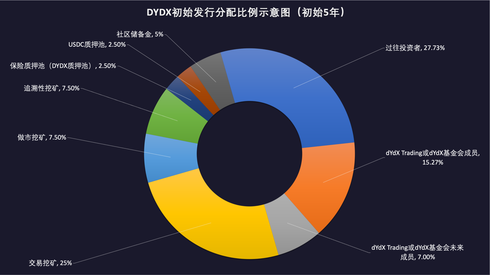
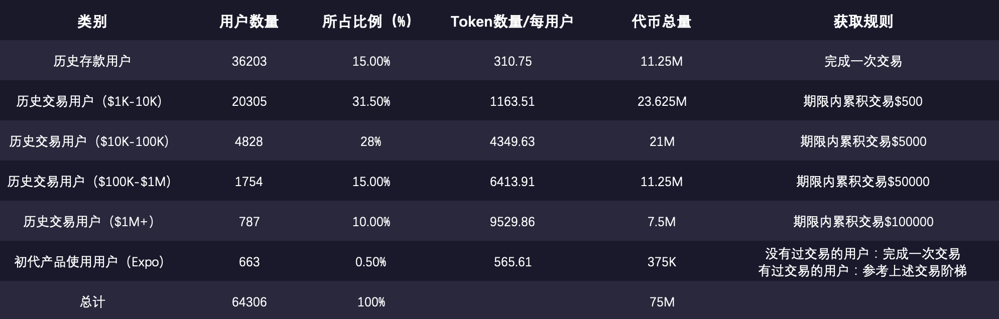
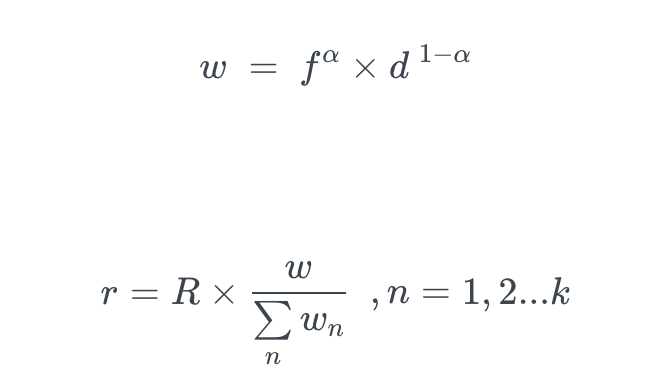
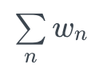
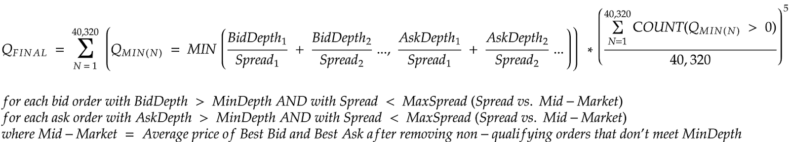

# DYDX 介绍

## **关于协议**

dYdX是去中心化的衍生品交易协议 mough, ， + +. dYdX的二层技术通过零识证明提高了安全性和隐私性 heromic 在交易手续费方面费用低 specification 在取款处理效率方面速度极快 Layer 2取款 specification, commakWare的二层技术通过零识证明提高了安全性和隐私性 在保证金利用率方面 ； algerydXYdX可以交叉使用保证金

## **关于代币**

DYDX是一种治理代币 dYdX

### dYdX发行细则 has has

DYDX的 Token发行总量为 并且会在五年内分发给所有的 dYdX 包括社区用户 dYdX 社区可以投票决定 DYDX代币的通胀率进行增发 실종

#### 分配机制

* 50%（ 500,000,000 DYDX分配给社区 DYDX, momic homeric
   * 25%（ 250,000,000 DYDX分配给交易挖矿的用户
   * 7.5%（ 75,000,000个 DYDX分配给追溯性挖矿用户
   * 7.5%（ 75,000,000个 DYDX分配给做市挖矿做市商
   * 5% （ 50,000,000个 DYDX分配给社区储备资金
   * 2.5%（ 25,000,000个 DYDX分配给参与流动性质押池的用户
   * 2.5%（ 25,000,000个 DYDX质押用户 ）

● 27.73%（ 277,295,070个 DYDX分配给过往投资者

● 15.27%（ 152,704,930个 DYDXDYdX Trading或

● 7.00%（ 70,000,000个 DYDXDYdX Trading或

#### DYDX 主要用途

DYDX主要用于合约治理和手续费折扣 share.

#### DYDX的手续费折扣的具体政策是什么

DYDXDYDX持有数量决定 Contact

**DYDX代币奖励活动的起始和结束时间是**

* 到 2021年 8月 3日 15:00 UTC, comma, 到 2021年 8月 31日 15:00:00 UTC. 为期一个时段
* 交易挖矿从 2021年 8日 3日 15:00 UTC, come 2 2026年 8日 3日 15:00 UTC结束
* 做市挖矿从 2021年 8日 3日 15:00 UTC, come 2 2026年 8日 3日 15:00 UTC结束
* 流动性质押池从 2021年 8月 3日 15:00 UTC에서 comcyalmomal, 到 2026年 82日 215:00:00 UTC结束
* 保险质押池从 2021年 98日 15:00 UTC 开始 comal, 到 2026年 97日 15:00 UTC 结束 **

**？**

* 如果需要取出质押款 ，
* 交易挖矿和做市挖矿的用户 compare)(77DYDX代币 EPOCH).
* 2021年 98日 15:00:00 utc, 第一个时段结束 8, comal, 市场上会有大约 DYDX代币会第一次自动解锁 市场上会有大约 市场上会有大约 DYDX代币流动性 하얀색

## **DYDX的获取规则**

有五种不同的方式可以获得 DYDX代币 ）

* 您都可以参与只开放给老用户的追溯性挖矿项目 dYdX, momaly, 杠杆和合约和 Layer 2的合约产品
* 合约产品的新用户 dYdX Layer 2
* 如果您曾在 dYdX5%以上的流动性
* 只有选定的做市商可以从流动性质押池里借出 社区可以投票决定哪些做市商可以从

### **追溯性挖矿**

* 的 heror 7.5%（ 75,000,000년 이후에는 점진적으로 DX DYDX代币会通过追溯性挖矿分发给 dYdydxygyear 的快照将 2021年 7月 26日 00:00:00的快照将 DYDX分配给所有 dYdDXYdX 取决于所有 追溯性挖矿不能提供给位于美国或任何其他受禁止的司法管辖区、在美国或任何其他受禁止的司法管辖区注册或以其他方式成立公司或者是美国或任何其他受禁止的司法管辖区居民的用户 DYDX和 dYdX Layer 任何与推测未来空投的机器人活动明显相关的账户也被排除在追溯奖励之外

* 如果要申领 DYDX, momewal, 280 [） Ronducture 2协议的里程碑](https://trade.dydx.exchange/) hername

dYdX Layer 2协议上的任何历史成交量都将计入用户的申领里程碑 并自动转移至社区资金库 DYDX将被没收

* ？

用户可以去到此页面查看自己的额度 trade.dydx.exchange/portion/reward

* ？

天之后 8天之后 2021年 98日 11:00C+8에서 하차

### **交易挖矿**

* 的 hub 25%(250,000,000)의 **공증(DYDX代币会通过 dYdx)**

* 挖矿规则

25% 个 DYDX, malizelement合约交易的用户 2 dYdX, comma3,835,616 DYDXYDX-YDX(DYDX)에서 （ 28天 DYDX具体计算公式如下 Horder

注释

： 토켄数量 선교

Rheror 将在该时期池中的所有交易者之间分配的总奖励

fheror 交易者在该时期支付的总交易费用

w、个人交易者得分

、所有交易者得分的总和

d、交易者在该时期所有市场的平均持仓量 、交易者在该时期所有市场的平均持仓量

k、该时期的交易者总数

α、确定费用与未平仓合约权重的范围内的常数 concanceric 初始值为 α=0.7conomania.

* ？

用户可以在此页面查看自己的交易手续费

[https://trade.dydx.exchange/portion/reward](https://trade.dydx.exchange/portfolio/rewards)

用户可以在此页面查看 [heromic](https://dydx.community/history/rewards) heromic

* ？

**天**

### **做市挖矿**

* 的 7.5%\ (75,000,000 DYDX)的 DYDXdYdYdXyqx
* 挖矿规则
   * 7.5% 的 DYDX, momalia 每个时段会分发 28天 specificic 每个时段会分发 specificy)
   * 但必须满足在前一个时段提供大于
   * （ 28天 DY代币将由其做市的深度 DYDX HERRO

* ？

天 7天 dYdX 来申领代币奖励

### **流动性质押池**

* 的 72.5%\ (25,000,000 DYDX)的 DYDXdYdYdXyqxy. 激励专业做市商 DYDX将被分配给向流动性质押池质押 从而进一步提高市场的可用流动性 USDC基于 Layer 2协议进行做市

* ？

   * 用户可以在此页面参与 [heromic https://dydx.community/scaley/w풀을 /dull/유동성](https://dydx.community/dashboard/pools/liquidity)
   * 点击质押
   * 要允许

* DX的代币奖励如何发放和申领

所占整体流动池的比例

* ？

质押人必须至少在时段结束前 他们质押 DYDX将被转入下一时段 [可以在此页面进行操作 https://dydx.community/scal/scanscaling-staking-pool/유동성](https://dydx.community/dashboard/staking-pool/liquidity)

* ？

首批获得批准的做市商包括 Wintermute、 Amber Group、 Kronos、 Sixtant和 Trading, dYdX Layer

* ？

协议提现 dYdX Layer 2协议提现 USDC也有可能会亏损掉

### **保险质押池**

* ？

协议推出以来 dYdX Layer 2协议推出以来 到保险资金池的用户 DYDX将分配给质押 DYDXYDX Layer

* 代币会通过流动性质押池分发

2.5%\ (25,000,000 DYDX\ )的 DYDX代币会通过流动性质押池分发给

* ？

   2021年 8号 15:00 utC.

* ？

   * 用户可以在此页面参与 dydx.community/대시 / 풀 / 안전
   * 点击质押
   * 要允许

* DX的代币奖励如何发放和申领

所占整体流动池的比例

* ？

质押人必须至少在时段结束前 他们质押 DYDX将被转入下一时段 [可以在此页面进行操作 https://dydx.community/scal/scanscaling-staking-pool/유동성](https://dydx.community/dashboard/staking-pool/liquidity)

* ？ 这可能进一步导致 DYDX锁定在保险资金池 근접, commyDX治理酌情削减质押资金

**社区资金库**

无论是用于补助金、新流动性矿池还是任何其他计划 DYDXDYDX持有人决定其如何使用 Harmeyword DYDX将在五年内持续被委托给社区资金库 share. 从社区资金库中支出任何 DYDX都必须进行治理投票 请查阅[此处](http://docs.dydx.community/dydx-governance/start-here/community-treasury)

那么在五年后 DYDX都将被委托给社区资金库

## 治理

DYDX赋予持有人进行提议和对 dYdX Layer 2协议的修改投票的权利 DYDXAAVE治理合约 DYDX持有量的投票

### 治理内容

与此同时

* 分配社区资金库的资金
* dYdX Layer 2协议上的新代币上市
* dYdX Layer 2协议的风险参数
* 流动性权益质押池中做市商的资金分配
* 向流动性权益质押池添加新做市商
* 确定保险资金质押池的支出额
* 针对推出时便存在的任何奖励和资金池进行变更
* 治理合约本身

### 提案类型

参数各不同 执行器必须验证每种类型的提议

* 短时间锁执行器可以执行通常变更奖励和激励合约或者需要快速干预的社区资金库的提议
* 协议部分的提议 dYdX Layer 2协议部分的提议
* 머클-puser执行器可以执行冻结 머클 rot会根据每个用户的累计奖励余额定期更新 merkle root, commorekle
* 스타크웨어 执行器可以执行通常变更目前需要 스테이크웨어

