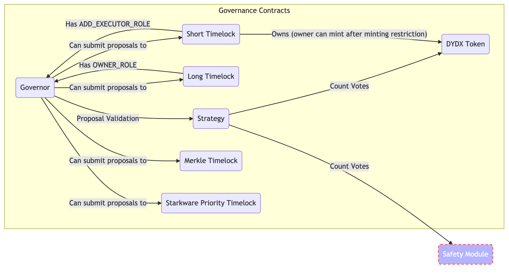
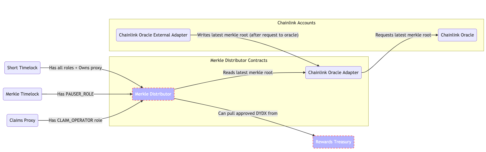
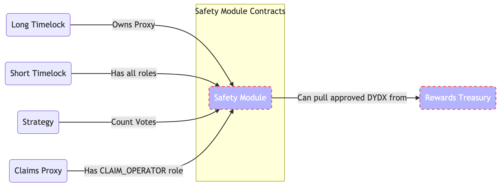
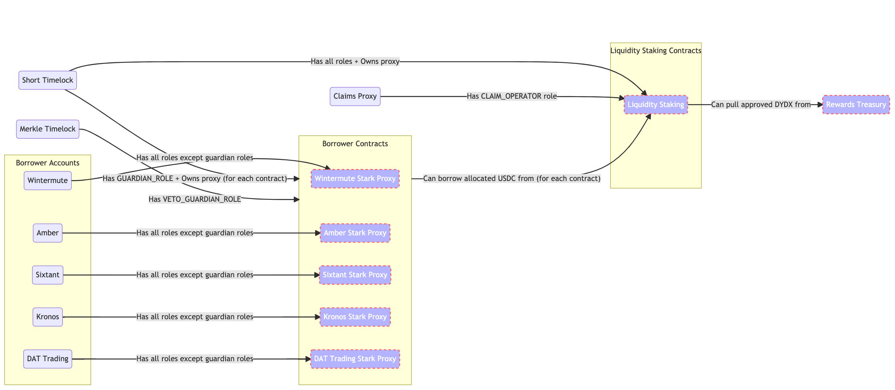
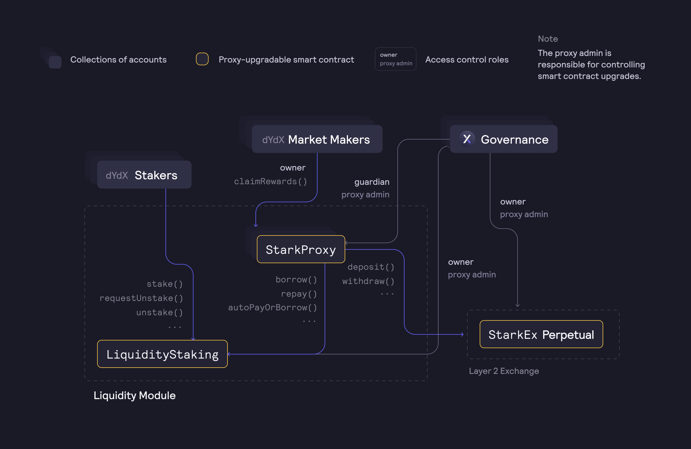
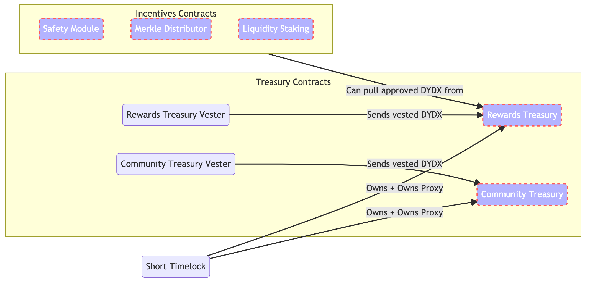
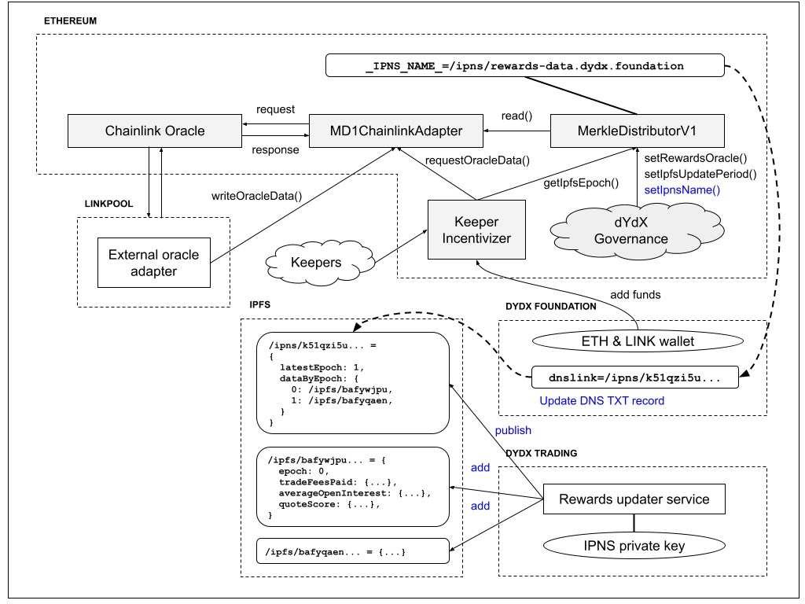

# 기술 개요

## 거버넌스 아키텍처 개요

dYdX 온체인 거버넌스는 다음 기능을 지원합니다.

* 제안 생성 및 투표
* 제안이 시작될 때 토큰의 보유량을 스냅샷합니다.
* 별도의 투표 및 제안 권한 위임
* 제안, 정족수 및 투표 격차 임계값 등 거버넌스 임계값 설정
* 투표의 계산 방법을 결정하는 "거버넌스 전략 V2" 스마트 계약 대체
* 다음을 허용하는 다중 실행자 계약 구성:
  * 단기 타임락 실행자를 통한 빠른 프로토콜 업그레이드 및 자금 분배
  * 장기 타임락 실행자를 통한 거버넌스 업그레이드

dYdX 거버넌스를 지원하는 스마트 계약은 다음 7개입니다.

* **`DydxToken` 계약 **: 모든 블록 번호에서 주소의 투표 또는 제안 권한에 대한 쿼리를 지원하는 스냅샷을 유지합니다. 투표 및 제안 권한에 대한 별도의 위임을 지원합니다.
* **`래핑된 이더리움 Dydx 토큰(wethDYDX)` 계약**: 모든 블록 번호에서 주소의 투표권 또는 제안권의 쿼리를 지원하는 스냅샷을 유지합니다. 투표 및 제안 권한에 대한 별도의 위임을 지원합니다.
* **`DydxGovernor` 계약**: 제안서를 추적하고 실행자 스마트 컨트랙트를 통해 제안을 실행할 수 있습니다.
* **`실행자` 계약**: 거버넌스가 투표한 거래를 대기열에 포함시키고, 취소 및 실행할 수 있습니다. 제안이 통과되면 제안 내 기능 요청은 제안에 명시된 실행자 계약에 의해 실행될 수 있습니다. 대기열에 있는 트랜잭션은 지연 후에 실행될 수 있습니다. 해당 기간은 실행자 계약에 따라 결정됩니다.
* ******`우선 타임락`** **계약**: 타임락 계약과 동일하지만, 우선권 컨트롤러가 타임락 지연이 종료되기 전에 **우선권 기간**(7일) 이내에 거래를 실행할 수 있습니다.
* **`거버넌스 전략 V2` 계약**: 투표 수를 계산하는 로직을 포함합니다. 현재 $ethDYDX 토큰, $wethDYDX 토큰 및 $stkDYDX으로 투표 수를 계산합니다. 장기 타임락을 통해 업그레이드될 수 있습니다.
* **`안전 모듈` 계약**: 기본 토큰의 투표 및 제안권, 위임 기능을 유지하면서 $ethDYDX 토큰을 스테이킹하고, 스테이킹된 포지션을 토큰화하고, 보상을 획득하는 로직을 포함합니다.



 | 계약                                     | 주소                                            |
| ------------------------------------ | ------------------------------------------ |
| DydxToken                            | 0x92D6C1e31e14520e676a687F0a93788B716BEff5 |
| WrappedEthereumDydxToken             | 0x46b2DeAe6eFf3011008EA27EA36b7c27255ddFA9 |
| DydxGovernor                         | 0x7E9B1672616FF6D6629Ef2879419aaE79A9018D2 | | Short Timelock Executor              | 0x64c7d40c07EFAbec2AafdC243bF59eaF2195c6dc |
| 장기 타임락 실행자               | 0xEcaE9BF44A21d00E2350a42127A377Bf5856d84B | | 머클-포저 실행자 | 0xd98e7A71BacB6F11438A8271dDB2EFd7f9361F52 | | Starkware 타임락 실행자 | 0xa306989BA6BcacdECCf3C0614FfF2B8C668e3CaE | | 보상 트레저리                    | 0x639192D54431F8c816368D3FB4107Bc168d0E871 |
| 커뮤니티 트레저리                   | 0xE710CEd57456D3A16152c32835B5FB4E72D9eA5b |
| 안전 모듈                        | 0x65f7BA4Ec257AF7c55fd5854E5f6356bBd0fb8EC |
| 거버넌스전략V2                 | 0xc2f5F3505910Da80F0592a3Cc023881C50b16505 |
| 보상 트레저리 베스터              | 0xb9431E19B29B952d9358025f680077C3Fd37292f |
| 커뮤니티 트레저리 베스터            | 0x08a90Fe0741B7DeF03fB290cc7B273F1855767D8 |
| 머클 배포자                   | 0x01d3348601968aB85b4bb028979006eac235a588 |
| Chainlink Adapter                    | 0x99B0599952a4FD2d1A1561Fa4C010827EaD30354 |
| 유동성 스테이킹                    | 0x5Aa653A076c1dbB47cec8C1B4d152444CAD91941 |
| 클레임 프록시                         | 0x0fd829C3365A225FB9226e75c97c3A114bD3199e |
| StarkEx 도움말 거버너              | 0x0db9b3F7Dd83e29C9bece8E5e1089bA4369E694a |
| StarkEx 리무버 거버너 V2          | 0xFCAac0F14deA11eDe11Afcb875f29130e1ad5ec0 |
| Rewards Treasury Proxy Admin         | 0x40D6992cbd03E0DC1c2DE9606D29Cb245E737a5d |
| 커뮤니티 트레저리 프록시 관리자       | 0x9d51599A6b10f562619D8ef2EFDcA1B68aE80D03 |
| 안전 모듈 프록시 관리자            | 0x6aaD0BCfbD91963Cf2c8FB042091fd411FB05b3C |
| 머클 배포자 프록시 관리자       | 0x6C5cd3aD7A16Ae207D221908E6b997d9B0DcD7b0 |
| Liquidity Staking Proxy Admin        | 0xAc5D8bCD13da463bea96c75f9085c4e40037F790 |
| StarkProxy \[0]                      | 0x0b2B08AC98a1568A34208121c26F4F41a9e0FbB6 |
| StarkProxy \[1]                      | 0x3e6E9EFb0A677a24F47093a22044dc5451A028cF |
| StarkProxy \[2]                      | 0xCB7fa3a2F47b62293Cc2E1a4C7752fC72E49FCe2 |
| StarkProxy \[3]                      | 0x16BEC2D9A010e7D8b2D576d17893C52Ddbfe4C06 |
| StarkProxy \[4]                      | 0x531F3BE462F10386D01FBeD7fAD1d20A61Ce7874 |
| StarkProxy Proxy Admin \[0]          | 0xE16718eace44e0CB06b9cd164490A69A6425D1e3 |
| StarkProxy 프록시 관리자 \[1]          | 0x78e899e576C3565C3219dbC9Ea5042A9DBed36d3 |
| StarkProxy 프록시 관리자 \[2]          | 0x15774D4555fEfD57C9Fc8b11C8beba993eafcc13 |
| StarkProxy 프록시 관리자 \[3]          | 0x4d9460e5C958f46a1Fe129954A069a37972f16EA |
| StarkProxy Proxy Admin \[4]          | 0xfa45DCDbEc82C94082d283B62506320DB8632054 |
 

## 오픈소스 코드 및 감사

거버넌스 계약 및 스테이킹 풀에 대한 모든 스마트 계약 소스 코드는 [https://github.com/dydxfound/government/government-contracts](https://github.com/dydxfoundation/governance-contracts)에 있습니다.

dydx.community에서 호스팅되는 거버넌스 프론트엔드용 소스 코드는 [여기](https://github.com/dydxfoundation/pnyx)를 참조하십시오.

모든 주요 신규 스마트 컨트랙트는 Peckshield의 감사를 받았습니다. 중요하거나 우선 순위가 높은 보안 문제가 발견되지 않았습니다. 핵심 거버넌스 및 토큰 계약은 [CertiK](https://www.certik.io/), [Certora](https://www.certora.com/) 및 [Peckshield가](https://peckshield.com/en) 감사한 AAVA 거버넌스 계약에서 포크되었으며 몇 달 동안 메인넷에서 실시간으로 배틀 테스트를 거쳤습니다.

## 핵심 거버넌스 계약



### DydxToken

DydxToken 계약은 Aave에서 영감을 받았습니다. dYdX 팀에 의해 작은 변경 사항이 있습니다.

이더리움 기반 DYDX는 이더리움 메인넷의 [0x92D6C1e31e14520e676a687F0a93788B716BEff5](https://etherscan.io/address/0x92d6c1e31e14520e676a687f0a93788b716beff5)에 배포됩니다.

**ABI**

```json
[{"inputs":[{"internalType":"address","name":"distributor","type":"address"},{"internalType":"uint256","name":"transfersRestrictedBefore","type":"uint256"},{"internalType":"uint256","name":"transferRestrictionLiftedNoLaterThan","type":"uint256"},{"internalType":"uint256","name":"mintingRestrictedBefore","type":"uint256"},{"internalType":"uint256","name":"mintMaxPercent","type":"uint256"}],"stateMutability":"nonpayable","type":"constructor"},{"anonymous":false,"inputs":[{"indexed":true,"internalType":"address","name":"owner","type":"address"},{"indexed":true,"internalType":"address","name":"spender","type":"address"},{"indexed":false,"internalType":"uint256","name":"value","type":"uint256"}],"name":"Approval","type":"event"},{"anonymous":false,"inputs":[{"indexed":true,"internalType":"address","name":"delegator","type":"address"},{"indexed":true,"internalType":"address","name":"delegatee","type":"address"},{"indexed":false,"internalType":"enum IGovernancePowerDelegationERC20.DelegationType","name":"delegationType","type":"uint8"}],"name":"DelegateChanged","type":"event"},{"anonymous":false,"inputs":[{"indexed":true,"internalType":"address","name":"user","type":"address"},{"indexed":false,"internalType":"uint256","name":"amount","type":"uint256"},{"indexed":false,"internalType":"enum IGovernancePowerDelegationERC20.DelegationType","name":"delegationType","type":"uint8"}],"name":"DelegatedPowerChanged","type":"event"},{"anonymous":false,"inputs":[{"indexed":true,"internalType":"address","name":"previousOwner","type":"address"},{"indexed":true,"internalType":"address","name":"newOwner","type":"address"}],"name":"OwnershipTransferred","type":"event"},{"anonymous":false,"inputs":[{"indexed":true,"internalType":"address","name":"from","type":"address"},{"indexed":true,"internalType":"address","name":"to","type":"address"},{"indexed":false,"internalType":"uint256","name":"value","type":"uint256"}],"name":"Transfer","type":"event"},{"anonymous":false,"inputs":[{"indexed":false,"internalType":"address","name":"account","type":"address"},{"indexed":false,"internalType":"bool","name":"isAllowed","type":"bool"}],"name":"TransferAllowlistUpdated","type":"event"},{"anonymous":false,"inputs":[{"indexed":false,"internalType":"uint256","name":"transfersRestrictedBefore","type":"uint256"}],"name":"TransfersRestrictedBeforeUpdated","type":"event"},{"inputs":[],"name":"DELEGATE_BY_TYPE_TYPEHASH","outputs":[{"internalType":"bytes32","name":"","type":"bytes32"}],"stateMutability":"view","type":"function"},{"inputs":[],"name":"DELEGATE_TYPEHASH","outputs":[{"internalType":"bytes32","name":"","type":"bytes32"}],"stateMutability":"view","type":"function"},{"inputs":[],"name":"DOMAIN_SEPARATOR","outputs":[{"internalType":"bytes32","name":"","type":"bytes32"}],"stateMutability":"view","type":"function"},{"inputs":[],"name":"EIP712_DOMAIN","outputs":[{"internalType":"bytes32","name":"","type":"bytes32"}],"stateMutability":"view","type":"function"},{"inputs":[],"name":"EIP712_VERSION","outputs":[{"internalType":"bytes","name":"","type":"bytes"}],"stateMutability":"view","type":"function"},{"inputs":[],"name":"INITIAL_SUPPLY","outputs":[{"internalType":"uint256","name":"","type":"uint256"}],"stateMutability":"view","type":"function"},{"inputs":[],"name":"MINT_MAX_PERCENT","outputs":[{"internalType":"uint256","name":"","type":"uint256"}],"stateMutability":"view","type":"function"},{"inputs":[],"name":"MINT_MIN_INTERVAL","outputs":[{"internalType":"uint256","name":"","type":"uint256"}],"stateMutability":"view","type":"function"},{"inputs":[],"name":"PERMIT_TYPEHASH","outputs":[{"internalType":"bytes32","name":"","type":"bytes32"}],"stateMutability":"view","type":"function"},{"inputs":[],"name":"TRANSFER_RESTRICTION_LIFTED_NO_LATER_THAN","outputs":[{"internalType":"uint256","name":"","type":"uint256"}],"stateMutability":"view","type":"function"},{"inputs":[],"name":"_mintingRestrictedBefore","outputs":[{"internalType":"uint256","name":"","type":"uint256"}],"stateMutability":"view","type":"function"},{"inputs":[{"internalType":"address","name":"","type":"address"}],"name":"_propositionPowerDelegates","outputs":[{"internalType":"address","name":"","type":"address"}],"stateMutability":"view","type":"function"},{"inputs":[{"internalType":"address","name":"","type":"address"},{"internalType":"uint256","name":"","type":"uint256"}],"name":"_propositionPowerSnapshots","outputs":[{"internalType":"uint128","name":"blockNumber","type":"uint128"},{"internalType":"uint128","name":"value","type":"uint128"}],"stateMutability":"view","type":"function"},{"inputs":[{"internalType":"address","name":"","type":"address"}],"name":"_propositionPowerSnapshotsCounts","outputs":[{"internalType":"uint256","name":"","type":"uint256"}],"stateMutability":"view","type":"function"},{"inputs":[{"internalType":"address","name":"","type":"address"}],"name":"_tokenTransferAllowlist","outputs":[{"internalType":"bool","name":"","type":"bool"}],"stateMutability":"view","type":"function"},{"inputs":[{"internalType":"uint256","name":"","type":"uint256"}],"name":"_totalSupplySnapshots","outputs":[{"internalType":"uint128","name":"blockNumber","type":"uint128"},{"internalType":"uint128","name":"value","type":"uint128"}],"stateMutability":"view","type":"function"},{"inputs":[],"name":"_totalSupplySnapshotsCount","outputs":[{"internalType":"uint256","name":"","type":"uint256"}],"stateMutability":"view","type":"function"},{"inputs":[],"name":"_transfersRestrictedBefore","outputs":[{"internalType":"uint256","name":"","type":"uint256"}],"stateMutability":"view","type":"function"},{"inputs":[{"internalType":"address","name":"","type":"address"}],"name":"_votingDelegates","outputs":[{"internalType":"address","name":"","type":"address"}],"stateMutability":"view","type":"function"},{"inputs":[{"internalType":"address","name":"","type":"address"},{"internalType":"uint256","name":"","type":"uint256"}],"name":"_votingSnapshots","outputs":[{"internalType":"uint128","name":"blockNumber","type":"uint128"},{"internalType":"uint128","name":"value","type":"uint128"}],"stateMutability":"view","type":"function"},{"inputs":[{"internalType":"address","name":"","type":"address"}],"name":"_votingSnapshotsCounts","outputs":[{"internalType":"uint256","name":"","type":"uint256"}],"stateMutability":"view","type":"function"},{"inputs":[{"internalType":"address[]","name":"addressesToAdd","type":"address[]"}],"name":"addToTokenTransferAllowlist","outputs":[],"stateMutability":"nonpayable","type":"function"},{"inputs":[{"internalType":"address","name":"owner","type":"address"},{"internalType":"address","name":"spender","type":"address"}],"name":"allowance","outputs":[{"internalType":"uint256","name":"","type":"uint256"}],"stateMutability":"view","type":"function"},{"inputs":[{"internalType":"address","name":"spender","type":"address"},{"internalType":"uint256","name":"amount","type":"uint256"}],"name":"approve","outputs":[{"internalType":"bool","name":"","type":"bool"}],"stateMutability":"nonpayable","type":"function"},{"inputs":[{"internalType":"address","name":"account","type":"address"}],"name":"balanceOf","outputs":[{"internalType":"uint256","name":"","type":"uint256"}],"stateMutability":"view","type":"function"},{"inputs":[],"name":"decimals","outputs":[{"internalType":"uint8","name":"","type":"uint8"}],"stateMutability":"view","type":"function"},{"inputs":[{"internalType":"address","name":"spender","type":"address"},{"internalType":"uint256","name":"subtractedValue","type":"uint256"}],"name":"decreaseAllowance","outputs":[{"internalType":"bool","name":"","type":"bool"}],"stateMutability":"nonpayable","type":"function"},{"inputs":[{"internalType":"address","name":"delegatee","type":"address"}],"name":"delegate","outputs":[],"stateMutability":"nonpayable","type":"function"},{"inputs":[{"internalType":"address","name":"delegatee","type":"address"},{"internalType":"uint256","name":"nonce","type":"uint256"},{"internalType":"uint256","name":"expiry","type":"uint256"},{"internalType":"uint8","name":"v","type":"uint8"},{"internalType":"bytes32","name":"r","type":"bytes32"},{"internalType":"bytes32","name":"s","type":"bytes32"}],"name":"delegateBySig","outputs":[],"stateMutability":"nonpayable","type":"function"},{"inputs":[{"internalType":"address","name":"delegatee","type":"address"},{"internalType":"enum IGovernancePowerDelegationERC20.DelegationType","name":"delegationType","type":"uint8"}],"name":"delegateByType","outputs":[],"stateMutability":"nonpayable","type":"function"},{"inputs":[{"internalType":"address","name":"delegatee","type":"address"},{"internalType":"enum IGovernancePowerDelegationERC20.DelegationType","name":"delegationType","type":"uint8"},{"internalType":"uint256","name":"nonce","type":"uint256"},{"internalType":"uint256","name":"expiry","type":"uint256"},{"internalType":"uint8","name":"v","type":"uint8"},{"internalType":"bytes32","name":"r","type":"bytes32"},{"internalType":"bytes32","name":"s","type":"bytes32"}],"name":"delegateByTypeBySig","outputs":[],"stateMutability":"nonpayable","type":"function"},{"inputs":[{"internalType":"address","name":"delegator","type":"address"},{"internalType":"enum IGovernancePowerDelegationERC20.DelegationType","name":"delegationType","type":"uint8"}],"name":"getDelegateeByType","outputs":[{"internalType":"address","name":"","type":"address"}],"stateMutability":"view","type":"function"},{"inputs":[{"internalType":"address","name":"user","type":"address"},{"internalType":"uint256","name":"blockNumber","type":"uint256"},{"internalType":"enum IGovernancePowerDelegationERC20.DelegationType","name":"delegationType","type":"uint8"}],"name":"getPowerAtBlock","outputs":[{"internalType":"uint256","name":"","type":"uint256"}],"stateMutability":"view","type":"function"},{"inputs":[{"internalType":"address","name":"user","type":"address"},{"internalType":"enum IGovernancePowerDelegationERC20.DelegationType","name":"delegationType","type":"uint8"}],"name":"getPowerCurrent","outputs":[{"internalType":"uint256","name":"","type":"uint256"}],"stateMutability":"view","type":"function"},{"inputs":[{"internalType":"address","name":"spender","type":"address"},{"internalType":"uint256","name":"addedValue","type":"uint256"}],"name":"increaseAllowance","outputs":[{"internalType":"bool","name":"","type":"bool"}],"stateMutability":"nonpayable","type":"function"},{"inputs":[{"internalType":"address","name":"recipient","type":"address"},{"internalType":"uint256","name":"amount","type":"uint256"}],"name":"mint","outputs":[],"stateMutability":"nonpayable","type":"function"},{"inputs":[],"name":"name","outputs":[{"internalType":"string","name":"","type":"string"}],"stateMutability":"view","type":"function"},{"inputs":[{"internalType":"address","name":"owner","type":"address"}],"name":"nonces","outputs":[{"internalType":"uint256","name":"","type":"uint256"}],"stateMutability":"view","type":"function"},{"inputs":[],"name":"owner","outputs":[{"internalType":"address","name":"","type":"address"}],"stateMutability":"view","type":"function"},{"inputs":[{"internalType":"address","name":"owner","type":"address"},{"internalType":"address","name":"spender","type":"address"},{"internalType":"uint256","name":"value","type":"uint256"},{"internalType":"uint256","name":"deadline","type":"uint256"},{"internalType":"uint8","name":"v","type":"uint8"},{"internalType":"bytes32","name":"r","type":"bytes32"},{"internalType":"bytes32","name":"s","type":"bytes32"}],"name":"permit","outputs":[],"stateMutability":"nonpayable","type":"function"},{"inputs":[{"internalType":"address[]","name":"addressesToRemove","type":"address[]"}],"name":"removeFromTokenTransferAllowlist","outputs":[],"stateMutability":"nonpayable","type":"function"},{"inputs":[],"name":"renounceOwnership","outputs":[],"stateMutability":"nonpayable","type":"function"},{"inputs":[],"name":"symbol","outputs":[{"internalType":"string","name":"","type":"string"}],"stateMutability":"view","type":"function"},{"inputs":[],"name":"totalSupply","outputs":[{"internalType":"uint256","name":"","type":"uint256"}],"stateMutability":"view","type":"function"},{"inputs":[{"internalType":"address","name":"recipient","type":"address"},{"internalType":"uint256","name":"amount","type":"uint256"}],"name":"transfer","outputs":[{"internalType":"bool","name":"","type":"bool"}],"stateMutability":"nonpayable","type":"function"},{"inputs":[{"internalType":"address","name":"sender","type":"address"},{"internalType":"address","name":"recipient","type":"address"},{"internalType":"uint256","name":"amount","type":"uint256"}],"name":"transferFrom","outputs":[{"internalType":"bool","name":"","type":"bool"}],"stateMutability":"nonpayable","type":"function"},{"inputs":[{"internalType":"address","name":"newOwner","type":"address"}],"name":"transferOwnership","outputs":[],"stateMutability":"nonpayable","type":"function"},{"inputs":[{"internalType":"uint256","name":"transfersRestrictedBefore","type":"uint256"}],"name":"updateTransfersRestrictedBefore","outputs":[],"stateMutability":"nonpayable","type":"function"}]
```

### WrappedEthereumDydxToken

래핑된 이더리움 Dydx 토큰 계약은 `Dydx 토큰`의 래핑된 버전입니다. 사용자는 `wethDYDX 스마트 계약`과 상호 작용하여 wethDYDX를 획득할 수 있습니다.

wethDYDX는 이더리움 메인넷의 [0x46b2deae6eff3011008ea27ea36b7c27255ddfa9](https://etherscan.io/address/0x46b2deae6eff3011008ea27ea36b7c27255ddfa9)에 배포됩니다.

**ABI**

```json
[{"inputs":[{"internalType":"contract ERC20","name":"tokenAddress","type":"address"}],"stateMutability":"nonpayable","type":"constructor"},{"anonymous":false,"inputs":[{"indexed":true,"internalType":"address","name":"owner","type":"address"},{"indexed":true,"internalType":"address","name":"spender","type":"address"},{"indexed":false,"internalType":"uint256","name":"value","type":"uint256"}],"name":"Approval","type":"event"},{"anonymous":false,"inputs":[{"indexed":true,"internalType":"uint256","name":"id","type":"uint256"},{"indexed":false,"internalType":"uint256","name":"amount","type":"uint256"},{"indexed":false,"internalType":"address","name":"from","type":"address"},{"indexed":false,"internalType":"bytes","name":"accAddress","type":"bytes"},{"indexed":false,"internalType":"bytes","name":"data","type":"bytes"}],"name":"Bridge","type":"event"},{"anonymous":false,"inputs":[{"indexed":true,"internalType":"address","name":"delegator","type":"address"},{"indexed":true,"internalType":"address","name":"delegatee","type":"address"},{"indexed":false,"internalType":"enum IGovernancePowerDelegationERC20.DelegationType","name":"delegationType","type":"uint8"}],"name":"DelegateChanged","type":"event"},{"anonymous":false,"inputs":[{"indexed":true,"internalType":"address","name":"user","type":"address"},{"indexed":false,"internalType":"uint256","name":"amount","type":"uint256"},{"indexed":false,"internalType":"enum IGovernancePowerDelegationERC20.DelegationType","name":"delegationType","type":"uint8"}],"name":"DelegatedPowerChanged","type":"event"},{"anonymous":false,"inputs":[{"indexed":true,"internalType":"address","name":"from","type":"address"},{"indexed":true,"internalType":"address","name":"to","type":"address"},{"indexed":false,"internalType":"uint256","name":"value","type":"uint256"}],"name":"Transfer","type":"event"},{"inputs":[],"name":"DELEGATE_BY_TYPE_TYPEHASH","outputs":[{"internalType":"bytes32","name":"","type":"bytes32"}],"stateMutability":"view","type":"function"},{"inputs":[],"name":"DELEGATE_TYPEHASH","outputs":[{"internalType":"bytes32","name":"","type":"bytes32"}],"stateMutability":"view","type":"function"},{"inputs":[],"name":"DOMAIN_SEPARATOR","outputs":[{"internalType":"bytes32","name":"","type":"bytes32"}],"stateMutability":"view","type":"function"},{"inputs":[],"name":"DYDX_TOKEN","outputs":[{"internalType":"contract IERC20","name":"","type":"address"}],"stateMutability":"view","type":"function"},{"inputs":[],"name":"EIP712_DOMAIN","outputs":[{"internalType":"bytes32","name":"","type":"bytes32"}],"stateMutability":"view","type":"function"},{"inputs":[],"name":"EIP712_VERSION","outputs":[{"internalType":"bytes","name":"","type":"bytes"}],"stateMutability":"view","type":"function"},{"inputs":[],"name":"PERMIT_TYPEHASH","outputs":[{"internalType":"bytes32","name":"","type":"bytes32"}],"stateMutability":"view","type":"function"},{"inputs":[],"name":"_nextAvailableBridgeId","outputs":[{"internalType":"uint256","name":"","type":"uint256"}],"stateMutability":"view","type":"function"},{"inputs":[{"internalType":"address","name":"","type":"address"}],"name":"_propositionPowerDelegates","outputs":[{"internalType":"address","name":"","type":"address"}],"stateMutability":"view","type":"function"},{"inputs":[{"internalType":"address","name":"","type":"address"},{"internalType":"uint256","name":"","type":"uint256"}],"name":"_propositionPowerSnapshots","outputs":[{"internalType":"uint128","name":"blockNumber","type":"uint128"},{"internalType":"uint128","name":"value","type":"uint128"}],"stateMutability":"view","type":"function"},{"inputs":[{"internalType":"address","name":"","type":"address"}],"name":"_propositionPowerSnapshotsCounts","outputs":[{"internalType":"uint256","name":"","type":"uint256"}],"stateMutability":"view","type":"function"},{"inputs":[{"internalType":"address","name":"","type":"address"}],"name":"_votingDelegates","outputs":[{"internalType":"address","name":"","type":"address"}],"stateMutability":"view","type":"function"},{"inputs":[{"internalType":"address","name":"","type":"address"},{"internalType":"uint256","name":"","type":"uint256"}],"name":"_votingSnapshots","outputs":[{"internalType":"uint128","name":"blockNumber","type":"uint128"},{"internalType":"uint128","name":"value","type":"uint128"}],"stateMutability":"view","type":"function"},{"inputs":[{"internalType":"address","name":"","type":"address"}],"name":"_votingSnapshotsCounts","outputs":[{"internalType":"uint256","name":"","type":"uint256"}],"stateMutability":"view","type":"function"},{"inputs":[{"internalType":"address","name":"owner","type":"address"},{"internalType":"address","name":"spender","type":"address"}],"name":"allowance","outputs":[{"internalType":"uint256","name":"","type":"uint256"}],"stateMutability":"view","type":"function"},{"inputs":[{"internalType":"address","name":"spender","type":"address"},{"internalType":"uint256","name":"amount","type":"uint256"}],"name":"approve","outputs":[{"internalType":"bool","name":"","type":"bool"}],"stateMutability":"nonpayable","type":"function"},{"inputs":[{"internalType":"address","name":"account","type":"address"}],"name":"balanceOf","outputs":[{"internalType":"uint256","name":"","type":"uint256"}],"stateMutability":"view","type":"function"},{"inputs":[{"internalType":"uint256","name":"amount","type":"uint256"},{"internalType":"bytes","name":"accAddress","type":"bytes"},{"internalType":"bytes","name":"memo","type":"bytes"}],"name":"bridge","outputs":[],"stateMutability":"nonpayable","type":"function"},{"inputs":[],"name":"decimals","outputs":[{"internalType":"uint8","name":"","type":"uint8"}],"stateMutability":"view","type":"function"},{"inputs":[{"internalType":"address","name":"spender","type":"address"},{"internalType":"uint256","name":"subtractedValue","type":"uint256"}],"name":"decreaseAllowance","outputs":[{"internalType":"bool","name":"","type":"bool"}],"stateMutability":"nonpayable","type":"function"},{"inputs":[{"internalType":"address","name":"delegatee","type":"address"}],"name":"delegate","outputs":[],"stateMutability":"nonpayable","type":"function"},{"inputs":[{"internalType":"address","name":"delegatee","type":"address"},{"internalType":"uint256","name":"nonce","type":"uint256"},{"internalType":"uint256","name":"expiry","type":"uint256"},{"internalType":"uint8","name":"v","type":"uint8"},{"internalType":"bytes32","name":"r","type":"bytes32"},{"internalType":"bytes32","name":"s","type":"bytes32"}],"name":"delegateBySig","outputs":[],"stateMutability":"nonpayable","type":"function"},{"inputs":[{"internalType":"address","name":"delegatee","type":"address"},{"internalType":"enum IGovernancePowerDelegationERC20.DelegationType","name":"delegationType","type":"uint8"}],"name":"delegateByType","outputs":[],"stateMutability":"nonpayable","type":"function"},{"inputs":[{"internalType":"address","name":"delegatee","type":"address"},{"internalType":"enum IGovernancePowerDelegationERC20.DelegationType","name":"delegationType","type":"uint8"},{"internalType":"uint256","name":"nonce","type":"uint256"},{"internalType":"uint256","name":"expiry","type":"uint256"},{"internalType":"uint8","name":"v","type":"uint8"},{"internalType":"bytes32","name":"r","type":"bytes32"},{"internalType":"bytes32","name":"s","type":"bytes32"}],"name":"delegateByTypeBySig","outputs":[],"stateMutability":"nonpayable","type":"function"},{"inputs":[{"internalType":"address","name":"delegator","type":"address"},{"internalType":"enum IGovernancePowerDelegationERC20.DelegationType","name":"delegationType","type":"uint8"}],"name":"getDelegateeByType","outputs":[{"internalType":"address","name":"","type":"address"}],"stateMutability":"view","type":"function"},{"inputs":[{"internalType":"address","name":"user","type":"address"},{"internalType":"uint256","name":"blockNumber","type":"uint256"},{"internalType":"enum IGovernancePowerDelegationERC20.DelegationType","name":"delegationType","type":"uint8"}],"name":"getPowerAtBlock","outputs":[{"internalType":"uint256","name":"","type":"uint256"}],"stateMutability":"view","type":"function"},{"inputs":[{"internalType":"address","name":"user","type":"address"},{"internalType":"enum IGovernancePowerDelegationERC20.DelegationType","name":"delegationType","type":"uint8"}],"name":"getPowerCurrent","outputs":[{"internalType":"uint256","name":"","type":"uint256"}],"stateMutability":"view","type":"function"},{"inputs":[{"internalType":"address","name":"spender","type":"address"},{"internalType":"uint256","name":"addedValue","type":"uint256"}],"name":"increaseAllowance","outputs":[{"internalType":"bool","name":"","type":"bool"}],"stateMutability":"nonpayable","type":"function"},{"inputs":[],"name":"name","outputs":[{"internalType":"string","name":"","type":"string"}],"stateMutability":"view","type":"function"},{"inputs":[{"internalType":"address","name":"owner","type":"address"}],"name":"nonces","outputs":[{"internalType":"uint256","name":"","type":"uint256"}],"stateMutability":"view","type":"function"},{"inputs":[{"internalType":"address","name":"owner","type":"address"},{"internalType":"address","name":"spender","type":"address"},{"internalType":"uint256","name":"value","type":"uint256"},{"internalType":"uint256","name":"deadline","type":"uint256"},{"internalType":"uint8","name":"v","type":"uint8"},{"internalType":"bytes32","name":"r","type":"bytes32"},{"internalType":"bytes32","name":"s","type":"bytes32"}],"name":"permit","outputs":[],"stateMutability":"nonpayable","type":"function"},{"inputs":[],"name":"symbol","outputs":[{"internalType":"string","name":"","type":"string"}],"stateMutability":"view","type":"function"},{"inputs":[],"name":"totalSupply","outputs":[{"internalType":"uint256","name":"","type":"uint256"}],"stateMutability":"view","type":"function"},{"inputs":[{"internalType":"address","name":"recipient","type":"address"},{"internalType":"uint256","name":"amount","type":"uint256"}],"name":"transfer","outputs":[{"internalType":"bool","name":"","type":"bool"}],"stateMutability":"nonpayable","type":"function"},{"inputs":[{"internalType":"address","name":"sender","type":"address"},{"internalType":"address","name":"recipient","type":"address"},{"internalType":"uint256","name":"amount","type":"uint256"}],"name":"transferFrom","outputs":[{"internalType":"bool","name":"","type":"bool"}],"stateMutability":"nonpayable","type":"function"}]
```

### DydxGovernor

DYdxGovernor 계약은 Aave에서 영감을 받았습니다. dYdX 팀에 의해 작은 변경 사항이 있습니다.

거버너는 이더리움 메인넷의 [0x7E9B1672616FF6D6629Ef2879419aaE79A9018D2](https://etherscan.io/address/0x7e9b1672616ff6d6629ef2879419aae79a9018d2)에 배포됩니다.

### 거버넌스 전략 V2

거버넌스 전략 V2(GovernanceStrategyV2) 계약은 Aave에서 영감을 받았으며, [`거버넌스 전략(GovernanceStrategy)`](https://etherscan.io/address/0x90Dfd35F4a0BB2d30CDf66508085e33C353475D9)이 업그레이드된 것입니다.

전략은 이더리움 메인넷의 [0xc2f5F3505910Da80F0592a3Cc023881C50b16505](https://etherscan.io/address/0xc2f5F3505910Da80F0592a3Cc023881C50b16505)에 배포됩니다.

**ABI**

```json
[{"inputs":[{"internalType":"address","name":"dydxToken","type":"address"},{"internalType":"address","name":"stakedDydxToken","type":"address"},{"internalType":"address","name":"wrappedEthereumDydxToken","type":"address"}],"stateMutability":"nonpayable","type":"constructor"},{"inputs":[],"name":"DYDX_TOKEN","outputs":[{"internalType":"address","name":"","type":"address"}],"stateMutability":"view","type":"function"},{"inputs":[],"name":"STAKED_DYDX_TOKEN","outputs":[{"internalType":"address","name":"","type":"address"}],"stateMutability":"view","type":"function"},{"inputs":[],"name":"WRAPPED_ETHEREUM_DYDX_TOKEN","outputs":[{"internalType":"address","name":"","type":"address"}],"stateMutability":"view","type":"function"},{"inputs":[{"internalType":"address","name":"user","type":"address"},{"internalType":"uint256","name":"blockNumber","type":"uint256"}],"name":"getPropositionPowerAt","outputs":[{"internalType":"uint256","name":"","type":"uint256"}],"stateMutability":"view","type":"function"},{"inputs":[{"internalType":"uint256","name":"blockNumber","type":"uint256"}],"name":"getTotalPropositionSupplyAt","outputs":[{"internalType":"uint256","name":"","type":"uint256"}],"stateMutability":"view","type":"function"},{"inputs":[{"internalType":"uint256","name":"blockNumber","type":"uint256"}],"name":"getTotalVotingSupplyAt","outputs":[{"internalType":"uint256","name":"","type":"uint256"}],"stateMutability":"view","type":"function"},{"inputs":[{"internalType":"address","name":"user","type":"address"},{"internalType":"uint256","name":"blockNumber","type":"uint256"}],"name":"getVotingPowerAt","outputs":[{"internalType":"uint256","name":"","type":"uint256"}],"stateMutability":"view","type":"function"}]
```

### 실행자

실행자 계약은 Aave에서 영감을 받았습니다. dYdX 팀에 의해 작은 변경 사항이 있습니다.

**장기 타임락**은 이더리움 메인넷의 [0xEcaE9BF44A21d00E2350a42127A377Bf5856d84B](https://etherscan.io/address/0xecae9bf44a21d00e2350a42127a377bf5856d84b)에 배포됩니다.

**ABI**

```json
[{"inputs":[{"internalType":"address","name":"admin","type":"address"},{"internalType":"uint256","name":"delay","type":"uint256"},{"internalType":"uint256","name":"gracePeriod","type":"uint256"},{"internalType":"uint256","name":"minimumDelay","type":"uint256"},{"internalType":"uint256","name":"maximumDelay","type":"uint256"},{"internalType":"uint256","name":"propositionThreshold","type":"uint256"},{"internalType":"uint256","name":"voteDuration","type":"uint256"},{"internalType":"uint256","name":"voteDifferential","type":"uint256"},{"internalType":"uint256","name":"minimumQuorum","type":"uint256"}],"stateMutability":"nonpayable","type":"constructor"},{"anonymous":false,"inputs":[{"indexed":false,"internalType":"bytes32","name":"actionHash","type":"bytes32"},{"indexed":true,"internalType":"address","name":"target","type":"address"},{"indexed":false,"internalType":"uint256","name":"value","type":"uint256"},{"indexed":false,"internalType":"string","name":"signature","type":"string"},{"indexed":false,"internalType":"bytes","name":"data","type":"bytes"},{"indexed":false,"internalType":"uint256","name":"executionTime","type":"uint256"},{"indexed":false,"internalType":"bool","name":"withDelegatecall","type":"bool"}],"name":"CancelledAction","type":"event"},{"anonymous":false,"inputs":[{"indexed":false,"internalType":"bytes32","name":"actionHash","type":"bytes32"},{"indexed":true,"internalType":"address","name":"target","type":"address"},{"indexed":false,"internalType":"uint256","name":"value","type":"uint256"},{"indexed":false,"internalType":"string","name":"signature","type":"string"},{"indexed":false,"internalType":"bytes","name":"data","type":"bytes"},{"indexed":false,"internalType":"uint256","name":"executionTime","type":"uint256"},{"indexed":false,"internalType":"bool","name":"withDelegatecall","type":"bool"},{"indexed":false,"internalType":"bytes","name":"resultData","type":"bytes"}],"name":"ExecutedAction","type":"event"},{"anonymous":false,"inputs":[{"indexed":false,"internalType":"address","name":"newAdmin","type":"address"}],"name":"NewAdmin","type":"event"},{"anonymous":false,"inputs":[{"indexed":false,"internalType":"uint256","name":"delay","type":"uint256"}],"name":"NewDelay","type":"event"},{"anonymous":false,"inputs":[{"indexed":false,"internalType":"address","name":"newPendingAdmin","type":"address"}],"name":"NewPendingAdmin","type":"event"},{"anonymous":false,"inputs":[{"indexed":false,"internalType":"bytes32","name":"actionHash","type":"bytes32"},{"indexed":true,"internalType":"address","name":"target","type":"address"},{"indexed":false,"internalType":"uint256","name":"value","type":"uint256"},{"indexed":false,"internalType":"string","name":"signature","type":"string"},{"indexed":false,"internalType":"bytes","name":"data","type":"bytes"},{"indexed":false,"internalType":"uint256","name":"executionTime","type":"uint256"},{"indexed":false,"internalType":"bool","name":"withDelegatecall","type":"bool"}],"name":"QueuedAction","type":"event"},{"inputs":[],"name":"GRACE_PERIOD","outputs":[{"internalType":"uint256","name":"","type":"uint256"}],"stateMutability":"view","type":"function"},{"inputs":[],"name":"MAXIMUM_DELAY","outputs":[{"internalType":"uint256","name":"","type":"uint256"}],"stateMutability":"view","type":"function"},{"inputs":[],"name":"MINIMUM_DELAY","outputs":[{"internalType":"uint256","name":"","type":"uint256"}],"stateMutability":"view","type":"function"},{"inputs":[],"name":"MINIMUM_QUORUM","outputs":[{"internalType":"uint256","name":"","type":"uint256"}],"stateMutability":"view","type":"function"},{"inputs":[],"name":"ONE_HUNDRED_WITH_PRECISION","outputs":[{"internalType":"uint256","name":"","type":"uint256"}],"stateMutability":"view","type":"function"},{"inputs":[],"name":"PROPOSITION_THRESHOLD","outputs":[{"internalType":"uint256","name":"","type":"uint256"}],"stateMutability":"view","type":"function"},{"inputs":[],"name":"VOTE_DIFFERENTIAL","outputs":[{"internalType":"uint256","name":"","type":"uint256"}],"stateMutability":"view","type":"function"},{"inputs":[],"name":"VOTING_DURATION","outputs":[{"internalType":"uint256","name":"","type":"uint256"}],"stateMutability":"view","type":"function"},{"inputs":[],"name":"acceptAdmin","outputs":[],"stateMutability":"nonpayable","type":"function"},{"inputs":[{"internalType":"address","name":"target","type":"address"},{"internalType":"uint256","name":"value","type":"uint256"},{"internalType":"string","name":"signature","type":"string"},{"internalType":"bytes","name":"data","type":"bytes"},{"internalType":"uint256","name":"executionTime","type":"uint256"},{"internalType":"bool","name":"withDelegatecall","type":"bool"}],"name":"cancelTransaction","outputs":[{"internalType":"bytes32","name":"","type":"bytes32"}],"stateMutability":"nonpayable","type":"function"},{"inputs":[{"internalType":"address","name":"target","type":"address"},{"internalType":"uint256","name":"value","type":"uint256"},{"internalType":"string","name":"signature","type":"string"},{"internalType":"bytes","name":"data","type":"bytes"},{"internalType":"uint256","name":"executionTime","type":"uint256"},{"internalType":"bool","name":"withDelegatecall","type":"bool"}],"name":"executeTransaction","outputs":[{"internalType":"bytes","name":"","type":"bytes"}],"stateMutability":"payable","type":"function"},{"inputs":[],"name":"getAdmin","outputs":[{"internalType":"address","name":"","type":"address"}],"stateMutability":"view","type":"function"},{"inputs":[],"name":"getDelay","outputs":[{"internalType":"uint256","name":"","type":"uint256"}],"stateMutability":"view","type":"function"},{"inputs":[{"internalType":"contract IDydxGovernor","name":"governance","type":"address"},{"internalType":"uint256","name":"blockNumber","type":"uint256"}],"name":"getMinimumPropositionPowerNeeded","outputs":[{"internalType":"uint256","name":"","type":"uint256"}],"stateMutability":"view","type":"function"},{"inputs":[{"internalType":"uint256","name":"votingSupply","type":"uint256"}],"name":"getMinimumVotingPowerNeeded","outputs":[{"internalType":"uint256","name":"","type":"uint256"}],"stateMutability":"view","type":"function"},{"inputs":[],"name":"getPendingAdmin","outputs":[{"internalType":"address","name":"","type":"address"}],"stateMutability":"view","type":"function"},{"inputs":[{"internalType":"bytes32","name":"actionHash","type":"bytes32"}],"name":"isActionQueued","outputs":[{"internalType":"bool","name":"","type":"bool"}],"stateMutability":"view","type":"function"},{"inputs":[{"internalType":"contract IDydxGovernor","name":"governance","type":"address"},{"internalType":"uint256","name":"proposalId","type":"uint256"}],"name":"isProposalOverGracePeriod","outputs":[{"internalType":"bool","name":"","type":"bool"}],"stateMutability":"view","type":"function"},{"inputs":[{"internalType":"contract IDydxGovernor","name":"governance","type":"address"},{"internalType":"uint256","name":"proposalId","type":"uint256"}],"name":"isProposalPassed","outputs":[{"internalType":"bool","name":"","type":"bool"}],"stateMutability":"view","type":"function"},{"inputs":[{"internalType":"contract IDydxGovernor","name":"governance","type":"address"},{"internalType":"address","name":"user","type":"address"},{"internalType":"uint256","name":"blockNumber","type":"uint256"}],"name":"isPropositionPowerEnough","outputs":[{"internalType":"bool","name":"","type":"bool"}],"stateMutability":"view","type":"function"},{"inputs":[{"internalType":"contract IDydxGovernor","name":"governance","type":"address"},{"internalType":"uint256","name":"proposalId","type":"uint256"}],"name":"isQuorumValid","outputs":[{"internalType":"bool","name":"","type":"bool"}],"stateMutability":"view","type":"function"},{"inputs":[{"internalType":"contract IDydxGovernor","name":"governance","type":"address"},{"internalType":"uint256","name":"proposalId","type":"uint256"}],"name":"isVoteDifferentialValid","outputs":[{"internalType":"bool","name":"","type":"bool"}],"stateMutability":"view","type":"function"},{"inputs":[{"internalType":"address","name":"target","type":"address"},{"internalType":"uint256","name":"value","type":"uint256"},{"internalType":"string","name":"signature","type":"string"},{"internalType":"bytes","name":"data","type":"bytes"},{"internalType":"uint256","name":"executionTime","type":"uint256"},{"internalType":"bool","name":"withDelegatecall","type":"bool"}],"name":"queueTransaction","outputs":[{"internalType":"bytes32","name":"","type":"bytes32"}],"stateMutability":"nonpayable","type":"function"},{"inputs":[{"internalType":"uint256","name":"delay","type":"uint256"}],"name":"setDelay","outputs":[],"stateMutability":"nonpayable","type":"function"},{"inputs":[{"internalType":"address","name":"newPendingAdmin","type":"address"}],"name":"setPendingAdmin","outputs":[],"stateMutability":"nonpayable","type":"function"},{"inputs":[{"internalType":"contract IDydxGovernor","name":"governance","type":"address"},{"internalType":"address","name":"user","type":"address"},{"internalType":"uint256","name":"blockNumber","type":"uint256"}],"name":"validateCreatorOfProposal","outputs":[{"internalType":"bool","name":"","type":"bool"}],"stateMutability":"view","type":"function"},{"inputs":[{"internalType":"contract IDydxGovernor","name":"governance","type":"address"},{"internalType":"address","name":"user","type":"address"},{"internalType":"uint256","name":"blockNumber","type":"uint256"}],"name":"validateProposalCancellation","outputs":[{"internalType":"bool","name":"","type":"bool"}],"stateMutability":"view","type":"function"},{"stateMutability":"payable","type":"receive"}]
```

**단기 타임락**은 이더리움 메인넷의 [0xEcaE9BF44A21d00E2350a42127A377Bf5856d84B](https://etherscan.io/address/0xecae9bf44a21d00e2350a42127a377bf5856d84b)에 배포됩니다.

**ABI**

```json
[{"inputs":[{"internalType":"address","name":"admin","type":"address"},{"internalType":"uint256","name":"delay","type":"uint256"},{"internalType":"uint256","name":"gracePeriod","type":"uint256"},{"internalType":"uint256","name":"minimumDelay","type":"uint256"},{"internalType":"uint256","name":"maximumDelay","type":"uint256"},{"internalType":"uint256","name":"propositionThreshold","type":"uint256"},{"internalType":"uint256","name":"voteDuration","type":"uint256"},{"internalType":"uint256","name":"voteDifferential","type":"uint256"},{"internalType":"uint256","name":"minimumQuorum","type":"uint256"}],"stateMutability":"nonpayable","type":"constructor"},{"anonymous":false,"inputs":[{"indexed":false,"internalType":"bytes32","name":"actionHash","type":"bytes32"},{"indexed":true,"internalType":"address","name":"target","type":"address"},{"indexed":false,"internalType":"uint256","name":"value","type":"uint256"},{"indexed":false,"internalType":"string","name":"signature","type":"string"},{"indexed":false,"internalType":"bytes","name":"data","type":"bytes"},{"indexed":false,"internalType":"uint256","name":"executionTime","type":"uint256"},{"indexed":false,"internalType":"bool","name":"withDelegatecall","type":"bool"}],"name":"CancelledAction","type":"event"},{"anonymous":false,"inputs":[{"indexed":false,"internalType":"bytes32","name":"actionHash","type":"bytes32"},{"indexed":true,"internalType":"address","name":"target","type":"address"},{"indexed":false,"internalType":"uint256","name":"value","type":"uint256"},{"indexed":false,"internalType":"string","name":"signature","type":"string"},{"indexed":false,"internalType":"bytes","name":"data","type":"bytes"},{"indexed":false,"internalType":"uint256","name":"executionTime","type":"uint256"},{"indexed":false,"internalType":"bool","name":"withDelegatecall","type":"bool"},{"indexed":false,"internalType":"bytes","name":"resultData","type":"bytes"}],"name":"ExecutedAction","type":"event"},{"anonymous":false,"inputs":[{"indexed":false,"internalType":"address","name":"newAdmin","type":"address"}],"name":"NewAdmin","type":"event"},{"anonymous":false,"inputs":[{"indexed":false,"internalType":"uint256","name":"delay","type":"uint256"}],"name":"NewDelay","type":"event"},{"anonymous":false,"inputs":[{"indexed":false,"internalType":"address","name":"newPendingAdmin","type":"address"}],"name":"NewPendingAdmin","type":"event"},{"anonymous":false,"inputs":[{"indexed":false,"internalType":"bytes32","name":"actionHash","type":"bytes32"},{"indexed":true,"internalType":"address","name":"target","type":"address"},{"indexed":false,"internalType":"uint256","name":"value","type":"uint256"},{"indexed":false,"internalType":"string","name":"signature","type":"string"},{"indexed":false,"internalType":"bytes","name":"data","type":"bytes"},{"indexed":false,"internalType":"uint256","name":"executionTime","type":"uint256"},{"indexed":false,"internalType":"bool","name":"withDelegatecall","type":"bool"}],"name":"QueuedAction","type":"event"},{"inputs":[],"name":"GRACE_PERIOD","outputs":[{"internalType":"uint256","name":"","type":"uint256"}],"stateMutability":"view","type":"function"},{"inputs":[],"name":"MAXIMUM_DELAY","outputs":[{"internalType":"uint256","name":"","type":"uint256"}],"stateMutability":"view","type":"function"},{"inputs":[],"name":"MINIMUM_DELAY","outputs":[{"internalType":"uint256","name":"","type":"uint256"}],"stateMutability":"view","type":"function"},{"inputs":[],"name":"MINIMUM_QUORUM","outputs":[{"internalType":"uint256","name":"","type":"uint256"}],"stateMutability":"view","type":"function"},{"inputs":[],"name":"ONE_HUNDRED_WITH_PRECISION","outputs":[{"internalType":"uint256","name":"","type":"uint256"}],"stateMutability":"view","type":"function"},{"inputs":[],"name":"PROPOSITION_THRESHOLD","outputs":[{"internalType":"uint256","name":"","type":"uint256"}],"stateMutability":"view","type":"function"},{"inputs":[],"name":"VOTE_DIFFERENTIAL","outputs":[{"internalType":"uint256","name":"","type":"uint256"}],"stateMutability":"view","type":"function"},{"inputs":[],"name":"VOTING_DURATION","outputs":[{"internalType":"uint256","name":"","type":"uint256"}],"stateMutability":"view","type":"function"},{"inputs":[],"name":"acceptAdmin","outputs":[],"stateMutability":"nonpayable","type":"function"},{"inputs":[{"internalType":"address","name":"target","type":"address"},{"internalType":"uint256","name":"value","type":"uint256"},{"internalType":"string","name":"signature","type":"string"},{"internalType":"bytes","name":"data","type":"bytes"},{"internalType":"uint256","name":"executionTime","type":"uint256"},{"internalType":"bool","name":"withDelegatecall","type":"bool"}],"name":"cancelTransaction","outputs":[{"internalType":"bytes32","name":"","type":"bytes32"}],"stateMutability":"nonpayable","type":"function"},{"inputs":[{"internalType":"address","name":"target","type":"address"},{"internalType":"uint256","name":"value","type":"uint256"},{"internalType":"string","name":"signature","type":"string"},{"internalType":"bytes","name":"data","type":"bytes"},{"internalType":"uint256","name":"executionTime","type":"uint256"},{"internalType":"bool","name":"withDelegatecall","type":"bool"}],"name":"executeTransaction","outputs":[{"internalType":"bytes","name":"","type":"bytes"}],"stateMutability":"payable","type":"function"},{"inputs":[],"name":"getAdmin","outputs":[{"internalType":"address","name":"","type":"address"}],"stateMutability":"view","type":"function"},{"inputs":[],"name":"getDelay","outputs":[{"internalType":"uint256","name":"","type":"uint256"}],"stateMutability":"view","type":"function"},{"inputs":[{"internalType":"contract IDydxGovernor","name":"governance","type":"address"},{"internalType":"uint256","name":"blockNumber","type":"uint256"}],"name":"getMinimumPropositionPowerNeeded","outputs":[{"internalType":"uint256","name":"","type":"uint256"}],"stateMutability":"view","type":"function"},{"inputs":[{"internalType":"uint256","name":"votingSupply","type":"uint256"}],"name":"getMinimumVotingPowerNeeded","outputs":[{"internalType":"uint256","name":"","type":"uint256"}],"stateMutability":"view","type":"function"},{"inputs":[],"name":"getPendingAdmin","outputs":[{"internalType":"address","name":"","type":"address"}],"stateMutability":"view","type":"function"},{"inputs":[{"internalType":"bytes32","name":"actionHash","type":"bytes32"}],"name":"isActionQueued","outputs":[{"internalType":"bool","name":"","type":"bool"}],"stateMutability":"view","type":"function"},{"inputs":[{"internalType":"contract IDydxGovernor","name":"governance","type":"address"},{"internalType":"uint256","name":"proposalId","type":"uint256"}],"name":"isProposalOverGracePeriod","outputs":[{"internalType":"bool","name":"","type":"bool"}],"stateMutability":"view","type":"function"},{"inputs":[{"internalType":"contract IDydxGovernor","name":"governance","type":"address"},{"internalType":"uint256","name":"proposalId","type":"uint256"}],"name":"isProposalPassed","outputs":[{"internalType":"bool","name":"","type":"bool"}],"stateMutability":"view","type":"function"},{"inputs":[{"internalType":"contract IDydxGovernor","name":"governance","type":"address"},{"internalType":"address","name":"user","type":"address"},{"internalType":"uint256","name":"blockNumber","type":"uint256"}],"name":"isPropositionPowerEnough","outputs":[{"internalType":"bool","name":"","type":"bool"}],"stateMutability":"view","type":"function"},{"inputs":[{"internalType":"contract IDydxGovernor","name":"governance","type":"address"},{"internalType":"uint256","name":"proposalId","type":"uint256"}],"name":"isQuorumValid","outputs":[{"internalType":"bool","name":"","type":"bool"}],"stateMutability":"view","type":"function"},{"inputs":[{"internalType":"contract IDydxGovernor","name":"governance","type":"address"},{"internalType":"uint256","name":"proposalId","type":"uint256"}],"name":"isVoteDifferentialValid","outputs":[{"internalType":"bool","name":"","type":"bool"}],"stateMutability":"view","type":"function"},{"inputs":[{"internalType":"address","name":"target","type":"address"},{"internalType":"uint256","name":"value","type":"uint256"},{"internalType":"string","name":"signature","type":"string"},{"internalType":"bytes","name":"data","type":"bytes"},{"internalType":"uint256","name":"executionTime","type":"uint256"},{"internalType":"bool","name":"withDelegatecall","type":"bool"}],"name":"queueTransaction","outputs":[{"internalType":"bytes32","name":"","type":"bytes32"}],"stateMutability":"nonpayable","type":"function"},{"inputs":[{"internalType":"uint256","name":"delay","type":"uint256"}],"name":"setDelay","outputs":[],"stateMutability":"nonpayable","type":"function"},{"inputs":[{"internalType":"address","name":"newPendingAdmin","type":"address"}],"name":"setPendingAdmin","outputs":[],"stateMutability":"nonpayable","type":"function"},{"inputs":[{"internalType":"contract IDydxGovernor","name":"governance","type":"address"},{"internalType":"address","name":"user","type":"address"},{"internalType":"uint256","name":"blockNumber","type":"uint256"}],"name":"validateCreatorOfProposal","outputs":[{"internalType":"bool","name":"","type":"bool"}],"stateMutability":"view","type":"function"},{"inputs":[{"internalType":"contract IDydxGovernor","name":"governance","type":"address"},{"internalType":"address","name":"user","type":"address"},{"internalType":"uint256","name":"blockNumber","type":"uint256"}],"name":"validateProposalCancellation","outputs":[{"internalType":"bool","name":"","type":"bool"}],"stateMutability":"view","type":"function"},{"stateMutability":"payable","type":"receive"}]
```

**머클 타임락**은 이더리움 메인넷의 [0xd98e7A71BacB6F11438A8271dDB2EFd7f9361F52](https://etherscan.io/address/0xd98e7a71bacb6f11438a8271ddb2efd7f9361f52)에 배포됩니다.

**ABI**

```json
[{"inputs":[{"internalType":"address","name":"admin","type":"address"},{"internalType":"uint256","name":"delay","type":"uint256"},{"internalType":"uint256","name":"gracePeriod","type":"uint256"},{"internalType":"uint256","name":"minimumDelay","type":"uint256"},{"internalType":"uint256","name":"maximumDelay","type":"uint256"},{"internalType":"uint256","name":"propositionThreshold","type":"uint256"},{"internalType":"uint256","name":"voteDuration","type":"uint256"},{"internalType":"uint256","name":"voteDifferential","type":"uint256"},{"internalType":"uint256","name":"minimumQuorum","type":"uint256"}],"stateMutability":"nonpayable","type":"constructor"},{"anonymous":false,"inputs":[{"indexed":false,"internalType":"bytes32","name":"actionHash","type":"bytes32"},{"indexed":true,"internalType":"address","name":"target","type":"address"},{"indexed":false,"internalType":"uint256","name":"value","type":"uint256"},{"indexed":false,"internalType":"string","name":"signature","type":"string"},{"indexed":false,"internalType":"bytes","name":"data","type":"bytes"},{"indexed":false,"internalType":"uint256","name":"executionTime","type":"uint256"},{"indexed":false,"internalType":"bool","name":"withDelegatecall","type":"bool"}],"name":"CancelledAction","type":"event"},{"anonymous":false,"inputs":[{"indexed":false,"internalType":"bytes32","name":"actionHash","type":"bytes32"},{"indexed":true,"internalType":"address","name":"target","type":"address"},{"indexed":false,"internalType":"uint256","name":"value","type":"uint256"},{"indexed":false,"internalType":"string","name":"signature","type":"string"},{"indexed":false,"internalType":"bytes","name":"data","type":"bytes"},{"indexed":false,"internalType":"uint256","name":"executionTime","type":"uint256"},{"indexed":false,"internalType":"bool","name":"withDelegatecall","type":"bool"},{"indexed":false,"internalType":"bytes","name":"resultData","type":"bytes"}],"name":"ExecutedAction","type":"event"},{"anonymous":false,"inputs":[{"indexed":false,"internalType":"address","name":"newAdmin","type":"address"}],"name":"NewAdmin","type":"event"},{"anonymous":false,"inputs":[{"indexed":false,"internalType":"uint256","name":"delay","type":"uint256"}],"name":"NewDelay","type":"event"},{"anonymous":false,"inputs":[{"indexed":false,"internalType":"address","name":"newPendingAdmin","type":"address"}],"name":"NewPendingAdmin","type":"event"},{"anonymous":false,"inputs":[{"indexed":false,"internalType":"bytes32","name":"actionHash","type":"bytes32"},{"indexed":true,"internalType":"address","name":"target","type":"address"},{"indexed":false,"internalType":"uint256","name":"value","type":"uint256"},{"indexed":false,"internalType":"string","name":"signature","type":"string"},{"indexed":false,"internalType":"bytes","name":"data","type":"bytes"},{"indexed":false,"internalType":"uint256","name":"executionTime","type":"uint256"},{"indexed":false,"internalType":"bool","name":"withDelegatecall","type":"bool"}],"name":"QueuedAction","type":"event"},{"inputs":[],"name":"GRACE_PERIOD","outputs":[{"internalType":"uint256","name":"","type":"uint256"}],"stateMutability":"view","type":"function"},{"inputs":[],"name":"MAXIMUM_DELAY","outputs":[{"internalType":"uint256","name":"","type":"uint256"}],"stateMutability":"view","type":"function"},{"inputs":[],"name":"MINIMUM_DELAY","outputs":[{"internalType":"uint256","name":"","type":"uint256"}],"stateMutability":"view","type":"function"},{"inputs":[],"name":"MINIMUM_QUORUM","outputs":[{"internalType":"uint256","name":"","type":"uint256"}],"stateMutability":"view","type":"function"},{"inputs":[],"name":"ONE_HUNDRED_WITH_PRECISION","outputs":[{"internalType":"uint256","name":"","type":"uint256"}],"stateMutability":"view","type":"function"},{"inputs":[],"name":"PROPOSITION_THRESHOLD","outputs":[{"internalType":"uint256","name":"","type":"uint256"}],"stateMutability":"view","type":"function"},{"inputs":[],"name":"VOTE_DIFFERENTIAL","outputs":[{"internalType":"uint256","name":"","type":"uint256"}],"stateMutability":"view","type":"function"},{"inputs":[],"name":"VOTING_DURATION","outputs":[{"internalType":"uint256","name":"","type":"uint256"}],"stateMutability":"view","type":"function"},{"inputs":[],"name":"acceptAdmin","outputs":[],"stateMutability":"nonpayable","type":"function"},{"inputs":[{"internalType":"address","name":"target","type":"address"},{"internalType":"uint256","name":"value","type":"uint256"},{"internalType":"string","name":"signature","type":"string"},{"internalType":"bytes","name":"data","type":"bytes"},{"internalType":"uint256","name":"executionTime","type":"uint256"},{"internalType":"bool","name":"withDelegatecall","type":"bool"}],"name":"cancelTransaction","outputs":[{"internalType":"bytes32","name":"","type":"bytes32"}],"stateMutability":"nonpayable","type":"function"},{"inputs":[{"internalType":"address","name":"target","type":"address"},{"internalType":"uint256","name":"value","type":"uint256"},{"internalType":"string","name":"signature","type":"string"},{"internalType":"bytes","name":"data","type":"bytes"},{"internalType":"uint256","name":"executionTime","type":"uint256"},{"internalType":"bool","name":"withDelegatecall","type":"bool"}],"name":"executeTransaction","outputs":[{"internalType":"bytes","name":"","type":"bytes"}],"stateMutability":"payable","type":"function"},{"inputs":[],"name":"getAdmin","outputs":[{"internalType":"address","name":"","type":"address"}],"stateMutability":"view","type":"function"},{"inputs":[],"name":"getDelay","outputs":[{"internalType":"uint256","name":"","type":"uint256"}],"stateMutability":"view","type":"function"},{"inputs":[{"internalType":"contract IDydxGovernor","name":"governance","type":"address"},{"internalType":"uint256","name":"blockNumber","type":"uint256"}],"name":"getMinimumPropositionPowerNeeded","outputs":[{"internalType":"uint256","name":"","type":"uint256"}],"stateMutability":"view","type":"function"},{"inputs":[{"internalType":"uint256","name":"votingSupply","type":"uint256"}],"name":"getMinimumVotingPowerNeeded","outputs":[{"internalType":"uint256","name":"","type":"uint256"}],"stateMutability":"view","type":"function"},{"inputs":[],"name":"getPendingAdmin","outputs":[{"internalType":"address","name":"","type":"address"}],"stateMutability":"view","type":"function"},{"inputs":[{"internalType":"bytes32","name":"actionHash","type":"bytes32"}],"name":"isActionQueued","outputs":[{"internalType":"bool","name":"","type":"bool"}],"stateMutability":"view","type":"function"},{"inputs":[{"internalType":"contract IDydxGovernor","name":"governance","type":"address"},{"internalType":"uint256","name":"proposalId","type":"uint256"}],"name":"isProposalOverGracePeriod","outputs":[{"internalType":"bool","name":"","type":"bool"}],"stateMutability":"view","type":"function"},{"inputs":[{"internalType":"contract IDydxGovernor","name":"governance","type":"address"},{"internalType":"uint256","name":"proposalId","type":"uint256"}],"name":"isProposalPassed","outputs":[{"internalType":"bool","name":"","type":"bool"}],"stateMutability":"view","type":"function"},{"inputs":[{"internalType":"contract IDydxGovernor","name":"governance","type":"address"},{"internalType":"address","name":"user","type":"address"},{"internalType":"uint256","name":"blockNumber","type":"uint256"}],"name":"isPropositionPowerEnough","outputs":[{"internalType":"bool","name":"","type":"bool"}],"stateMutability":"view","type":"function"},{"inputs":[{"internalType":"contract IDydxGovernor","name":"governance","type":"address"},{"internalType":"uint256","name":"proposalId","type":"uint256"}],"name":"isQuorumValid","outputs":[{"internalType":"bool","name":"","type":"bool"}],"stateMutability":"view","type":"function"},{"inputs":[{"internalType":"contract IDydxGovernor","name":"governance","type":"address"},{"internalType":"uint256","name":"proposalId","type":"uint256"}],"name":"isVoteDifferentialValid","outputs":[{"internalType":"bool","name":"","type":"bool"}],"stateMutability":"view","type":"function"},{"inputs":[{"internalType":"address","name":"target","type":"address"},{"internalType":"uint256","name":"value","type":"uint256"},{"internalType":"string","name":"signature","type":"string"},{"internalType":"bytes","name":"data","type":"bytes"},{"internalType":"uint256","name":"executionTime","type":"uint256"},{"internalType":"bool","name":"withDelegatecall","type":"bool"}],"name":"queueTransaction","outputs":[{"internalType":"bytes32","name":"","type":"bytes32"}],"stateMutability":"nonpayable","type":"function"},{"inputs":[{"internalType":"uint256","name":"delay","type":"uint256"}],"name":"setDelay","outputs":[],"stateMutability":"nonpayable","type":"function"},{"inputs":[{"internalType":"address","name":"newPendingAdmin","type":"address"}],"name":"setPendingAdmin","outputs":[],"stateMutability":"nonpayable","type":"function"},{"inputs":[{"internalType":"contract IDydxGovernor","name":"governance","type":"address"},{"internalType":"address","name":"user","type":"address"},{"internalType":"uint256","name":"blockNumber","type":"uint256"}],"name":"validateCreatorOfProposal","outputs":[{"internalType":"bool","name":"","type":"bool"}],"stateMutability":"view","type":"function"},{"inputs":[{"internalType":"contract IDydxGovernor","name":"governance","type":"address"},{"internalType":"address","name":"user","type":"address"},{"internalType":"uint256","name":"blockNumber","type":"uint256"}],"name":"validateProposalCancellation","outputs":[{"internalType":"bool","name":"","type":"bool"}],"stateMutability":"view","type":"function"},{"stateMutability":"payable","type":"receive"}]
```

**Starkware 우선 타임락**은 이더리움 메인넷의 [0xa306989BA6BcacdECCf3C0614FfF2B8C668e3CaE](https://etherscan.io/address/0xa306989ba6bcacdeccf3c0614fff2b8c668e3cae)에 배포됩니다.

**ABI**

```json
[{"inputs":[{"internalType":"address","name":"admin","type":"address"},{"internalType":"uint256","name":"delay","type":"uint256"},{"internalType":"uint256","name":"gracePeriod","type":"uint256"},{"internalType":"uint256","name":"minimumDelay","type":"uint256"},{"internalType":"uint256","name":"maximumDelay","type":"uint256"},{"internalType":"uint256","name":"priorityPeriod","type":"uint256"},{"internalType":"uint256","name":"propositionThreshold","type":"uint256"},{"internalType":"uint256","name":"voteDuration","type":"uint256"},{"internalType":"uint256","name":"voteDifferential","type":"uint256"},{"internalType":"uint256","name":"minimumQuorum","type":"uint256"},{"internalType":"address","name":"priorityExecutor","type":"address"}],"stateMutability":"nonpayable","type":"constructor"},{"anonymous":false,"inputs":[{"indexed":false,"internalType":"bytes32","name":"actionHash","type":"bytes32"},{"indexed":true,"internalType":"address","name":"target","type":"address"},{"indexed":false,"internalType":"uint256","name":"value","type":"uint256"},{"indexed":false,"internalType":"string","name":"signature","type":"string"},{"indexed":false,"internalType":"bytes","name":"data","type":"bytes"},{"indexed":false,"internalType":"uint256","name":"executionTime","type":"uint256"},{"indexed":false,"internalType":"bool","name":"withDelegatecall","type":"bool"}],"name":"CancelledAction","type":"event"},{"anonymous":false,"inputs":[{"indexed":false,"internalType":"bytes32","name":"actionHash","type":"bytes32"},{"indexed":true,"internalType":"address","name":"target","type":"address"},{"indexed":false,"internalType":"uint256","name":"value","type":"uint256"},{"indexed":false,"internalType":"string","name":"signature","type":"string"},{"indexed":false,"internalType":"bytes","name":"data","type":"bytes"},{"indexed":false,"internalType":"uint256","name":"executionTime","type":"uint256"},{"indexed":false,"internalType":"bool","name":"withDelegatecall","type":"bool"},{"indexed":false,"internalType":"bytes","name":"resultData","type":"bytes"}],"name":"ExecutedAction","type":"event"},{"anonymous":false,"inputs":[{"indexed":false,"internalType":"address","name":"newAdmin","type":"address"}],"name":"NewAdmin","type":"event"},{"anonymous":false,"inputs":[{"indexed":false,"internalType":"uint256","name":"delay","type":"uint256"}],"name":"NewDelay","type":"event"},{"anonymous":false,"inputs":[{"indexed":false,"internalType":"address","name":"newPendingAdmin","type":"address"}],"name":"NewPendingAdmin","type":"event"},{"anonymous":false,"inputs":[{"indexed":false,"internalType":"uint256","name":"priorityPeriod","type":"uint256"}],"name":"NewPriorityPeriod","type":"event"},{"anonymous":false,"inputs":[{"indexed":false,"internalType":"address","name":"account","type":"address"},{"indexed":false,"internalType":"bool","name":"isPriorityController","type":"bool"}],"name":"PriorityControllerUpdated","type":"event"},{"anonymous":false,"inputs":[{"indexed":false,"internalType":"bytes32","name":"actionHash","type":"bytes32"},{"indexed":true,"internalType":"address","name":"target","type":"address"},{"indexed":false,"internalType":"uint256","name":"value","type":"uint256"},{"indexed":false,"internalType":"string","name":"signature","type":"string"},{"indexed":false,"internalType":"bytes","name":"data","type":"bytes"},{"indexed":false,"internalType":"uint256","name":"executionTime","type":"uint256"},{"indexed":false,"internalType":"bool","name":"withDelegatecall","type":"bool"}],"name":"QueuedAction","type":"event"},{"anonymous":false,"inputs":[{"indexed":false,"internalType":"bytes32","name":"actionHash","type":"bytes32"},{"indexed":false,"internalType":"bool","name":"isUnlockedForExecution","type":"bool"}],"name":"UpdatedActionPriorityStatus","type":"event"},{"inputs":[],"name":"GRACE_PERIOD","outputs":[{"internalType":"uint256","name":"","type":"uint256"}],"stateMutability":"view","type":"function"},{"inputs":[],"name":"MAXIMUM_DELAY","outputs":[{"internalType":"uint256","name":"","type":"uint256"}],"stateMutability":"view","type":"function"},{"inputs":[],"name":"MINIMUM_DELAY","outputs":[{"internalType":"uint256","name":"","type":"uint256"}],"stateMutability":"view","type":"function"},{"inputs":[],"name":"MINIMUM_QUORUM","outputs":[{"internalType":"uint256","name":"","type":"uint256"}],"stateMutability":"view","type":"function"},{"inputs":[],"name":"ONE_HUNDRED_WITH_PRECISION","outputs":[{"internalType":"uint256","name":"","type":"uint256"}],"stateMutability":"view","type":"function"},{"inputs":[],"name":"PROPOSITION_THRESHOLD","outputs":[{"internalType":"uint256","name":"","type":"uint256"}],"stateMutability":"view","type":"function"},{"inputs":[],"name":"VOTE_DIFFERENTIAL","outputs":[{"internalType":"uint256","name":"","type":"uint256"}],"stateMutability":"view","type":"function"},{"inputs":[],"name":"VOTING_DURATION","outputs":[{"internalType":"uint256","name":"","type":"uint256"}],"stateMutability":"view","type":"function"},{"inputs":[],"name":"acceptAdmin","outputs":[],"stateMutability":"nonpayable","type":"function"},{"inputs":[{"internalType":"address","name":"target","type":"address"},{"internalType":"uint256","name":"value","type":"uint256"},{"internalType":"string","name":"signature","type":"string"},{"internalType":"bytes","name":"data","type":"bytes"},{"internalType":"uint256","name":"executionTime","type":"uint256"},{"internalType":"bool","name":"withDelegatecall","type":"bool"}],"name":"cancelTransaction","outputs":[{"internalType":"bytes32","name":"","type":"bytes32"}],"stateMutability":"nonpayable","type":"function"},{"inputs":[{"internalType":"address","name":"target","type":"address"},{"internalType":"uint256","name":"value","type":"uint256"},{"internalType":"string","name":"signature","type":"string"},{"internalType":"bytes","name":"data","type":"bytes"},{"internalType":"uint256","name":"executionTime","type":"uint256"},{"internalType":"bool","name":"withDelegatecall","type":"bool"}],"name":"executeTransaction","outputs":[{"internalType":"bytes","name":"","type":"bytes"}],"stateMutability":"payable","type":"function"},{"inputs":[],"name":"getAdmin","outputs":[{"internalType":"address","name":"","type":"address"}],"stateMutability":"view","type":"function"},{"inputs":[],"name":"getDelay","outputs":[{"internalType":"uint256","name":"","type":"uint256"}],"stateMutability":"view","type":"function"},{"inputs":[{"internalType":"contract IDydxGovernor","name":"governance","type":"address"},{"internalType":"uint256","name":"blockNumber","type":"uint256"}],"name":"getMinimumPropositionPowerNeeded","outputs":[{"internalType":"uint256","name":"","type":"uint256"}],"stateMutability":"view","type":"function"},{"inputs":[{"internalType":"uint256","name":"votingSupply","type":"uint256"}],"name":"getMinimumVotingPowerNeeded","outputs":[{"internalType":"uint256","name":"","type":"uint256"}],"stateMutability":"view","type":"function"},{"inputs":[],"name":"getPendingAdmin","outputs":[{"internalType":"address","name":"","type":"address"}],"stateMutability":"view","type":"function"},{"inputs":[],"name":"getPriorityPeriod","outputs":[{"internalType":"uint256","name":"","type":"uint256"}],"stateMutability":"view","type":"function"},{"inputs":[{"internalType":"bytes32","name":"actionHash","type":"bytes32"}],"name":"hasPriorityStatus","outputs":[{"internalType":"bool","name":"","type":"bool"}],"stateMutability":"view","type":"function"},{"inputs":[{"internalType":"bytes32","name":"actionHash","type":"bytes32"}],"name":"isActionQueued","outputs":[{"internalType":"bool","name":"","type":"bool"}],"stateMutability":"view","type":"function"},{"inputs":[{"internalType":"address","name":"account","type":"address"}],"name":"isPriorityController","outputs":[{"internalType":"bool","name":"","type":"bool"}],"stateMutability":"view","type":"function"},{"inputs":[{"internalType":"contract IDydxGovernor","name":"governance","type":"address"},{"internalType":"uint256","name":"proposalId","type":"uint256"}],"name":"isProposalOverGracePeriod","outputs":[{"internalType":"bool","name":"","type":"bool"}],"stateMutability":"view","type":"function"},{"inputs":[{"internalType":"contract IDydxGovernor","name":"governance","type":"address"},{"internalType":"uint256","name":"proposalId","type":"uint256"}],"name":"isProposalPassed","outputs":[{"internalType":"bool","name":"","type":"bool"}],"stateMutability":"view","type":"function"},{"inputs":[{"internalType":"contract IDydxGovernor","name":"governance","type":"address"},{"internalType":"address","name":"user","type":"address"},{"internalType":"uint256","name":"blockNumber","type":"uint256"}],"name":"isPropositionPowerEnough","outputs":[{"internalType":"bool","name":"","type":"bool"}],"stateMutability":"view","type":"function"},{"inputs":[{"internalType":"contract IDydxGovernor","name":"governance","type":"address"},{"internalType":"uint256","name":"proposalId","type":"uint256"}],"name":"isQuorumValid","outputs":[{"internalType":"bool","name":"","type":"bool"}],"stateMutability":"view","type":"function"},{"inputs":[{"internalType":"contract IDydxGovernor","name":"governance","type":"address"},{"internalType":"uint256","name":"proposalId","type":"uint256"}],"name":"isVoteDifferentialValid","outputs":[{"internalType":"bool","name":"","type":"bool"}],"stateMutability":"view","type":"function"},{"inputs":[{"internalType":"address","name":"target","type":"address"},{"internalType":"uint256","name":"value","type":"uint256"},{"internalType":"string","name":"signature","type":"string"},{"internalType":"bytes","name":"data","type":"bytes"},{"internalType":"uint256","name":"executionTime","type":"uint256"},{"internalType":"bool","name":"withDelegatecall","type":"bool"}],"name":"queueTransaction","outputs":[{"internalType":"bytes32","name":"","type":"bytes32"}],"stateMutability":"nonpayable","type":"function"},{"inputs":[{"internalType":"uint256","name":"delay","type":"uint256"}],"name":"setDelay","outputs":[],"stateMutability":"nonpayable","type":"function"},{"inputs":[{"internalType":"address","name":"newPendingAdmin","type":"address"}],"name":"setPendingAdmin","outputs":[],"stateMutability":"nonpayable","type":"function"},{"inputs":[{"internalType":"uint256","name":"priorityPeriod","type":"uint256"}],"name":"setPriorityPeriod","outputs":[],"stateMutability":"nonpayable","type":"function"},{"inputs":[{"internalType":"bytes32","name":"actionHash","type":"bytes32"},{"internalType":"bool","name":"isUnlockedForExecution","type":"bool"}],"name":"setTransactionPriorityStatus","outputs":[],"stateMutability":"nonpayable","type":"function"},{"inputs":[{"internalType":"address","name":"account","type":"address"},{"internalType":"bool","name":"isPriorityController","type":"bool"}],"name":"updatePriorityController","outputs":[],"stateMutability":"nonpayable","type":"function"},{"inputs":[{"internalType":"contract IDydxGovernor","name":"governance","type":"address"},{"internalType":"address","name":"user","type":"address"},{"internalType":"uint256","name":"blockNumber","type":"uint256"}],"name":"validateCreatorOfProposal","outputs":[{"internalType":"bool","name":"","type":"bool"}],"stateMutability":"view","type":"function"},{"inputs":[{"internalType":"contract IDydxGovernor","name":"governance","type":"address"},{"internalType":"address","name":"user","type":"address"},{"internalType":"uint256","name":"blockNumber","type":"uint256"}],"name":"validateProposalCancellation","outputs":[{"internalType":"bool","name":"","type":"bool"}],"stateMutability":"view","type":"function"},{"stateMutability":"payable","type":"receive"}]
```

## DYDX 인센티브 계약

### 머클 분배자



머클 분배자 스마트 계약은 잔액의 머클 트리에 따라 $ethDYDX 토큰 보상을 분배합니다. 이 트리는 각 사용자의 누적 보상 잔액으로 주기적으로 업데이트될 수 있으며, 시간 경과에 따라 사용자에게 새로운 보상을 제공합니다.

업데이트는 제안된 머클 루트를 오라클 계약에 의해 반환되는 최신 값으로 설정하여 수행됩니다. 제안된 머클 루트는 대기 기간이 경과된 후 활성화될 수 있습니다. 대기 기간 동안 dYdX 거버넌스는 제안된 루트가 올바르지 않거나 악의적인 경우 Merkle 루트를 멈출 수 있는 기회를 갖습니다. 루트 업데이트의 일시 중지는 ShortTimelockExecutor에 의해 해제될 수 있습니다.

머클 배포자 스마트 컨트랙트는 Uniswap 및 Badger 디자인에서 영감을 받았습니다. 스마트 계약은 이더리움 메인넷의 [0x01d3348601968aB85b4bb028979006eac235a588](https://etherscan.io/address/0x01d3348601968ab85b4bb028979006eac235a588)에 배포됩니다.

**ABI**

```json
[{"anonymous":false,"inputs":[{"indexed":false,"internalType":"address","name":"previousAdmin","type":"address"},{"indexed":false,"internalType":"address","name":"newAdmin","type":"address"}],"name":"AdminChanged","type":"event"},{"anonymous":false,"inputs":[{"indexed":true,"internalType":"address","name":"implementation","type":"address"}],"name":"Upgraded","type":"event"},{"stateMutability":"payable","type":"fallback"},{"inputs":[],"name":"admin","outputs":[{"internalType":"address","name":"","type":"address"}],"stateMutability":"nonpayable","type":"function"},{"inputs":[{"internalType":"address","name":"newAdmin","type":"address"}],"name":"changeAdmin","outputs":[],"stateMutability":"nonpayable","type":"function"},{"inputs":[],"name":"implementation","outputs":[{"internalType":"address","name":"","type":"address"}],"stateMutability":"nonpayable","type":"function"},{"inputs":[{"internalType":"address","name":"_logic","type":"address"},{"internalType":"address","name":"_admin","type":"address"},{"internalType":"bytes","name":"_data","type":"bytes"}],"name":"initialize","outputs":[],"stateMutability":"payable","type":"function"},{"inputs":[{"internalType":"address","name":"_logic","type":"address"},{"internalType":"bytes","name":"_data","type":"bytes"}],"name":"initialize","outputs":[],"stateMutability":"payable","type":"function"},{"inputs":[{"internalType":"address","name":"newImplementation","type":"address"}],"name":"upgradeTo","outputs":[],"stateMutability":"nonpayable","type":"function"},{"inputs":[{"internalType":"address","name":"newImplementation","type":"address"},{"internalType":"bytes","name":"data","type":"bytes"}],"name":"upgradeToAndCall","outputs":[],"stateMutability":"payable","type":"function"}]
```

### 안전 모듈



안전 모듈은 프로토콜의 보안을 위해 $ethDYDX를 스테이킹하는 사용자에게 $ethDYDX 보상을 제공하는 스테이킹 풀입니다.

### 유동성 모듈



유동성 모듈은 dYdX 레이어 2 거래소에서 마켓 메이킹을 목적으로 $USDC 자금 할당을 장려하는 스테이킹 및 대출과 관련된 스마트 계약의 모음입니다.

스테이커는 $USDC를 스테이킹하면 $ethDYDX 보상을 받습니다. 스테이킹된 자금은 사전 승인된 특정 파트너가 담보 없이 평판에 따라 차입할 수 있습니다. 자금은 L2 거래소에서만 사용할 수 있습니다. 이 제한은 StarkEx 무기한 거래소 계약과 상호 작용하는 StarkProxy 계약을 통해 집행됩니다.



### StarkProxy

이 계약을 통해 소유자는 LiquidityStaking에서 자금을 빌리고 StarkPerpetual에서 해당 자금을 사용할 수 있습니다. 추가 자금은 보유자가 입금할 수 있으며 차용 금액을 초과하는 모든 자금은 자유롭게 인출될 수 있습니다. 이 계약은 Starkware가 작성하고 먼저 감사 및 배포된[ StarkPerpetual](https://github.com/starkware-libs/starkex-contracts/tree/master/scalable-dex/contracts/src/perpetual) 계약과 상호 작용합니다.

### 트레저리 계약



TreasuryVeser 계약은 [Uniswap](https://github.com/Uniswap/governance/blob/master/contracts/TreasuryVester.sol)에서 영감을 받았습니다.

단기 타임락은 거버넌스에 의해 승인된 활동만 수행할 수 있습니다.

2개의 트레저리 베스터 및 트레저리 계약이 있습니다. 하나는 인센티브 계약 보상을 위한 것이고 다른 하나는 일반적으로 트레저리 자금을 보유하기 위한 것입니다.

거버넌스는 각 트레저리를 통제하기 때문에 자금을 임의의 주소로 전송하거나 트레저리에서 자금을 지출하기 위해 모든 주소를 승인할 수 있습니다. 예를 들어 보상 프로그램에는 거버넌스에 의해 설정된 토큰 승인 제한이 있어야 합니다.

각 트레저리 베스터는 \~5년 동안 선형적으로 토큰을 해당하는 트레저리에 베스팅합니다.(2021년 8월 3일 - 2026년 8월 3일)

## 부차적 계약

### 체인링크 오라클 보상(거래 및 유동성 공급자 보상)

이 시스템의 목표는 dYdX 레이어 2 거래소를 이용하여 트레이더가 얻은 ethDYDX 토큰 보상을 오라클 서명자의 탈중앙 네트워크를 통해 계산하고 게시하는 것입니다. 보상 프로그램은 배포 프로그램의 시작 이후 각 사용자가 적립한 누적 보상을 포함하는 머클 트리에 저장됩니다. 각 에포크에 머클 루트는 MerkleDistributorV1 스마트 컨트랙트에서 업데이트되어 마지막 에포크에서 얻은 보상을 반영합니다.

당사는 체인링크 오라클 시스템과 통합하여 보상 데이터를 체인에 게시했습니다. 당사는 IPNS를 사용하여 체인링크가 머클 트리를 구축하기 위해 사용하는 거래 데이터를 게시합니다. IPNS를 사용하면 이전 에포크와 동일한 IPNS 링크 아래에 최신 에포크에 대한 거래 데이터를 게시할 수 있습니다. 즉, 데이터의 위치는 변경되지 않습니다.

거래 데이터에서 적절한 보상을 계산한 후 체인링크는 머클 보상 트리를 IPFS에 게시합니다. 머클 트리 데이터가 있는 IPFS CID는 해당 에포크의 보상을 위해 머클 루트와 함께 머클 배포자 계약에 저장됩니다.

다음 플로우 차트는 체인링크 오라클이 구동하는 보상 시스템의 아키텍처를 나타냅니다.



### 기타 자산

* dYdX Foundation 브랜드 자산은 [**여기**](https://dydx.foundation/brand)를 참조하십시오.\*\*\*\*
