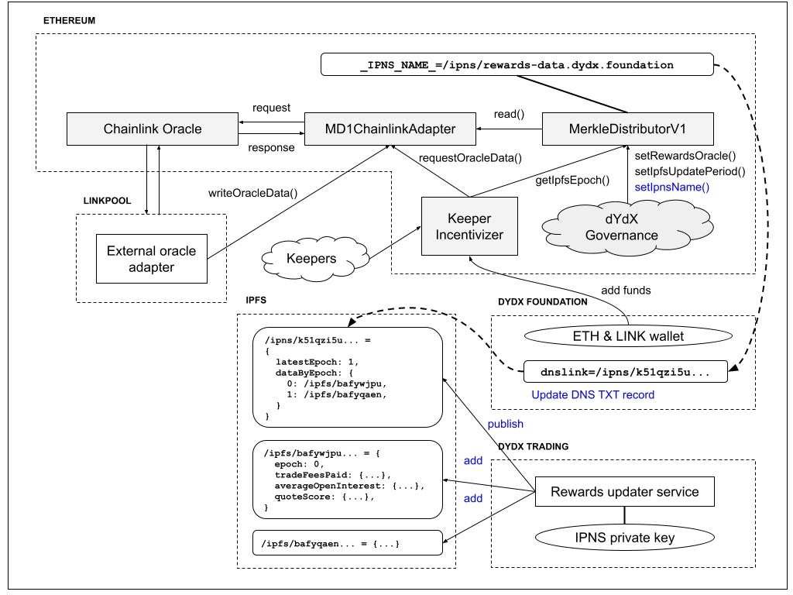

# Technical Overview

## Governance Architecture Overview

dYdX on-chain governance supports the following features:

* Creating and voting on proposals
* Snapshotting token holdings at the start of a proposal
* Delegating separate voting and proposing powers
* Setting governance thresholds including proposing, quorum, and vote differential thresholds
* Replacing the “Governance Strategy” smart contract, which determines how votes are counted
* Configuring multiple executor contracts allowing for:
  * rapid protocol upgrades and funds distribution via short time-lock executors;
  * governance upgrades via long time-lock executors.

There are 5 smart contracts that support dYdX Governance:

* **The `DYDX Token` contract**: Keeps snapshots which support queries for an address’ voting or proposing power at any block number. Supports separate delegation of voting and proposing powers.
* **The `Safety Module` contract**: Contains logics to stake DYDX tokens, tokenize a staked position, and earn rewards, while retaining the voting and proposing rights and delegation functions of the underlying tokens.
* **The `Governor` contract**: Tracks proposals and can execute proposals via the Executor smart contracts.
* **The `Executor` contracts**: Can queue, cancel, and execute transactions voted on by Governance. If a proposal passes, the functions calls in the proposal may be executed by the Executor contract specified in the proposal. Queued transactions can be executed after a delay, whose duration is determined by the Executor contract.
* **The `Governance Strategy` contract**: Contains the logic for counting votes. Currently, counts votes from the DYDX Token and the Safety Module. Can be upgraded via the long time-lock.

## Code

The DYDX and Governance codebase is available to review on the dYdX Foundation Github \[[https://github.com/dydxfoundation/governance-contracts](https://github.com/dydxfoundation/governance-contracts)\]

## Core Governance Contracts

### DydxToken

The DydxToken contract was inspired by Aave, whose smart contracts were audited \[XXX\]. Minor changes have been made by the dYdX team.

DYDX is deployed at [0x92D6C1e31e14520e676a687F0a93788B716BEff5](https://etherscan.io/address/0x92d6c1e31e14520e676a687f0a93788b716beff5) on the Ethereum mainnet. It was built from commit \[XXX\].

**ABI**

### DydxGovernor

The DydxGovernor contract was inspired by Aave, whose smart contracts were audited \[XXX\]. Minor changes have been made by dYdX. 

Governor is deployed at [0x7E9B1672616FF6D6629Ef2879419aaE79A9018D2](https://etherscan.io/address/0x7e9b1672616ff6d6629ef2879419aae79a9018d2) on the Ethereum mainnet. It was built from commit \[XXX\].

**ABI**

### Executors

The Executor contract was inspired by Aave, whose smart contracts were audited \[XXX\]. Minor changes have been made by dYdX. 

The **Long Timelock** is deployed at [0xEcaE9BF44A21d00E2350a42127A377Bf5856d84B](https://etherscan.io/address/0xecae9bf44a21d00e2350a42127a377bf5856d84b) on the Ethereum mainnet. It was built from commit \[XXX\].

**ABI**

The **Short Timelock** is deployed at [0xEcaE9BF44A21d00E2350a42127A377Bf5856d84B](https://etherscan.io/address/0xecae9bf44a21d00e2350a42127a377bf5856d84b) on the Ethereum mainnet. It was built from commit \[XXX\].

**ABI**

The **Merkle Timelock** is deployed at [0xd98e7A71BacB6F11438A8271dDB2EFd7f9361F52](https://etherscan.io/address/0xd98e7a71bacb6f11438a8271ddb2efd7f9361f52) on the Ethereum mainnet. It was built from commit \[XXX\].

**ABI**

The **Starkware Priority Timelock** is deployed  at [0xa306989BA6BcacdECCf3C0614FfF2B8C668e3CaE](https://etherscan.io/address/0xa306989ba6bcacdeccf3c0614fff2b8c668e3cae) on the Ethereum mainnet. It was built from commit \[XXX\].

**ABI**

## DYDX Incentives Contracts

### Merkle Distributor

The Merkle Distributor smart contract distributes DYDX token rewards according to a Merkle tree of balances. The tree can be updated periodically with each user's cumulative reward balance, allowing new rewards to be distributed to users over time.

An update is performed by setting the proposed Merkle root to the latest value returned by the oracle contract. The proposed Merkle root can be made active after a waiting period has elapsed. During the waiting period, dYdX Governance has the opportunity to freeze the Merkle root, in case the proposed root is incorrect or malicious. Root updates can be unpaused by ShortTimelockExecutor.

The Merkle Distributor smart contract was inspired by Uniswap and Badger designs. The smart contract is deployed at \[XXX\] on the Ethereum mainnet. It was built from commit \[XXX\]. An audit by PeckShield is available \[XXX\].

ABI

### Safety Module

The Safety Module is a staking pool that offers DYDX rewards to users who stake DYDX towards the security of the Protocol.

ABI

### Liquidity Module

The Liquidity Module is a collection of smart contracts for staking and borrowing, which incentivize the allocation of USDC funds for market making purposes on the dYdX layer 2 exchange.

Stakers earn DYDX rewards for staking USDC. The staked funds may be borrowed by certain pre-approved partners, on a reputational basis, without collateral. The funds may only be used on the L2 exchange—this is enforced via the StarkProxy contract which interacts with the StarkEx Perpetual Exchange contract.

### StarkProxy

StarkProxy: This contract allows the owner to borrow funds from LiquidityStaking and use those funds on StarkPerpetual. Additional funds may be deposited by the owner, and any funds in excess of the borrowed amount may be withdrawn freely. This contract interacts with the [StarkPerpetual](https://github.com/starkware-libs/starkex-contracts/tree/master/scalable-dex/contracts/src/perpetual) contract which was written by Starkware, and previously audited and deployed.

### Treasury Contracts

The TreasuryVester contract was inspired by [Uniswap](https://github.com/Uniswap/governance/blob/master/contracts/TreasuryVester.sol), whose smart contracts were audited \[XXX\]. Minor changes have been made by the dYdX team.

The DydxEcosystemReserve contract was inspired by Aave, whose smart contracts were audited \[XXX\]. Minor changes have been made by the dYdX team.

The Short Timelock can only execute governance-approved actions.

There are two treasury vesters and ecosystem reserve contracts, one is for liquidity mining rewards and the other is for holding “general purpose” treasury funds.

Since governance controls each ecosystem reserve, it can transfer funds to any address and/or approve any address to spend funds within either ecosystem reserve. For example, the rewards programs will need to have token approval limits set by governance.

Each treasury vester will vest tokens \(starting at a timestamp and emission rate specified by the treasury vester deployer\) to the corresponding ecosystem reserve.

The ecosystem reserve controller is only necessary because the ecosystem reserve smart contract is a proxy. Governance is the admin of the ecosystem reserve proxy, and proxy admins cannot call the implementation contract of proxies. Therefore, governance cannot directly call functions on the ecosystem reserve and needs the ecosystem reserve controller to “proxy” all calls to the ecosystem reserve implementation contract.

The following flow chart shows the Community Treasury architecture:

## Peripheral Contracts

### Chainlink Oracle-Powered Rewards \(Trading & Liquidity Provider Rewards\)

The goal of this system is to calculate and publish, via a decentralized network of oracle signers, the DYDX token rewards earned by traders using the dYdX layer 2 exchange. Rewards are stored in a Merkle tree, which contains the cumulative rewards earned by each user since the start of the distribution program. Each epoch, the Merkle root is updated on the MerkleDistributorV1 smart contract to reflect rewards earned in the last epoch.

We have integrated with the Chainlink Oracle system to post rewards data on-chain. We use IPNS to post the trading data that Chainlink uses to build the Merkle tree. By using IPNS, we can post the trading data for the latest epoch under the same IPNS link as previous epochs, meaning the location of the data won't change.

After calculating the appropriate rewards from the raw trading data, Chainlink posts the Merkle tree of rewards to IPFS. The IPFS CID with the Merkle tree data is stored on the Merkle distributor contract along with the Merkle root for that epoch's rewards.

The following flow chart shows the Chainlink Oracle-Powered Rewards system architecture:

### Other Assets

* DYDX brand assets are available [**here**](https://dydx.foundation/brand)\*\*\*\*

