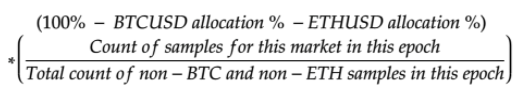

# 流動性プロバイダーの報酬

稼働時間、両方向のデプス、売買スプレッド、およびサポートされているマーケット数の組み合わせによる報酬計算公式に基づき、流動性プロバイダーには7.5％ \（`7,500万DYDX`\）が提供されます。

**目的**

* 両方向の流動性を改善し、流動性プロバイダーにプログラムによる報酬を提供します。

## **概要**

マーケットの流動性を利用できるようにするため、DYDXはマーケット参入、両方向のデプス、スプレッド \（対ミッドマーケット\）、およびdYdXレイヤ2プロトコルの稼働時間から計算される報酬計算公式に基づき、流動性プロバイダーに提供されます。イーサリアムのアドレスでは、前身のエポックにおけるメーカーボリュームの5％の最小メーカーボリューム基準値を条件とし、かかる報酬を獲得できます。DYDXは5年間にわたって28日間のエポックを基本として提供され、権利確定やロックアップの対象にはなりません。115万685ドル DYDXは、各エポックにて提供されます。

エポックごとに流動性プロバイダーにどのくらいのDYDXが報酬として支払われるかを計算するには、以下の関数を使用します。得られるDYDXの量は、各参加者の$$Q_{FINAL}$$の相対的なシェアによって決定されます。

マーケットごとに一定の**最小デプス** \(size\) \($$MinSize$$\)を下回る注文および一定の**最大スプレッド** \(ミッドマーケットスプレッド\) \($$MaxSpread$$$\)を上回る注文は除外されます。

流動性プロバイダーのパフォーマンスは分単位で監視および計算され \（ランダム化されたサンプリングを使用\）、所与のマーケットの$$Q_{SCORE}$$\($$Q_{FINAL}$$\)に集約されます。分単位のサンプリングにより、各エポックには28日間\* 24時間\* 60分のデータポイント（1エポックあたり合計40,320データポイント）があります。

流動性プロバイダーは、エポックごとの相対的な$$Q_{FINAL}$$のシェアに基づいて月次報酬を得ます。

上記の公式の詳細は以下のような逐次段計算に分かれています。

<table>
  <thead>
    <tr>
      <th style="text-align:left">用語（計算順）</th>
      <th style="text-align:left">定義</th>
      <th style="text-align:left">説明/例</th>
    </tr>
  </thead>
  <tbody>
    <tr>
      <td style="text-align:left"></td>
      <td style="text-align:left">
        

        

          
        

      </td>
      <td style="text-align:left">
        
流動性プロバイダーが、BTC-USDのオーダーブックで複数のオープンオーダー（29,900ドルで0.1BTC、
29,800ドルで5BTC、29,500ドルで10BTC）を保持しており、BTCは
現在3万ドル（ミッドマーケットに基づく）であると仮定します。TargetDepthが5,000ドル、
TargetSpread対ミッドマーケットは150ドル（USD条件）であると仮定します。 

        

        
 ランダムサンプリングを使用して分単位で計算します。 

      </td>
    </tr>
    <tr>
      <td style="text-align:left"></td>
      <td style="text-align:left">
        

        

          
        

      </td>
      <td style="text-align:left">
        
流動性プロバイダーが、BTC-USDのオーダーブックで複数のオープンアスクオーダー（30,100ドルで0.1BTC、
31,200ドルで5BTC、31,300ドルで10BTC）を保持しており、BTCは
現在3万ドル（ミッドマーケットに基づく）で取引されていると仮定します。TargetDepthは
5,000ドル、TargetSpread対ミッドマーケットは150ドル（USD条件）であると仮定します。

        

        

        
 ランダムな間隔により分単位で計算されます。

      </td>
    </tr>
    <tr>
      <td style="text-align:left"></td>
      <td style="text-align:left">
        
      </td>
      <td style="text-align:left">
        
最小値を取ることで、両方向の流動性に報酬を与えます。 

        
毎分計算されます。

      </td>
    </tr>
    <tr>
      <td style="text-align:left"></td>
      <td style="text-align:left">
        
      </td>
      <td style="text-align:left">所与のエポックにおけるすべての合計です。</td>
    </tr>
    <tr>
      <td style="text-align:left"></td>
      <td style="text-align:left">
        
      </td>
      <td style="text-align:left">エポックにおいて、特定のマーケットメーカーが取引および
建値の提示を行っていた時間の割合です（稼働時間）。</td>
    </tr>
    <tr>
      <td style="text-align:left"></td>
      <td style="text-align:left">
        

        

          
        

      </td>
      <td style="text-align:left">正規化して稼働時間を説明します。</td>
    </tr>
  </tbody>
</table>

各パーペチュアルマーケットには、加重が異なる独自の報酬プールがあります。各マーケットに適用される最初の加重値のセットは以下のとおりです。

| マーケット | 総報酬プールの配分率 |
| :--- | :--- |
| BTC-USD | 20％ |
| ETH-USD | 20％ |
| その他のパーペチュアルマーケット |  |

## FAQ

### 流動性プロバイダー報酬の対象者は誰ですか？

過去のエポックのdYdXレイヤ2パーペチュアルで最小メーカーボリュームである5％を達成したすべての流動性プロバイダーは、所定のエポックでDYDXを報酬として受け取る資格があります。

エポック0では、dYdX Tradingがどのマーケットメーカーが適格であるかを判断します。dYdX Tradingはどのマーケットメーカーがこの基準値に達しているかを判断します。

dYdXの[利用規約](https://dydx.exchange/terms)に定められているように、この商品は米国または制限地域のトレーダーにはご利用いただけません。

### 流動性プロバイダー報酬プログラムでDYDXをどのくらい獲得しましたか？

所定のエポックでは、流動性プロバイダーは所定のペアのマーケットにおける相対的な$$Q_{SCORE}$$に基づいてイールドを獲得します。各ペアには、ガバナンスによって設定された相対的な報酬額があります。獲得できるDYDXの期待値は、関与するマーケットメーカーの数、相対的な$$Q_{SCORE}$$、および所定のペアでの報酬額に基づき決定されます。

### 流動性プロバイダー報酬を請求するにはどうすればよいですか？

流動性プロバイダー報酬は、[dYdX API](https://docs.dydx.exchange/)に表示されます。ガバナンスのユーザーインターフェースには表示されないものの、[ここ](https://dydx.community/dashboard)での各エポックの終了時にガバナンスを通じて請求することが可能です。

### 請求済みのDYDX流動性プロバイダー報酬はいつ出金および移転することができますか？

取引報酬として獲得したDYDXトークンは、各エポックの終了後`7日間`\（**待機期間**\）を経過すると移転可能になります。

### 両方向のデプス、売買スプレッド、および稼働時間はどのように定義および測定するのでしょうか？

**両方向のデプス**

両方向の流動性プロバイダーとは、dYdXで両方向のマーケットで積極的にクォートする企業または個人を指しており、マーケットで多くの呼値を提示します。全体として分散型取引所に流動性を提供します。

たとえば、BTC-USDマーケットでマーケットメーカーが3万ドル - 3万100ドル、10x50を提示しているとします。これはつまり、3万ドルで10BTC\（購入する\）と提示し、3万100ドルで50BTC\（売却する\）と提示していることになります。その他のマーケット参加者は、このマーケットメーカーから3万ドルで\（オファーを押し上げて\）購入するか、マーケットメーカーに3万100ドルで\（約定して\）売却することができます。

流動性プロバイダーは、所定のマーケットでの両方向の価格提示能力について評価されます。一方向 \（売値または買値\）のみクォートする流動性プロバイダーは、min\(\)関数により報酬の受け取り対象から除外されます。

**ミッドマーケットのスプレッド**

流動性の一般的な尺度の1つとして、ビッド・アスク・スプレッドがあります。これはマーケットにおける最も高い買値\（買い注文\）と最も安い売値\（売り注文\）の差を指します。買値と売値の差であるスプレッドは主な取引コスト\（手数料以外\）であり、その買値と売値で注文を処理することで流動性プロバイダーが受け取ります。このスプレッドはユーザーに対する取引費用を直ちに測定します。

ミッドマーケット・スプレッドは、このマーケットでの中央値を指しています。この公式では各マーケットでMinDepth額を下回る注文も除外されます。

たとえば、流動性プロバイダーのBTC-USDの買値が3万ドルで、売値が3万100ドルである場合、ビッド・アスク・スプレッドは100ドルになります。ミッドマーケット価格は3万50ドルであり、ミッドマーケット・スプレッドは50ドルになります。

**稼働時間**

流動性プロバイダーの稼働時間はマーケット、特にボラティリティが高い期間において重要です。$$Q_{FINAL}$$の入力値の1つである$$Uptime_{epoch}$$に5の指数を適用することで、報酬は両方向の流動性を絶えず維持する流動性プロバイダーの方にスキューします。言い換えれば、稼働時間99％の流動性プロバイダーは90％のマーケットメーカーよりも指数関数的に価値が高いことになります。

稼働時間は、分単位で流動性を提供している所定のマーケットにおけるタイムオーダーの割合として定義されます\（ランダムサンプリングによる\）。稼働時間は取引所が停止している時間を除きます。取引所での処理が遅いとか、注文を受けていない\（ただし停止ではない\）など、上記のケースが適用されないようなエッジケースが存在する可能性があります\（そうしたものがバグとみなされ、すべてのマーケットメーカーが停止状態と同様の影響を受けることがあります）。

### マーケットごとの最大スプレッドをどのように定義しますか？

スプレッドが所定のマーケットの$MaxSpread$を上回っている場合、$$Q_{BID}$$や$$Q_{ASK}$$は生成されません。

最初の最大スプレッドは以下のとおりです。

| マーケット | 最大スプレッド対ミッドマーケット \（売値および買値\） |
| :--- | :--- |
| BTC-USD | 20bps |
| ETH-USD | 20bps |
| その他のパーペチュアルマーケット | 40bps |

### マーケットごとの最小サイズはどのように定義しますか？

サイズが所定のマーケットの$$MinSize$$を下回っている場合、$$Q_{BID}$$や$$Q_{ASK}$$は生成されません。

最初の最小サイズは以下のとおりです。

| **マーケット** | **最小サイズ \（買値および売値\）** |
| :--- | :--- |
| BTC-USD | 5,000ドル |
| ETH-USD | 5,000ドル |
| その他のパーペチュアルマーケット | 1,000ドル |

