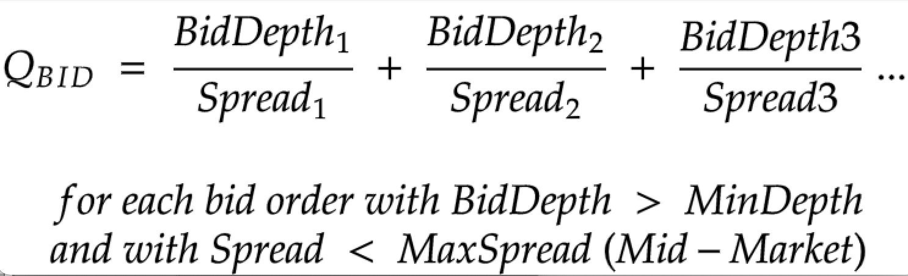
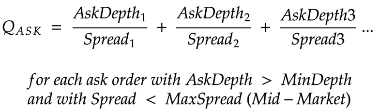
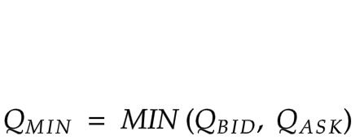
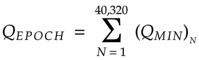
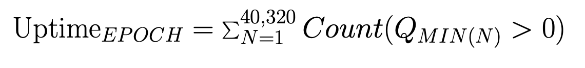
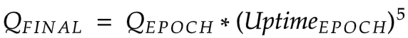
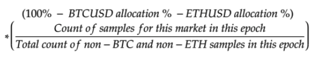

# ⚖️ Награды для поставщиков ликвидности

**3,3%** от первоначального количества токенов в обращении (`32 794 525 $ethDYDX`) будет распределено между поставщиками ликвидности на основе формул, которые рассчитывают награды с учетом сочетания объема мейкера, времени работы, двусторонней глубины, спредов между ценой спроса и предложения, а также количества поддерживаемых рынков. Первоначально между ПЛ распределялось **7,5%** (`75 000 000 $ethDYDX`) от предложения токенов.

* В рамках [ППУ 24](https://github.com/dydxfoundation/dip/blob/master/content/dips/DIP-24.md) сообщество dYdX [проголосовало](https://dydx.community/dashboard/proposal/14) за сокращение размера наград для поставщиков ликвидности на 50% с `1 150 685 $ethDYDX` за эпоху до `575 343 $ethDYDX` за эпоху. В результате размер распределяемых наград для ПЛ сократился с `7,5%` до `5,2%`.
*   В рамках [ППУ 29](https://dydx.community/dashboard/proposal/16) сообщество dYdX [проголосовало](https://dydx.community/dashboard/proposal/16) за сокращение наград для поставщиков ликвидности на ⅓ с эпохи 30-32 на dYdX v3 до следующих значений:

    * Эпоха 30: 562 $ethDYDX
    * Эпоха 31: 191 781 $ethDYDX
    * Эпоха 32: 0 $ethDYDX

    После эпохи 31 поставщикам ликвидности не будут присуждаться награды на dYdX v3. В результате размер распределяемых наград для поставщиков ликвидности сократился с `5,2%` до `3,2%`.

Поскольку в цепочке dYdX не распределяются награды для поставщиков ликвидности, сообщество dYdX рамках ППУ 29 проголосовало за перенос оставшегося распределения наград для поставщиков ликвидности в казну сообщества цепочки dYdX.

**Цели**

* Повышайте двустороннюю ликвидность и автоматически награждайте ее поставщиков.

## **Обзор**

Чтобы стимулировать ликвидность рынка, токены $ethDYDX будут распределяться между поставщиками ликвидности по формулам присуждения наград, учитывающим степень участия на рынках, объем мейкера, двустороннюю глубину, спред (по сравнению со среднерыночной ценой), а также время работы в рамках протокола dYdX v3. Эти награды может получать любой адрес Ethereum при условии минимального порогового значения объема мейкера в размере 0,25% от объема мейкера в предыдущую эпоху. $ethDYDX распределяется по 28-дневной эпохе в течение пяти лет и не подлежит никакому вестингу или блокировке.

Для расчета количества токенов $ethDYDX, присуждаемых каждому поставщику ликвидности за эпоху, используются указанные далее функции. В рамках [ППУ 15](https://github.com/dydxfoundation/dip/blob/master/content/dips/DIP-15.md) сообщество dYdX проголосовало за пересмотр формулы наград для поставщиков ликвидности за счет разделения функций для рынков BTC/ETH и рынков, не относящихся к BTC/ETH. В рамках [ППУ 19](https://github.com/dydxfoundation/dip/blob/master/content/dips/DIP-19.md) сообщество dYdX проголосовало за перераспределение объема 0,05 stkDYDX в MakerVolume.

В целом, значение объема в функциях был увеличен на всех рынках. Количество заработанных токенов ethDYDX определяется на основе относительной доли параметра $$Q_{FINAL}$$ ($$Q_{BTC}$$+​$$Q_{ETH}$$+$$Q_{non BTC/ETH}$$​) каждого участника.

<figure><figcaption></figcaption></figure>

Ордера ниже определенной **минимальной глубины** (объема) ($$MinDepth$$) на рынке исключаются. Также исключаются ордера на определенный **максимальный спред** (среднерыночный спред) ($$MaxSpread$$).

Показатели работы поставщиков ликвидности отслеживаются и рассчитываются поминутно (с использованием случайной выборки) и суммируются в показатель $$Q_{SCORE}$$ для данного рынка. Каждая эпоха подразумевает выборку точек данных на ежеминутной основе. Так, она состоит из 40 320 точек данных в целом (28 дней \* 24 часа \* 60 минут).

Количество заработанных токенов DYDX определяется на основе относительной доли параметра $$Q_{FINAL}$$ каждого участника:

Расчет по приведенной выше формуле разбит на этапы, подробная информация о которых указана ниже:

| _Объем мейкера_ | Общий объем мейкера за эпоху. |
| --------------------------------------------------------------------------------------- | ---------------------------------------------------------------------------------------------------------------------------------------------------------------------------------------------------------------------------------------------------------------------------------------------------------------------------------------------------------------------------------------------------------------------------------------------------------------------------------------------------------------------------------------------------------------------------------------------------------- |
|  | 

Предположим, что поставщик ликвидности имеет несколько открытых ордеров на продажу (1 BTC по цене 29 900 USD, 5 BTC по цене 29 850, 10 BTC по цене 29 500 USD) в биржевом стакане BTC-USD, а цена BTC в настоящий момент составляет 30 000 USD (на основе среднерыночного показателя). Предположим, что минимальная глубина (MinDepth) — 5000 USD, а максимальный спред (MaxSpread) по сравнению со среднерыночным — 200 USD, или 67 базисных пунктов (200 USD / 30 000 USD). Базисный пункт равен одной сотой процента. 

Q_{BID} = (1\ \times \left(\frac{$29,900}{$100/30000}\right)) + (5\ \times \left(\frac{$29,850}{$150/30000}\right))

 Q_{BID}рассчитывается ежеминутно методом случайной выборки.  |
|  | 

Предположим, что поставщик ликвидности имеет несколько открытых ордеров на покупку (0,1 BTC по цене 30 100 USD, 5 BTC по цене 30 150, 10 BTC по цене 30 175 USD) в биржевом стакане BTC-USD, а цена BTC в настоящий момент составляет 30 000 USD (на основе среднерыночного показателя). Предположим, что минимальная глубина (MinDepth) — 5000 USD, а максимальный спред (MaxSpread) по сравнению со среднерыночным — 200 USD, или 67 базисных пунктов (200 USD / 30 000 USD). Базисный пункт равен одной сотой процента.

Q_{ASK} = (5\ \times \left(\frac{$30,150}{$150/30000}\right)) + (10\ \times \left(\frac{$30,175}{$175/30000}\right))

 Q_{ASK} рассчитывается каждую минуту через случайные интервалы времени. |
|  | 

Присуждение наград за обеспечение двусторонней ликвидности с учетом минимального значения Q_{BID} и Q_{ASK}. 

Рассчитывается каждую минуту. |
|  | $$Q_{EPOCH}$$— это сумма всех значений $$Q_{MIN}$$за определенную эпоху. |
|  | $$Uptime_{EPOCH}$$обозначает время в эпоху, когда определенный маркетмейкер участвовал в торгах на бирже и совершал торговые операции как по продаже, так и по покупке с размером ордеров, превышающим установленный минимальный размер (отмечается ниже по рынку), и спредами, меньшими, чем установленный максимальный спред (отмечается ниже по рынку). |
|  | $$Q_{FINAL}$$нормализует показатель $$Q_{EPOCH}$$для учета времени работы |

У каждого рынка будет свой собственный пул наград, который будет рассчитываться по-разному. В рамках [ППУ 15](https://github.com/dydxfoundation/dip/blob/master/content/dips/DIP-15.md) сообщество dYdX проголосовало за сокращение общего количества распределяемых наград в отношении пар BTC-USD и ETH-USDC на 10%. Ко всем рынкам будут применяться следующие значения:

| Рынок | Распределение общего пула наград в % |
| ----------------------- | ---------------------------------------------------------------- |
| BTC-USD | 10% |
| ETH-USD | 10% |
| Другие рынки бессрочных контрактов |  |

## Часто задаваемые вопросы

Кто имеет право на получение наград для поставщиков ликвидности?

Право на получение токена ethDYDX в качестве награды в данную эпоху имеют все поставщики ликвидности, которые достигли минимума в 0,25% от объема мейкера в рамках протокола dYdX v3 в предыдущую эпоху.

Пакет dYdX v3 недоступен для поставщиков ликвидности в Соединенных Штатах Америки или на территориях с ограниченным доступом, как определено в [Условиях использования](https://dydx.exchange/terms) dYdX Trading Inc.

Сколько $ethDYDX мне удалось заработать по программе вознаграждения поставщиков ликвидности?

Каждой паре соответствует свой собственный относительный размер награды, который определяется управлением. Каждой паре соответствует свой собственный относительный размер награды, который определяется управлением. Ожидаемое количество заработанных ethDYDX отображается на [панели мониторинга наград для поставщиков ликвидности](https://p.datadoghq.com/sb/dc160ddf0-b32271920202875868dc46be6b66cf87?tpl\_var\_Market=btc\&from\_ts=1661805073576\&to\_ts=1661891473576\&live=true). Его можно определить на основе количества участвующих поставщиков ликвидности, относительного показателя $$Q_{SCORE}$$ и размера награды, доступного для определенной пары.

Как получить награды для поставщиков ликвидности?

Награды для поставщиков ликвидности отображаются в [API dYdX](https://docs.dydx.exchange/). Хотя они не отображаются в пользовательском интерфейсе управления, их все же можно получить с помощью управления в конце каждой эпохи [здесь](https://dydx.community/dashboard).

Когда можно выводить и переводить полученные награды для поставщиков ликвидности в виде токенов $ethDYDX?

Заработанные в качестве награды для поставщиков ликвидности токены $ethDYDX станут доступны для получения и перевода по истечении периода первоначального ограничения на перевод.

Начиная с эпохи 1 токены $ethDYDX, присужденные в качестве награды для поставщиков ликвидности, станут доступны для получения `через 7 дней` (**период ожидания**) после окончания каждой эпохи.

Как определяются и измеряются двусторонняя глубина, спред между ценой спроса и предложения и время работы?

* **Двусторонняя глубина**

Двусторонний поставщик ликвидности на dYdX v3 — это тот, кто активно назначает цены покупки и продажи на рынке, обеспечивая ликвидность протокола. Например, на рынке BTC-USD они могут предложить купить 10 BTC по цене $30 000 и продать 50 BTC по цене $30 100. Другие участники могут торговать с ними по этим ценам. Поставщики ликвидности оцениваются на основе их способности предоставлять цены как на покупку, так и на продажу. Те, кто котирует только одну сторону, исключаются из наград.

* **Среднерыночный спред**

Спред спроса и предложения — это распространенная мера ликвидности, представляющая собой разницу между самой высокой ценой предложения (покупки) и самой низкой ценой предложения (продажи) на рынке. Это основная стоимость торговли, которую взимают поставщики ликвидности. Еще одним показателем является среднерыночный спред, который является средней точкой рынка. Например, если цена спроса для BTC-USD составляет $30 000, а цена предложения — $30 100, спред между ценой покупки и продажи составляет $100, а среднерыночный спред — $50.

* **Время работы**

Время работы поставщиков ликвидности — это крайне важный показатель для рынков, особенно в периоды высокой волатильности. При применении экспоненты 5 к параметру $$Uptime_{epoch}$$ в качестве вводных данных для параметра $$Q_{FINAL}$$ награды распределяются между теми поставщиками ликвидности, которые постоянно обеспечивают двустороннюю ликвидность. Другими словами, поставщик ликвидности, который обеспечивает 99% времени работы, экспоненциально более ценен, чем поставщик ликвидности, обеспечивающий 90% времени работы.

Время безотказной работы — это процент времени, в течение которого ордера активно обеспечивают ликвидность на рынке, измеряемый поминутно с помощью рандомизированной выборки. Он исключает периоды, когда протокол dYdX уровня 2 испытывает сбои, но может не учитывать случайную медлительность или проблемы с принятием ордеров, которые будут считаться ошибками, одинаково влияющими на всех поставщиков ликвидности.

Как можно определить максимальные спреды по рынку?

Если спред выше значения $$MaxSpread$$ на определенном рынке, то $$Q_{BID}$$ или $$Q_{ASK}$$ не генерируется.

Изначально максимальные спреды имеют следующие значения:

* BTC-USD: 20 б/с
* ETH-USD: 20 б/с
* другие бессрочные рынки: 40 б/с

Как определить минимальную глубину (объем) рынка?

Если объем определенного рынка ниже значения $$MinDepth$$, то $$Q_{BID}$$ или $$Q_{ASK}$$ не генерируется.

Изначально минимальная глубина рынка имеет следующие значения:

* BTC-USD: $5000
* ETH-USD: $5000
* Другой бессрочный рынок: $1000

