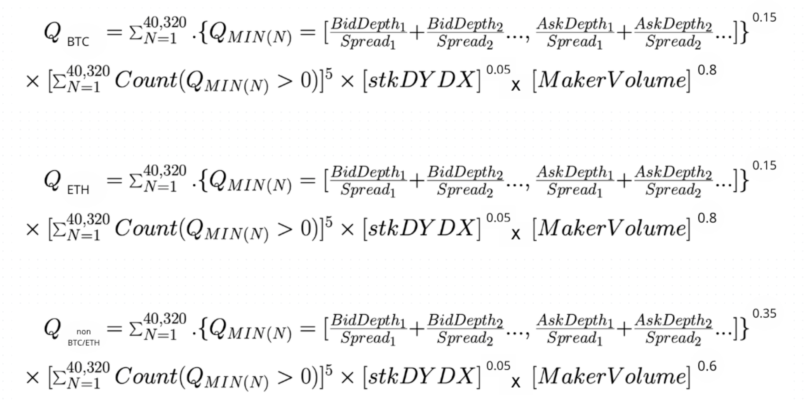

# Belohnungen für Liquiditätsanbieter

7,5% der anfänglichen Tokenmenge (`75.000.000 DYDX`) werden an Liquiditätsanbieter verteilt, basierend auf Formeln, die eine Kombination aus Maker-Volumen, Betriebszeit, zweiseitiger Tiefe, Geld-Brief-Spannen, stkDYDX und der Anzahl der unterstützten Märkte belohnen.

**Ziele**

* Verbessern Sie die zweiseitige Liquidität und belohnen Sie Liquiditätsanbieter programmatisch.

## **Überblick**

Um Anreize für die Marktliquidität zu schaffen, wird DYDX an die Liquiditätsanbieter auf der Grundlage von Formeln verteilt, die die Teilnahme an den Märkten, das Maker-Volumen, die zweiseitige Tiefe, den Spread (im Vergleich zum mittleren Markt) und die Betriebszeit auf dem Layer-2-Protokoll von dYdX vergüten. Jede Ethereum-Adresse kann diese Prämien verdienen, vorbehaltlich eines Mindest-Macher-Volumens von 0,25 % des Macher-Volumens in der vorangegangenen Epoche. DYDX wird auf einer Epochenbasis von 28 Tagen über einen Zeitraum von fünf Jahren verteilt und unterliegt keinen Vesting- oder Sperrfristen. Pro Epoche werden 1.150.685 DYDX verteilt.

Die folgenden Funktionen werden verwendet, um zu berechnen, wie viel DYDX pro Epoche an jeden Liquiditätsanbieter vergütet werden sollte. In [DIP 15](https://github.com/dydxfoundation/dip/blob/master/content/dips/DIP-15.md) hat die dYdX-Gemeinschaft dafür gestimmt, die Formel für die LP-Vergütung zu überarbeiten, indem die Funktionen für BTC/ETH-Märkte und Nicht-BTC/ETH-Märkte aufgeteilt werden. Insgesamt wurde die Gewichtung des Volumens in den Funktionen in allen Märkten erhöht. Die Höhe des verdienten DYDX wird durch den relativen Anteil des $$Q_{FINAL}$$  ($$Q_{BTC}$$+$$Q_{ETH}$$+$$Q_{non BTC/ETH}$$) jedes Teilnehmers bestimmt.

<figure><figcaption></figcaption></figure>

Aufträge unter einer bestimmten **Mindesttiefe** (Größe) ($$MinDepth$$) pro Markt sind ausgeschlossen, und Aufträge über einem bestimmten **maximalen Spread **(Mid-Market-Spread) ($$MaxSpread$$) Markt sind ebenfalls ausgeschlossen.

Die Leistung von Liquiditätsanbietern wird minütlich überwacht und berechnet (unter Verwendung von Zufallsstichproben) und zu einem $$Q_{SCORE}$$ für einen bestimmten Markt aggregiert. Bei minütlichen Stichproben hat jede Epoche 28 Tage \* 24 Stunden \* 60 Minuten an Datenpunkten – insgesamt 40.320 Datenpunkte pro Epoche.

Liquiditätsanbieter verdienen monatliche Prämien basierend auf ihrem relativen Anteil von $$Q_{FINAL}$$ pro Epoche.

Die obige Formel wird unten in schrittweise Berechnungen für Details unterteilt:

| _Macher-Volumen_ | Gesamt-Macher-Volumen für die Epoche. |
| --------------------------------------------------------------------------------------- | ----------------------------------------------------------------------------------------------------------------------------------------------------------------------------------------------------------------------------------------------------------------------------------------------------------------------------------------------------------------------------------------------------------------------------------------------------------------------------------------------------------------------------------------------------------------------------------------------------------- |
|  | 

Angenommen, ein Liquiditätsanbieter hat mehrere offene Gebotsaufträge (1 BTC zu 29.900 $, 5 BTC zu 29.850 $, 10 BTC zu 29.500 $) im BTC-USD-Auftragsbuch und BTC liegt derzeit bei 30.000 $ (basierend auf der Marktmitte). Angenommen, MinDepth beträgt 5.000 $ und MaxSpread gegenüber dem Mittelstand 200 $ oder 6,7 Basispunkte (200 $/30.000 $). Ein BP ist ein Hundertstel von einem Prozent. 

Q_{BID} = (1\ \times \left(\frac{$29.900}{$100/30000}\right)) + (5\ \times \left(\frac{$29.850}{$150/30000}\right))

 Q_{BID} wird jede Minute per Zufallsstichprobe berechnet.  |
|  | 

Angenommen, ein Liquiditätsanbieter hat mehrere offene Briefaufträge (0,1 BTC zu 30.100 $, 5 BTC zu 30.150 $, 10 BTC zu 30.175 $) im BTC-USD-Auftragsbuch und BTC wird derzeit bei 30.000 $ gehandelt (basierend auf der Marktmitte). Angenommen, MinDepth beträgt 5.000 $ und MaxSpread gegenüber dem Mittelstand 200 $ oder 6,7 Basispunkte (200 $/30.000 $). Ein BP ist ein Hundertstel von einem Prozent.

Q_{ASK} = (5\ \times \left(\frac{$30,150}{$150/30000}\right)) + (10\ \times \left(\frac{$30,175}{$175/30000}\right))

 Q_{ASK} wird jede Minute in einem zufälligen Intervall berechnet. |
|  | 

Belohnt 2-seitige Liquidität, indem das Minimum von Q_{BID} und Q_{ASK} genommen wird. 

Berechnet jede Minute. |
|  | $$Q_{EPOCH}$$ ist die Summe aller $$Q_{MIN}$$ in einer gegebenen Epoche. |
|  | $$Uptime_{EPOCH}$$ ist die Zeit in einer Epoche, in der ein bestimmter Marktmacher live war und sowohl auf der Geld- als auch auf der Briefseite mit Auftragsgrößen notierte, die größer als das angegebene Auftragsminimum (unten nach Markt angegeben) und Spreads kleiner als das angegebene Spread-Maximum waren (unten nach Markt notiert). |
|  | $$Q_{FINAL}$$normalisiert $$Q_{EPOCH}$$, um die Betriebszeit zu berücksichtigen |
| _stkDYDX_ | Durchschnittliche Menge an gehaltenem stkDYDX (zufällig jede Minute gemessen) über die Epoche |

Jeder Markt wird seinen eigenen Belohnungspool haben, der unterschiedlich gewichtet wird. Im Rahmen des DIP \[] stimmte die dYdX-Community dafür, die Zuteilung der gesamten Rewards in BTC-USD und ETH-USDC auf jeweils 10 % zu beschränken.  Der anfängliche Satz von Gewichtungen, der auf jeden Markt angewendet wird, lautet wie folgt:

| Markt | % Zuteilung des Gesamtprämienpools |
| ---------------------- | ---------------------------------------------------------------- |
| BTC-USD | 10 % |
| ETH-USD | 10 % |
| Anderer ewiger Markt |  |

## FAQ

### Wer hat Anspruch auf Prämien von Liquiditätsanbietern?

Alle Liquiditätsanbieter, die in der vorherigen Epoche mindestens 0,25 % des Herstellervolumens auf dem dYdX-Ebene-2-Protokoll erreicht haben, sind berechtigt, DYDX als Belohnung in einer bestimmten Epoche zu erhalten.

Das dYdX Layer 2-Protokoll ist für Trader in den Vereinigten Staaten oder in beschränkten Gebieten nicht verfügbar, wie in den [Nutzungsbedingungen](https://dydx.exchange/terms) von dYdX Trading Inc. definiert.

### Wie viel DYDX habe ich im Liquidity Provider Rewards-Programm verdient?

In einer bestimmten Epoche erzielen Liquiditätsanbieter Renditen basierend auf ihren relativen $$Q_{SCORE}$$ auf dem Markt eines bestimmten Paares. Jedes Paar hat seinen eigenen relativen Belohnungsbetrag, der von der Governance festgelegt wird. Der erwartete Betrag an verdienten DYDX wird im [LP-Rewards Dashboard](https://p.datadoghq.com/sb/dc160ddf0-b32271920202875868dc46be6b66cf87?tpl\_var\_Market=btc\&from\_ts=1661805073576\&to\_ts=1661891473576\&live=true) angezeigt und kann auf Grundlage der Anzahl der beteiligten Liquiditätsanbieter, des relativen $$$Q_{SCORE}$$ und der Höhe der für ein bestimmtes Paar verfügbaren Rewards ermittelt werden.

### Wie beanspruche ich meine Liquidity-Provider-Prämien?

Belohnungen für Liquiditätsanbieter werden in der [dYdX API](https://docs.dydx.exchange/) aufgestellt. Obwohl sie nicht auf der Governance-Benutzeroberfläche aufgetaucht sind, können sie [hier](https://dydx.community/dashboard) immer noch über die Governance am Ende jeder Epoche beansprucht werden.

### Wann kann ich meine beanspruchten DYDX Liquidity-Provider-Prämien abheben und übertragen?

DYDX-Token, die über die Liquidity-Provider-Prämien belohnt werden, werden beanspruchbar und übertragbar, sobald der anfängliche Übertragungsbeschränkungszeitraum aufgehoben ist.

Ab Epoche 1 können DYDX-Token, die über die Liquidity-Provider-Prämien belohnt werden, `7 Tage` (**Wartezeit**) nach dem Ende jeder Epoche eingefordert werden.

### Wie werden zweiseitige Tiefe, Geld-Brief-Spanne und Betriebszeit definiert und gemessen?

**Zweiseitige Tiefe**

Ein zweiseitiger Liquiditätsanbieter ist eine Firma oder Einzelperson, die aktiv zweiseitige Märkte auf dem dYdX-Ebene-2-Protokoll notiert und Gebote und Nachfragen für einen bestimmten Markt bereitstellt. Sie stellen dem Protokoll insgesamt Liquidität zur Verfügung.

Beispielsweise kann ein Liquiditätsanbieter auf dem BTC-USD-Markt ein Angebot von 30.000 $ bis 30.100 $, 10x50 bereitstellen. Das bedeutet, dass er 10 BTC für 30.000 $ bietet (kauft) und 50 BTC für 30.100 $ anbietet (verkauft). Andere Marktteilnehmer können dann bei dem Liquiditätsanbieter für 30.100 $ kaufen (das Angebot aufheben) oder für 30.000 $ an ihn verkaufen (das Gebot abgeben).

Liquiditätsanbieter werden anhand ihrer Fähigkeit bewertet, sowohl Gebote als auch Nachfragen auf einem bestimmten Markt bereitzustellen. Liquiditätsanbieter, die nur auf der 1-Seite quotieren (entweder nur Gebote oder Nachfragen), sind aufgrund der Funktion min() vom Erhalt von Prämien ausgeschlossen.

**Mittlerer Markt-Spread**

Ein gängiges Maß für die Liquidität ist die Geld-Brief-Spanne: die Spanne zwischen dem höchsten Geldkurs (Kaufauftrag) und dem niedrigsten Briefkurs (Verkaufsauftrag) in einem Markt. Die Differenz zwischen Geld- und Briefkurs, der Spread, sind die Haupttransaktionskosten des Handels (ohne Provisionen) und werden vom Liquiditätsanbieter durch die Verarbeitung von Aufträgen zu Geld- und Briefkursen eingezogen. Der Spread misst die Kosten der Transaktion unmittelbar für einen Benutzer.

Der mittlere Markt-Spread nimmt speziell den Mittelpunkt des Marktes ein. Mit dieser Formel werden auch Aufträge unter dem MinDepth-Betrag für jeden Markt ausgeschlossen.

Wenn beispielsweise der Geldkurs eines Liquiditätsanbieters für BTC-USD 30.000 $ und der Briefkurs 30.100 $ beträgt, dann beträgt die Geld-Brief-Spanne 100 $. Der mittlere Marktpreis beträgt 30.050 $ und der mittlere Markt-Spread 50 $.

**Betriebszeit**

Die Verfügbarkeit von Liquiditätsanbietern ist für die Märkte von entscheidender Bedeutung, insbesondere in Zeiten hoher Volatilität. Durch die Anwendung eines Exponenten von 5 auf $$Uptime_{epoch}$$ als Eingabe für $$Q_{FINAL}$$ werden die Belohnungen in Richtung Liquiditätsanbieter verschoben, die ständig zweiseitige Liquidität aufrechterhalten. Mit anderen Worten, ein Liquiditätsanbieter, der 99 % der Zeit Betriebszeit bietet, ist exponentiell wertvoller als ein Liquiditätsanbieter, der 90 % Betriebszeit bietet.

Betriebszeit ist definiert als der Prozentsatz der Zeit, in der sich Aufträge in einem bestimmten Markt befinden und minutenweise Liquidität bereitstellen (mit zufälliger Stichprobe). Die Betriebszeit schließt Zeiträume aus, in denen Ausfälle auf dem dYdX-Ebene-2-Protokoll selbst bestehen. Es kann Grenzfälle geben, in denen die Börse langsam ist oder keine Aufträge annimmt (aber kein Ausfall ist) – in diesem Fall würde das oben Gesagte nicht zutreffen (aber das würde als Fehler angesehen werden und alle Liquiditätsanbieter wären ähnlich betroffen wie bei Ausfällen).

### Wie werden die maximalen Spreads pro Markt definiert?

Es werden keine $$Q_{BID}$$ oder $$Q_{ASK}$$ generiert, wenn der Spread über dem $$MaxSpread$$ eines bestimmten Marktes liegt.

Die anfänglichen maximalen Spreads sind wie folgt:

| Markt | Max. Spread vs. Mid-Market (Geld und Brief) |
| ----------------------- | -------------------------------------- |
| BTC-USD | 20 bps |
| ETH-USD | 20 bps |
| Andere ewige Märkte | 40 bps |

### Wie wird die minimale Tiefe (Größe) pro Markt definiert?

Es werden keine $$Q_{BID}$$ oder $$Q_{ASK}$$ generiert, wenn die Größe unter der $$MinDepth$$ eines bestimmten Marktes liegt.

Die anfänglichen Mindesttiefen sind wie folgt:

| **Markt** | **Mindesttiefe (Gebot und Nachfrage)** |
| ----------------------- | --------------------------- |
| BTC-USD | $5000 |
| ETH-USD | $5000 |
| Andere ewige Märkte | $1000 |
