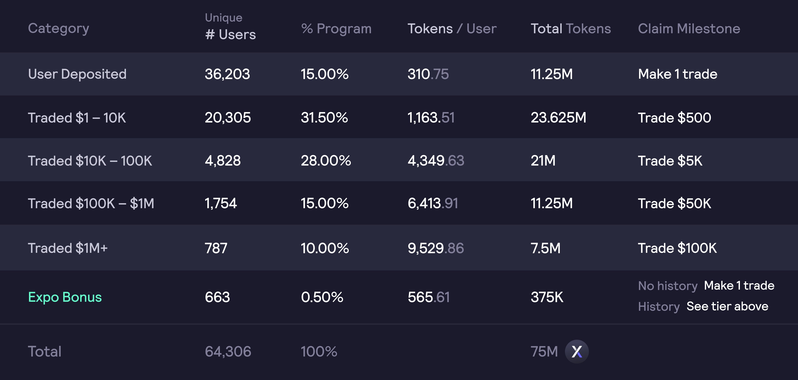

# 追溯性挖矿奖励

初始代币供应量的 **5.0%**（`50,309,197 $ethDYDX`）将分配给在 dYdX v 3上完成某些交易里程碑的过往用户，但不包括位于禁止提供 $ethDYDX 的司法管辖区的用户（包括美国）。最初，代币供应量的 `7.50%`（`75,000,000  $ethDYDX`）留给 dYdX 协议的过往用户，但在时段 0 结束时，未被申领的“追溯性挖矿奖励”则转至社区资金库。

**目标**

* 根据过去使用情况，采用追溯奖励来奖励过往dYdX用户。
* 激励 dYdX 的历史用户在 dYdX v3 上交易。

## 概述

dYdX v3 的成功是大量社区成员在过去三年中一直在 dYdX v3 及其前身上进行交易的成果。

根据**截至北京时间 2021 年 7 月 27 日 08:00:00** 的快照，$ethDYDX 已分配给所有 dYdX 协议的历史用户（不包括位于禁止 $ethDYDX 的司法管辖区的用户（包括美国））。有五个分配等级，考虑了用户过去在所有dYdX协议上的活动。

如果要申领 $ethDYDX，历史用户必须在首个28 天时段（时段 0）内满足 [Layer 2永续合](https://trade.dydx.exchange)约的下列里程碑：

用户将能够达到申领里程碑，直到0时段结束。所有未赚取的奖励将被收回，并自动分配给社区资金库。一旦初始转账限制期限解除，即可申领和转账通过“追溯挖矿奖励”获得的 $ethDYDX 代币。

## **常见问题解答**

### **谁有资格获得追溯奖励？**

在 Layer 2 或 Layer 1上交易 dYdX 协议（永续、保证金、现货）或将资金存入 dYdX 的借款/供应池的过往 dYdX 用户，有资格通过追溯奖励获得 $ethDYDX。

由于美国禁止 $ethDYDX 和 dYdX v3，追溯性挖矿不提供给位于美国或任何其他受禁止司法管辖区的居民、公司或总部设在这些地区的用户。任何看来与投机未来空投的机器人活动明显相关联的账户也被排除在追溯奖励之外。

所有追溯奖励分配都是最终的，无法更改。

### 我在追溯性奖励计划中赚取了多少 $ethDYDX？

过往dYdX用户可以在[**trade.dydx.exchange/portfolio/rewards**](https://trade.dydx.exchange/portfolio/rewards)上查看他们过去的追溯性挖矿活动和等级。要获得 $ethDYDX，用户必须在 [**trade.dydx.exchange**](https://trade.dydx.exchange/) 上交易 dYdX v3，达到其标准阈值。

### 如果我没有达到申领里程碑，会发生什么情况？

如果要申领全部分配的 $ethDYDX 代币，用户必须达到他们在 dYdX v3 上交易永续合约的特定目标交易量等级。

获得的追溯奖励按照目标交易量来相应进行申领。例如，如果用户在 dYdX v3 上的申领里程碑是 5,000 美元的交易量，但用户在时段 0 的过程中仅交易了 2,500 美元，那么用户只能申领 50% 的分配奖励。

时段 0 结束时，如有未被申领的 $ethDYDX ，则予以收回并自动分配给社区资金库。

### 我何时可以支取并转账申领的 $ethDYDX 追溯奖励？

一旦初始转账限制期限解除，即可申领和转账通过“追溯挖矿奖励”赚取的 $ethDYDX 代币。

大约在**北京时间 2021 年 9 月 8 日晚上11:00:00**，即时段 0 结束后的`第 8 天`，初始转账限制解除，可以申领、支取、转账、委托通过“追溯性挖矿奖励”赚取的 $ethDYDX 代币。
