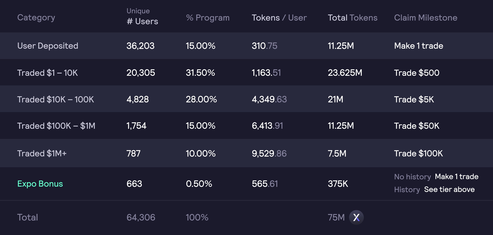
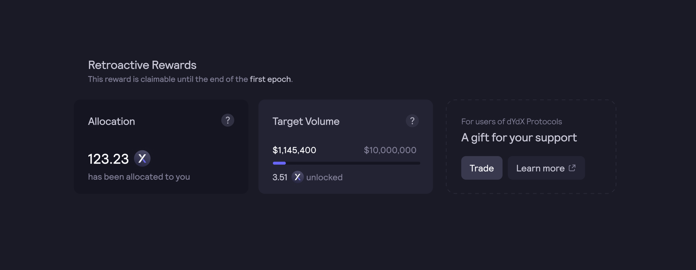

# 追溯性挖矿奖励

初始代币供应量的`7.50%`（`75,000,000个DYDX`）将分配给完成协议某些交易里程碑的dYdX协议过往用户，但不包括位于不允许提供DYDX的管辖区的用户，包括美国。如果要申领赚取的代币，用户需要在dYdX Layer 2协议上进行交易，并达到各自的申领里程碑。

**目标**

* 根据过去使用情况，采用追溯奖励来奖励过往dYdX用户。
* 激励过往dYdX用户在dYdX Layer 2协议上进行交易。

## 概述

dYdX Layer 2协议的成功是成千上万名社区成员努力的结果，他们在过去三年中一直在dYdX Layer 2协议及其前身上进行交易。

根据截至**中国时间2021年7月27日08:00:00**的快照，将DYDX分配给所有dYdX 协议的过往用户（不包括不允许提供DYDX的管辖区的用户，包括美国）。有五个分配等级，考虑了用户过去在所有dYdX协议上的活动。

如果要申领DYDX，过往用户必须在首个28天时段（0时段）内满足[Layer 2永续合约](https://trade.dydx.exchange)的以下里程碑：

dYdX Layer 2协议上的任何历史成交量都将计入用户的申领里程碑。只有在[trade.dydx.exchange/portfolio/rewards](https://trade.dydx.exchange/portfolio/rewards)上，才能查看您的申领里程碑的进展，因为dYdX基金会无法明确了解每个用户的持续交易量。

用户将能够达到申领里程碑，直到0时段结束。所有未赚取的奖励将被收回，并自动分配给社区资金库。一旦初始转让限制期解除，通过追溯挖矿奖励获得的DYDX代币将永久可申领和转让。

## **常见问题解答**

### **谁有资格获得追溯奖励？**

在Layer 2或Layer 1上交易dYdX产品（永续、保证金、现货）或将资金质存入dYdX的借款/供应池的过往dYdX用户，便有资格通过追溯奖励获得DYDX。

根据DYDX和dYdX Layer 2协议在美国的可用性限制，追溯性挖矿不能提供给美国或任何其他受禁止司法管辖区的居民、注册或总部设在这些地区的用户。任何看来与投机未来空投的机器人活动明显相关联的账户也被排除在追溯奖励之外。

所有追溯奖励分配都是最终的，无法更改。

### 我在追溯性奖励计划中赚取了多少DYDX？

过往dYdX用户可以在[**trade.dydx.exchange/portfolio/rewards**](https://trade.dydx.exchange/portfolio/rewards)上查看他们过去的追溯性挖矿活动和等级。如果要赚取DYDX，用户必须在[**trade.dydx.exchange**](https://trade.dydx.exchange/)上在dYdX Layer 2协议上进行交易，以达到他们的标准阈值。

### 如果我没有达到申领里程碑，会发生什么情况？

如果要申领全部分配的DYDX代币，用户必须达到他们在dYdX Layer 2协议上交易永续合约的特定目标交易量等级。

获得的追溯奖励按照目标交易量来相应申领。例如，如果用户在dydx Layer 2协议上的申领里程碑是5,000美元的交易量，但用户在0时段的过程中仅交易了2,500美元，则用户将只能申领50%的分配奖励。

在0时段结束时，任何未申领的DYDX将被收回，并自动分配给社区资金库。

### 我何时可以提现并转让我申领的DYDX追溯奖励？

一旦初始转让限制期解除，通过追溯挖矿奖励获得的DYDX代币将可申领和转让。

**中国时间2021年9月8 日晚上11:00:00**，即0时段结束后的`8天`，初始转让限制将被取消，并可以通过追溯性挖矿奖励申领、提现、转让或委托所赚取的DYDX代币。
