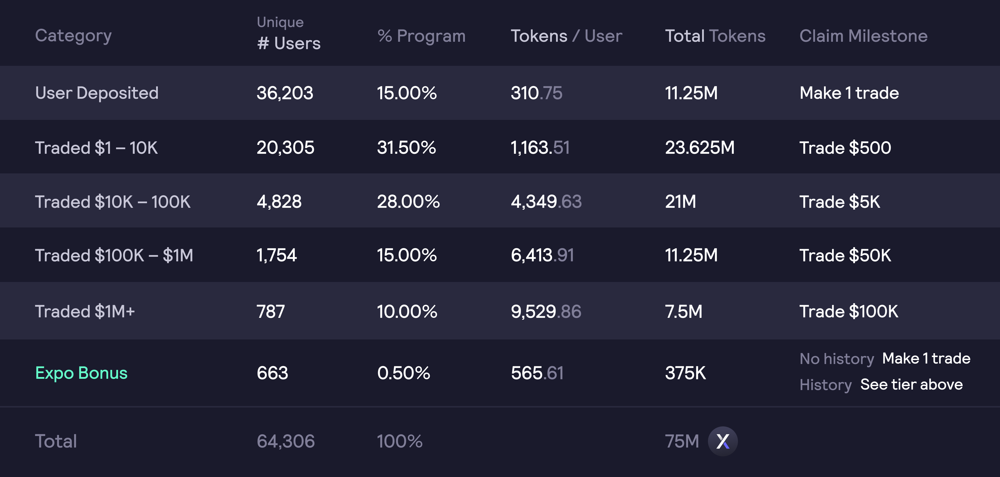

# ⛏️ 追溯挖矿奖励

初始代币供应量的**5.0%**（`50,309,197 $ethDYDX`）将分配给在dYdX v 3上完成某些交易里程碑的过往用户，但不包括位于禁止提供$ethDYDX的司法管辖区的用户（包括美国）。最初，代币供应量的 `7.50%`（`75,000,000  $ethDYDX`）留给 dYdX 协议的过往用户，但在时段 0 结束时，未被申领的“追溯性挖矿奖励”则转至社区资金库。

**目标**

* 根据过去使用情况，采用追溯奖励来奖励过往dYdX用户。
* 激励dYdX的过往用户在dYdX v3上交易。

## 概述

dYdX v3之所以取得成功，是因为大量社区成员在过去三年内一直使用dYdX v3及其前身进行交易。

根据截至 **中国时间2021年7月27日08:00:00**的快照，$ethDYDX已分配给所有dYdX协议的过往用户（不包括位于美国等禁止ethDYDX的司法管辖区的用户）。有五个分配层考虑到了用户在所有 dYdX 协议上的过去活动。

要申领$ethDYDX，过往用户必须在首个28天时段（时段0）内满足 [Layer 2永续合约](https://trade.dydx.exchange)的下列里程碑：

在0时段结束前，用户都能够达到申领里程碑。所有未赚取的奖励将被收回，并自动分配给社区资金库。 一旦初始转账限制期限解除，通过追溯挖矿奖励获得的$ethDYDX代币即可永久申领和转让。

## **常见问题解答**

谁有资格获得追溯奖励？

在 Layer 2 或 Layer 1 上从事 dYdX 协议（永续、保证金、现货）交易或将资金存入 dYdX 的借款/供应池的 dYdX 以往用户，有资格通过追溯奖励获得 $ethDYDX。 但是，由于限制，美国或其他禁止司法管辖区的居民或总部设在美国或其他禁止司法管辖区的居民被排除在追溯既往开采之外。 此外，与机器人活动投机未来空投相关的账户也被排除在外。 所有追溯奖励分配均为最终奖励，不可更改。

如果我没有达到申领里程碑，会发生什么情况？

用户必须满足其特定目标交易量等级在 dYdX v3 上交易永续合约，才能获得 $ethDYDX 代币的全部分配。 追溯奖励与目标交易量直线获得，这意味着如果用户的索赔里程碑为 5,000 美元，但他们只交易 2,500 美元，他们只能申领 50% 的奖励。 在第 0 时段结束时，任何未认领的 $ethDYDX 将被没收并分配给社区资金库。

我何时可以支取并转账申领的 $ethDYDX 追溯奖励？

通过追溯挖矿奖励获得的$ethDYDX代币在初始转移限制期解除后，即可领取和转让。 限制期解除时间大致在2021年9月8日，即世界协调时 15:00:00，也就是时段结束后的8天。之后用户便可申领、提现、转移或委托其所赚取的$ethDYDX代币。

###

