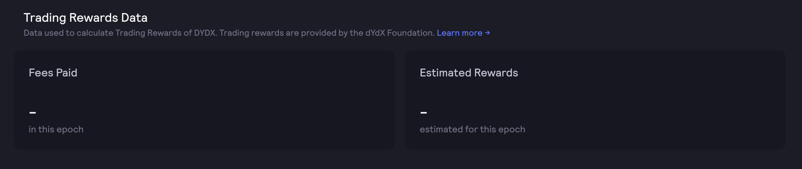
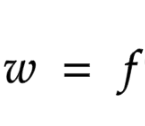
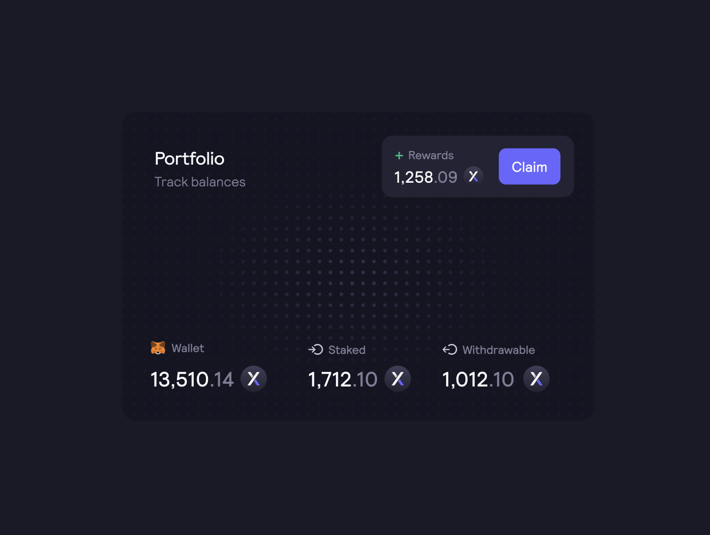

# 交易奖励

初始代币供应量的 `25.00%` （`250,000,000 个 DYDX`） 将根据支付的费用，分配给在 dYdX Layer 2 协议上交易的用户。在 [DIP 16](https://github.com/dydxfoundation/dip/blob/master/content/dips/DIP-16.md) 中，dYdX社区 [投票](https://dydx.community/dashboard/proposal/8) 支持将交易奖励减少 25%。因此，在任意给定时段内分配的交易奖励从 3,835,616 个 DYDX 减少到时段 15 的 2,876,712 个 DYDX。

**目标**

* 激励所有交易者使用dYdX Layer 2协议。
* 加快市场流动性以及产品的总体使用情况。

## **概述**

<figure><figcaption>
在给定时段内所支付的费用以及预估的奖励
</figcaption></figure>

DYDX 将根据支付的费用分配给 dYdX Layer 2 协议的交易者。DYDX将在五年内以28天时段为周期进行分配，不受任何兑现或锁定的限制。每个时段内将分配 2,876,712 个 DYDX。

由于社区投票将交易奖励减少了 25%，奖励的数量也从 3,835,616 个 DYDX 减少到 2,876,712 个 DYDX，奖励资金库中所累积的剩余 958,904 个 DYDX 可由 dYdX 社区通过[治理投票](https://docs.dydx.community/dydx-governance/voting-and-governance/governance-parameters)来使用/指导。

<figure><figcaption></figcaption></figure>

$$
r=R\times \frac{w}{\sum\limits _{n} w_{n}} \ \ ,n=1,2...k
$$

| 术语                           | 定义                       |
| ---------------------------- | ------------------------ |
| r                            | 特定交易者的奖励。                |
| R                            | 将在该时段中资金池中所有交易者之间分配的总奖励。 |
| f                            | 本时段交易者支付的总费用。            |
| 周                            | 个人交易者分数。                 |
| $${\sum\limits _{n} w_{n}}$$ | 所有交易者分数的总和。              |
| k                            | 本时段的交易者总数。               |

在 [DIP-13](https://github.com/dydxfoundation/dip/blob/master/content/dips/DIP-13.md) 中，dYdX 社区投票表决，将公式简化为基于交易者在给定时段内支付的总费用。

## 常见问题解答

### 谁有资格获得交易奖励？

dYdX Layer 2协议的所有交易者都有资格获得DYDX作为交易奖励。

如dYdX Trading Inc.[使用条款](https://dydx.exchange/terms)所定义，DYdX Layer 2协议不适用于美国或受限制地区的交易者。

### 我在交易奖励计划中赚取了多少DYDX？

在当前时段，用户可以在[**trade.dydx.exchange/portfolio/rewards**](https://trade.dydx.exchange/portfolio/rewards)查看已支付的费用和预估的交易奖励，该网站存有用户的交易数据。

<figure><figcaption>
在给定时段内所支付的费用以及预估的奖励
</figcaption></figure>

如需查看过去时段的奖励，请访问[**dydx.community/history/rewards**](https://dydx.community/history/rewards)**。**

### 我如何申领我的交易奖励？何时可以提现并转让我赚取的DYDX？

通过交易奖励赚取的DYDX代币将在每个时段结束时可以转让。DYDX代币持有人必须在时段结束后等待大约`7天`\*\*（\*\*等待期）才能申领代币。在申领代币之后，可以将代币用于dYdX治理。

在**等待期**后，交易者可以在[此处](https://dydx.community/dashboard)在每个时段结束时申领其交易奖励。

用户需要单击“申领”，签署交易，并支付gas费用以申领DYDX。

