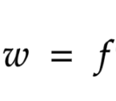
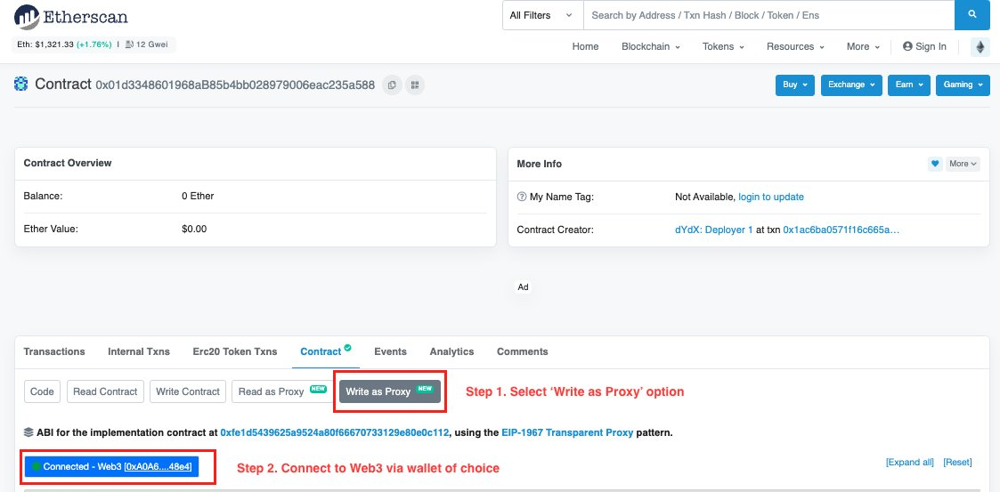
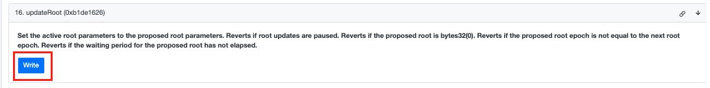

# トレード報酬

トークン供給の`14.5`**`％`**（`144,693,506 $ethDYDX`)は、支払われた手数料に基づいてdYdX v3で取引するユーザーに分配されるように割り当てられます。当初、取引報酬にトークン供給の`25.0%`（`2億5000万$ethDYDX`）が割り当てられました。

* [DIP 16](https://github.com/dydxfoundation/dip/blob/master/content/dips/DIP-16.md)では、dYdXコミュニティーが取引報酬を25.0%削減することに[投票](https://dydx.community/dashboard/proposal/8)しました。その結果、取引報酬の割り当ては`25.0%`から`20.2%`に減少しました。
* [DIP 2](https://dydx.community/dashboard/proposal/11)０では、dYdXコミュニティーが取引報酬をさらに45.0%削減することに[投票](https://dydx.community/dashboard/proposal/11)しました。その結果、取引報酬の割り当ては`20.2%`から`14.5%`に減少しました。
*   [DIP 29](https://dydx.community/dashboard/proposal/16)では、dYdXコミュニティは取引報酬をdYdX v3上のエポック30-32から⅓に削減することを[投票](https://dydx.community/dashboard/proposal/16)しました。

    * エポック30：1,054,795 $ethDYDX
    * エポック31：527,398 $ethDYDX
    * エポック32：0 $ethDYDX

    DIP 29では、dYdXコミュニティが残りの取引報酬の割り当てを取引報酬用dYdXチェーンに移行することを投票したことが注意してください。

特定のエポックに分配された取引報酬は、3,835,616 $ethDYDXから以下に削減されます。

* エポック15で2,876,712 $ethDYDX、
* エポック21で1,582,192 $ethDYDX、
* エポック30で1,054,795 $ethDYDX、
* エポック31で527,398 $ethDYDX、
* エポック32以降では0 $ethDYDX。

エポック31以降、dYdX v3では取引報酬はありません。dYdX v3の[DIP 29](https://dydx.community/dashboard/proposal/16)およびdYdXチェーンの[提案2](https://www.mintscan.io/dydx/proposals/2)において、dYdXコミュニティは、dYdXチェーンのガバナンスの承認を条件として、dYdX v3の[報酬トレジャリーベスター](https://etherscan.io/address/0xb9431e19b29b952d9358025f680077c3fd37292f)の権利未確定の$ethDYDXの残額を[dYdXチェーンの報酬トレジャリーベスター`（dydx1wxje320an3karyc6mjw4zghs300dmrjkwn7xtk）`](https://www.mintscan.io/dydx/address/dydx1wxje320an3karyc6mjw4zghs300dmrjkwn7xtk)にクレジットし、その後dYdXチェーンの取引報酬として分配することに投票しました。

**目的**

* dYdX v3を使用するすべてのトレーダーに促進する。
* マーケットの流動性および全体的な商品利用を加速する。

## **概要**

<figure><figcaption>
所定のエポックにおける支払済みの手数料と推定される報酬
</figcaption></figure>

以前、$ethDYDXは、dYdX v3で支払われた手数料に基づいてトレーダーに配布されました。$ethDYDXは、5年間にわたって28日間のエポックを基本として提供され、権利確定やロックアップの対象にはなりませんでした。

[DIP 29](https://dydx.community/dashboard/proposal/16)では、dYdXコミュニティは取引報酬をdYdX v3上のエポック30-32から⅓に削減することを[投票](https://dydx.community/dashboard/proposal/16)しました。

* エポック30：1,054,795 $ethDYDX
* エポック31：527,398 $ethDYDX
* エポック32と残りのすべてのエポック：0 $ethDYDX

<figure><figcaption></figcaption></figure>

$$
r=R\times \frac{w}{\sum\limits _{n} w_{n}} \ \ ,n=1,2...k
$$

| 用語 | 定義 |
| ---------------------------- | ----------------------------------------------------------------------- |
| r | 特定のトレーダーに対する報酬。 |
| R | 全トレーダー間で分割するためにエポックごとにプールされている報酬総額。 |
| f | このエポックでトレーダーが支払った手数料総額。 |
| w | 個々のトレーダーのスコア。 |
| $${\sum\limits _{n} w_{n}}$$ | 全トレーダーのスコアの合計。 |
| k | このエポックでのトレーダーの総数。 |

[DIP-13](https://github.com/dydxfoundation/dip/blob/master/content/dips/DIP-13.md)において、dYdXコミュニティは公式を簡素化し、所与のエポックでトレーダーが支払った手数料の総額に基づくものにすることで合意しました。

## FAQ

### どのような人がトレード報酬の対象になるのですか？

dYdX v3のすべてのトレーダーは、取引報酬として$ethDYDXを受け取る資格がありました。

dYdX v3は、dYdX Trading Inc.の[利用規約](https://dydx.exchange/terms)に定義されているように、米国または制限地域のトレーダーはご利用いただけません。

### トレード報酬プログラムでどのくらい$ethDYDXを獲得できたのか知ることはできますか？

現在のエポックでは、ユーザーは[**trade.dydx.exchange/portfolio/rewards**](https://trade.dydx.exchange/portfolio/rewards)で、支払われた手数料と推定されるトレード報酬を確認できます。

<figure><figcaption>
所定のエポックにおける支払済みの手数料と推定される報酬
</figcaption></figure>

過去のエポックからの報酬は、[**dydx.community/history/rewards**](https://dydx.community/history/rewards)でご覧いただけます**。**

### トレード報酬を請求するにはどうすればよいですか？いつから獲得したethDYDXを出金および移動することができますか？

トレード報酬で獲得した$ethDYDXトークンは、各エポックの終了時から移動することができるようになります。$ethDYDXトークン保有者は、$ethDYDXトークンを請求するために、エポックの終了から約`7日間`（**待機期間**）待つ必要があります。

7日間の待機期間後、コミュニティメンバーは[Merkleディストリビュータコントラクト](https://etherscan.io/address/0x01d3348601968ab85b4bb028979006eac235a588#writeProxyContract)上の`updateRoot`パラメータで`Write`関数を呼び出して、$ethDYDX報酬を請求できるようにすることができます。

ステップ：

1. Etherscanの[Merkleディストリビュータコントラクト](https://etherscan.io/address/0x01d3348601968ab85b4bb028979006eac235a588#writeProxyContract)ページで、`コントラクト`タブをクリックし、`プロキシとして書き込む`を選択します。
2. `Web3に接続する`ボタンをクリックし、Web3ウォレットを接続します。

<figure><figcaption></figcaption></figure>

3\. `updateRoot`パラメータまで下にスクロールし、`書き込み`ボタンをクリックします。

<figure><figcaption></figcaption></figure>

**このトランザクションには、ガス代のためにETHが必要となり、以下の場合トランザクションは失敗します。**

* 7日間の待機期間がまだ有効な場合
* コミュニティメンバーが、すでに[Merkleディストリビュータコントラクト](https://etherscan.io/address/0x01d3348601968ab85b4bb028979006eac235a588#writeProxyContract)で`updateRoot`パラメータを呼び出している場合

トランザクションが確定した後、トレーダーは[こちら](https://dydx.community/dashboard)から取引報酬を請求できます。$ethDYDXを請求するには、`請求`をクリックし、トランザクションに署名して、Gas（ガス）代を支払う必要があります。

