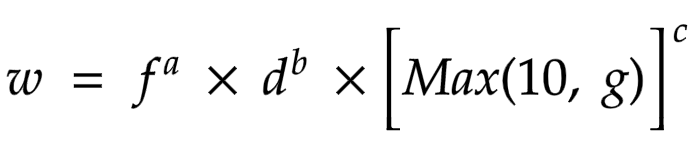

# Награды за торговлю

`25,00%` от первоначального количества токенов в обращении (`250 000 000 DYDX`) получат пользователи, которые торгуют в рамках протокола dYdX уровня 2, на основе сочетания размера уплаченных комиссий и суммы открытых позиций.

**Цели**

* Мотивируйте всех трейдеров на использование протокола dYdX уровня 2.
* Стимулируйте рост рыночной ликвидности и общей степени использования продуктов.

## **Обзор**

.png>)

Токены DYDX будут распределяться между трейдерами по формуле предоставления наград, основанной на сочетании уплаченных комиссий и суммы открытых позиций в протоколе dYdX уровня 2. Токены DYDX будут распределяться в течение 28-дневного периода на протяжении пяти лет и не подлежат передаче во владение или блокировке. В каждую эпоху будет распределяться 3 835 616 DYDX.

Для расчета количества DYDX, присуждаемых конкретному трейдеру в качестве награды за определенную эпоху, используется функция Кобба — Дугласа:

$$
 r=R\times \frac{w}{\sum\limits _{n} w_{n}} \ \ ,n=1,2...k
 $$

| Параметр | Определение |
| ---------------------------- | ------------------------------------------------------------------------------------------ |
| r | Награда для конкретного трейдера. |
| R | Совокупный размер наград, подлежащих распределению между всеми трейдерами в пуле за эпоху. |
| f | Общая сумма комиссий, уплаченных трейдером в этой эпохе. |
| w | Личная оценка трейдера. |
| $${\sum\limits &lt;g id="1" ctype="italic" equiv-text="_"&gt;{n} w</g>{n}}$$ | Сумма всех оценок трейдера. |
| Д | Средняя сумма открытых позиций трейдера (измеряется каждую минуту) на всех рынках в этой эпохе. |
| k | Общее число трейдеров в этой эпохе. |
| g | Среднее количество stkDYDX, находящихся во владении трейдера, в течение эпохи (измеряется случайным образом каждую минуту) |
| a | 0,67 |
| b | 0,28 |
| c | 0,05 |

## Часто задаваемые вопросы

### Кто имеет право на получение наград за торговлю?

Право на получение DYDX в качестве награды за торговлю имеют все трейдеры, торгующие в рамках протокола dYdX уровня 2.

Протокол dYdX уровня 2 недоступен трейдерам в Соединенных Штатах Америки и на Запрещенных территориях, как определено в [Условиях использования](https://dydx.exchange/terms) dYdX Trading Inc.

### Сколько DYDX мне удалось заработать по программе вознаграждения за торговлю?

В текущую эпоху пользователи могут просмотреть уплаченные комиссии, среднюю сумму открытых позиций и предполагаемый размер наград за торговлю по ссылке [**trade.dydx.exchange/portfolio/rewards**](https://trade.dydx.exchange/portfolio/rewards), где размещены данные о торговой деятельности пользователей.

.png>)

Награды за прошлые эпохи можно просмотреть по ссылке [**dydx.community/history/rewards**](https://dydx.community/history/rewards) **** (ожидается в ближайшее время).

### Как получить награды за торговлю? Когда можно вывести и перевести DYDX, полученные в качестве награды?

Заработанные в качестве награды за торговлю токены DYDX станут доступны для перевода по окончании каждой эпохи. Владельцы токенов DYDX могут получить их примерно через `7 дней` (**период ожидания**) после окончания эпохи. После получения токены можно использовать для управления dYdX.

Трейдеры могут получить награды за торговлю в конце каждой эпохи по завершении **периода ожидания** [здесь](https://dydx.community/dashboard).

Чтобы получить DYDX, пользователям необходимо нажать «Получить», заключить сделку и уплатить комиссию за газ.

.png>)

### Что такое сумма открытых позиций?

Общая сумма открытых позиций — это стоимость всех незакрытых длинных и коротких позиций в USD (общее количество длинных позиций всегда совпадает с общим количеством коротких позиций) для определенного рынка. Увеличение суммы открытых позиций свидетельствует о притоке на рынок дополнительной денежной массы, тогда как ее уменьшение указывает на отток денежных средств с рынка.

Ниже приведена таблица торговой деятельности трейдеров А, Б, В, Г и Д. Сумма открытых позиций рассчитывается в USDC после завершения торговой деятельности каждый день:

| Время | Торговая деятельность | Общая чистая сумма открытых позиций (USDC) |
| ------- | -------------------------------------------------------------------------- | ------------------------------ |
| 1 июля | **Трейдер A** покупает 1 BTC по цене 30 000 USD, а **трейдер Б** продает 1 BTC по цене 30 000 USD | 30 000 USD |
| 3 июля | **Трейдер В** покупает 5 BTC по цене 30 000 USD, а **трейдер Г** продает 5 BTC по цене 30 000 USD | 180 000 USD |
| 5 июля | **Трейдер А** продает 1 BTC по цене 30 000 USD, а трейде**р Г покуп**ает 1 BTC по цене 30 000 USD | 150 000 USD |
| 10 июля | **Трейдер Д** покупает 5 BTC по цене 30 000 USD, а **трейдер В** продает 5 BTC по цене 30 000 USD | 150 000 USD |

В контексте формулы расчета размера **наград за торговлю** сумма открытых позиций измеряется каждую минуту (в случайный момент времени) на всех рынках и усредняется по определенной эпохе для расчета размера наград.

Собственная сумма открытых позиций трейдера — это стоимость всех его открытых позиций в USD. Применительно к **наградам за торговлю** сумма открытых позиций трейдера измеряется каждый час (в случайный момент времени) на всех рынках и усредняется по определенной эпохе.
