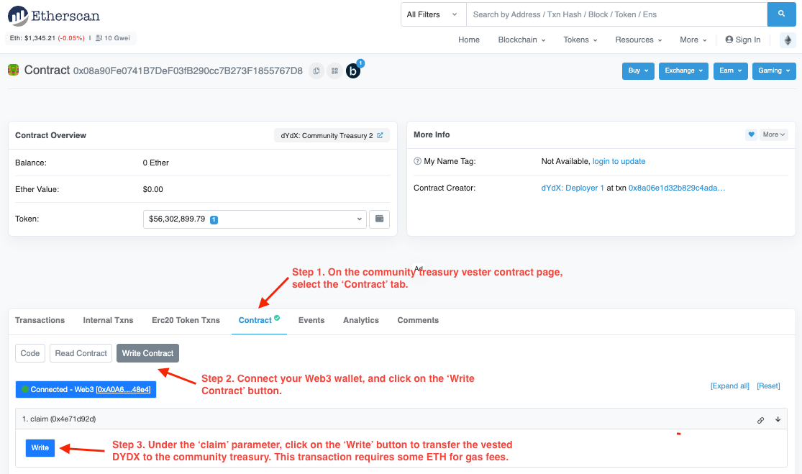

# Trading Rewards

`25.00%` of the initial token supply \(`250,000,000 DYDX`\) will be distributed to users who trade on the dYdX Layer 2 Protocol based on a combination of fees paid and open interest.

**Objectives**

* Incentivize all traders to use the dYdX Layer 2 Protocol.
* Accelerate market liquidity and overall product usage.

## **Overview**

DYDX will be distributed to traders based on a formula that rewards a combination of fees paid and open interest on the dYdX Layer 2 Protocol. DYDX will be distributed on a 28-day epoch basis over five years and is not subject to any vesting or lockups. 3,835,616 DYDX will be distributed per epoch.

The Cobb-Douglas function is used to compute how much DYDX is awarded to each trader during each epoch:

$$
w\ =\ f ^{\alpha } \times d \ ^{1-\alpha }
$$

$$
r=R\times \frac{w}{\sum\limits _{n} w_{n}} \ \ ,n=1,2...k
$$

| Term | Definition |
| :--- | :--- |
| r | Reward for a specific trader. |
| R | Total reward to be split between all traders in the pool for the epoch. |
| f | Total fees paid by a trader in this epoch. |
| w | Individual trader score. |
| $${\sum\limits _{n} w_{n}}$$ | Sum of all trader scores. |
| d | A trader’s average open interest \(measured every minute\) across all markets in this epoch. |
| k | Total number of traders in this epoch. |
| α | A constant in the range that determines the weight of fees vs open interest. The initial value is α=0.7. |

The following example illustrates Trading Rewards earned by Traders A, B, and C using the formula listed above:

## FAQ

### Who is eligible for trading rewards?

All traders on the dYdX Layer 2 protocol are eligible to receive DYDX as trading rewards.

The dYdX Layer 2 Protocol is not available to traders in the United States or Restricted Territories, as defined in dYdX Trading Inc.’s [Terms of Use](https://dydx.exchange/terms).

### How much DYDX did I earn in the Trading Rewards program?

In the current epoch, users can see fees paid, average open interest, and estimated trading rewards at [**trade.dydx.exchange/portfolio/rewards**](https://trade.dydx.exchange/portfolio/rewards) where users' trading data exists.

Rewards from past epochs can be viewed at [**dydx.community/history/rewards**](https://dydx.community/history/rewards) ****\(coming soon\).

### How do I claim my Trading Rewards? When can I withdraw and transfer my earned DYDX?

Earned DYDX tokens via Trading Rewards will be transferable at the end of each epoch. DYDX token holders are required to wait approximately `7 days` \(**Waiting Period**\) after the end of the epoch to claim their tokens. Once tokens have been claimed, they can be used for dYdX governance.

Traders can claim their trading rewards at the end of every epoch, after the **Waiting Period**, [here](https://dydx.community/dashboard). 

Users will need to click on "Claim", sign a transaction, and pay gas fees to claim DYDX.

### What is Open Interest?

Total open interest is the USD value of all outstanding long or short positions \(the total units of longs always equals the total units of shorts\) for a given market. Increasing open interest represents new or additional money coming into the market while decreasing open interest indicates money flowing out of the market.

Below is a table of trading activity for traders, A, B, C, D, and E. Open interest is calculated in USDC terms following the trading activity for each day:

| Time | Trading Activity | Total Net Open Interest \(USDC\) |
| :--- | :--- | :--- |
| July 1 | **Trader A** buys 1 BTC at $30,000 and **Trader B** sells 1 BTC at $30,000 | $30,000 |
| July 3 | **Trader C** buys 5 BTC at $30,000 and **Trader D** sells 5 BTC at $30,000 | $180,000 |
| July 5 | **Trader A** sells 1 BTC at $30,000 and **Trader D** buys 1 BTC at $30,000 | $150,000 |
| July 10 | **Trader E** buys 5 BTC at $30,000 and **Trader C** sells 5 BTC at $30,000 | $150,000 |

In the context of the **Trading Rewards** formula, open interest is measured every minute \(at a random time in each minute\) across all markets and averaged across a given epoch to calculate rewards.

A trader's own open interest is the USD value of all of that trader's open positions. For the purposes of **Trading Rewards**, a trader's open interest is measured every minute \(at a random time in each minute\) across all markets and averaged across a given epoch.

