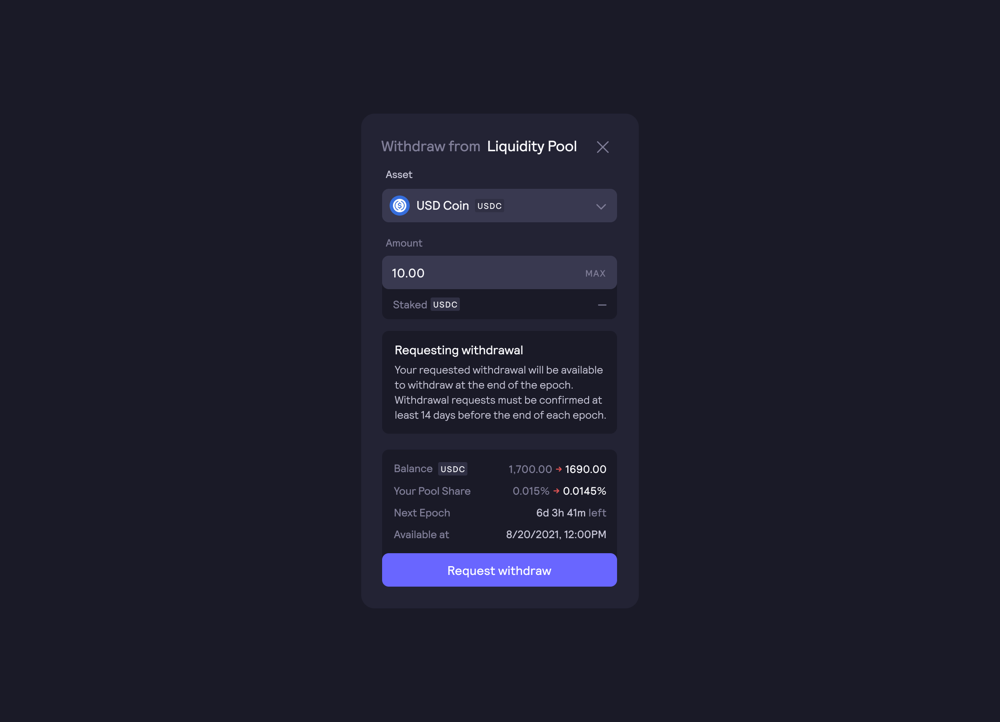

# 流動性モジュール

流動性ステーキングプールに$USDCをステーキングするユーザーにトークン供給の`0.6%`（`5,753,430$ethDYDX）`が配布されました。当初、流動性ステーキングプールに$USDCをステーキングするユーザーに配布するために、トークン供給の`2.50％`（`25,000,000$ethDYDX`）が割り当てられました。 流動性ステーキングプールは、2022年9月29日の時点でアクティブではありません。[DIP 14](https://github.com/dydxfoundation/dip/blob/master/content/dips/DIP-14.md)では、dYdXコミュニティは、流動性ステーキングプール報酬を1秒あたり0.\に設定することで、流動性ステーキングプールと借入プールを効果的に縮小することに[合意](https://dydx.community/dashboard/proposal/7)しました。\これまでは、流動性ステーキングプールに$USDCをステーキングしたユーザーに対して$ethDYDXが提供されていました。コミュニティに承認された流動性プロバイダーは、ステーキングされた$USDCを利用してdYdX v3で「マーケット」を作り、そうしたマーケット全体で流動性が利用しやすくなっていました。流動性プロバイダーは、dYdX v3以外で借り入れた資金の使用が制限されていました。

## **ステーキング**概要

現在、流動性ステーキングプールでステーキングされた$USDCへの報酬は提供されていません。

これまでUSDCステーカーに対して提供されていた383,562$ethDYDXは報酬トレジャリーに計上され、[ガバナンス投票](https://docs.dydx.community/dydx-governance/voting-and-governance/governance-parameters)によって、dYdXコミュニティが使用できます。.

## USDCのステーキング解除および出金

エポックの終了後にステーカーが$USDCを出金できるようにするには、ステーカーは[エポック](../start-here/epochs.md)終了の遅くとも`****3日`（**ブラックアウトウィンドウ**）前までに出金をリクエストする必要があります。ステーカーが出金をリクエストしない場合、ステーキングされた$USDCは次のエポックにロールオーバーされます。

**ブラックアウトウィンドウ**の間は、出金をリクエストすることができません。

[DIP 14](https://github.com/dydxfoundation/dip/blob/master/content/dips/DIP-14.md)において、dYdXコミュニティはブラックアウトウィンドウの期間を`14日`から`3日に`短縮することに[合意しました](https://dydx.community/dashboard/proposal/7)。

## stkUSDCとは何ですか？

$USDCを流動性ステーキングプールに入金およびステーキングするUSDC保有者は、トークン化されたポジション（$**stkUSDC**）を受け取ります。ユーザーがUSDCをステーキングすると$stkUSDCが発行され、ユーザーが`withdrawStake`を要求すると$stkUSDCが消費されます。同一のトランザクション内で、$USDCがステーカーのウォレットから出ていき、$stkUSDCがウォレットに入ってきます。ステーキングを解除すると、出入りが逆になります。

$stkUSDCの残高は、アクティブまたは非アクティブにすることができます。アクティブな$stkUSDCは、ERC-20として移動はできますが、出金はできません。非アクティブな$stkUSDCは、出金はできますが、移動はできません。たとえば、ユーザーがウォレットにアクティブおよび非アクティブな$stkUSDCをそれぞれ100個ずつ有している場合、ユーザー残高は200$stkUSDCと表示されますが、ユーザーが100個以上の$stkUSDCを移動しようとすると、移動は取り消されてしまいます。

ステーキングされた残高に対してステーカーがエポック終了前に出金をリクエストした場合、非アクティブとみなされて移転できません。

## FAQ

### ブラックアウト・ウィンドウとは何ですか？

ブラックアウト・ウィンドウとは、ユーザーが、ステーキングされた$USDCの出金をリクエストすることができない期間です。ブラックアウトウィンドウの期間中、`requestWithdrawal`関数を呼び出すことはできません。この期間は、エポックの最後の`3日間`として初期設定されているものです。新しいエポックは、28日ごとに開始されます。つまり、ユーザーは所定のエポック終了の`3日`前までであれば次のエポックの出金をリクエストすることができます。

### ステーキングプールから$USDCを出金するにはどうすればよいですか？どのくらいかかりますか？

エポック終了後に$USDCを引き出すためには、エポック終了の`3日`前までに$USDCのステーキングの解除を申請する必要があります。ステーカーが出金をリクエストしない場合、ステーキングされた$USDCは次のエポックにロールオーバーされます。

$USDCを出金するには、ユーザーは次のエポックに対する`requestWithdrawal`関数を呼び出します。現在のエポックでは、ユーザーの資金はステーキングされたままとなり、出金できません。次のエポックから資金は「非アクティブ」となり、出金が可能になります。

次のエポックでは、ユーザーは`withdrawStake`関数を呼び出して出金するので、アクティブな$USDCを特定のアドレスに引き出すことができます。ユーザーは、出金する非アクティブな資金の額を指定するか、\`withdrawMaxStake\`関数を呼び出して、非アクティブな資金をすべて出金することができます。eth\_callで最大値を検索して`withdrawStake()`を呼び出すよりも、`withdrawMaxStake`関数の方がガス効率が低くなります。

流動性プールへの$USDCのステーキングを解除するには、以下の手順に従います。

* [**https://dydx.community/dashboard/staking-pool/liquidity**](https://dydx.community/dashboard/staking-pool/liquidity)\*\*\*\*にアクセスします
* 「**リクエスト**」をクリックし、以下のモーダルを開きます。

* プールからの出金リクエストをする$USDC額を入力し、「**出金リクエスト**」をクリックします。$USDCのステーキングを解除するには、Gas（ガス）手数料を支払う必要があります。
* ステーカーは、現在のエポックが終了する遅くとも`3日`（**ブラックアウトウィンドウ**）前までに$USDCのステーキングを解除すると、次のエポックから$USDCを出金することが可能になります。

### ガバナンスが変更できるパラメーターはどれですか？

dYdXのガバナンスは、以下の責任があります。

* 流動性ステーキングプールに$USDCをステーキングする際の報酬（秒単位）
* ステーキング流動性プールにおける借入者の追加および/または削除
* 承認された借り手に対する借入$USDCの割り当て変更
  * 特定の借入者の割り当てを変更する場合、`setBorrowerAllocations`および`setBorrowingRestriction`関数が呼び出されます。これらの関数を使用して借入者を追加および削除することができます。追加は次のエポックから適用されますが、削除による借入制限はただちに適用されることになります。ブラックアウトウィンドウの間は、これらの関数を呼び出すことはできません。
* エポックの期間やブラックアウトウィンドウは、コントラクトの作成時に設定されるものですが、変更になる場合もあります
