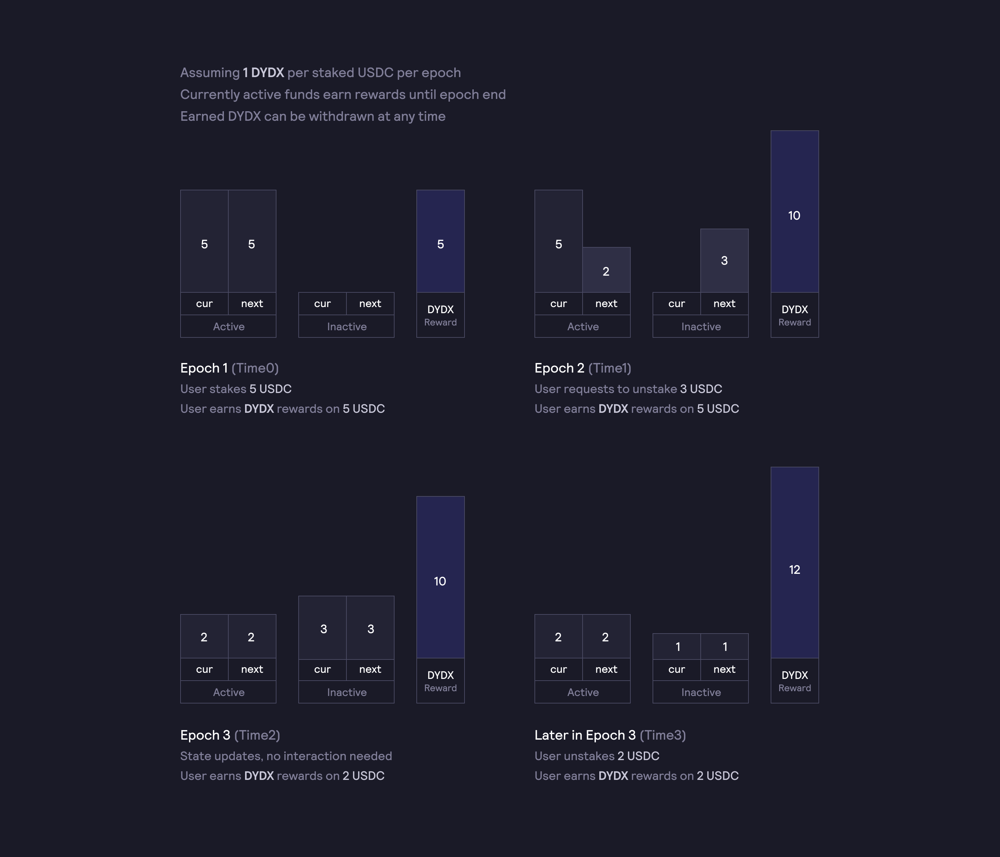
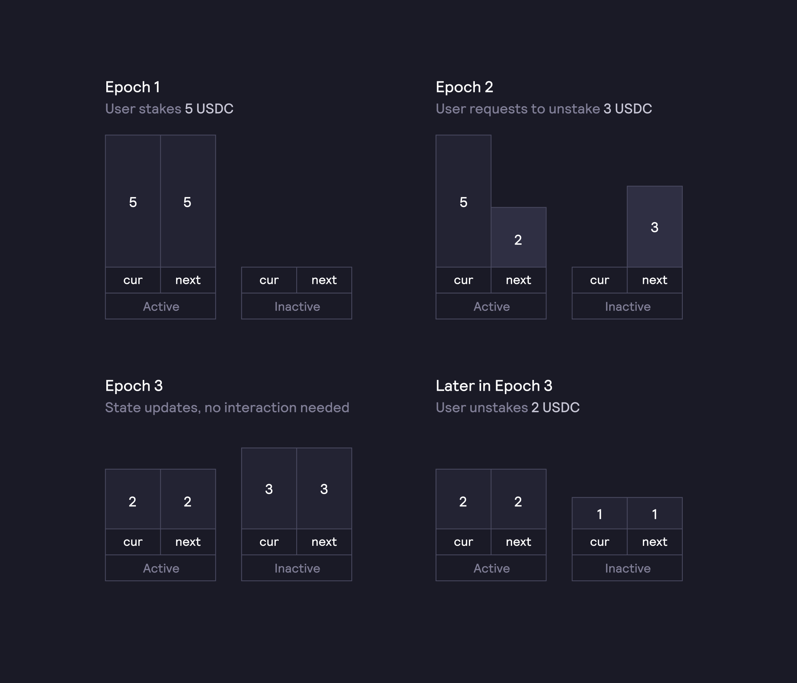

# Модуль безопасности

`2,50%` от первоначального количества токенов в обращении (`25 000 000 DYDX`) будет распределено между пользователями, размещающими DYDX в пуле стейкинга безопасности для технической поддержки системы.

**Цели**

* Создайте независимый децентрализованный фонд для использования в случае финансовой неустойчивости или других проблем с протоколом.
* Мотивируйте владельцев DYDX на должное управление: владельцы DYDX подвергаются риску разводнения капитала в качестве конечного механизма поддержки и управляют риском в системе.

Токены DYDX, размещенные в модуле безопасности, сохраняют право на внесение предложений и право голоса, а также возможности делегирования.

Чтобы приступить к стейкингу, перейдите по ссылке [**dydx.community/dashboard/pools/safety**](https://dydx.community/dashboard/pools/safety)\*\*\*\*

## Обзор

С момента запуска протокола безопасность и защита пользователей — наш приоритет. Поэтому токены DYDX будут распределяться между пользователями, которые размещают DYDX в пуле стейкинга безопасности, чтобы создать дополнительную защитную сеть для пользователей протокола. Стейкеры будут получать DYDX непрерывно и пропорционально своей доли в общем объеме токенов DYDX, размещенных пуле.

Пул стейкинга безопасности станет доступен после того, как 8 сентября 2021 г. в 15:00 по времени в формате UTC появится возможность перевода DYDX.

## Вывод

Для вывода средств по окончании эпохи стейкеры должны направлять соответствующий запрос по меньшей мере за `14 дней` **(период недоступности вывода средств из стейка)** до окончания этой эпохи. В противном случае размещенные в стейке DYDX будут переноситься на следующую эпоху.

## Риски

Вследствие события дефицита количество размещенных в стейке DYDX может быть сокращено. Сокращение проводится по усмотрению управления DYDX и предусматривает проведение голосования.

Наряду с участниками любого протокола децентрализованных финансовых сервисов стейкеры в модуле безопасности подвергаются риску в рамках смарт-контракта при возникновении уязвимости в базовом коде смарт-контракта. Все смарт-контракты DYDX и управления прошли аудит и тщательную проверку.

## События дефицита

Процесс принятия решения о наступлении события дефицита осуществляется управлением dYdX с помощью голосования, но может включать в себя учет следующих факторов:

* Финансовая устойчивость биржи (например, снижение уровня залоговой обеспеченности биржи в связи с убыточными ликвидациями)
* Атаки на смарт-контракты
* Другие события, которые, по мнению управления dYdX, привели к дефициту

В случае возникновения дефицита баланс владельцев токенов может быть сокращен и переведен на другой адрес или в другой контракт (в каждом случае устанавливается управлением dYdX индивидуально). Для сокращения количества размещенных в стейке токенов управление dYdX должно утвердить предложение о короткой блокировке по времени. После того как управление проголосовало по вопросу о сокращении количества размещенных в стейке токенов DYDX, сокращенная часть DYDX может быть продана с аукциона на рынке под активы, которые требуются для минимизации последствий, вызванных дефицитом.

## Часто задаваемые вопросы

### Как получить награды за стейкинг?

Стейкеры могут разместить USDC в пуле стейкинга безопасности в любое время и немедленно начать получать награды. Награды в виде DYDX распределяются постоянно в соответствии с долей каждого стейкера в общем пуле на ежесекундной основе. Награды можно получить и вывести в любое время.

Пока активные средства находятся в активном состоянии, за них присуждаются награды. Это означает, что после отправки запроса на вывод некоторого количества средств, награды за них будут и дальше присуждаться до окончания эпохи. Это подтверждается в следующем примере из [пула стейкинга ликвидности](https://docs.dydx.community/dydx-governance/staking-pools/liquidity-staking-pool):

В вышеприведенном сценарии пользователь получит награды за период с **Time0** по **Time2** в зависимости от общего баланса размещенных в стейке средств в том периоде. Если пользователь запросит вывод только части средств со своего баланса, то за остаток продолжат присуждаться награды в период после **Time2**.

### Как разместить DYDX в пуле стейкинга безопасности?

Чтобы разместить DYDX в пуле стейкинга безопасности, сделайте следующее:

* Перейдите по ссылке [**dydx.community/dashboard/pools/safety**](https://dydx.community/dashboard/pools/safety)\*\*\*\*
* Нажмите «**Разместить в стейке**»
* При первом размещении нужно разрешить операции с DYDX. Это действие и оплату комиссии за газ необходимо выполнить только один раз.
* Введите количество DYDX, которое вы хотите разместить в пуле для стейкинга.
* Нажмите «**Разместить средства в стейке**». Для размещения средств в стейке и их вывода вам потребуется уплатить комиссии за газ.

Размещенные в стейке средства теперь активны, и вы можете сразу начать получать награды.

Чтобы разместить средства непосредственно в смарт-контракте, пользователи вызывают [функцию](https://github.com/dydxprotocol/governance-private/blob/2645927b44f517f51c84e35a00a1ee810300c13f/contracts/liquidity/v1/impl/LS1Staking.sol#L59) \`stake\`. Пользователи могут также размещать средства в стейке от имени другого адреса при помощи [функции](https://github.com/dydxprotocol/governance-private/blob/2645927b44f517f51c84e35a00a1ee810300c13f/contracts/liquidity/v1/impl/LS1Staking.sol#L64) \`stakeFor\.

### Что такое stkDYDX?

Чтобы содействовать обеспечению безопасности протокола и получать за это вознаграждение, владельцы DYDX будут вносить свои токены в модуль безопасности. В свою очередь они будут получать токенизированную позицию (**stkDYDX**), которую можно вывести или перевести в виде ERC-20. Токен **stkDYDX** обладает тем же правом на внесение предложений и правом голоса, что и токен DYDX для управления dYdX.

### Что такое период недоступности вывода средств из стейка?

Период недоступности вывода средств из стейка — это период времени, в течение которого пользователи не могут запрашивать вывод размещенных в стейке средств. Чтобы обеспечить предсказуемость и регулярность доступности средств в пуле, для их вывода используется график эпох. Для вывода средств из стейка по окончании эпохи стейкер должен направить соответствующий запрос до начала периода недоступности вывода средств из стейка. В случае если от стейкера не поступает запрос на вывод размещенных в стейке средств, то они переносятся на следующую эпоху.

Рекомендуемая продолжительность периода недоступности вывода средств из стейка для пула стейкинга безопасности составляет `14 дней`.

### Как происходит учет баланса размещенных в стейке средств?

Баланс размещенных в стейке средств может находиться в двух состояниях:

* **Активный**: средства доступны для выдачи займа; присуждаются награды за стейкинг; остаток не может быть выведен стейкером.
* **Неактивный**: средства недоступны для выдачи займа; не присуждаются награды; остаток может быть выведен стейкером.

У стейкера может иметься сочетание активных и неактивных балансов. Учет средств производится для каждой эпохи, как показано в следующем примере:

На баланс размещенных в стейке средств оказывают влияние следующие операции, как описано ниже:

* **Внесение средств**: увеличение активного баланса.
* **Запрос на** **вывод**: перевод некоторых активных средств в неактивные в конце текущей эпохи.
* **Вывод средств**: уменьшение неактивного баланса.
* **Перевод**: перевод некоторых активных средств другому стейкеру.

Для кодировки того факта, что изменение баланса может быть запланировано на конец определенной эпохи, мы храним каждый баланс в виде структуры из трех полей: currentEpoch, currentEpochBalance и nextEpochBalance.

### Как вывести средства из пула стейкинга? Сколько времени занимает этот процесс?

Чтобы обеспечить предсказуемость и регулярность доступности средств в пуле, для их вывода используется график эпох. Чтобы вывести свои средства по окончании эпохи, стейкер должен отправить соответствующий запрос минимум за `14 дней` до конца эпохи. В противном случае размещенные в стейке DYDX будут переноситься на следующую эпоху.

Для вывода средств пользователи вызывают функцию \`requestWithdrawal\`, отправляющую соответствующий запрос в следующую эпоху. В текущей эпохе средства пользователей будут оставаться в стейке и не подлежат выводу. Начиная со следующей эпохи средства станут неактивными и доступными для вывода.

Для вывода неактивных средств на конкретный адрес в следующую эпоху пользователи вызывают функцию \`withdrawStake\`. Для вывода всех неактивных средств пользователи могут выбрать то количество, которое они желают вывести, или вызвать функцию \`withdrawMaxStake\`. Обратите внимание, что при использовании функции \`withdrawMaxStake\` размер комиссии за газ будет выше, чем при запросе максимальной величины с помощью eth\_call и вызове функции \`withdrawStake()\`.

Чтобы вывести DYDX из пула стейкинга ликвидности, сделайте следующее:

* Перейдите по ссылке [**dydx.community/dashboard/pools/safety**](https://dydx.community/dashboard/pools/safety)\*\*\*\*
* Нажмите «**Запросить**» и введите необходимое количество DYDX для вывода из пула.
* Нажмите «**Запросить вывод средств**». Чтобы вывести средства, вам потребуется уплатить комиссию за газ.
* Стейкеры, которые запрашивают вывод DYDX не позднее чем за 14 дней до окончания текущей эпохи, могут вывести DYDX в начале следующей эпохи.

### Каковы риски для стейкеров при участии в пуле стейкинга безопасности? Что произойдет при наступлении события дефицита?

Решение стейкера о блокировке DYDX в пуле стейкинга безопасности несет в себе риск возникновения дефицита, что может привести к сокращению количества размещенных в стейке DYDX по усмотрению управления dYdX.

В рамках контракта сократить можно количество как активных, так и неактивных средств. В рамках контракта процедура сокращения осуществляется путем корректировки обменного курса между DYDX и stkDYDX. Это означает, что по мере проведения процедуры сокращения обменный курс между DYDX и stkDYDX будет отклоняться от своего первоначального значения 1:1. Обратите внимание, что процедуры сокращения не влияют на получение наград за стейкинг.
