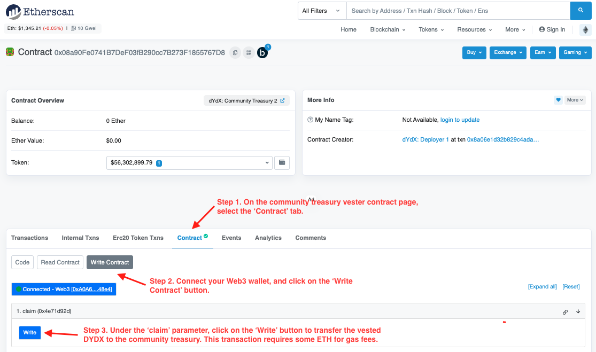

# Tesorería

`El 5,00%` del suministro inicial de tokens (`50,000,000 DYDX`) se distribuirá a una tesorería comunitaria que se asignará de forma continua a través de las subvenciones de contribuyente, las iniciativas comunitarias, la minería de liquidez y otros programas.

**Objetivos**

* Financiar programas e iniciativas que impulsen el crecimiento de dYdX.
* Desarrollar programas de subvenciones para financiar NFT comunitarios, hackatones, paneles de análisis, memes, obsequios, herramientas de terceros, traducciones y otros proyectos.
* Desarrollar un sistema de gobernanza de primer nivel e incentivar una gobernanza sólida.

## Visión general

La tesorería de la comunidad retendrá DYDX para usarse según lo decidan los titulares de DYDX, ya sea para subvenciones, nuevos fondos de minería de liquidez o cualquier otro programa. Los DYDX se otorgarán a la tesorería de la comunidad de manera continua en el transcurso de cinco años. Se requerirá un voto de gobierno para gastar cualquier DYDX de la tesorería de la comunidad.

Si, después de cinco años, la gobernanza decide promulgar la inflación de los perpetuals (a una inflación anual máxima del `2 %`), cualquier DYDX recién acuñado estará disponible para la tesorería de la comunidad.

## Preguntas frecuentes

### ¿Cómo se depositan DYDX en la tesorería de la comunidad?

Cada segundo, la tesorería de la comunidad Vester (ver detalles [aquí](https://docs.dydx.community/dydx-governance/resources/technical-overview#governance-architecture-overview)) otorga [`0.3169242627`](tel:03169242627) DYDX a la tesorería de la comunidad. Una vez que se han otorgado los DYDX, al utilizar la función `de reclamo` en la tesorería de la comunidad Vester transferirá los DYDX otorgados a la tesorería de la comunidad. Cualquier miembro de la comunidad dYdX puede utilizar la función de `reclamo` en Etherscan [aquí](https://etherscan.io/address/0x08a90Fe0741B7DeF03fB290cc7B273F1855767D8#writeContract) (lo que requeriría ETH para las tarifas de gas) para transferir el DYDX adquirido de la tesorería de la comunidad Vester a la tesorería de la comunidad.

<figure><figcaption></figcaption></figure>

### ¿Cuál es el balance invertido del Tesoro de la Comunidad?

Los miembros de la comunidad dYdX pueden ver el balance invertido del Tesoro de la Comunidad [aquí](https://dydx.shippooor.xyz/)\\. Además, la Fundación dYdX publica el balance invertido del Tesoro de la Comunidad en la [Revisión de la etapa](https://dydx.foundation/blog) al final de cada etapa. Además del dYdX invertido en el Tesoro de la Comunidad, la comunidad de dYdX también puede acceder a la dYdX acumulada en el Tesoro de Recompensas como resultado de los votos para (1) reducir las recompensas comerciales en un 25 % (958.904 dYdX y (2) fijar las recompensas por apostar USDC a 0 (383.562 dYDX). A partir de la etapa 15, 1.342.466 dYdX  se acumularán en el Tesoro de Recompensas en cada etapa y podrán ser utilizados por la comunidad dYdX con un [voto de gobernanza](https://docs.dydx.community/dydx-governance/voting-and-governance/governance-parameters).

### ¿Quién puede presentar propuestas para gastar tokens DYDX desde la tesorería de la comunidad?

Cualquier usuario con poder de propuesta suficiente puede presentar propuestas. Se requerirá un voto de gobernanza para gastar cualquier DYDX de la tesorería de la comunidad. Para enviar una propuesta, envía una propuesta de mejora de dYdX (DIP) tal como se describe en el [ciclo de vida de la propuesta de DIP](../voting-and-governance/dip-proposal-lifecycle.md).

### ¿Qué tipos de propuestas pueden enviarse a la Tesorería de la comunidad?

Una tesorería administrada por la comunidad ofrece un mundo de posibilidades. Esperamos ver varios experimentos e iniciativas, incluidas las subvenciones de ecosistema, que pueden fomentar el crecimiento de los ecosistemas de la Capa 2 de dYdX.
