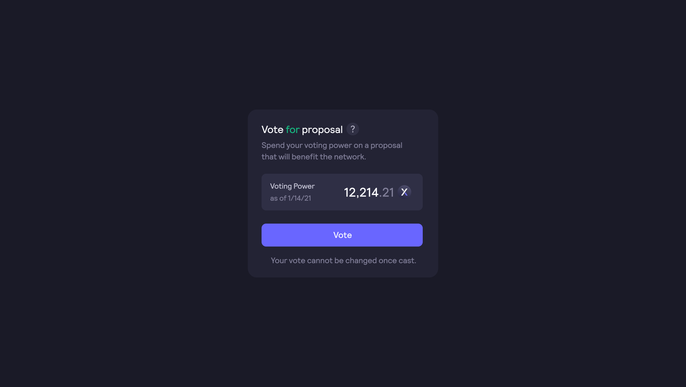

#

**`26,1%`** (`261.133.225 $ethDYDX`) do fornecimento de tokens é alocado para o tesouro da comunidade dYdX, para ser usado continuamente em recompensas para contribuidores, iniciativas da comunidade, mineração de liquidez e outros programas. Inicialmente, `5,0%` do suprimento de tokens (`50.000.000 $ethDYDX`) foram [alocados](https://docs.dydx.community/dydx-governance/start-here/dydx-allocations) ao tesouro da comunidade e 766.703 $ethDYDX foram investidos no tesouro da comunidade a cada epoch. Atualmente, 3.787.251 $ethDYDX foram coletados no tesouro da comunidade, porque várias propostas de governança resultaram em um aumento de 3.020.548 $ethDYDX no valor de $ethDYDX disponível para a comunidade dYdX a cada epoch:

* [DIP 14](https://dydx.community/dashboard/proposal/7) - Definição as recompensas de staking de USDC para 0 (383.562 $ethDYDX por epoch),
* [DIP 16](https://dydx.community/dashboard/proposal/8) - Redução de recompensas de trading em 25% (958.904 $ethDYDX por epoch),
* [DPI 17](https://dydx.community/dashboard/proposal/9) - Definição de recompensas de staking de $DYDX para 0 (383.562 $ethDYDX por epoch).
* [DPI 20](https://dydx.community/dashboard/proposal/11) - Redução de recompensas de trading em 45% (1.294.520 $ethDYDX por epoch) e
* [DPI 24](https://github.com/dydxfoundation/dip/blob/master/content/dips/DIP-24.md) - Redução de recompensas de provedor de liquidez em 50% (575.342 $ethDYDX por epoch).
*   [DIP 29](https://dydx.community/dashboard/proposal/16) - Redução de recompensas de provedor de liquidez em ⅓ da epoch 30-32 na dYdX v3 para os seguintes valores:

    * Epoch 30: 383.562 $ethDYDX
    * Epoch 31: 191.781 $ethDYDX
    * Epoch 32: 0 $ethDYDX

    Após a epoch 31, não haverá recompensas de provedor de liquidez na dYdX v3. No DIP 29, a comunidade dYdX votou para reduzir as recompensas de trading em ⅓ da epoch 30-32 na dYdX v3, no entanto, a alocação restante de recompensas de trading foi migrada para a Cadeia dYdX para recompensas de trading.

Em 18 de novembro de 2023, a comunidade dYdX [votou](https://dydx.community/dashboard/proposal/16) para conectar o saldo ethDYDX acumulado no Tesouro da Comunidade de Ethereum com a Cadeia dYdX. Após conectado, o DYDX pode ser usado pela comunidade dYdX com um voto de governança na Cadeia dYdX.

**Objetivos**

* Financiar programas e iniciativas que impulsionem o crescimento da dYdX.
* Desenvolver programas de concessões para financiar NFTs da comunidade, hackathons, painéis de análise, memes, swag, ferramentas de terceiros, traduções e outros projetos.
* Desenvolver um sistema de governança de alto nível e incentivar uma governança robusta.

## Visão geral

O tesouro da comunidade manterá $ethDYDX para ser usado conforme os detentores de $ethDYDX decidirem, seja para doações, novos pools de mineração de liquidez ou qualquer outro programa. O $ethDYDX será investido ao tesouro da comunidade de forma contínua ao longo de cinco anos. Será necessário haver uma votação por parte da governança para gastar qualquer ethDYDX no tesouro da comunidade.

Se, após cinco anos, a governança decidir promover uma inflação perpétua (numa inflação máxima anual de `2%`), qualquer mint de $ethDYDX futuro ficará disponível para o tesouro da comunidade.

## Perguntas e respostas

Como $ethDYDX é investido no Tesouro da Comunidade?

Anteriormente, o Investidor de Tesouro da Comunidade (veja detalhes [aqui](https://docs.dydx.community/dydx-governance/resources/technical-overview#governance-architecture-overview)) investiu [`0,3169242627`](tel:03169242627) $ethDYDX no Tesouro da Comunidade a cada segundo. Após o $ethDYDX ter sido investido, chamar a função `resgate` no Investidor do Tesouro da Comunidade transferirá o $ethDYDX investido para o Tesouro da Comunidade. Qualquer membro da comunidade dYdX pode chamar a função `resgate` na Etherscan [aqui](https://etherscan.io/address/0x08a90Fe0741B7DeF03fB290cc7B273F1855767D8#writeContract) (o que exigiria algum ETH para cobrir as taxas de gás) e mover o $ethDYDX investido do Investidor do Tesouro da Comunidade para o Tesouro da Comunidade.

Consulte os [Termos de uso](https://dydx.foundation/terms) da dYdX Foundation para obter mais detalhes sobre o controle do tesouro da comunidade pela comunidade dYdX.

