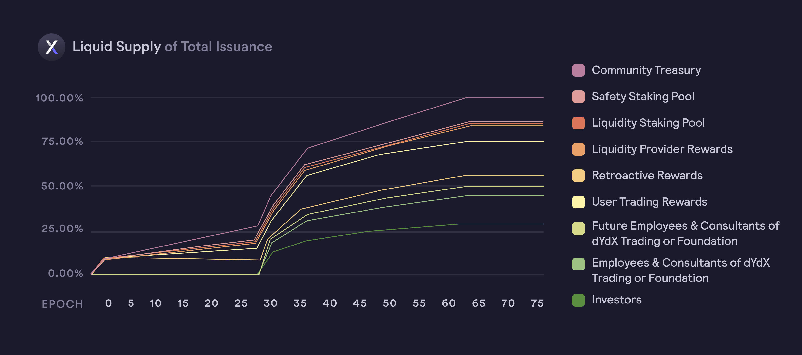

# 分配

**分配**

总共铸造了`1,000,000,000 个 $DYDX`，自**中国时间 2021 年 8 月 3 日晚上 23:00:00** 开始，可在五 (5) 年内使用。$DYDX 总供应量的初始五年期分配如下：

* **50.0%** (`500,000,000 $DYDX`) 分配给社区，如下所示：
  * **25.0%** (`250,000,000 $DYDX`) 根据[交易奖励公式而定](https://docs.dydx.community/dydx-governance/rewards/trading-rewards)，
  * **7.5%** （`75,000,000 个 $DYDX`） 分配给在 dYdX Layer 2 协议上完成某些交易里程碑的过往用户（[追溯性挖矿奖励](https://docs.dydx.community/dydx-governance/rewards/retroactive-mining-rewards)），
  * **7.5%** (`75,000,000 个 $DYDX`) 根据[流动性提供方奖励公式而定](https://docs.dydx.community/dydx-governance/rewards/liquidity-provider-rewards)，
  * **5.0%** (`50,000,000 $DYDX`) 分配给[社区资金库](https://docs.dydx.community/dydx-governance/start-here/community-treasury/)，
  * **2.5%** (`25,000,000 $DYDX`) 分配给将 $USDC 质押到[流动性质押池](https://docs.dydx.community/dydx-governance/staking-pools/liquidity-staking-pool)的用户，
  * **2.5%** (`25,000,000 $DYDX`) 分配给将 $DYDX 质押到[保险质押池](https://docs.dydx.community/dydx-governance/staking-pools/safety-staking-pool)的用户，
* **27.7%** (`277,295,070 $DYDX`) 分配给 dYdX Trading Inc. 的过往投资者，
* **15.3%** (`152,704,930 个 $DYDX`) 分配给 dYdX Trading Inc. 或 dYdX 基金会的创始人、员工、顾问、咨询，及
* **7.0%** (`70,000,000 $DYDX`) 分配给 dYdX Trading Inc. 或 dYdX 基金会的未来员工和顾问。

自 $DYDX 推出以来，已经有几项治理提案导致初始分配发生变化。目前，分配包括：

* **50.0%** (`500,000,000 个 $DYDX`) 分配给社区，如下所示：
  * **14.5%** (`144,693,506 $DYDX`) 根据[交易奖励公式](https://docs.dydx.community/dydx-governance/rewards/trading-rewards)，
    * 在 [DIP 16](https://github.com/dydxfoundation/dip/blob/master/content/dips/DIP-16.md) 和 [DIP 20](https://dydx.community/dashboard/proposal/11) 中，dYdX 社区投票减少交易奖励，总共减少 230万 $DYDX。（958,904 $DYDX 来自 DIP 16，1,294,520 $DYDX 来自 DIP 20）。230万 $DYDX 将存入奖励资金库，可通过[治理投票](https://docs.dydx.community/dydx-governance/voting-and-governance/governance-parameters)由 dYdX 社区使用。
  * **5.0%** (`50,309,197 个 $DYDX`) 分配给在 dYdX 第二层协议上完成某些交易里程碑的用户（[追溯性挖矿奖励](../rewards/retroactive-mining-rewards.md)），
    * 在 0 时段之后，追溯性挖矿奖励计划中无人认领的 24,690,803 $DYDX 则转移到社区资金库。
  * **7.5%** (`75,000,000 个 $DYDX`) 根据[流动性提供方奖励公式而定](https://docs.dydx.community/dydx-governance/rewards/liquidity-provider-rewards)，
  * **21.9%** (`219,194,788 $DYDX`) 分配给[社区资金库](https://docs.dydx.community/dydx-governance/start-here/community-treasury/)和[奖励资金库](https://docs.dydx.community/dydx-governance/start-here/rewards-treasury)，
  * **0.6%** (`5,753,430 $DYDX`) 分配给将 $USDC 质押到[流动性质押池](https://docs.dydx.community/dydx-governance/staking-pools/liquidity-staking-pool)的用户，
    *  在 [DIP 14](https://github.com/dydxfoundation/dip/blob/master/content/dips/DIP-14.md) 中，dYdX 社区[投票](https://dydx.community/dashboard/proposal/7)将质押 $USDC 的奖励设置为 0。先前分配给 $USDC 质押人的 383,562 个 $DYDX 将在奖励资金库中积累，并可由 dYdX 社区通过[治理投票](https://docs.dydx.community/dydx-governance/voting-and-governance/governance-parameters)来使用。
  * **0.5%** (`5,049,079 $DYDX`) 分配给将 $DYDX 质押到[保险质押池](https://docs.dydx.community/dydx-governance/staking-pools/safety-staking-pool)的用户，
    *  在 [DIP 17](https://github.com/dydxfoundation/dip/blob/master/content/dips/DIP-17.md) 中，dYdX 社区[投票](https://dydx.community/dashboard/proposal/9)将质押 $DYDX 的奖励设置为 0。先前分配给 $DYDX 质押人的 383,562 个 $DYDX 将在奖励资金库中积累，并可由 dYdX 社区通过[治理投票](https://docs.dydx.community/dydx-governance/voting-and-governance/governance-parameters)来使用。
* **27.7%** (`277,295,070 DYDX`) 分配给 dYdX Trading Inc. 的过往投资者，
* **15.3%** （15`2,704,930 个 DYDX`） 分配给 dYdX Trading Inc. 或 dYdX 基金会的创始人、员工、顾问，及
* **7.0%** （70,000,000 `个 DYDX`） 分配给 dYdX Trading Inc. 或 dYdX 基金会的未来员工和顾问。

<figure><figcaption></figcaption></figure>

从推出五年后开始，管理部门可能会利用每年 `2%` 的最大永续性通货膨胀率，增加 $DYDX 的供应，以确保社区拥有资源继续发展和完善该协议。通货膨胀必须通过治理提议来实施，每年的上限为`2%`。

<figure><figcaption></figcaption></figure>

尽管社区分配如上文所述，但 $DYDX 持有人对社区分配的后续使用方式拥有完全的控制权。

## **常见问题解答**

### $DYDX 分配能否改变？

是的，dYdX 社区可以更改[启动之时存在的任意奖励和资金池](../voting-and-governance/governance-parameters.md)。到目前为止，dYdX 社区投票决定将交易奖励减少 25%，将 $USDC 质押奖励设置为 0，将 $DYDX 质押奖励设置为 0。

在 [DIP 16](https://github.com/dydxfoundation/dip/blob/master/content/dips/DIP-16.md) 中，dYdX社区 [投票](https://dydx.community/dashboard/proposal/8) 支持将交易奖励减少 25%。因此，在给定特定时段内分配的交易奖励从 3,835,616 个 $DYDX 减少到时段 15 的 2,876,712 个 $DYDX。奖励资金库中所累积的剩余 958,904 个 $DYDX 可由 dYdX 社区通过[治理投票](https://docs.dydx.community/dydx-governance/voting-and-governance/governance-parameters)来使用\\。

 在 [DIP 14](https://github.com/dydxfoundation/dip/blob/master/content/dips/DIP-14.md) 中，dYdX 社区[投票](https://dydx.community/dashboard/proposal/7)将质押 $USDC 的奖励设置为 0。先前分配给 $USDC 质押人的 383,562 个 $DYDX 将在奖励资金库中积累，并可由 dYdX 社区通过[治理投票](https://docs.dydx.community/dydx-governance/voting-and-governance/governance-parameters)来使用。

在 [DIP 17](https://github.com/dydxfoundation/dip/blob/master/content/dips/DIP-17.md) 中，dYdX 社区[投票](https://dydx.community/dashboard/proposal/9)将质押 $DYDX 相关奖励设置为 0。先前分配给 $DYDX 质押人的 383,562 个 $DYDX 将在奖励资金库中累积，可由 dYdX 社区通过[治理投票](https://docs.dydx.community/dydx-governance/voting-and-governance/governance-parameters)来使用。

### **是否可以铸造新的 $DYDX 代币？**

从推出五年后开始，可以利用每年 `2%` 的最大永续性通货膨胀率，增加 $DYDX 的供应，以确保社区拥有资源继续为 dYdX 第二层协议作出贡献。

自**中国时间 2026 年 7 月 14 晚上 23:00:00** 开始，dYdX 管理层可以决定要铸造的新 $DYDX 最大供应量，最高可达每个铸币厂每年 `2%` 的最大通货膨胀率。在给定的365天期间内，只能有一次造币。所有新发行的 $DYDX 将由管理层分配，并立即归属。然后可以将这些新发行的代币发送至任何指定地址。

### **向投资者、现有和未来的员工以及顾问发行的 $DYDX 锁定是什么？**

部分初始分配留作：

* dYdX Trading Inc. 的过往投资者 (27.7%)，
* dYdX Trading Inc. 或 dYdX 基金会 (15.3%) 的创始人、员工、顾问 (15.3%)，以及
* dYdX Trading Inc. 或 dYdX 基金会的未来员工和顾问（7.0%）。

2023 年 1 月 25 日，dYdX 基金会[宣布](https://dydx.foundation/blog/lock-up-extension)，dYdX Trading Inc.、dYdX 基金会及“代币购买权证”的某些方签署了修正案（“修正案”），将投资者 $DYDX 代币的初始发布日前推迟至 2023 年 12 月 1 日。

上述修正案并不改变初始解锁日期后发生的交错解锁，因此，根据修正案，相关代币将按以下方式解除转让限制：

* (i) 2023 年 12 月 1 日（新的初始解锁日期）30%；
* (ii) 从 2024 年 1 月 1 日到 2024 年 6 月 1 日，每月第一天等额分期付款 40%；
* (iii) 2024 年 7 月 1 日至 2025 年 6 月 1 日期间，每月第一天等额分期付款 20%；及
* (iv) 从 2025 年 7 月 1 日到 2026 年 6 月 1 日，每月第一天等额分期付款 10%。

dYdX Trading Inc. 和 dYdX 基金会的各创始人、员工、顾问也须遵守修正案中规定的转让限制时间表。

所有员工和顾问也将受到各种归属时间表的约束，如有违反，则将丧失 $DYDX 权利。现在或未来，员工或顾问不得因为提供 dYdX 协议相关服务或令协议受益的其他服务而接收 DYDX。相反，员工和顾问可能会因为令 dYdX Trading Inc.、dYdX 基金会或另一方受益的服务而获得 $DYDX。

无论 $DYDX 是否锁定，dYdX Trading 或 dYdX 基金会的投资者和前员工或顾问都可以使用 $DYDX 提出提案、委托投票或对 dYdX 协议有关的提案投票。dYdX Trading 或 dYdX 基金会的现职员工和顾问最初不会提出提案或参加投票，但今后可能这样做。dYdX Trading Inc. 或 dYdX 基金会的现任员工和顾问委托投票，但不得试图影响投票结果。

所有投资者都必须遵守转让限制（通过与 dYdX 基金会和 dYdX Trading Inc. 签订合同协议而实施）。dYdX 基金会跟踪钱包地址，以确定是否有转让违反该限制。

dYdX基金会已表示会对不遵守这些要求的投资者采取法律行动。

## $DYDX 的流动性供应曲线是什么？

2021 年 9 月 8 日，0 时段结束后的 `8 天`，解除代币的初始转让限制。

下图显示了流动性总供应量（无通胀）：

<figure><figcaption></figcaption></figure>

下图显示了流动性总供应量（有通胀）：

<figure><figcaption></figcaption></figure>
