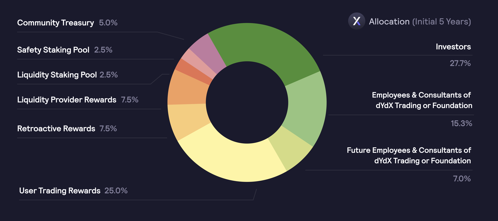
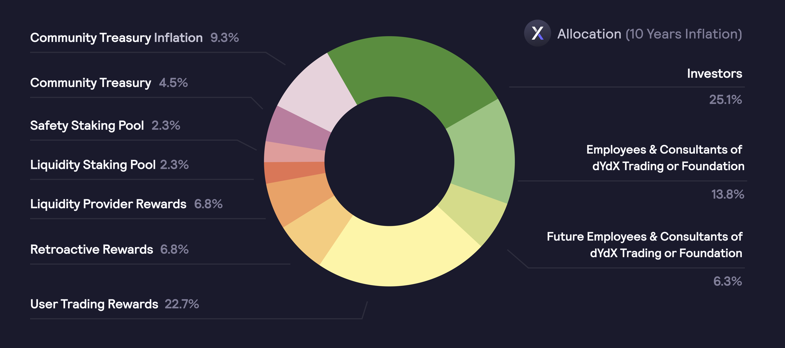
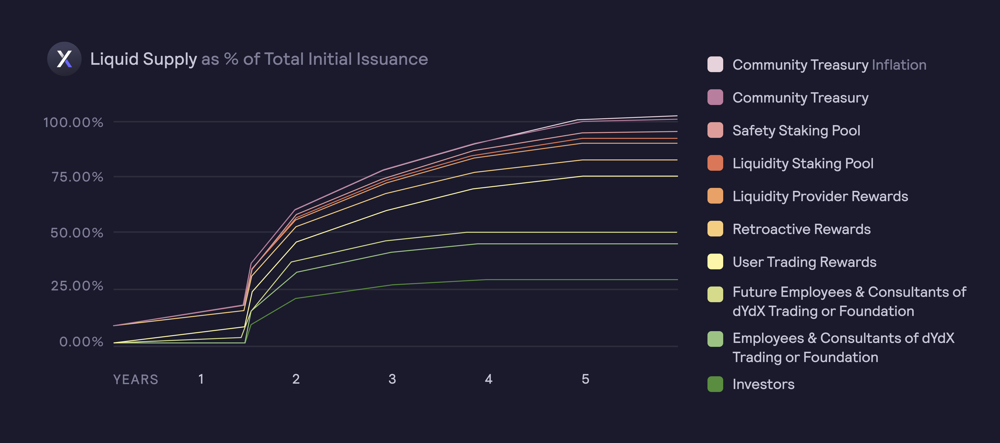

# 分配

**分配**

总共有`1,000,000,000个DYDX`被挖出，并将于**中国时间2021年8月3日晚上23:00:00**开始，在五(5)年内可以使用。DYDX初始五年的总供应量分配如下：

* **50.00%**`（500,000,000个DYDX）`分配给社区，具体如下：
  * **25.00%** （`250,000,000 个 DYDX`）将根据支付的费用（[**交易奖励**](../rewards/trading-rewards.md)）分配给在 dYdX Layer 2 协议上交易的用户。在 [DIP 16](https://github.com/dydxfoundation/dip/blob/master/content/dips/DIP-16.md) 中，dYdX 社区 [投票](https://dydx.community/dashboard/proposal/8) 支持将交易奖励减少 25%。因此，在给定时段内分配的交易奖励从 3,835,616 个 DYDX 减少到时段 15 的 2,876,712 个 DYDX。奖励资金库中所累积的剩余 958,904 个 DYDX 可由 dYdX 社区通过[治理投票](https://docs.dydx.community/dydx-governance/voting-and-governance/governance-parameters)来使用，
  * **7.50%** （`75,000,000 个 DYDX`） 分配给在 dYdX Layer 2 协议上完成某些交易里程碑的过往用户（[**追溯性挖矿奖励**](../rewards/retroactive-mining-rewards.md)），
  * **7.50%** （`75,000,000 个 DYDX`） 根据一条公式分配给流动性提供方，此公式奖励正常运行时间、双侧交易深度、买卖价差和受支持市场数量的组合（[**流动性提供方奖励**](../rewards/liquidity-provider-rewards.md)），
  * **5.00%** （`50,000,000 个 DYDX`）分配给社区资金库（[**资金库**](community-treasury.md)），
  * **2.50%** （`25,000,000 个 DYDX`）分配给将 USDC 质押给流动性质押池的用户 （[**流动性模块**](../staking-pools/liquidity-staking-pool.md)）。在 [DIP 14](https://github.com/dydxfoundation/dip/blob/master/content/dips/DIP-14.md) 中，dYdX 社区 [投票](https://dydx.community/dashboard/proposal/7) 将质押 USDC 的相关奖励设置为 0。先前分配给 USDC 质押人的 383,562 个 DYDX 将在奖励资金库中积累，并可由 dYdX 社区通过[治理投票](https://docs.dydx.community/dydx-governance/voting-and-governance/governance-parameters)来使用，
  * **2.50%**（25,000,000 `个 DYDX`）分配给将 DYDX 质押给保险资金质押池（[**安全模块**](../staking-pools/safety-staking-pool.md)）的用户。在 [DIP 17](https://github.com/dydxfoundation/dip/blob/master/content/dips/DIP-17.md) 中，dYdX 社区[投票](https://dydx.community/dashboard/proposal/9)将质押 DYDX 相关的奖励设置为 0。先前分配给 DYDX 质押人的 383,562 个 DYDX 将在奖励资金库中累积，可由 dYdX 社区通过[治理投票](https://docs.dydx.community/dydx-governance/voting-and-governance/governance-parameters)来使用，
* **27.3%** （`277,295,070 个 DYDX`） 分配给过往投资者，
* **15.27%** （`152,704,930 个 DYDX`） 分配给 dYdX Trading 或基金会的创始人、员工、顾问和咨询人员，
* **7.00%** （`70,000,000 个 DYDX`） 分配给 dYdX Trading 或 dYdX 基金会的未来员工和顾问。

从推出五年后开始，管理部门可能会利用每年`2%`的最大永续性通货膨胀率来增加DYDX的供应，以确保社区拥有资源继续发展和完善该协议。通货膨胀必须通过治理提议来实施，每年的上限为`2%`。

尽管社区分配如上文所述，但DYDX持有人对社区分配的后续使用方式拥有完全的控制权。

## **常见问题解答**

### DYDX 的分配能否改变？

是的，dYdX 社区可以更改[启动之时存在的任意奖励和资金池](../voting-and-governance/governance-parameters.md)。到目前为止，dYdX 社区投票决定将交易奖励减少 25%，将 USDC 质押奖励设置为 0，将 DYDX 质押奖励设置为 0。

在 [DIP 16](https://github.com/dydxfoundation/dip/blob/master/content/dips/DIP-16.md) 中，dYdX社区 [投票](https://dydx.community/dashboard/proposal/8) 支持将交易奖励减少 25%。因此，在给定特定时段内分配的交易奖励从 3,835,616 个 DYDX 减少到时段 15 的 2,876,712 个 DYDX。奖励资金库中所累积的剩余 958,904 个 DYDX 可由 dYdX 社区通过[治理投票](https://docs.dydx.community/dydx-governance/voting-and-governance/governance-parameters)来使用。\
\
 在 [DIP 14](https://github.com/dydxfoundation/dip/blob/master/content/dips/DIP-14.md) 中，dYdX 社区[投票](https://dydx.community/dashboard/proposal/7)将质押 USDC 的奖励设置为 0。先前分配给 USDC 质押人的 383,562 个 DYDX 将在奖励资金库中积累，并可由 dYdX 社区通过[治理投票](https://docs.dydx.community/dydx-governance/voting-and-governance/governance-parameters)来使用。

在 [DIP 17](https://github.com/dydxfoundation/dip/blob/master/content/dips/DIP-17.md) 中，dYdX 社区[投票](https://dydx.community/dashboard/proposal/9)将质押 DYDX 相关奖励设置为 0。先前分配给 DYDX 质押人的 383,562 个 DYDX 将在奖励资金库中累积，可由 dYdX 社区通过[治理投票](https://docs.dydx.community/dydx-governance/voting-and-governance/governance-parameters)来使用。

### **是否可以创建新的DYDX代币？**

从推出五年后开始，可以利用每年`2%`的最大永续性通货膨胀率来增加DYDX的供应，以确保社区拥有资源继续为dYdX Layer 2协议作出贡献。

自**中国时间2026年7月14晚上23:00:00**开始，dYdX管理层可以决定要铸造的新代币的最大供应量，最高可达每个铸币厂每年`2%`的最大通货膨胀率。在给定的365天期间内，只能有一次造币。所有新发行的代币将由管理层分配，并立即进行归属。然后可以将这些新发行的代币发送至任何指定地址。

### **DYDX向投资者、现有和未来的员工以及顾问发行的锁定期是多久？**

DYDX将发行给dYdX Trading和基金会的股东、董事、官员、员工和顾问。分发给这些当事方的所有DYDX最初将受到链下的合约协议的约束，并授权锁定，根据该协议：

* DYDX持有量的30%将在发行18个月后解除锁定；
* 40%将从第19个月到第24个月平均解锁。
* 20%将从第25个月到第36个月平均解锁。
* 10%将从第37个月到第48个月平均解锁。

所有员工和顾问也将受到各种行权计划的约束，如违反可能导致他们失去对DYDX的权利。任何员工或顾问收到DYDX的消息都不是基于提供与协议相关的服务或可能使协议受益的其他服务。相反，员工和顾问之所以获得DYDX，可能是因为提供了只对dYdX Trading、dYdX基金会或其他当事方有利的服务。

无论DYDX是否受到任何锁定，dYdX Trading或基金会的投资者和前员工或顾问都可以使用DYDX进行提议、委托投票或对与协议有关的提议进行投票。dYdX Trading或基金会的现职员工和顾问最初不会提出任何提议或参加任何投票，但今后可能这样做。dYdX Trading或基金会的现职员工和顾问可以委托投票，但不得试图影响投票结果。

所有投资者都必须遵守通过与dYdX基金会签订的合同协议强制执行的转让限制。dYdX基金会跟踪钱包地址以确定是否有任何违反该限制的转账。

虽然在技术和法律上允许投资者将他们的DYDX质押到保险模块，但如果发生资金缺口事件和DYDX被削减，投资者将像其他人一样受到削减。此时，他们将违约。投资者将被要求再次购买因削减而转账的任何代币，以便每个人的头寸都相同。出于这个原因，我们要求所有投资者不要质押，并要求提现当前质押在保险模块中的任何资金。

dYdX基金会已表示会对不遵守这些要求的投资者采取法律行动。

## DYDX的流动性供应曲线是什么？

2021年9月8日，即0时段结束`8天`后，对代币的初始转让限制将被取消，大约8.11%的DYDX供应将开始流通。

下图显示了流动性总供应量随时间的变化情况：

