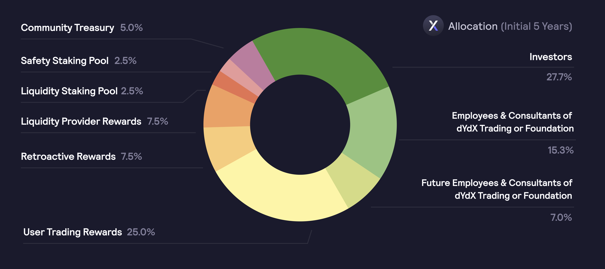

# Allocations

**Allocations**

A total of `1,000,000,000 DYDX` have been minted, and will become accessible over five \(5\) years, starting on **August 3rd, 2021, at 15:00:00 UTC**. The initial five-year allocation of the total supply of DYDX is as follows:

* **50.00%** \(`500,000,000 DYDX`\) to the community as follows:
  * **25.00%** \(`250,000,000 DYDX`\) to users who trade on the dYdX Layer 2 Protocol based on a combination of fees paid and open interest \([**Trading Rewards**](../rewards/trading-rewards.md)\)
  * **7.50%** \(`75,000,000 DYDX`\) to past users who complete certain trading milestones on the dYdX Layer 2 Protocol \([**Retroactive Mining Rewards**](../rewards/retroactive-mining-rewards.md)\)
  * **7.50%** \(`75,000,000 DYDX`\) to liquidity providers based on a formula rewarding a combination of uptime, two-sided depth, bid-ask spreads, and the number of markets supported \([**Liquidity Provider Rewards**](../rewards/liquidity-provider-rewards.md)\)
  * **5.00%** \(`50,000,000 DYDX`\) to a community treasury \([**Treasury**](community-treasury.md)\)
  * **2.50%** \(`25,000,000 DYDX`\) to users staking USDC to a liquidity staking pool \([**Liquidity Module**](../staking-pools/liquidity-staking-pool.md)\)
  * **2.50%** \(`25,000,000 DYDX`\) to users staking DYDX to a safety staking pool \([**Safety Module**](../staking-pools/safety-staking-pool.md)\)
* **27.73%** \(`277,295,070 DYDX`\) to past investors
* **15.27%** \(`152,704,930 DYDX`\) to founders, employees, advisors, and consultants of dYdX Trading or the Foundation
* **7.00%** \(`70,000,000 DYDX`\) to future employees and consultants of dYdX Trading or the dYdX Foundation 

Starting five years after launch, a maximum perpetual inflation rate of `2%` per year may be utilized by governance to increase the supply of DYDX, ensuring the community has the resources to continue the development and growth of the Protocol. Inflation must be enacted via a governance proposal and is capped at `2%` per year.

Although the community allocation has been established as laid out above, DYDX holders have full control via governance over how the community allocation is used going forwards.

## **FAQs**

### **Can new DYDX tokens be minted?**

Starting five years after launch, a maximum perpetual inflation rate of `2%` per year can be used to increase the supply of DYDX, ensuring the community has the resources to continue contributing to the dYdX Layer 2 Protocol.

Beginning on **July 14th, 2026 at 15:00:00 UTC**, dYdX governance can decide the maximum supply of new tokens to be minted, up to the maximum inflation rate of `2%` per year at each mint. Only one mint is possible in a given 365 day period. All newly issued tokens will be allocated by governance and will vest immediately. These newly issued tokens can then be sent to any address specified.

### **What is the lockup for DYDX issued to investors, existing and future employees, and consultants?**

DYDX will be issued to stockholders, directors, officers, employees, and consultants of dYdX Trading and the Foundation. All DYDX distributed to these parties will initially be subject to contractual agreements, off-chain, mandating a lockup according to which:

* 30% of DYDX holdings will unlock after 18 months post-launch;
* 40% will unlock equally from month 19 through month 24;
* 20% will unlock equally from month 25 through month 36;
* 10% will unlock equally from month 37 through month 48.

All employees and consultants also will be subject to various vesting schedules that could result in them losing their rights to DYDX. No employee’s or consultant’s receipt of DYDX is, or will in the future be, based on providing services related to the Protocol or other services that may benefit the Protocol. Instead, employees and consultants may receive DYDX for services that benefit only dYdX Trading, the dYdX Foundation or another party.

Regardless of any lockup on DYDX, investors and prior employees or consultants of dYdX Trading or the Foundation may use DYDX to make proposals, delegate votes, or vote on proposals related to the Protocol. Current employees and consultants of dYdX Trading or the Foundation will initially not make any proposals or participate in any votes but may do so in the future. Current employees and consultants of dYdX Trading or the Foundation may delegate votes without attempting to influence voting outcomes.

## What is the liquid supply curve of DYDX?

On September 8, 2021, `8 days` after the end of Epoch 0, the initial transfer restrictions on the token will be lifted and approximately 8.11% of the DYDX supply will become liquid. 

The following chart shows the total liquid supply over time:

