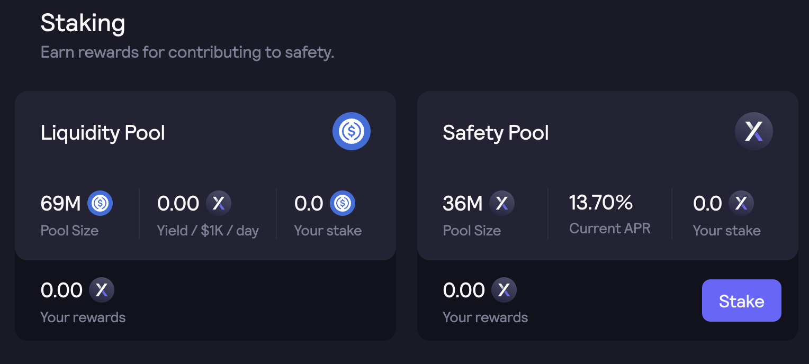

# インターフェース

ガバナンス、報酬、およびステーキングのインターフェースは、[**dydx.community**](https://dydx.community)から利用可能です。

### ガバナンス

アクティブなおよび過去のガバナンス提案を表示でき、アクティブなガバナンス提案を選択できます。

DYDXおよびstkDYDXの保有者は、権限および選択権の提案という2種類のガバナンス権限が付与されます。ダッシュボードを通じて、ユーザーは提案および選択権限を表示し、他のアドレスに委任できます。

### ステーキング

ユーザーはDYDXをステーキングすることで、ステーキング報酬を獲得できます。

<figure><figcaption></figcaption></figure>

### 取引報酬

ユーザーは、レイヤ2取引所での取引活動を通じて獲得した報酬を表示できます。取引の報酬は、エポックスケジュールに従い、28日ごとに提供されます。

### ポートフォリオ＆請求DYDX

ユーザーは、DYDXの保有、請求可能DYDX、ステーク済みのDYDX、および出金可能DYDXの集計ビューを確認できます。

ユーザーは、現在流通しているDYDXトークンの供給および毎日の提供を確認できます。ユーザーは利用可能なすべてのDYDX報酬を請求できます。DYDXトークンは、**2021年9月8日**午後3時（協定世界時：UTC）頃以降に移動可能になります。

