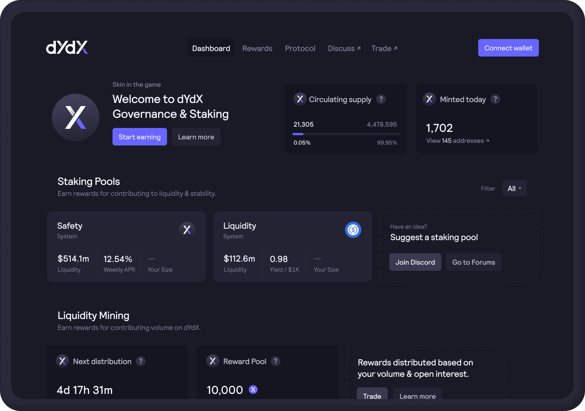
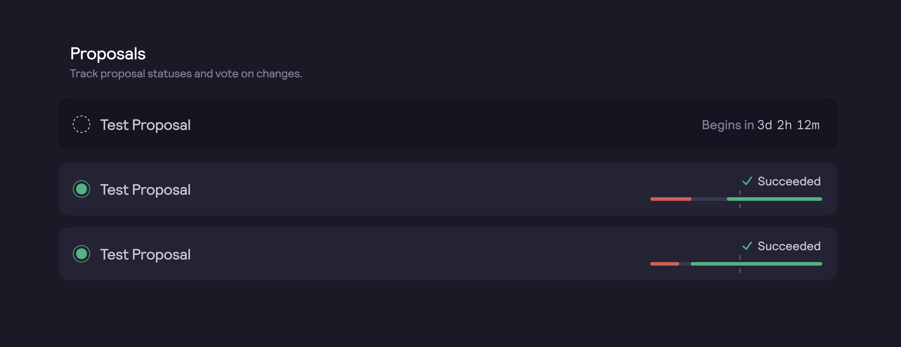
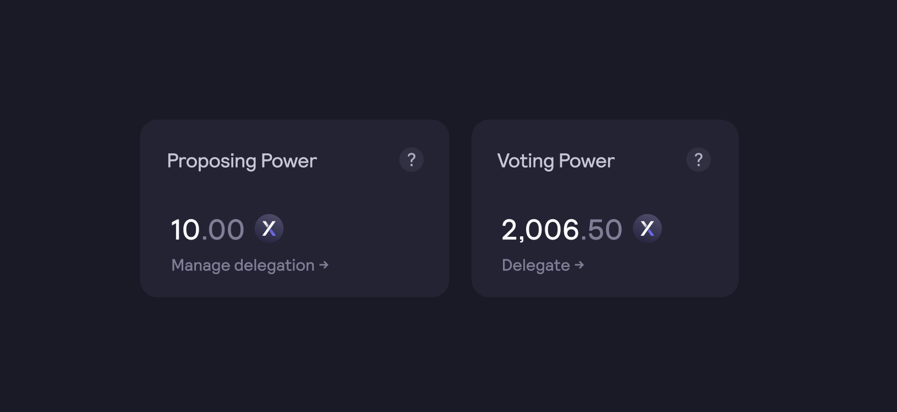
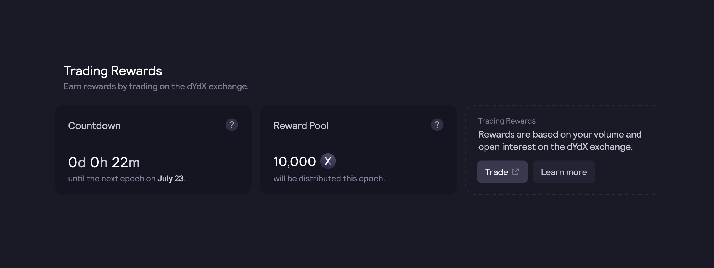
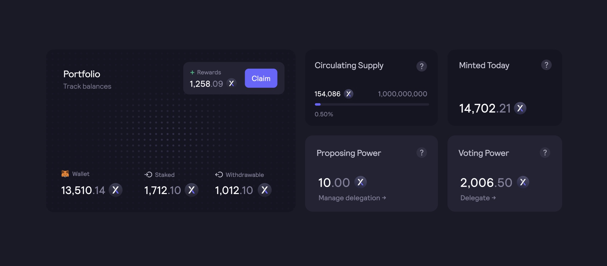

#

A interface para governança, recompensas e staking se encontra em [**dydx.community**](https://dydx.community).

### Governança

As propostas ativas e anteriores da governança podem ser exibidas, e as propostas ativas podem ser votadas.

Os holders de $ethDYDX e $wethDYDX recebem dois tipos de poderes de governança: o poder de voto e o poder de proposição. Por meio do painel, os usuários podem ver seus poderes de voto e proposição e delegá-los a outros endereços.

### Staking

Atualmente, o Módulo de Liquidez e o Módulo de Segurança estão inativos. Os usuários que têm $stkDYDX e $stkUSDC na Ethereum não ganham recompensas. Os usuários podem `solicitar saques` e `sacar` em [**dydx.community**](https://dydx.community).

### Recompensas de trades

* Epoch 30: 383.562 $ethDYDX
* Epoch 31: 191.781 $ethDYDX
* Epoch 32: 0 $ethDYDX

### Portfólio e resgate de $ethDYDX

Os usuários podem ter uma visão agregada de seus ativos $ethDYDX, $ethDYDX para resgate, $ethDYDX em stake e $ethDYDX para saque.

