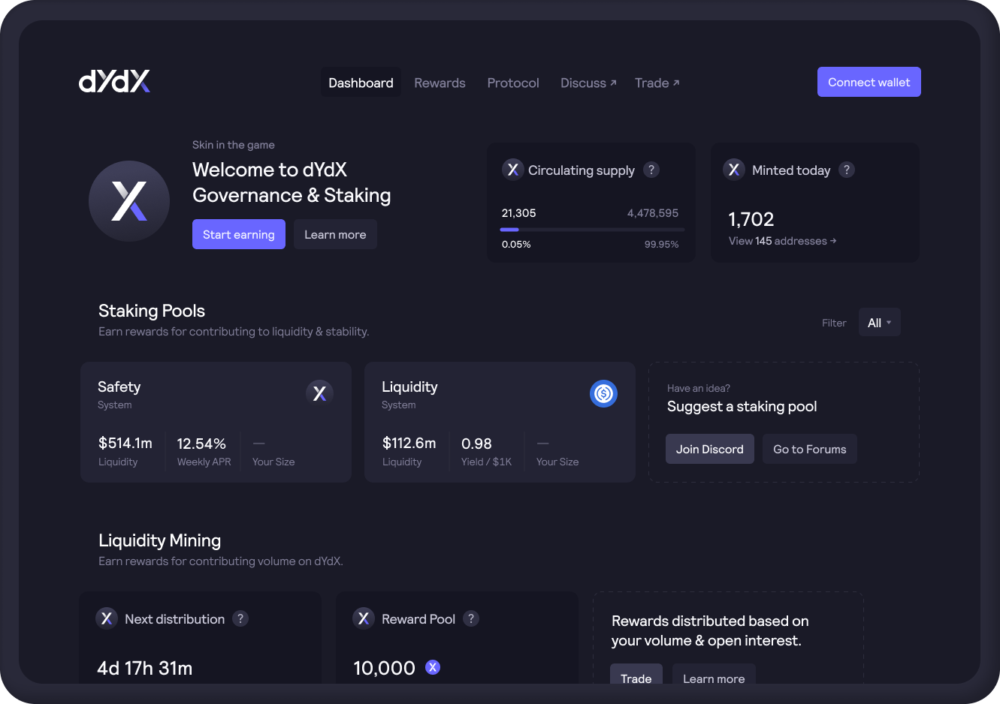
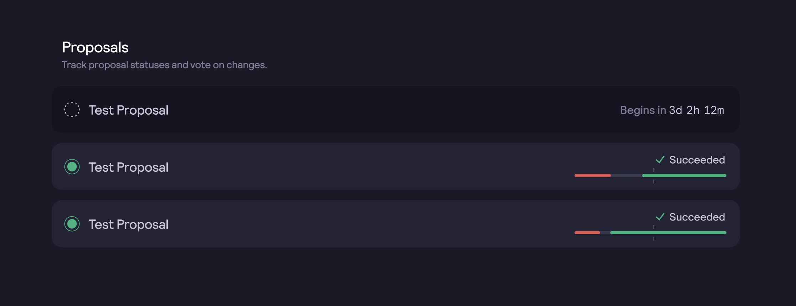
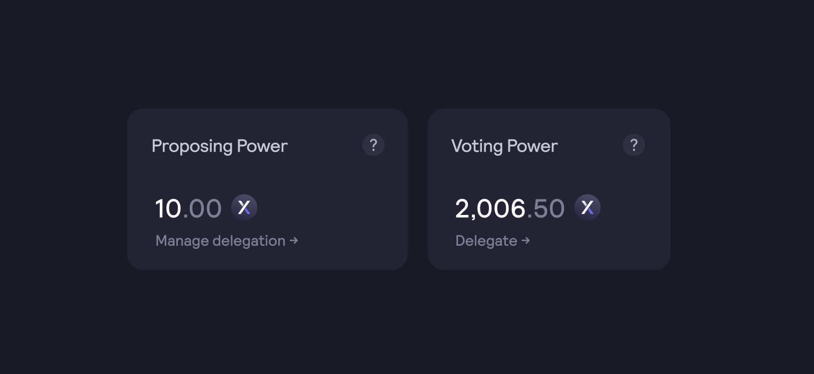
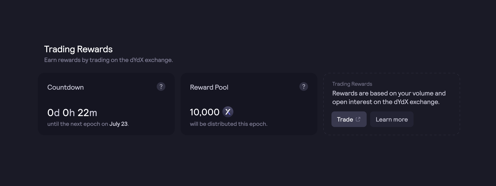
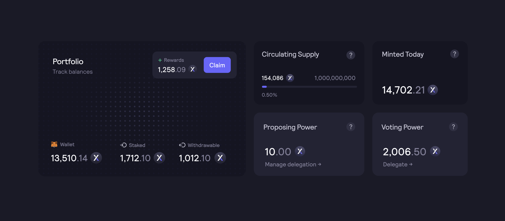

# 🖥️ Интерфейс

Интерфейс для управления, получения вознаграждения и стейкинга доступен на [**dydx.community**](https://dydx.community).

### Управление

Вы можете просматривать действующие и прошлые предложения по управлению, а также голосовать по действующим предложениям.

Владельцы $ethDYDX и $wethDYDX имеют два вида прав управления: право на внесение предложений и право голоса. На панели мониторинга пользователи могут просматривать свои права на внесение предложений и права голоса, а также делегировать их другим адресам.

### Стейкинг

В настоящее время модуль ликвидности и модуль безопасности неактивны. Пользователи, имеющие $stkDYDX и $stkUSDC в Ethereum, не получают наград. Пользователи могут `запросить вывод средств`, чтобы `вывести` их, на веб-сайте [**dydx.community**](https://dydx.community).

### Вознаграждения за торговлю

Пользователи могут просматривать свои ранее заработанные награды за торговлю на бирже уровня 2.  В [рамках ППУ 29](https://dydx.community/dashboard/proposal/16) сообщество dYdX проголосовало за сокращение вознаграждения  за торговлю на ⅓ с эпохи 30-32 на dYdX v3 до следующих значений:

* Эпоха 30: 383 562 $ethDYDX
* Эпоха 31: 191 781 $ethDYDX
* Эпоха 32: 0 $ethDYDX

В настоящее время вознаграждения за торговую деятельность на dYdX v3 не начисляются.

### Портфель и получение $ethDYDX

Пользователи могут просматривать сводку принадлежащих им $ethDYDX, невостребованных в виде вознаграждений $ethDYDX, размещенных в стейке $ethDYDX и доступных для вывода $ethDYDX.

