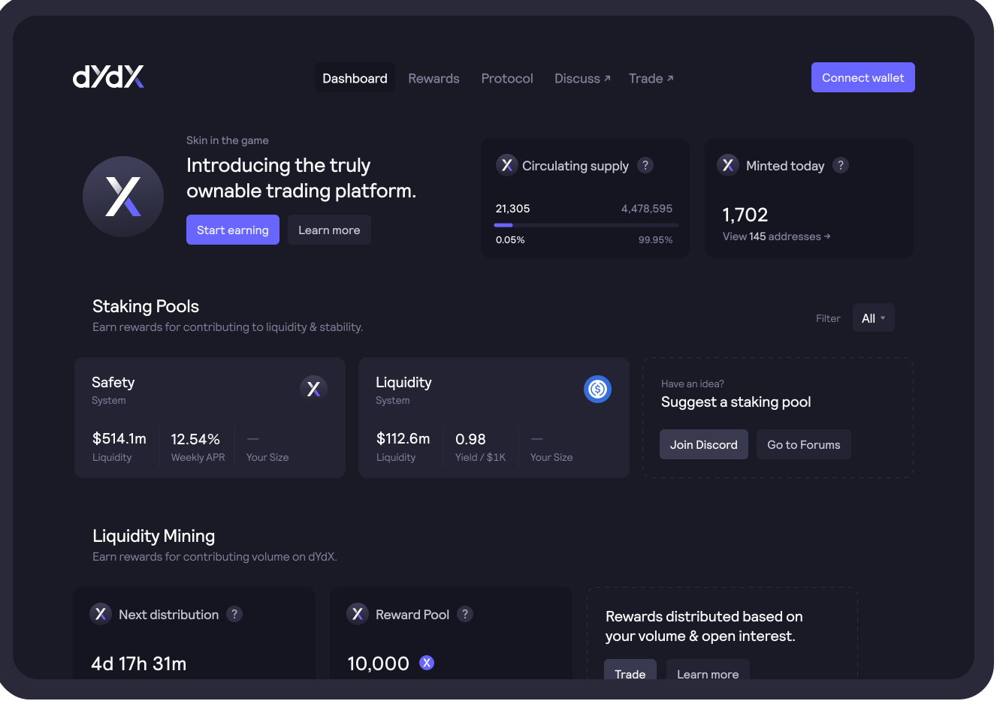

# Interface

The interface for governance, rewards, and staking is live at [**dydx.community**](https://dydx.community).

### Governance

Active and past governance proposals can be viewed, and active governance proposals can be voted on.

Holders of DYDX and stkDYDX are granted two types of governance powers: proposing power and voting power. Via the dashboard, users may view their proposing and voting powers, and delegate them to other addresses.

### Staking

Users can stake USDC and DYDX to earn staking rewards.

### Trading Rewards

Users can view their rewards earned through trading activity on the layer 2 exchange. Trading rewards are distributed every 28 days according to an epoch schedule.

### Portfolio & Claiming DYDX

Users can see an aggregated view of their DYDX holdings, claimable DYDX, staked DYDX, and withdrawable DYDX.

Users can see the current circulating supply and daily distribution of DYDX tokens. Users can also claim all available DYDX rewards.

