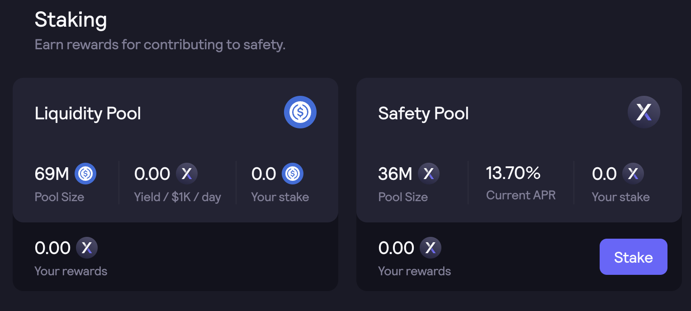

# Interfaz

La interfaz de gobernanza, recompensas e inversión está activa en [**dydx.community**](https://dydx.community).

### Gobernanza

Se pueden ver las propuestas de gobierno activas y pasadas, y se pueden votar las propuestas de gobierno activo.

A los titulares de DYDX y stkDYDX se les otorgan dos tipos de poderes de gobernanza: poder de propuesta y poder de voto. A través del panel, los usuarios pueden ver sus poderes de propuesta y de voto y delegarlos a otras direcciones.

### Participación

Los usuarios pueden invertir DYDX para ganar recompensas de participación.

<figure><figcaption></figcaption></figure>

### Recompensas por operaciones

Los usuarios pueden ver sus recompensas ganadas a través de la actividad de operaciones en la bolsa de la capa 2. Las recompensas de operaciones se distribuyen cada 28 días de acuerdo con el calendario de etapas.

### Portafolio y Reclamos DYDX

Los usuarios pueden ver una vista agregada de sus tenencias de DYDX, DYDX reclamable, DYDX invertido y DYDX retirable.

Los usuarios pueden ver el suministro circulante actual y la distribución diaria de tokens DYDX. Los usuarios también pueden reclamar todas las recompensas DYDX disponibles. Los tokens DYDX se volverán transferibles en o después **de septiembre de 2021** a las 15:00 UTC.

