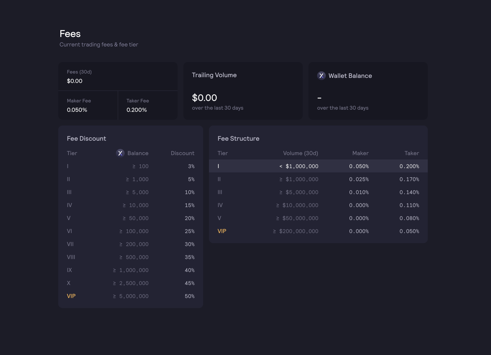

# Скидки на комиссии

В настоящее время dYdX Trading Inc. предлагает владельцам DYDX скидки на торговые комиссии исходя из объема токенов DYDX, которым они владеют. Трейдеры могут посмотреть количество DYDX, которым они владеют на данный момент, уровень комиссии и скидки на торговые комиссии [**здесь**](https://trade.dydx.exchange/portfolio/fees). Более подробную информацию можно получить у службы поддержки dYdX по вопросам торговли [**здесь**](https://help.dydx.exchange/en/articles/4798040-perpetual-trade-fees).

