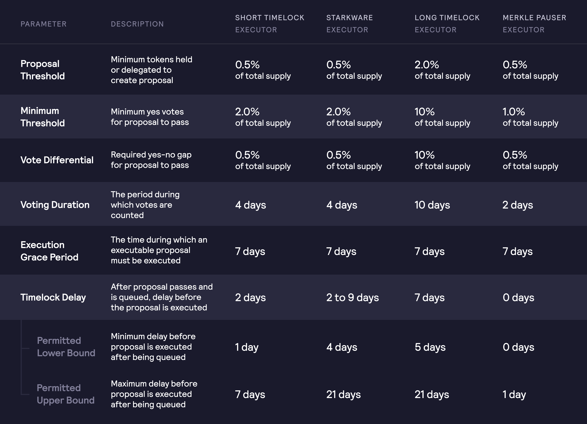

# 架构

## 概述

DYDX赋予持有人提议和投票修改协议的权利。DYDX治理以AAVE治理合约为基础，并支持基于DYDX代币持有量进行投票。

提议必须根据其类型达到特定阈值和赞成票比例。

这些DYDX代币可以用来提出建议或对治理提议进行投票，也可以委托给其他以太坊地址。

在dYdX治理的核心上，有5个智能合约：

* **`DYDX代币`合约**：在不同时间区块拥有每个地址的投票权的快照。
* **`治理战略`合约**：包含衡量用户提议和投票的相对权力的逻辑。
* **`保险模块`合约：**包含质押DYDX代币、标记位置并获得奖励的逻辑。代币质押的保险模块保留全部治理权。
* **`治理者`合约**：跟踪提议，并可以通过时间锁智能合约来执行提议。
* **`时间锁`合约：**可以排队、取消或执行治理者投票的交易。提议中的功能是由时间锁合约启动的。排队的交易可以在延迟之后和宽限期届满之前执行。

dYdX链上治理允许：

* 对“授权的执行者合约”将要执行的提议进行投票
* 在提议开始时，对代币持有量进行快照
* 分别委托投票权和提议权
* 设定治理阈值，包括提议、法定人数和投票差额
* 代替“治理战略”智能合约，例如，包括质押的代币的投票权

## 提议类型

有四种类型的提议，它们具有不同的参数，影响着提议的长度和执行情况，即影响治理共识的关键提议要求更多的投票时间和更大的投票差额，而仅影响协议参数的提议要求更少的投票时间，并可以迅速执行。执行器必须验证每种类型的提议。

#### **短时间锁执行器**

短时间锁执行器控制了激励合约，包括流动性模块、保险模块和Merkle分销商模块。此外，它控制了奖励和社区资金库的资金。

#### **Starkware执行器**

Starkware执行人拥有StarkEx永续交易所合约。它可以执行控制了dYdX Layer 2交易所配置的提议。

根据要采取的操作，Starkware团队可能需要参与进来，以便正确地在交易所实施变更。出于这个原因，该执行器获得了“优先权控制器”的角色，它为Starkware提供了7天的时间\(**优先期**\)，在这个时间里，只有他们才有能力触发提议的执行。

Starkware无法控制_哪些_协议被更改。只有DYDX代币持有人通过dYdX治理，才有能力批准或否认对交易所协议的更改。

#### **长时间锁执行器**

长时间锁执行器可以执行提议，这些提议通常会改变影响治理共识的那部分协议。

#### **Merkle-pauser执行器**

Merkle-pauser执行器可以执行冻结Merkle 根的提议，Merkle 根会根据每个用户的累计奖励余额定期更新，以便在建议的根不正确或具有恶意的情况下，可以随着时间的推移向用户分配新的奖励。

初始时间锁参数如下：

