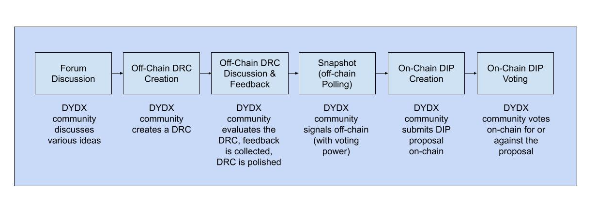
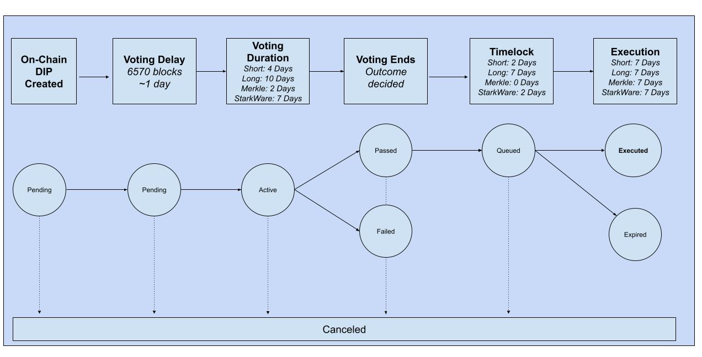

# DIP Proposal Lifecycle

## **Proposal Stages**

The dYdX Governance Process is fueled by governance forums at \[gov.dydx.community\] and ratified through dYdX Improvement Proposal \(“DIPs”\).

Below we outline a preliminary draft explaining how the dYdX governance process will flow, from the inception and definition of the concept to the actual implementation. These processes are subject to change according to feedback from the DYDX community.

The following flow chart is the initial proposed stages to pass a proposal:

## 0\) Forum Discussion

Anyone can sign up and set up a thread on any topic on dYdX’s Governance forums hosted on Commonwealth Governance Forum \[gov.dydx.community\]. Community members are required to register using an email address or an Ethereum wallet.

## 1\) Off-Chain dYdX Request for Comments Proposal \(DRCs\) Creation

Off-chain dYdX Request for Comments \(DRCs\) creation is the first step in the governance improvement process. Anyone can participate in the Governance Forum \[dydx.community\], create off-chain DRCs, and discuss improvements.

To create a DRC, use the following template available on our Github.

At a minimum, DRCs must include:

* Short and concise titles of the DRC
* A short and concise description of the proposal
* The rationale for the DRC, e.g. why?
* The title of the forum post must include DRC: with the short title of the DRC. E.g. DRC: New Market Request
* A community poll that community members can use to vote on improvements off-chain

## 2\) Off-Chain DRC Discussion / Feedback Period

Once posted on the governance forum, all questions and comments should be replied to and taken into consideration, to further improve the DRC.

## 3\) Snapshot Off-Chain Polling

Once an off-chain DRC has a very rough consensus, a community member holding more than `10,000` DYDX can create an off-chain vote on the DRC on Snapshot \([https://snapshot.org/\#/dydx/create](https://snapshot.org/#/dydx/create)\).

Snapshot is a simple voting interface that allows users to signal sentiment off-chain. Votes on snapshot are weighted by the number of DYDX delegated to the address used to vote.

The DRC submitter will need to provide details of the DRC, a voting system, vote start date, vote end date, and snapshot block number. The Snapshot block number locks the state of community members who are able to vote. Token holders who hold tokens before the snapshot block number are eligible to vote.

Snapshot poll lengths should be set to `5 days`.

Proposals and votes are just signed messages, stored on IPFS, and available via the Commonwealth portal.

## 4\) DIP On-Chain Creation

When a rough consensus is reached, an on-chain DIP may be submitted by a community member who holds enough proposition power for the type of proposal. An on-chain DIP is initiated via a smart contract call. The proposal should be based on the winning outcome of the off-chain DIP voting on Snapshot and can consist of one or multiple actions, up to a maximum of 10 actions per proposal.

A DIP creation is subject to a minimum number of tokens held/delegated required for an account. A Timelock executor must be specified when a proposal is created. The initial parameters are as follows \(and can be modified by governance\):

| Parameter | Description | Short Timelock Executor | Merkle-Pauser Executor | Long Timelock Executor | Starkware Executor |
| :--- | :--- | :--- | :--- | :--- | :--- |
| Proposal Threshold | Minimum tokens held/delegated to create proposal | 0.5% of total supply | 0.5% of total supply | 2% of total supply | 0.5% of total supply |

## 5\) DIP On-Chain voting

After an On-Chain DIP is created, the proposal enters a `pending` state for a period defined by the **Voting Delay**, which is currently configured to `6570` blocks or approximately 1 day \(assuming 13 seconds per block\). In other words, user snapshots are recorded 1 day after the DIP is created, at which point the proposal transitions to an `active` state.

After the Voting Delay, the Voting Period is activated. The voting period length depends on the proposal type.

The following chart shows a DIP state flowchart:

After a DIP is created on-chain it is subject to a **Voting Delay**, **Voting Period**, **Minimum Quorum**, and a minimum **Vote Differential**. The initial parameters are as follows \(and can be modified by governance\):

| Parameter | Description | Short Timelock DIP | Merkle-Pauser DIP | Long Timelock DIP | Starkware DIP |
| :--- | :--- | :--- | :--- | :--- | :--- |
| Voting Delay |  | 6,570 blocks | 6,570 blocks | 6,570 blocks | 6,570 blocks |
| Voting Period |  | 4 days | 2 days | 10 days | 7 days |
| Minimum Quorum | Minimum yes votes for a DIP proposal to pass | 2% of total supply | 1% of total supply | 10% of total supply | 2% of total supply |
| Vote Differential | Required yes-no gap for a DIP proposal to pass | 0.5% of total supply | 0.5% of total supply | 10% of total supply | 0.5% of total supply |

## 6\) Proposal Queuing and Execution

After a DIP has passed, any address can call the queue method to move the proposal into the Timelock queue. A DIP can only be queued if it has passed.

| Parameter | Description | Short Timelock Executor | Merkle-Pauser Executor | Long Timelock Executor | Starkware Executor |
| :--- | :--- | :--- | :--- | :--- | :--- |
| Timelock Delay | After a proposal passes and is queued, delay before the proposal is executed | 2 days | 0 days | 7 days | 2 days |
| Execution Grace Period | The period after a vote when proposal can be executed | 7 days | 7 days | 7 days | 7 days |
| Minimum Timelock Delay | Minimum delay before proposal is executed \(after queuing\) | 1 day | 0 days | 5 days | 1 day |
| Maximum Timelock Delay | Maximum delay before proposal is executed \(after queuing\) | 7 days | 1 day | 21 days | 7 days |

## 8\) \(Optional\) Proposal Canceling

At any point in a DIP lifecycle, the proposer can cancel the DIP. A new DIP will be submitted and subject to the same lifecycle.

## FAQ

### What is the purpose of the Voting Delay?

The **Voting Delay** is the number of Ethereum blocks to wait before voting on a proposal may begin after a proposal is submitted. 

DYDX voting power must be delegated to an address either entirely before a proposal has been submitted or during the proposal **Voting Delay**. 

For now, the **Voting Delay** is set to `6,570 blocks`, which is about 1 day. This value is added to the current block number when a proposal is created.

In the future, dYdX Governance may vote to increase or decrease the **Voting Delay**. While there are obvious benefits to an increased **Voting Delay.** It may introduce some potential adverse outcomes such as opportunistic edge case exploitation.

### What is the purpose of the Proposal Threshold?

Since DYDX is a freely tradable asset, anyone can attempt a governance takeover via market buying. That said, to force-pass a bad faith vote would require a minimum of 5 million DYDX in the event of a short timelock or 20 million DYDX in the event of long timelock. If not outright impossible, this amount would be prohibitively expensive and likely cost more when accounting for price fluctuation than the net gain from the attack.

If a group somehow achieved a bad faith takeover, Timelock’s delay would give affected agents time to withdraw their assets from the protocol. This would also be an opportunity to fork the protocol, a path that would likely be taken by the remaining good-faith actors.

### 

