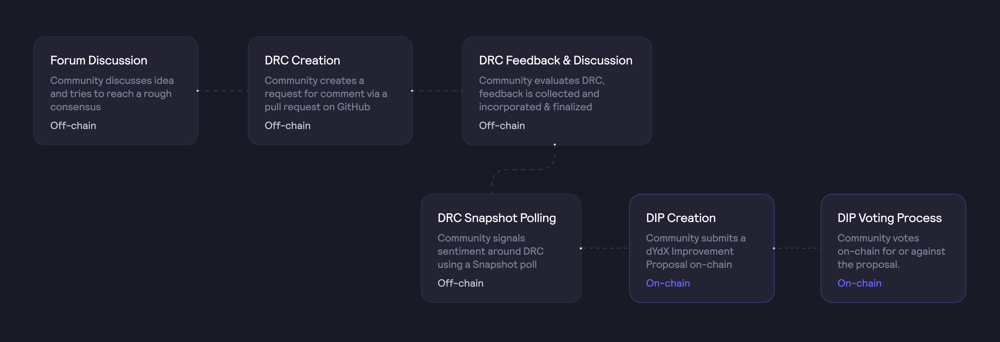
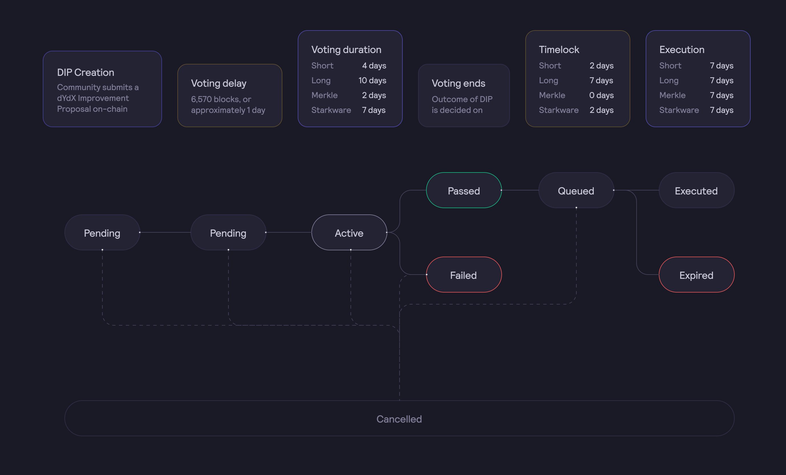

# 제안 수명주기

## **제안 단계**

dYdX 거버넌스 프로세스는 [**forum.dydx.community**](https://forums.dydx.community/)의 거버넌스 포럼을 기반으로 하며, dYdX 개선 제안(이하 'DIP')을 통해 승인됩니다.

아래의 초안에서는 거버넌스 개념의 시작 및 정의부터 실제 구현에 이르기까지 dYdX 거버넌스 프로세스가 어떻게 진행될 것인지를 설명합니다.
 해당 프로세스는 DYDX 커뮤니티의 피드백에 따라 변경될 수 있습니다.

다음 플로우 차트는 제안 통과를 위한 초기 제안 단계입니다.

## 0. 포럼 논의

누구나 [**forums.dydx.community**](https://forums.dydx.community/)에 호스팅되는 dYdX 거버넌스 포럼에 가입하고 모든 주제로 스레드를 만들 수 있습니다. 커뮤니티 회원은 이메일 주소 또는 이더리움 지갑을 사용하여 등록해야 합니다.

## 1. (오프체인) DRC 생성

오프체인 **dYdX 의견 요청**(DRC) 생성은 거버넌스 개선 프로세스의 첫 번째 단계입니다. 누구나 거버넌스 포럼에 참여하여 오프체인 DRC를 생성하고 개선점을 논의할 수 있습니다.

DRC를 생성하기 위해 [이 템플릿](https://github.com/dydxfoundation/dip/blob/master/DIP-X.md)(Github에서 이용 가능)을 사용하세요. DRC는 잠정적으로 최종 DIP의 모든 정보를 다뤄야 합니다.

DRC는 최소한 다음을 포함해야 합니다.

* DRC에 대한 짧고 간결한 제목

* 제안에 대한 짧고 간결한 설명

* DRC의 합리적인 근거(예: 제안 이유)

* 포럼 게시물의 제목은 'DRC: DRC에 대한 짧은 제목'을 포함해야 합니다.
 예) DRC: 새로운 시장 요청
* 커뮤니티 회원이 개선점 오프체인 투표에 사용할 수 있는 커뮤니티 여론조사

## 2. DRC 논의 및 피드백

거버넌스 포럼에 글이 게시되면 DRC를 더욱 개선하기 위해 모든 질문과 의견을 다루고 고려해야 합니다.

## 3. DRC 스냅샷 여론조사

스냅샷 여론조사는 향후 온체인 DIP의 동향 알림 및 오프체인 제어 변수에 대한 구속력 있는 투표의 두 가지 목적으로 시행됩니다.

오프체인 DRC가 대략적인 합의에 도달하면 `10,000` DYDX 이상을 보유한 커뮤니티 회원은 **스냅샷**에서 DRC에 대해 **오프체인 투표**를 생성할 수 있습니다. 저희는 dYdX 커뮤니티가 정규 근무 주간의 가시성을 높이기 위한 스냅샷 여론조사를 월요일에 실시하도록 장려합니다.

스냅샷은 사용자가 오프체인으로 견해를 표명할 수 있는 간단한 투표 인터페이스입니다.
 스냅샷에 대한 투표에는 투표에 사용된 주소의 투표권에 따라 가중치가 부여됩니다.

동향 알림과 관련된 스냅샷 여론조사의 경우, 제안자는 다음을 제공해야 합니다.

* DRC의 세부 사항,
* 투표 시스템,
* 투표 기간 - 4일의 투표 기간으로 설정된 투표 시작 날짜 및 투표 종료 날짜
* 투표 지연 - 향후 6570블록(약 1일)이 될 스냅샷 블록 번호. 스냅샷 블록 번호는 투표할 수 있는 커뮤니티 회원의 상태를 제한합니다. 스냅샷 블록 번호 이전에 토큰을 보유한 토큰 보유자가 투표에 참여할 수 있습니다.
 각 주소의 개별 투표권의 스냅샷 이전에 투표 지연은 DYDX/stkDYDY 보유자에게 토큰을 획득할 시간을 부여하고 투표권을 위임하며, 지갑 간에 토큰을 전송(지갑 간 토큰 전송은 DYDX 보유자만 해당)합니다.

온체인 스마트 컨트랙트 호출이 필요하지 않은 결정의 경우, 눈에 띄는 거래 및 유동성 제공자 보상 공식, 스냅샷 투표에 대한 내용 변경은 구속력 있는 투표 및 최종 투표로 간주됩니다. 제안자는 상기 요건을 포함해야 하며 다음을 제공해야 합니다.

* 이진 투표 옵션 - 명확성을 위해 주소는 제안에 대해 찬성 또는 반대 하나에만 투표해야 합니다.

제안된 변경 사항은 스냅샷 여론조사 결과가 다음을 충족할 경우, dYdX Trading Inc.가 실행하게 됩니다.

* 최소 정족수 - 최소 1백만 DYDX/stkDYDX. 최소 정족수는 의사 결정의 탈중앙화 및 일방적인 의사 결정으로부터 보호하는 데 기여하며,
* 최소 투표 격차 - 투표의 최소 67%는 제안에 찬성해야 합니다. 최소 투표 격차는 논쟁의 여지가 많은 제안과 추후 논의가 필요한 제안을 걸러내는 데 도움이 됩니다.

dYdX Trading Inc.는 성공적인 스냅샷 여론조사의 변경 사항을 실행하기 위한 최대 1에폭(28일)의 실행 유예 기간을 갖게 됩니다.

참고로 제안 및 투표는 서명된 메시지로 IPFS에 저장되며 Commonwealth 포털을 통해 확인할 수 있습니다.

## 4. (온체인) DIP 생성

대략적 합의에 도달하면 해당 유형의 제안에 대해 충분한 제안권을 보유한 커뮤니티 회원이 온체인 DIP를 제출할 수 있습니다.
 온체인 DIP는 스마트 컨트랙트 호출을 통해 시작됩니다.
 해당 제안은 스냅샷 상 오프체인 DIP 투표의 개표 결과에 기반해야 하며, 하나 또는 여러 개의 활동(제안당 최대 10개)으로 구성될 수 있습니다.

DIP를 생성하려면 계정에 요구되는 최소 보유/위임 토큰 수를 충족해야 합니다.
 제안 생성 시 타임락 실행자를 명시해야 합니다.
 초기 파라미터는 다음과 같이 설정됩니다(거버넌스에 의해 수정될 수 있음).

| 매개 변수 | 설명 | 단기 타임락 실행자 | 머클-파서 실행자 | 장기 타임락 실행자 | 스타크웨어 실행자 |
| ------------------ | ------------------------------------------------ | ----------------------- | ---------------------- | ---------------------- | -------------------- |
| 제안 임계점 | 제안 생성을 위해 보유/위임되는 최소 토큰
 | 총 공급의 0.5% | 총 공급의 0.5% | 총 공급의 2% | 총 공급의 0.5% |

## 5. (온체인) DIP 투표

온체인 DIP가 생성되면, 해당 제안은 현재 `6570` 블록 또는 약 1일(블록당 13초 가정)에 해당하는 **투표 딜레이**로 정의되는 동안 `보류` 상태에 진입합니다. 즉, DIP의 생성 1일 뒤 사용자 스냅샷이 촬영되며, 이때 해당 제안이 `활성` 상태로 전환됩니다.

투표 딜레이 후에 투표 기간이 활성화됩니다. 투표 기간의 길이는 제안 유형에 따라 다릅니다.

다음에서 DIP 상태 플로우 차트를 확인할 수 있습니다.

DIP가 온체인으로 생성되면, 해당 DIP에는 **투표 딜레이**, **투표 기간**, **최소 정족수** 및 최소 **투표 격차**가 적용됩니다. 초기 파라미터는 다음과 같습니다.

| 매개 변수 | 설명 | 단기 타임락 실행자 | 머클-파서 실행자 | 장기 타임락 실행자 | 스타크웨어 실행자 |
| ----------------- | ----------------------------------------------------------------------------------------------------- | ----------------------- | ---------------------- | ---------------------- | -------------------- |
| 투표 딜레이 | 제안 제출 후 제안에 대한 투표가 시작되기 전에 대기해야 하는 이더리움 블록 수 | 6,570블록 | 6,570블록 | 6,570블록 | 6,570블록 |
| 투표 기간 | 제안에 대한 투표 가능 시간 | 4일 | 2일 | 10일 | 4일 |
| 최소 정족수 | DIP 제안 통과에 필요한 찬성표 최소 수 | 총 공급의 2% | 총 공급의 1% | 총 공급의 10% | 총 공급의 2% |
| 투표 격차 | DIP 제안 통과에 필요한 찬반 격차 | 총 공급의 0.5% | 총 공급의 0.5% | 총 공급의 10% | 총 공급의 0.5% |

투표 딜레이만이 거버넌스에 의해 수정될 수 있으며 최소 및 최대 딜레이를 포함하여 그 사잇값으로만 변경할 수 있습니다. 투표 기간, 최소 정족수 및 투표 격차는 변경할 수 없습니다.

## 6. 제안 대기열 및 실행

DIP가 통과되면 어떤 주소든 대기열 진입 방법을 호출하여 해당 제안을 타임락 대기열로 이동시킬 수 있습니다. DIP가 통과된 경우에만 대기열에 진입할 수 있습니다.

| 매개 변수 | 설명 | 단기 타임락 실행자 | 머클-파서 실행자 | 장기 타임락 실행자 | 스타크웨어 실행자 |
| ---------------------- | ------------------------------------------------------------------------------------- | ----------------------- | ---------------------- | ---------------------- | ------------------ |
| 타임락 지연 | 제안이 통과되고 대기열에 진입한 후 실행되기 전에 발생하는 딜레이 | 2일 | 0일 | 7일 | 2~9일 |
| 실행 그레이스 기간 | 제안을 실행할 수 있으며 반드시 실행해야 하는 시간 | 7일 | 7일 | 7일 | 7일 |
| 최소 타임락 지연 | 제안이 실행되기 전 발생하는 최소 딜레이(대기열 진입 후) | 1일 | 0일 | 5일 | 4일 |
| 최대 타임락 지연 | 제안이 실행되기 전 최대 지연(대기열 추가 후) | 7일 | 1일 | 21일 | 21일 |

투표 기간이 끝나고 제안이 통과되면 누구나 대기열을 호출하여 타임락 지연을 시작할 수 있습니다.

Starkware 우선 타임락 실행자의 경우, 9일의 타임락 지연 중 7일의 우선 기간을 갖게 됩니다. 이는 9일 이후에는 누구나 제안을 실행할 수 있지만, 2~9일(우선 기간) 이내의 제안 실행 옵션은 Starkware에 있습니다.

실질적인 기간은 다음과 같습니다.

* 0~2일: 실행 불가
* 2~9일 : Starkware만 실행 가능
* 9일: 누구나 실행 가능

## 7. (선택 사항) 제안 취소

DIP 수명주기 동안 제안자는 언제든지 DIP를 취소할 수 있습니다. 제안은 제안자가 현재 블록에 충분한 제안권을 보유하지 않았을 경우, 실행 전에 누구나 취소할 수 있습니다.

## FAQ

### 투표 딜레이의 목적은 무엇입니까?

**투표 딜레이**는 제안 제출 후 제안에 대한 투표가 시작되기 전에 기다려야 하는 이더라움 블록 수입니다.

DYDX 투표권은 제안 제출 전 또는 제안에 대한 **투표 딜레이** 기간 동안 한 주소에 전적으로 위임되어야 합니다.

현 시점에서 **투표 딜레이**은 약 1일에 해당하는 `6,570 블록`으로 설정됩니다. 이 값은 제안 생성 시점의 현재 블록 번호에 추가됩니다.

향후 dYdX 거버넌스는 **투표 딜레이** 기간의 연장 또는 축소를 위해 투표할 수 있습니다. **투표 딜레이** 연장에는 명백한 이점이 있습니다. 하지만 기회주의적인 엣지 사례 악용과 같은 잠재적인 부작용을 초래할 수도 있습니다.

### 제안 임계값의 목적은 무엇입니까?

DYDX는 자유롭게 거래할 수 있는 자산이므로, 누구나 시장 거래를 통해 거버넌스 참여를 시도할 수 있습니다. 그러나 기만적인 투표를 강제로 통과시키려면 단기 타임락의 경우 최소 500만 DYDX, 장기 타임락의 경우 2000만 DYDX가 필요합니다.
 이를 달성한다 하더라도 이 금액은 매우 비싸며, 가격 변동을 고려할 때 공격을 통해 얻을 수 있는 순이익보다 더 많은 비용이 들 것입니다.

한 그룹이 어떻게든 악의적인 인수를 달성하더라도 타임락 딜레이를 통해 영향을 받은 에이전트는 프로토콜에서 자산을 인출할 시간을 확보할 수 있습니다. 이는 프로토콜을 포킹할 수 있는 기회이기도 합니다. 나머지 선의 행위자들은 이 방법을 선택할 가능성이 높습니다.

###
