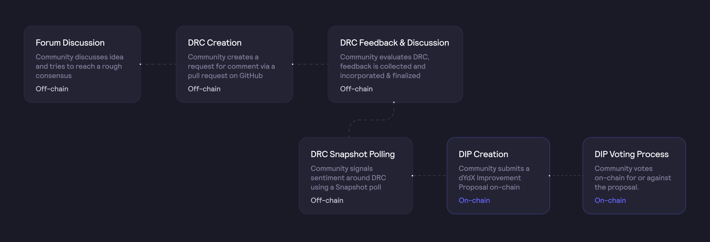

# 💼提案ライフサイクル

## **提案ステージ**

dYdXガバナンスプロセスは [**https://dydx.forum/**](https://dydx.forum/) のガバナンスフォーラムにおいて推進され、dYdX改善提案(「DIP」)を通じて承認されます。

以下では、コンセプトの開始および定義から実際の実装までのdYdX v3ガバナンスプロセスがどのように進むかを説明する、あらかじめ準備した草案を概説します。これらのプロセスは、dYdXコミュニティからのフィードバックに応じて変更される場合があります。

以下のフローチャートは、提案を審査する最初の提案ステージです。

## 0.フォーラムディスカッション

[**https://dydx.forum/**](https://dydx.forum/) でホストされているdYdXのガバナンスフォーラムでは、誰もが任意のトピックについてサインアップおよびスレッドの設定ができます。コミュニティのメンバーは、メールアドレスまたはイーサリアムウォレットを使用して登録する必要があります。

## 1.（オフチェーン）DRCの作成

オフチェーンで**dYdXコメントリクエスト**（DRC）の作成はガバナンスの改善プロセスの最初のステップです。[ガバナンスフォーラム](https://dydx.forum/) には誰でも参加し、オフチェーンでのDRCの作成や改善について議論することができます。

DRCを作成するには、[このテンプレート](https://github.com/dydxfoundation/dip/blob/master/DIP-X.md)を使用してください（Githubで利用可能です）。DRCは最終DIP素案のすべての情報をカバーする必要があります。

少なくとも、DRCには以下のものを含める必要があります。

* DRCの短い、簡潔なタイトル
* 提案の短い、簡潔な説明
* DRCの理論的根拠（例：存在理由）
* フォーラムポストのタイトルには、DRC：DRCの短いタイトルが含まれる必要があります。例：DRC：新マーケットリクエスト
* コミュニティのメンバーがオフチェーンの改善の投票のために使用できるコミュニティ調査

## 2.DRCディスカッションおよびフィードバック

ガバナンスフォーラムに掲載されると、DRCをさらに改善するため、すべての質問やコメントに対処し、考慮に入れなければなりません。

## 3。 DRCスナップショット投票

スナップショットでの投票には2つの目的があります：1つは将来におけるオンチェーンDIPのセンチメントのシグナリング、もう1つはオフチェーン制御された変数についての拘束力ある投票です。

オフチェーンDRCで非常に大まかな合意が得られると、`1万`ガバナンストークン以上の提案権を持つコミュニティメンバーは**スナップショット**でDRCに対して**オフチェーン投票**を作成できます。当社では、通常の勤務時間中に可視性を高めるために、dYdXコミュニティに対して月曜日にスナップショット投票を行うことを推奨しています。

スナップショットは、ユーザーがセンチメントオフチェーンを伝えることができるシンプルな投票インターフェースです。 スナップショット投票は、投票に使用されるアドレスの投票権に基づいて加重されます。

センチメントのシグナリングに関連するスナップショット投票では、提案者は以下を提供する必要があります：

* DRCの詳細、
* 投票システム、
* 投票期間（投票の開始日から終了日までの4日間を設定）、
* 投票遅延 - 6,570ブロック（13.2秒のブロックタイムに基づくと約1日）先のスナップショットブロック番号。 スナップショットブロック番号は、投票権を有するコミュニティメンバーの状態をロックします。スナップショットブロック番号の以前からトークンを保有するトークン保有者には、投票する資格があります。ガバナンストークン保有者は、各アドレスの投票権のスナップショット以前に、投票遅延によりトークンの取得、投票権の委任、ウォレット間のトークンの移動に必要な時間が付与されます。 ウォレット間の移動は、$ethDYDXと$wethDYDXにのみ適用されることにご注意ください。

オンチェーンでのスマートコントラクトコールが必要でない意思決定の場合、特に取引および流動性プロバイダーの報酬公式の変更については、スナップショットの投票は拘束力を有する最終投票とみなされます。提案者は上記の要件を含め、以下の内容の提供が必要です：

* 二者択一のオプション（明確化のためアドレスは提案への賛成または反対のいずれかを投票します）。

スナップショットの投票の結果、以下の条件を満たす場合、dYdX Trading Inc.は提案された変更を実行します。

* 最小クォーラム（少なくとも`100万`ガバナンストークン）、最小クォーラムは意思決定の分散化に貢献し、一方的な意思決定から保護します。また、
* 最小投票差（少なくとも67％が提案に賛成していなければなりません）も同様です。最小投票差は、賛否が大きく割れる提案をふるいにかけ、さらなる議論が必要な場合を判断する助けとなります。

dYdX Trading Inc.はスナップショットの投票で決定された変更について、最長1エポック（28日間）の実行猶予期間を有します。

注：提案および投票は署名済みメッセージとしてIPFSに保存され、コモンウェルスポータルを介して入手できます。

## 4.（オンチェーン）DIPの作成

ラフコンセンサスに達すると、提案の種類について十分な提案権を保有するコミュニティのメンバーによって、オンチェーンDIPが提出される可能性があります。スマートコントラクト呼び出しを通じてオンチェーンDIPが開始されます。提案は、スナップショットでのオフチェーンDIP投票の賛成結果に基づく必要があり、提案ごとに最大10アクションまで、1つまたは複数のアクションで構成できます。

DIPの作成は、アカウントに必要な保有/委任された最小トークンの数が対象となります。提案作成時に、タイムロックでの実行管理者を指定する必要があります。初期のパラメータは以下のとおりです（ガバナンスによって変更できます）。

| パラメータ | 説明 | 短いタイムロックでの実行管理者 | Merkle-Pauserの実行管理者 | 長いタイムロックでの実行管理者 | Starkwareの実行管理者 |
| ------------------ | ------------------------------------------------ | ----------------------- | ---------------------- | ---------------------- | -------------------- |
| 提案のしきい値 | 提案作成に保有/委任された最小トークン | 総供給量の0.5％ | 総供給量の0.5％ | 総供給量の2％ | 総供給量の0.5％ |

## 5.（オンチェーン）DIPの投票

オンチェーンDIPが作成された後、提案は**投票遅延**によって定義された期間に`保留中`の状態に入ります。現在、`6,570`ブロックまたは約1日間（ブロックごとに13.2秒）です。言い換えれば、DIP作成から1日後にユーザーのスナップショットが記録され、その時点で、提案は`アクティブ`状態に移行します。

投票遅延後、投票期間がアクティブになります。投票期間は、提案の種類によって異なります。

以下のグラフは、DIP状態フローチャートを示しています。

<figure><figcaption></figcaption></figure>

DIPがオンチェーンで作成された後、投票**遅延**、**投票期間**、**最小投票数**、および最小**投票差**が対象となります。初期のパラメータは以下のとおりです。

| パラメータ | 説明 | 短いタイムロックでの実行管理者 | Merkle-Pauserの実行管理者 | 長いタイムロックでの実行管理者 | Starkwareの実行管理者 |
| ----------------- | ----------------------------------------------------------------------------------------------------- | ----------------------- | ---------------------- | ---------------------- | -------------------- |
| 投票遅延（投票開始までの待機期間） | 提案の送信後、提案の投票前に待機するイーサリアムブロック数 | 6,570ブロック | 6,570ブロック | 6,570ブロック | 6,570ブロック |
| 投票期間\* | 提案が投票可能である場合の投票期間 | 4日間 | 2日間 | 10日間 | 4日間 |
| 最小クォーラム | DIP提案が審査を通過する場合の最小賛成票 | 総供給量の2％ | 総供給量の1％ | 総供給量の10％ | 総供給量の2％ |
| 投票差 | DIP提案が通るために必要な賛成・反対の差 | 総供給量の0.5％ | 総供給量の0.5％ | 総供給量の10％ | 総供給量の0.5％ |

_\*13.2秒のブロックタイムに基づくタイミング。_

投票遅延はガバナンスによってのみ変更できますが、最小限および最大限の遅延（包含）の間の値に限ります。投票期間、最小クォーラム、投票差は変更できません。

## 6.提案のキュー追加および実行

DIPが通過すると、任意のアドレスがキューメソッドを呼び出すことで提案をタイムロックのキューに移動できるようになります。DIPは、審査通過した場合にのみキューに追加することができます。

| パラメータ | 説明 | 短いタイムロックでの実行管理者 | Merkle-Pauserの実行管理者 | 長いタイムロックでの実行管理者 | Starkwareの実行管理者 |
| ------------------------ | ------------------------------------------------------------------------------------- | ----------------------- | ---------------------- | ---------------------- | ------------------ |
| タイムロック遅延\* | 提案が通過してキューに入った後、実行までのタイムロックによる遅延（待機期間） | 2日間 | 0日間 | 7日間 | 2〜9日間 |
| 実行猶予期間\* | 提案が実行可能になるまでの期間ががあり、その間に実行する必要があります。 | 7日間 | 7日間 | 7日間 | 7日間 |
| 最小タイムロック遅延期間\* | 提案実行までの最小遅延時間（キュー追加後） | 1日間 | 0日間 | 5日間 | 4日間 |
| 最大タイムロック遅延期間\* | 提案執行までの最大遅延時間（キュー追加後） | 7日間 | 1日間 | 21日間 | 21日間 |

_\*13.2秒のブロックタイムに基づくタイミング。_

投票期間が終了し、提案が成功すると、誰でもタイムロックの遅延を開始するためにキューを呼び出すことができます。

Starkwareの優先タイムロックの執行管理者は、9日間のタイムロック遅延のうち7日間を優先期間とします。これは、9日間経過以降は誰でも提案を執行できますが、2〜9日間（優先期間）の間はStarkwareが提案を執行するオプションを有していることを意味します。

実際に稼働すると以下のようになります。

* 0～2日目：誰も実行できません
* 2～9日目：Starkwareのみ実行できます
* 9日目：誰でも実行できます

## 7.（オプション）提案のキャンセル

DIPライフサイクルのいずれの時点でも、提案者はDIPをキャンセルできます。現在のブロックで十分なプロポジションパワーがない場合、提案は執行前に誰でもキャンセルできます。

## FAQ

### 投票遅延の目的は何ですか？

**投票遅延**とは、提案が送信された後、投票が開始されるまで待機する必要がある期間を指します。この期間は、イーサリアムのブロック数で計算されます。

投票権は、提案が提出される前または提案の**投票遅延**中に完全にアドレスに委任する必要があります。

現在、**投票遅延**は`6,570ブロック`に設定されており、約1日間です。提案作成時に、現在のブロック番号にこの値が追加されます。

将来的に、dYdXガバナンスは**投票遅延**を増加または減少させることを投票で決定する可能性があります。**投票遅延**の増加には明確な利点がありますが、日和見主義的なエッジケースによる悪用など、潜在的な悪影響をもたらしてしまう可能性があります。

### 提案のしきい値の目的は何ですか？

$ethDYDXおよび$wethDYDXは自由に取引可能な資産であるため、マーケット購入を通じて誰でもガバナンスの買収ができるようになってしまいます。とはいえ、悪意のある投票を強制的に通過させようとすると、短いタイムロックの場合には最小`500万`ガバナンストークン、長いタイムロックの場合には`2,000万`ガバナンストークンが必要になります。完全に不可能ではないかもしれませんが、この金額は、価格の変動を考慮すると、攻撃による純利益よりも法外に高額となり、より多くのコストがかかってしまいます。

グループが何らかの形で悪意のある買収を行った場合、タイムロックの遅延により、影響を受けた関係者はプロトコルから資産を出金する時間が与えられます。これは、プロトコルをフォークする機会であり、残りの善良な関係者によって実行される可能性が高いパスとなります。

###
