# 治理指南

dYdX基金会创建本指南是为了帮助dYdX社区了解dYdX治理流程。该指南提供了以下内容的分步概述：

* [论坛讨论（链下）](governance-guide.md#step-1-forum-discussions-drc-creation-off-chain-and-drc-feedback)
* [DRC创建（链下）](governance-guide.md#step-1-forum-discussions-drc-creation-off-chain-and-drc-feedback)
* [快照投票创建（链下）](governance-guide.md#step-2-drc-snapshot-polling-off-chain)
* [进行快照投票](governance-guide.md#how-to-vote-on-a-snapshot-poll)
* [DIP创建（链下）](governance-guide.md#step-3-dip-creation-off-chain-proposal)
* [DIP创建（链上）](governance-guide.md#step-1-on-chain-dip-drafting)
* [DIP投票（链上）](governance-guide.md#how-to-vote-on-a-dip)
* [DIP排队（链上）](governance-guide.md#how-to-queue-a-proposal)
* [执行DIP（链上）](governance-guide.md#how-to-execute-a-proposal)

指南中的两个示例是_DIP 2（链下提议） - 降低流动性提供方的奖励阈值_和_DIP 3（链上提议） - 安全模块恢复_。

## DIP 2（链下提议）- 降低流动性提供方奖励阈值

_**摘要：**_

在时段6中，dYdX社区对[快照](https://commonwealth.im/dydx/snapshot/dydxgov.eth/0x785066561be1e5d170eb28960da5ef2643ee0d0c3d590fd797c028512cc6be43)进行了投票，将做市商的LP奖励数量阈值从1%降低到0.25%。遵循与时段6中相同的过程（1%到0.25%），在时段2中，LP奖励阈值从5%降低到1%。下面提供了将 LP 奖励交易量的阈值从 5% 降低到 1% 的分步概述。

社区的大多数人（399名投票者和86%的DYDX）对[快照](https://forums.dydx.community/snapshot/dydxgov.eth/QmXtS7CGVX7C5v2JdcJpsqWAeZrStQcogSQpP6zzhzwLmN)进行了投票，以将获得流动性提供方奖励的数量阈值从5%降低到1%。DeFiance Capital的Jacob Goh (jteam0x)提交了一份[链下DIP](https://github.com/dydxfoundation/dip/blob/master/content/dips/DIP-2.md)，将做市商的流动性提供方奖励数量阈值从5%降低到1%。在时段2达到1%阈值的做市商有资格在时段3获得流动性提供方奖励。该提议不需要任何链上智能合约变更。

_**背景：**_

作为流动性提供方[奖励计划](https://docs.dydx.community/dydx-governance/rewards/liquidity-provider-rewards)的一部分，每个时段（28天）将1,150,685个DYDX分配给为该协议做市的流动性提供方。根据奖励正常运行时间、双侧深度、买卖价差和支持的交易对数量的公式，对奖励进行分配。要获得此奖励计划的资格，流动性提供方需要在前一个时段提供总挂单量的最低百分比。

dYdX社区对流动性提供方奖励阈值具有“即时且不可撤销的控制”。社区控制的参数的完整列表，请点击[此处](https://docs.dydx.community/dydx-governance/voting-and-governance/governance-parameters)访问链接。

社区受到激励，以降低流动性提供方奖励阈值，因为这将激励新的做市商和中小型做市商增加 dYdX 平台上的流动性。此外，增加平台上做市商的数量，有助于dYdX协议变得更加去中心化。

接下来，我们将分步概述dYdX治理在实践中的运作方式。有关dYdX治理流程的更多信息，请点击[此处](https://docs.dydx.community/dydx-governance/voting-and-governance/dip-proposal-lifecycle)访问链接。

### **第1步 - 论坛讨论、DRC创建（链下）和DRC反馈**

_**说明：**_

dYdX治理流程由[治理论坛](https://forums.dydx.community/)推动。社区成员在讨论论坛中进行发帖和评论，以在链下达成粗略的共识。有关论坛讨论和DRC创建的更多信息，请点击[此处](https://docs.dydx.community/dydx-governance/voting-and-governance/dip-proposal-lifecycle)访问链接。

_**适用于DIP 2：**_

Three Arrows Capital的Su Zhu (zhusu)创建了一个[链下论坛讨论](https://forums.dydx.community/proposal/discussion/1805-reduce-market-maker-incentives/)，目的是降低流动性提供方奖励阈值。各社区成员，例如 Wintermute 的 Evgeny、Kronos 的 Ben、Sixtan t的 Josh 等等，都参与了讨论并提供了宝贵的反馈意见。

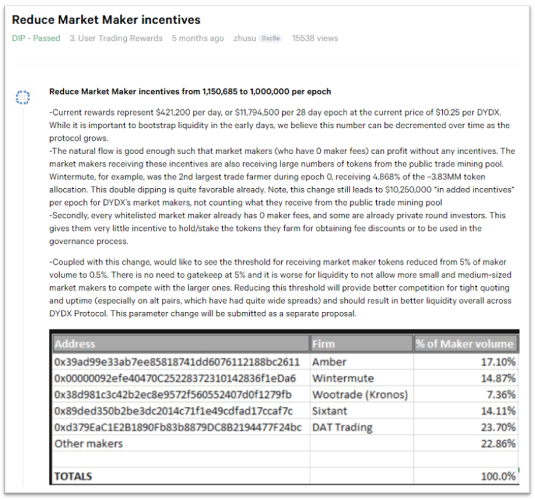

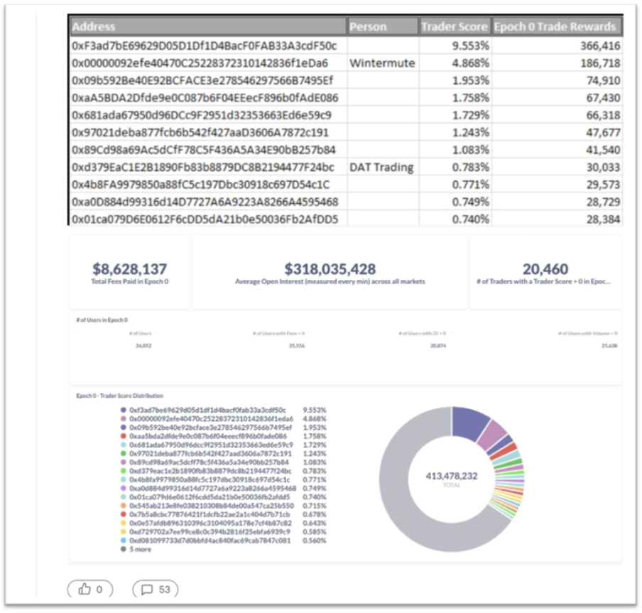

#### _如何在Commonwealth上发帖和评论：_

* 用以太坊钱包或 Github 帐户在 Commonwealth 上注册，并点击[此处](https://forums.dydx.community/)加入 dYdX 社区。

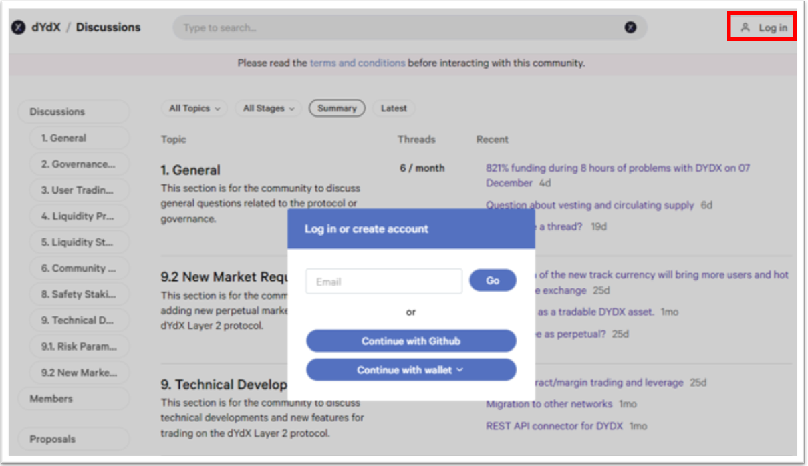

* 选择一个帖子，滚动查看评论，并通过点击相应评论下方的图标来点赞或回复评论。

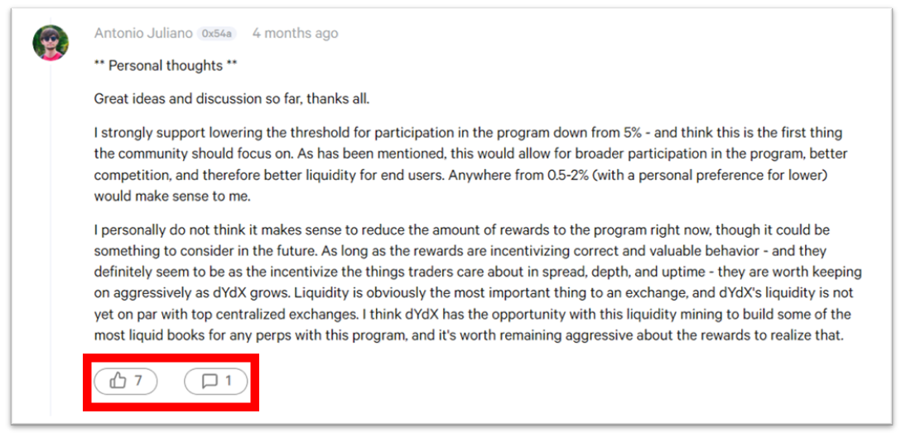

* 通过单击“创建新帖”并选择主题类别来创建新的讨论帖或发布DRC。

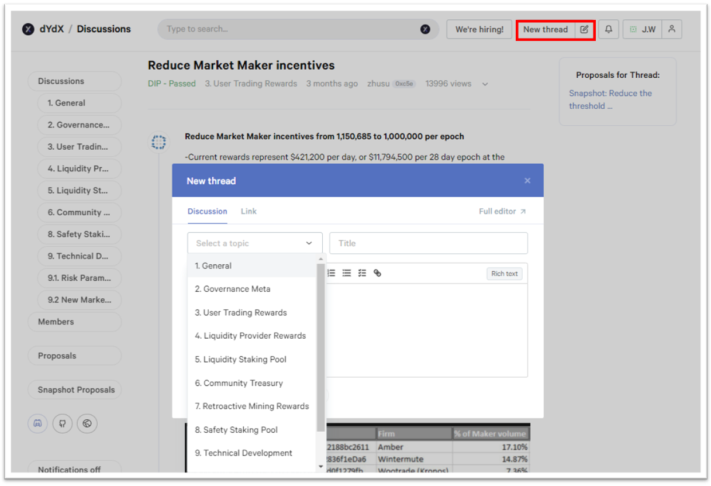

* 如果您要创建DRC，请点击[此处](https://github.com/dydxfoundation/dip/blob/master/DIP-X.md)访问链接并按照模板进行操作。如提议[生命周期](https://docs.dydx.community/dydx-governance/voting-and-governance/dip-proposal-lifecycle)中的_DRC创建_中所述，DRC至少必须包括以下内容：
  * DRC的简短标题。
  * 简明扼要的提议描述。
  * DRC的理由（例如，为什么？）。
  * 论坛帖子的标题必须包含DRC：\[插入DRC的短标题]（例如，DRC：新交易对请求）。
  * 社区成员可以使用的社区投票，对链下的改进进行投票。

### **第2步 - DRC快照投票（链下）**

_**说明：**_

在社区达成粗略共识后，拥有 1 万提议权的社区成员可以在[快照](https://snapshot.org/#/)上为 DRC 创建链下投票。[提议权](https://docs.dydx.community/dydx-governance/voting-and-governance/voting)允许创建和维持提议。快照是一个简单的投票界面，允许用户在链下表达意见。快照上的票数按照用于投票的地址持有或受委托的DYDX数量进行加权。创建快照投票的社区成员必须提供有关DRC、投票系统、投票开始日期、投票结束日期和快照区块编号的详情。投票期应为5天，并且投票应在1天投票延迟后开始。投票延迟为dYdX社区成员提供了更多时间，以了解DRC、购买DYDX或委托其DYDX的投票权。持有DYDX或在快照区块编号之前已被委托投票权的社区成员有资格投票。有关快照投票的更多信息，请点击[此处](https://docs.dydx.community/dydx-governance/voting-and-governance/dip-proposal-lifecycle)访问链接。

_**适用于DIP 2：**_

社区成员对Su Zhu的帖子提供了反馈。社区提出了关于奖励阈值的以下建议：

* [0.5%](https://forums.dydx.community/proposal/discussion/1805-reduce-market-maker-incentives?comment=body) - Three Arrows Capital的Su Zhu，
* [1%](https://forums.dydx.community/proposal/discussion/1805-reduce-market-maker-incentives?comment=4972) - BitTrading的Sam，
* [2.5%](https://forums.dydx.community/proposal/discussion/1805-reduce-market-maker-incentives?comment=4855) - Kronos / WOO Network的Ben，以及
* [5%](https://forums.dydx.community/proposal/discussion/1805-reduce-market-maker-incentives?comment=4872) - Wintermute的Evgeny。

接下来，Su Zhu使用以下选项创建了一个快照投票：

* 将MM阈值降低至1%
* 将MM阈值降低至2.5%
* 将MM阈值保持在5%

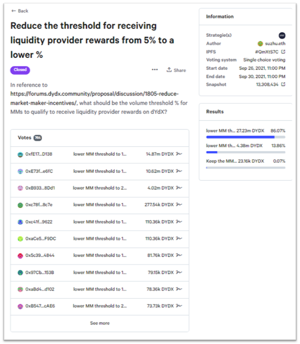

#### _如何对快照投票进行投票：_

* 用您的以太坊钱包在快照上注册，并遵循[此处](https://snapshot.org/#/dydxgov.eth)的dYdX提议。或者，您可以直接在[Commonwealth](https://forums.dydx.community/snapshot/dydxgov.eth)上投票并创建快照投票。

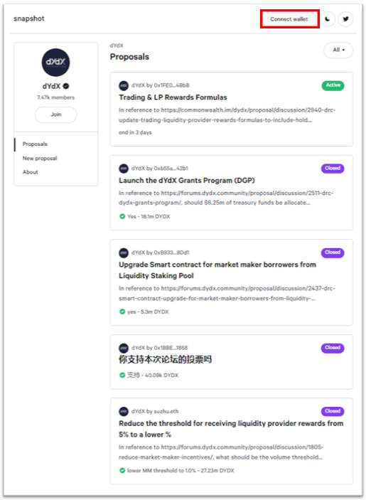

* 要查看有效的快照提议，请转到[快照](https://snapshot.org/#/dydxgov.eth)或[Commonwealth](https://forums.dydx.community/snapshot/dydxgov.eth)。

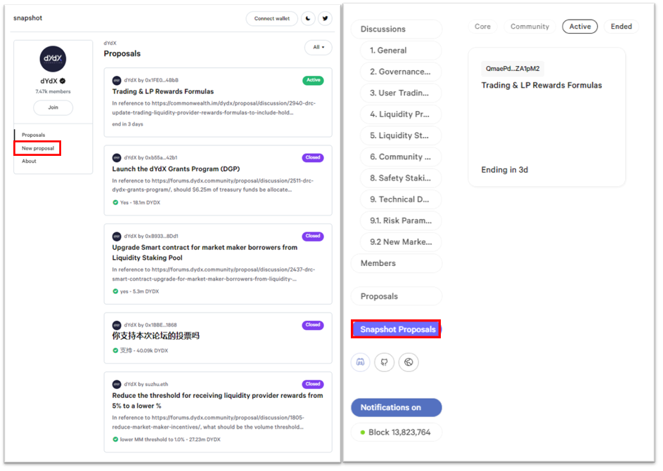

* 要对有效的快照投票进行投票，您需要在快照投票生效时在快照区块编号之前持有DYDX或将投票权委托给您的地址。

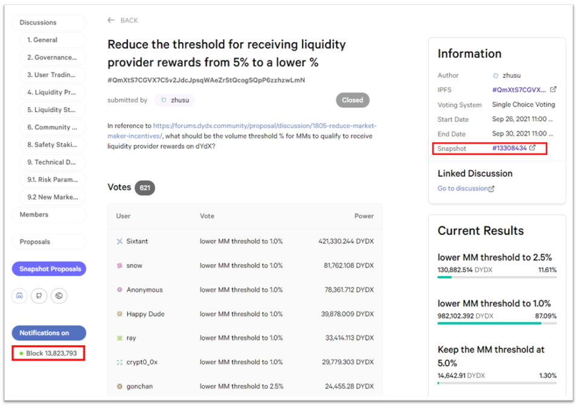

* 要进行投票，请点击提议并选择“是”或“否”，然后选择“投票”。

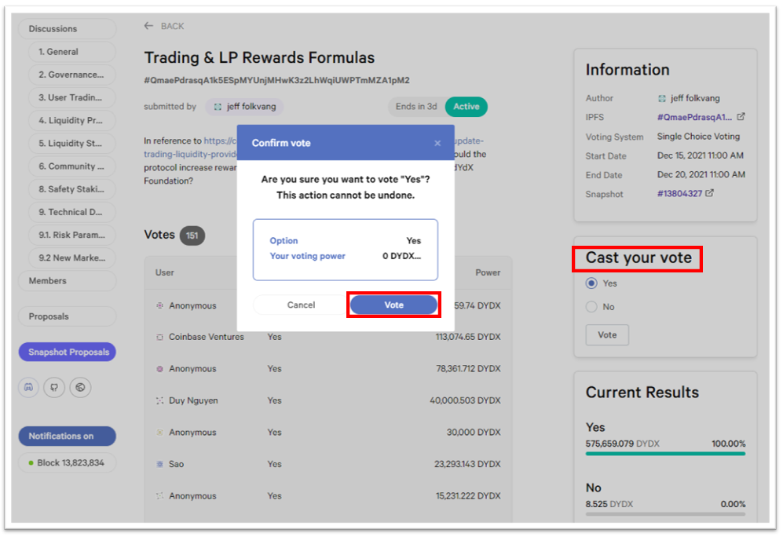

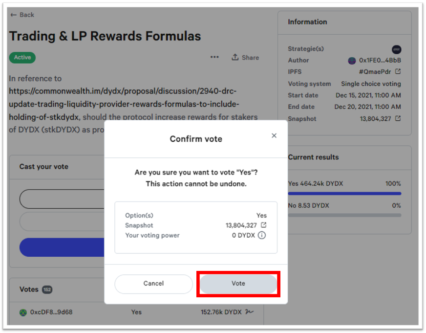

#### _如何在快照上创建投票：_

* 要创建快照投票，您需要至少持有 1 万个 DYDX 和/或将提议权委托给您用于创建提议的地址。
* 快照提议可以包含一个或多个操作，每个提议最多10个操作。操作是提议中指定的变更。
* 如果您符合最低 1 万提议权要求，请选择“新提议”并根据以下内容要求填写开放栏位。

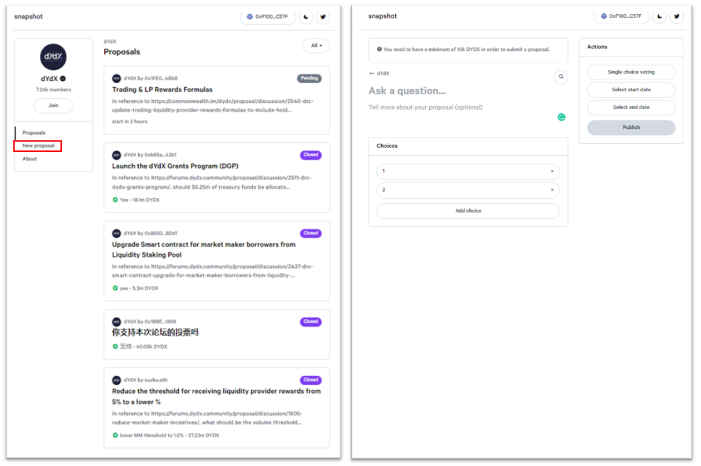

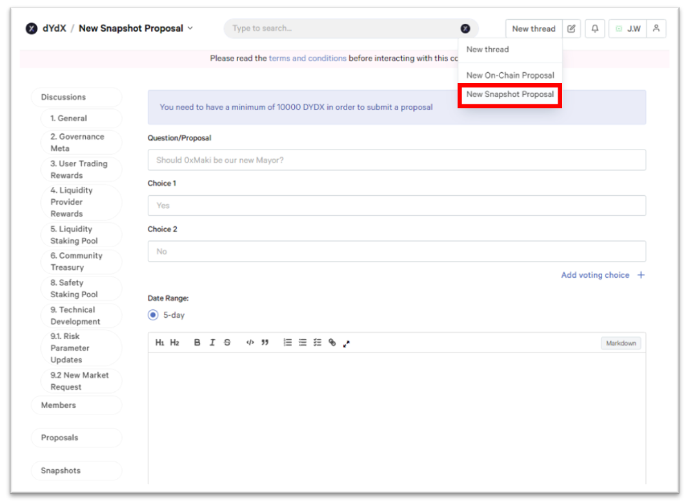

DRC快照投票内容要求：

* DRC的详情以及论坛讨论的链接，
* 投票系统，
* 从投票开始日期到投票结束日期的总长度设置为4天，以及
* 快照投票在投票开始前1天（\约6570个区块）发布。

具有约束力的快照投票的要求：

对于大多数决策，快照投票发挥着信号的作用，而变更智能合约的具有约束力的结果需要链上投票。对于不需要链上智能合约启动的决策，特别是对交易和流动性提供方奖励公式的变更，快照投票被视为具有约束力的最终投票。除了上述内容要求之外，对链下控制变量具有约束力的投票的快照投票必须包括：

* 二元投票选项。为清楚起见，一个地址要么投票赞成或投票反对提议。

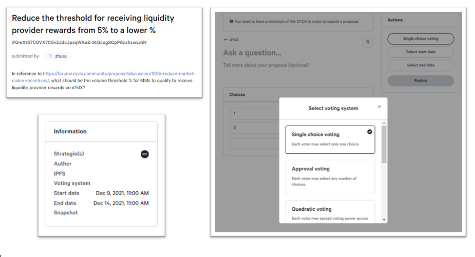

* 投票结束后，相关信息将存储在IPFS上，然后自动生成报告并可供下载。

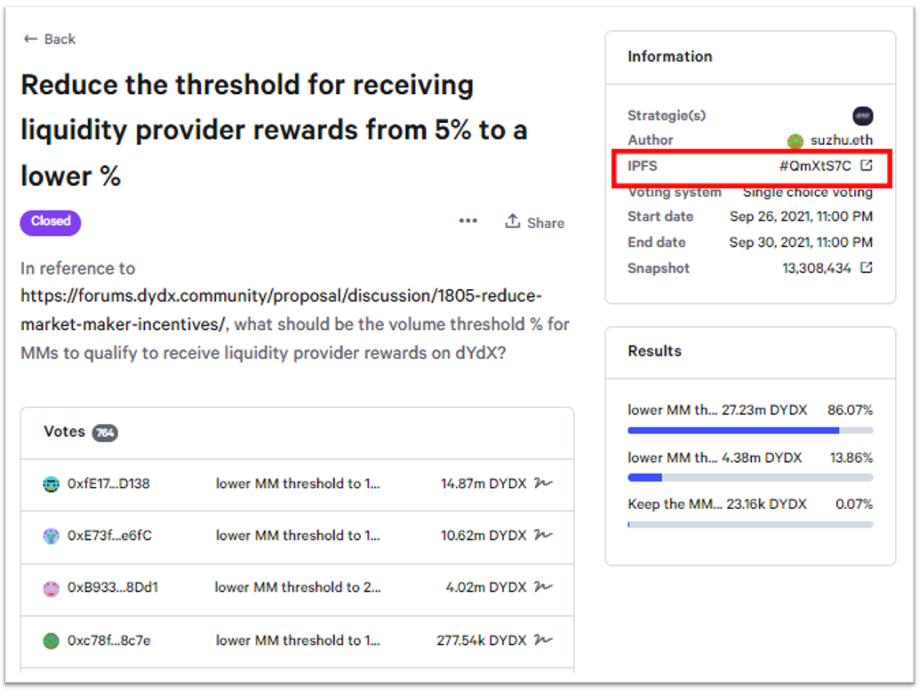

### **第3步 - DIP创建（链下提议）**

_**说明**：_

当(1)快照投票导致链下参数（例如，对交易奖励或LP奖励公式的修改）被更新以及 (2) 当社区成员想要提交修改链上智能合约的提议时，需要创建一个DIP。对于不需要任何链上智能合约更新的投票，快照投票的结果必须在链下DIP中正式化，并通过Pull Request提交给dYdX基金会Github的Pending-DIP分支。DIP应反映快照的胜利结果。DIP 必须指定[此处](https://github.com/dydxfoundation/dip/blob/master/DIP-X.md)链接的模板中包含的信息。

_**适用于DIP 2：**_

在这种情况下，[DIP](https://github.com/jteamdc/dip/blob/master/content/dips/DIP-2.md)由@Jteamdc编写。

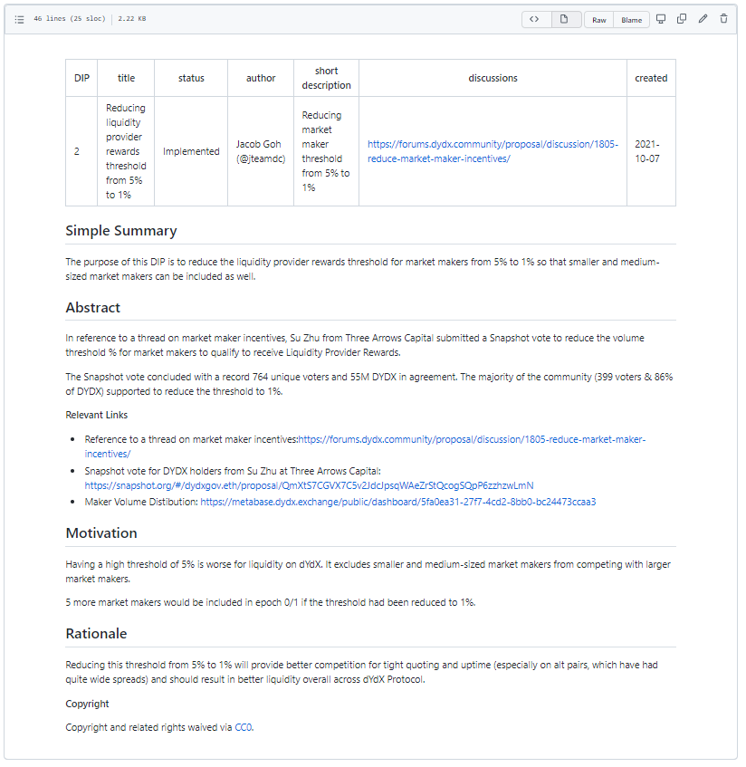

当 DIP 2 的提议草案完成后，@Jteamdc 从工作分支针对 dYdX 基金会的 Pending-DIP 分支创建了一个**** [Pull Request](https://github.com/dydxfoundation/dip/pull/8)。在dYdX基金会审核提议并签名后，来自Pending-DIP的变更被合并到主分支。

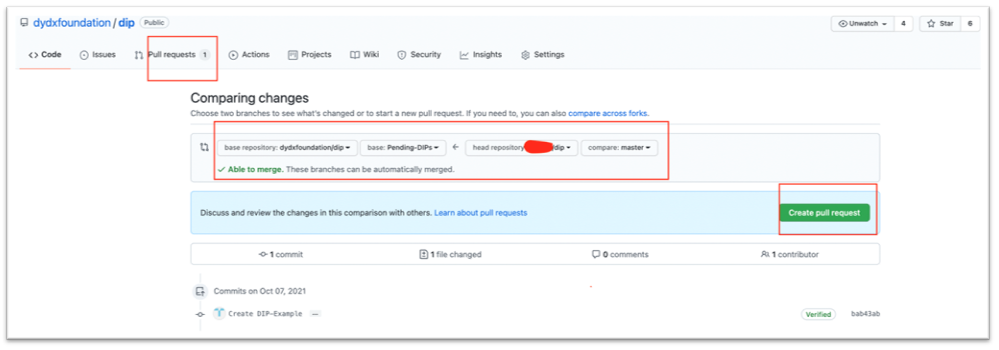

由于降低流动性提供方的奖励阈值不需要任何链上智能合约变更，因此该过程现已完成，变更将在下一个时段生效。

#### _如何创建DIP：_

* DIP应基于链下DIP在快照上投票的胜利结果，可以由一个或多个操作组成，每个提议最多可有10个操作。操作是提议中指定的变更。可以在[DIP创建](https://docs.dydx.community/dydx-governance/voting-and-governance/dip-proposal-lifecycle#6.-proposal-queuing-and-execution)中查阅更多信息。
* 注册 Github 帐户：[https://github.com/signup](https://github.com/signup)。
* 转到[此](https://github.com/dydxfoundation/dip)处链接的 dYdX 存储库页面，并在您的 Github 帐户下分叉存储库。

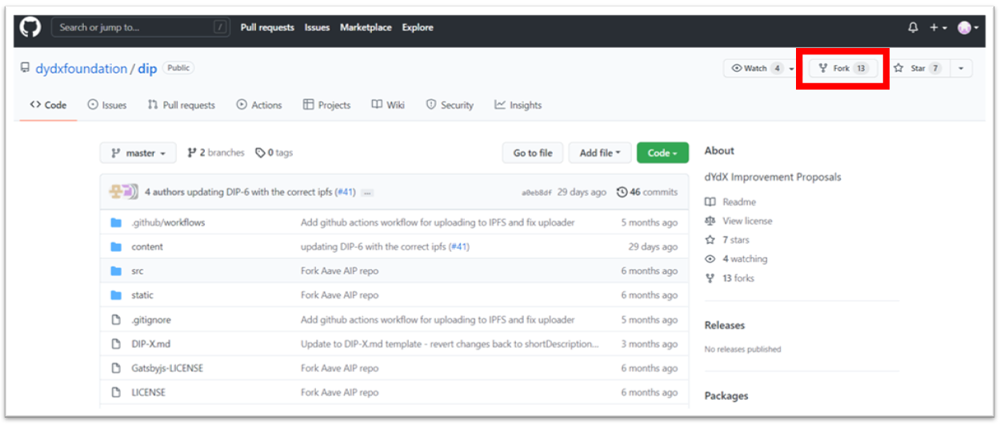

* 在分叉的DIP存储库中，转到包含DIP内容的目录：[https://github.com/\[user\_name\]/dip/tree/master/content/dips](https://github.com/yt8073/dip/tree/master/content/dips)。

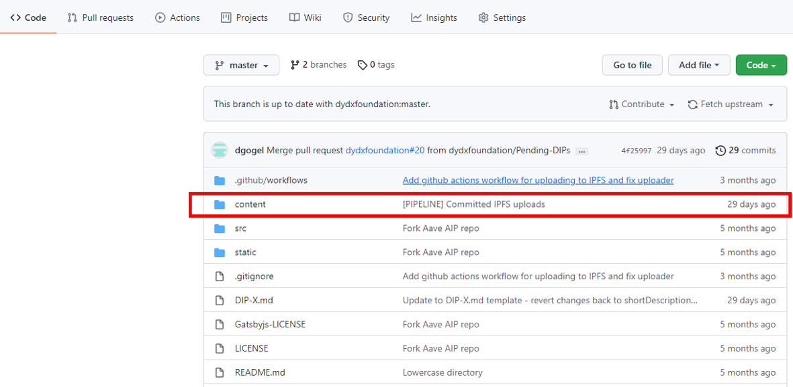

* 选择dips文件夹：[https://github.com/\[user\_name\]/dip/tree/master/content](https://github.com/Jwatts15/dip/tree/master/content)。

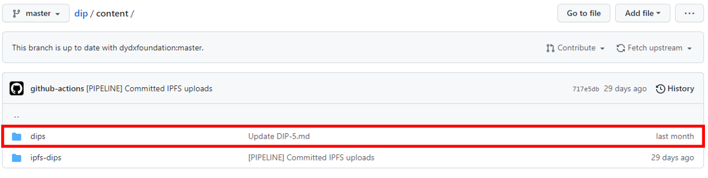

dips 文件夹包含一个先前提议的目录，这些提议遵循[此处](https://github.com/dydxfoundation/DIP/blob/master/DIP-X.md)链接的 DIP 模板。

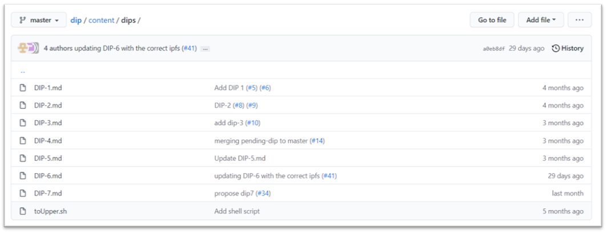

* 在开始起草提议之前，请确保您分叉的分支与主分支的最新版本是最新的。如果您使用的是旧版本的 DIP 存储库，请确认您的分叉版本是最新的，并带有最新的变更。如需帮助重新定位您的分叉版本，您可以按照以下步骤进行操作：[https://stackoverflow.com/questions/7929369/how-to-rebase-local-branch-onto-remote-master](https://stackoverflow.com/questions/7929369/how-to-rebase-local-branch-onto-remote-master)。
* 使用您的提议信息编辑[DIP模板](https://github.com/dydxfoundation/DIP/blob/master/DIP-X.md)。因为您不是管理员，所以如果您没有分叉DIP存储库，则选择编辑图标将自动从主分支分叉存储库。

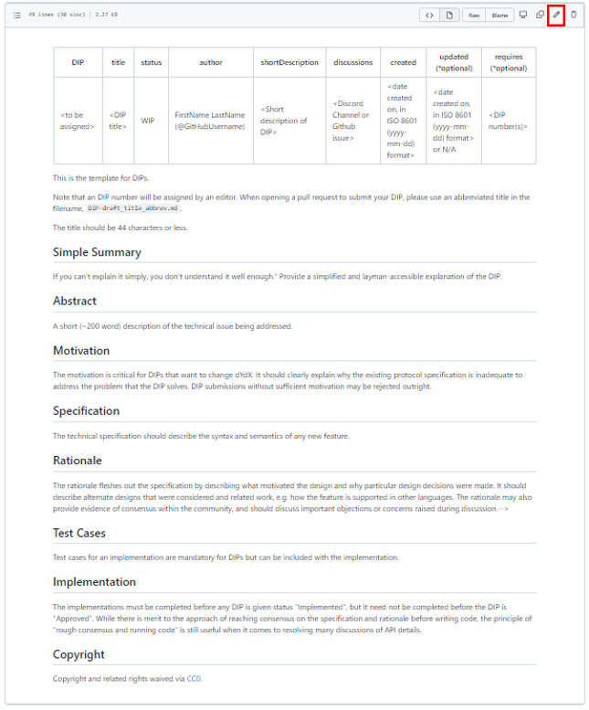

* 遵循[模板](https://github.com/dydxfoundation/DIP/blob/master/DIP-X.md)并将您的DIP添加到`content/dips/`目录中的存储库的分叉中。请遵循下面包含的DIP状态命名规范。

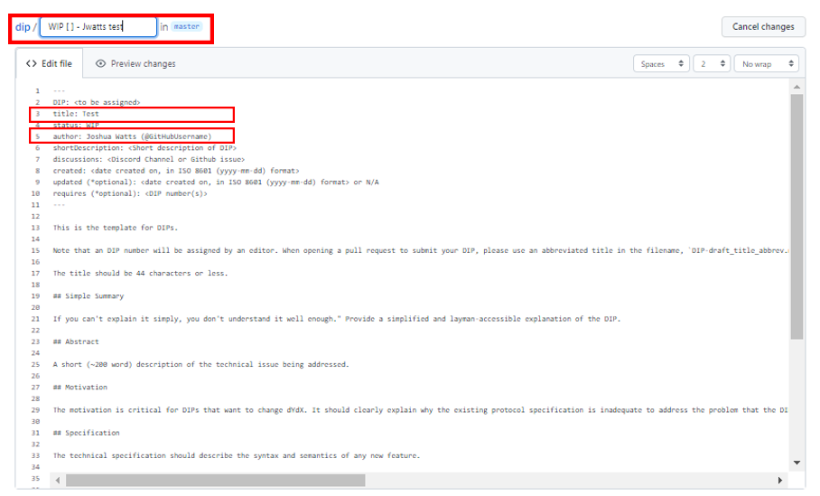

DIP状态：

* WIP - 仍在开发中的DIP。
* 已提议 - 准备在链上提议的DIP。
* 已批准 - 已被dYdX社区接受实施的DIP。
* 已实施 - 已发布到主网的DIP。
* 已拒绝 - 已被拒绝的DIP。
* 在检查所有内容是否正确之后，从您的工作分支针对dYdX基金会的Pending-DIP分支创建一个Pull Request。请**不要**针对dYdX基金会的主分支提交此Pull Request，因为如果任何外部方想要合并到主分支，IPFS作业将失败。请使用[此处](https://github.com/dydxfoundation/dip/pull/8)链接的Pull Request作为示例。

* 在审核之后，dYdX基金会将把Pending-DIP分支的变更合并到主分支。

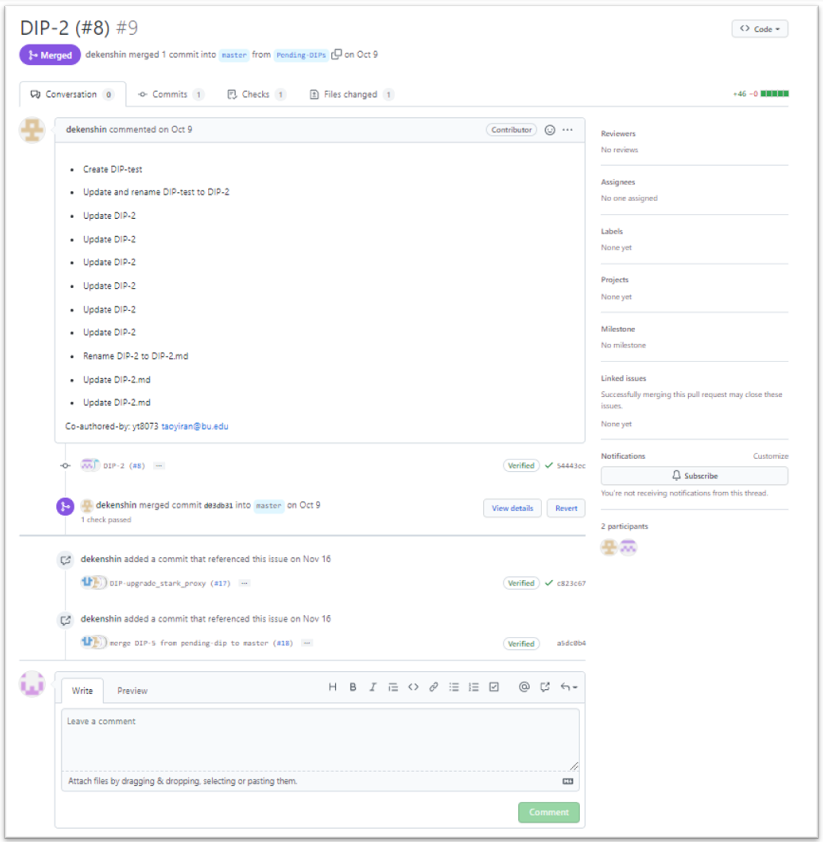

* 在**合并**之前，会自动运行一个作业将 DIP 上传到 IPFS。您可以在此处验证DIP到IPFS的上传：[https://github.com/dydxfoundation/dip/pull/9/checks](https://github.com/dydxfoundation/dip/pull/9/checks)。
* DIP被添加在[**`dip`**](https://github.com/dydxfoundation/dip)`/`[`content`](https://github.com/dydxfoundation/dip/tree/master/content)`/`**`dips`**`/`下。

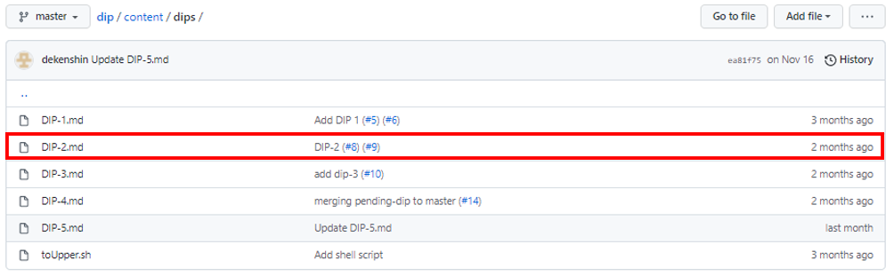

由于该提议不需要任何链上智能合约变更，因此该过程现已完成，变更将在下一个时段生效

## DIP 3（链上提议）- 保险模块恢复

_**摘要：**_

11 月 1 日，Paradigm 的 Dan Robinson 创建了一个链上 [DIP](https://dydx.community/dashboard/proposal/3)，以恢复保险模块质押池的功能。社区的大多数人（251名投票者和近1.42亿个DYDX）投票赞成恢复保险模块的功能。经过10天的投票期后，社区成员花了将近3天的时间才启动队列，并将提议移至长达7天的时间锁延迟。11 月 20 日，保险模块恢复并重置为纯净状态。

_**背景：**_

dYdX保险模块是一种质押合约，旨在引导分散去中心化的资金池，其可用于支持dYdX协议。用户将DYDX质押到安全池中并获得stkDYDX (1:1)。stkDYDX是作为ERC-20转移的代币化头寸，其具有与DYDX相同的投票权和提议权。如果发生资金缺口事件，则需要进行治理投票以削减质押的DYDX，从而减轻损失。在DYDX代币供应中，2.5%（25,000,000个DYDX）的代币供应将分配给在保险资金质押池中质押DYDX的用户。可以在[此处](https://dydx.foundation/blog/en/safety-staking)找到有关保险资金质押池的更多信息。

作为[保险资金质押池奖励](https://docs.dydx.community/dydx-governance/staking-pools/safety-staking-pool)的一部分，每个时段（28天）将向质押人分配383,562个DYDX。每秒按比例将奖励分配给质押人。

dYdX社区对保险模块智能合约的参数具有“直接和不可撤销的控制权”。社区控制的参数的完整列表，请点击[此处](https://docs.dydx.community/dydx-governance/voting-and-governance/governance-parameters)访问链接。

中国时间 9 月 8 日晚上 11:00，解除了对 DYDX 代币的转移限制，并有效地开放了对 dYdX 保险模块的质押。在将近1小时的时间里，超过50个不同的地址质押了大约157K DYDX。一个漏洞导致部署过程中出现错误，并且没有任何stkDYDX被发送至已向保险模块中进行质押的地址。因此，每个质押人的资金都冻结在了合约中，并且dYdX团队在dYdX治理UI上禁用了质押。

[DIP 1](https://dydx.community/dashboard/proposal/0)提议恢复保险模块的功能，允许受影响的地址收回其资金，并且获得额外10%的质押代币作为补偿以使他们得到弥补。虽然社区情绪强烈支持[ DIP 1 - 保险模块恢复和质押人恢复](https://dydx.community/dashboard/proposal/0)，但该提议已失败，因为它没有达到长时间锁投票通过所需的 1 亿个 DYDX 最低法定人数。因此，DeFiance Capital 的 Jacob Goh (jteam0x) 创建了[DIP 4 - 保险模块质押人赔付和补偿](https://dydx.community/dashboard/proposal/2)，用于赔付和补偿受影响地址错过的奖励和造成的不便。[DIP 4](https://dydx.community/dashboard/proposal/2)涉及为用户质押代币部署恢复合约，并从奖励资金库中向受影响的地址额外补偿10%。DIP由短时间锁的不太严格的治理参数进行治理。

DIP的提议生命周期在DIP创建之前通常是一致的。DIP 3（链上）和DIP 2（链下）的主要区别在于DIP 3需要链上投票和智能合约部署。由于论坛讨论、DRC创建和DIP草案创建的过程是相同的，我们从起草链上DIP的内容要求开始逐步讨论。如需了解更多信息，请点击以下链接：

* dYdX的治理流程 - [https://docs.dydx.community/dydx-governance/voting-and-governance/dip-proposal-lifecycle](https://docs.dydx.community/dydx-governance/voting-and-governance/dip-proposal-lifecycle)。
* 保险模块事故报告 - [https://dydx.foundation/blog/en/outage-1](https://dydx.foundation/blog/en/outage-1)。
* 链下论坛讨论 **-** [https://commonwealth.im/dydx/proposal/discussion/1743-safety-staking-pool-on-pause](https://commonwealth.im/dydx/proposal/discussion/1743-safety-staking-pool-on-pause)。
* 链下DRC **-** [https://commonwealth.im/dydx/proposal/discussion/1770-drc-incident-report-of-the-safety-module-outage-proposed-solution](https://commonwealth.im/dydx/proposal/discussion/1770-drc-incident-report-of-the-safety-module-outage-proposed-solution)
* 链下DRC快照投票 **-** [https://snapshot.org/#/dydxgov.eth/proposal/QmbJ5QxHr1pyShKTDaF5DjAr6vxQn8DVxshH2fyWgzDCBn](https://snapshot.org/#/dydxgov.eth/proposal/QmbJ5QxHr1pyShKTDaF5DjAr6vxQn8DVxshH2fyWgzDCBn)
* Github上提议的DIP **-** [https://github.com/dydxfoundation/dip/blob/master/content/dips/DIP-3.md](https://github.com/dydxfoundation/dip/blob/master/content/dips/DIP-3.md)

### **第1步 - 起草链上DIP**

_**说明：**_

起草影响dYdX协议治理共识的链上DIP，必须概述实施智能合约变更的具体步骤。在社区从快照或之前失败的DIP达成粗略共识后，具有足够提议权的社区成员可以提交新的链上DIP。有关提议权阈值、时间锁执行器和其他治理参数的更多信息，请点击[此处](https://docs.dydx.community/dydx-governance/voting-and-governance/governance-parameters)访问链接。

_**适用于DIP 3：**_

在这种情况下，[DIP](https://github.com/dydxfoundation/dip/blob/master/content/dips/DIP-3.md)由Paradigm的Dan Robinson编写。鉴于该提议包括链上智能合约变更，该提议包含一个指向特定智能合约实施的链接。

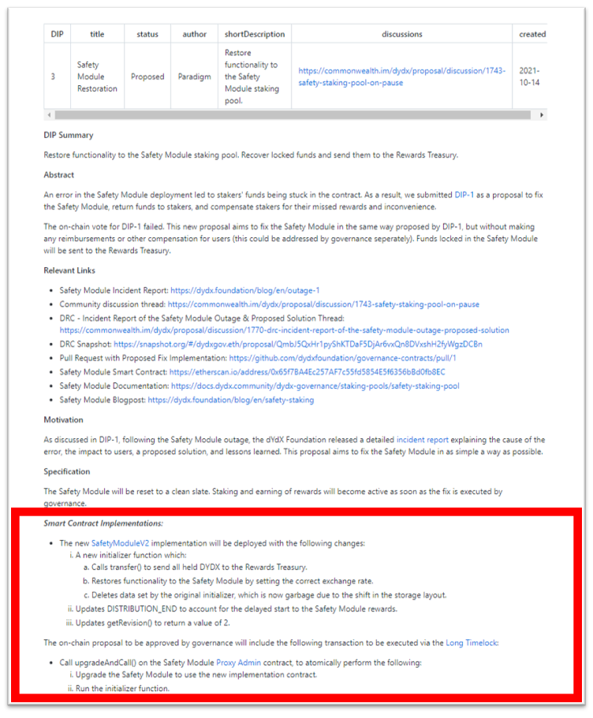

从SafetyModuleV2.sol部署合约导航到Safety文件夹会显示自述文件，其中包含有关如何实施提议的详细情况。

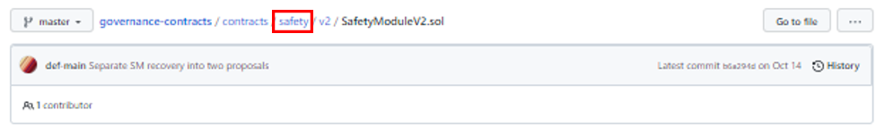

关于实施自述文件中包含的提议的步骤，请点击此处链接：[https://github.com/dydxfoundation/governance-contracts/tree/master/contracts/safety](https://github.com/dydxfoundation/governance-contracts/tree/master/contracts/safety)。

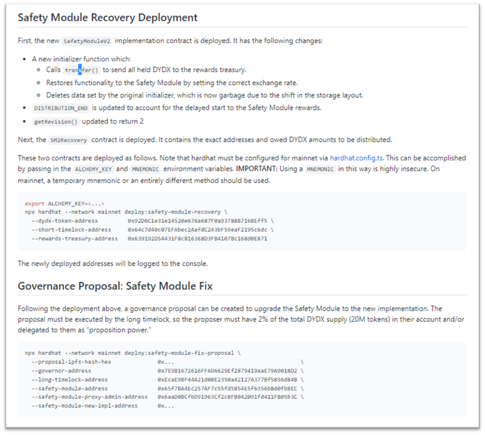

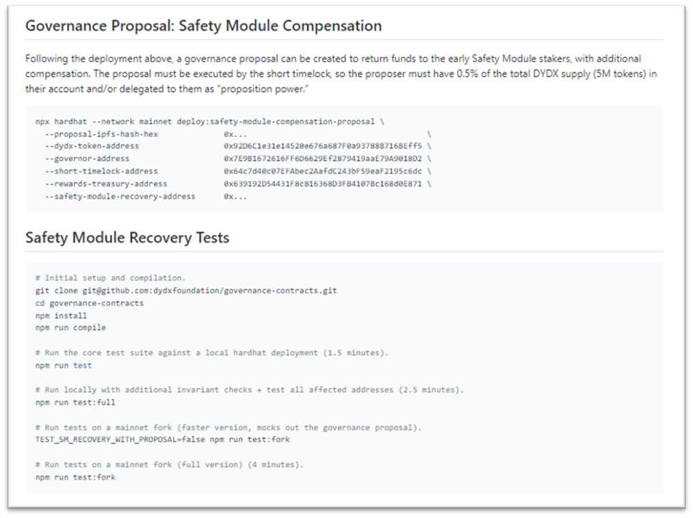

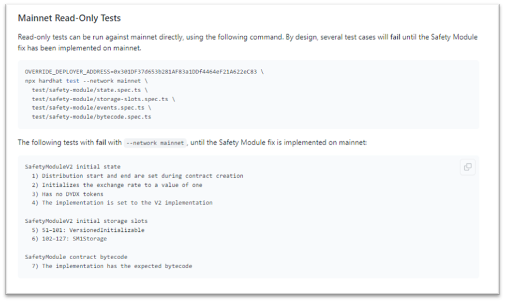

#### _如何起草链上DIP (WIP)：_

* 创建一个新钱包以创建DIP。部署过程需要输入助记词作为环境变量，因此我们建议您使用一次性钱包进行链上DIP创建。
* 将足够的提议权委托给一次性钱包以创建DIP。您可以在[此处](https://dydx.community/dashboard)委托提议权。下面包括不同的提议权阈值，请点击[此处](https://docs.dydx.community/dydx-governance/voting-and-governance/governance-parameters)访问链接。
  * 短时间锁：总供应量的 0.5%（500 万的提议权）。
  * Starkware 执行器：总供应量的 0.5%（500 万的提议权）。
  * 长时间锁执行器：总供应量的 2.0%（2 千万的提议权）。
  * Merkle Pauser 执行器：总供应量的 0.5%（500 万的提议权）。
* 创建Alchemy密钥。使用Alchemy密钥，您无需运行以太坊节点即可与以太坊进行交互并部署智能合约。关于创建Alchemy密钥的指南，请点击[此处](https://docs.alchemy.com/alchemy/introduction/getting-started)访问链接。

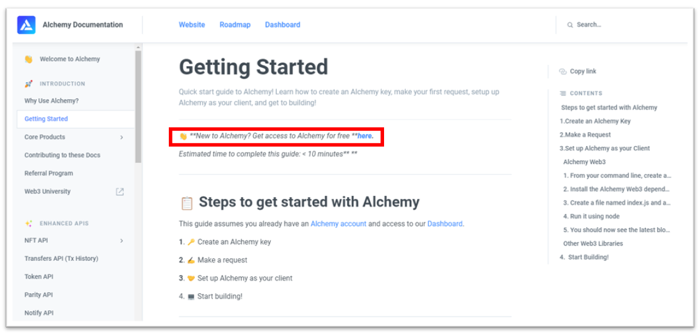

选择以太坊和“开始”。

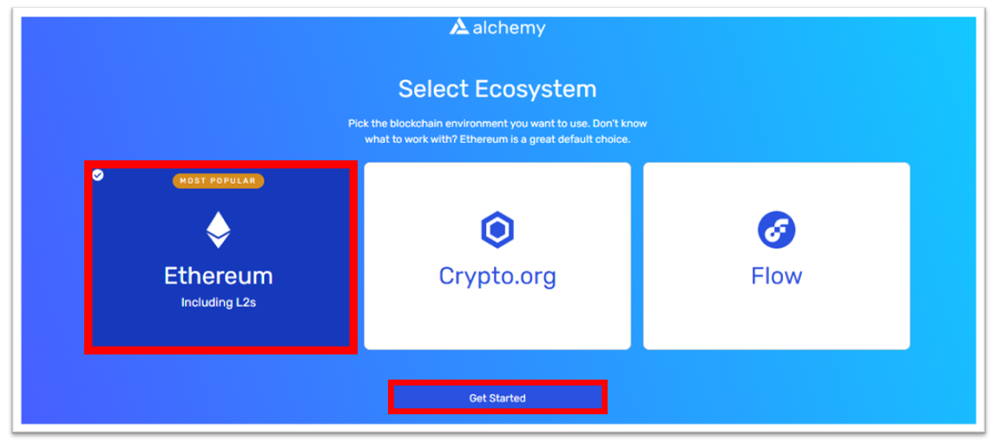

填写所需信息，选择 Goerli Network 并选择“创建应用程序”。

<figure>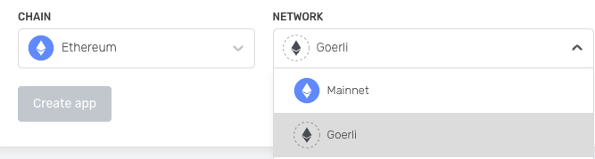<figcaption></figcaption></figure>

在创建帐户之后，请按照[此处](https://docs.alchemy.com/alchemy/introduction/getting-started)链接的设置说明进行操作。

在“4. 开始构建”中，选择“尝试部署您的第一个智能合约”并按照指南进行操作。

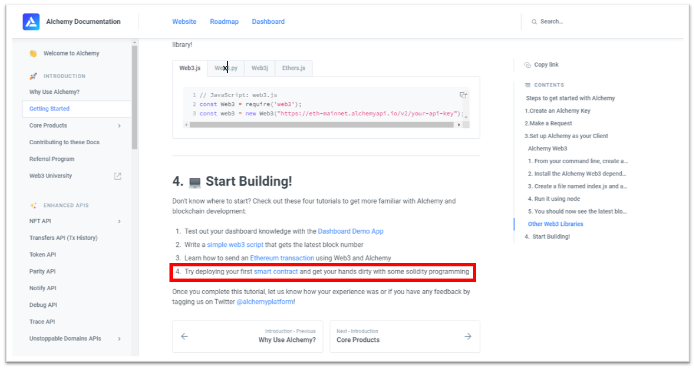

* 打开Windows命令行，默认Terminal应用程序，或下载iTerm：[https://iterm2.com/](https://iterm2.com/)。
* 如果您尚未下载并安装Node.js和npm，请访问以下链接进行操作：[https://docs.npmjs.com/downloading-and-installing-node-js-and-npm](https://docs.npmjs.com/downloading-and-installing-node-js-and-npm)。
* Hardhat是一种用于编译和测试以太坊软件的开发工具。如果您还没有安装Hardhat，请访问以下链接进行操作：[https://hardhat.org/tutorial/setting-up-the-environment.html](https://hardhat.org/tutorial/setting-up-the-environment.html)。
* 起草您提议的智能合约实施方案。
* IPFS哈希是自动生成的，并且可以在[此处](https://github.com/dydxfoundation/dip/tree/master/content/ipfs-dips)获取。IPFS哈希将位于文件名`DIP-[New DIP #]-ipfs-hashes.json`下的dYdX基金会目录中。

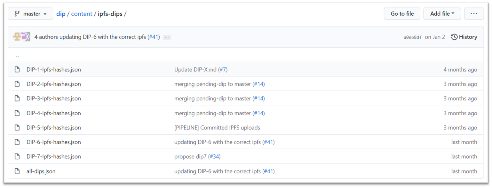

* 在选择新文件 (`DIP-[New DIP #]-ipfs-hashes.jso`) 之后，请确保使用 encodedHash。

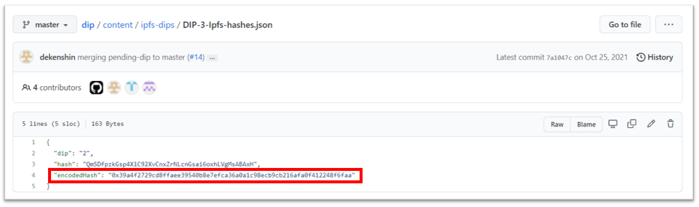

### **第2步 - 提交链上DIP**

_**说明：**_

在社区成员确认提议的智能合约实施是正确的并且DIP最终确定之后，可以在链上提交DIP。在创建链上DIP之后，提议进入“待定”状态，投票延迟持续约1天（约6570个区块）。投票延迟后记录用户快照，以计入DYDX持股和委托投票权。接下来，提议进入“活动”状态，根据提议类型的不同，投票时限为2-10天不等。对于要实施的提议，投票必须通过因提议类型而不同的最低法定人数和最低投票差值。如果DIP满足最低法定人数和最低投票差值，并且大多数投票社区成员投票支持DIP，则任何地址都可以调用排队方法将提议移至时间锁队列。时间锁合约可以排队、取消或执行由dYdX社区投票决定的交易。时间锁队列的长度取决于提议的类型。

_**适用于DIP 3：**_

Paradigm 团队最终确定了 `SafetyModuleV2.sol` 的 Solidity 代码。

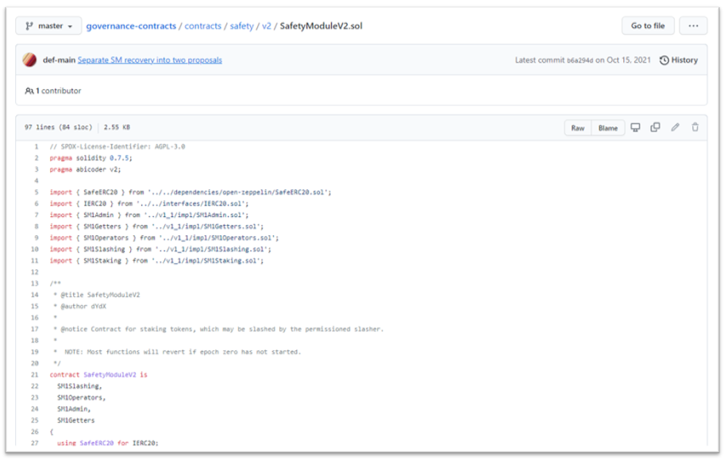

Paradigm团队在本地和分叉的主网环境中模拟了更新。然后运行测试套件，以确保在主网上执行治理提议后恢复全部功能。

Paradigm团队通过运行以下脚本来部署智能合约更新。

**保险模块恢复部署**

`导出 ALCHEMY_KEY=<...>`

`导出 MNEMONIC=<...>`

`npx hardhat --network mainnet deploy:safety-module-recovery`\
`--dydx-token-address 0x92D6C1e31e14520e676a687F0a93788B716BEff5`\
`--short-timelock-address 0x64c7d40c07EFAbec2AafdC243bF59eaF2195c6dc`\
`--rewards-treasury-address 0x639192D54431F8c816368D3FB4107Bc168d0E871`

**治理提议：保险模块修复**

`导出 ALCHEMY_KEY=<...>`

`导出 MNEMONIC=<...>`

`npx hardhat --network mainnet deploy:safety-module-fix-proposal`\
`--proposal-ipfs-hash-hex 0x...`\
`--governor-address 0x7E9B1672616FF6D6629Ef2879419aaE79A9018D2`\
`--long-timelock-address 0xEcaE9BF44A21d00E2350a42127A377Bf5856d84B`\
`--safety-module-address 0x65f7BA4Ec257AF7c55fd5854E5f6356bBd0fb8EC`\
`--safety-module-proxy-admin-address 0x6aaD0BCfbD91963Cf2c8FB042091fd411FB05b3C`\
`--safety-module-new-impl-address 0x...`

**治理提议：保险模块补偿**

`导出 ALCHEMY_KEY=<...>`

`导出 MNEMONIC=<...>`

`npx hardhat --network mainnet deploy:safety-module-compensation-proposal`\
`--proposal-ipfs-hash-hex 0x...`\
`--dydx-token-address 0x92D6C1e31e14520e676a687F0a93788B716BEff5`\
`--governor-address 0x7E9B1672616FF6D6629Ef2879419aaE79A9018D2`\
`--short-timelock-address 0x64c7d40c07EFAbec2AafdC243bF59eaF2195c6dc`\
`--rewards-treasury-address 0x639192D54431F8c816368D3FB4107Bc168d0E871`\
`--safety-module-recovery-address 0x...`

DIP同时发布在[https://dydx.community/dashboard](https://dydx.community/dashboard)上。

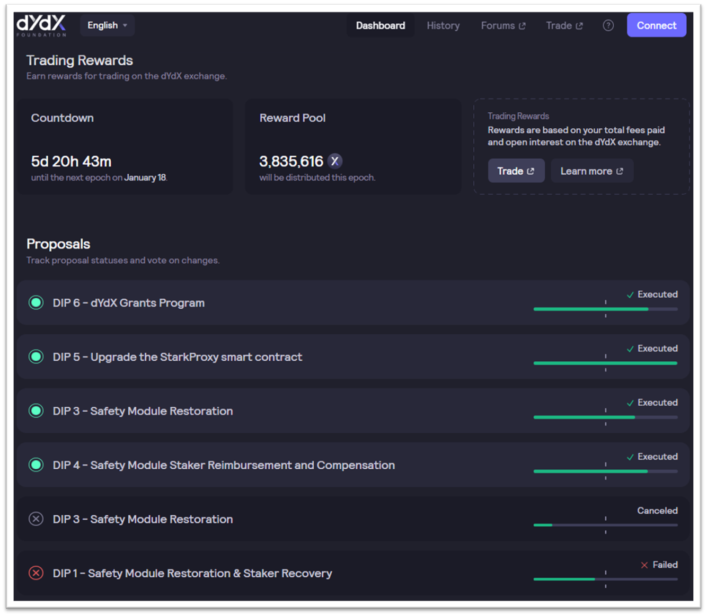

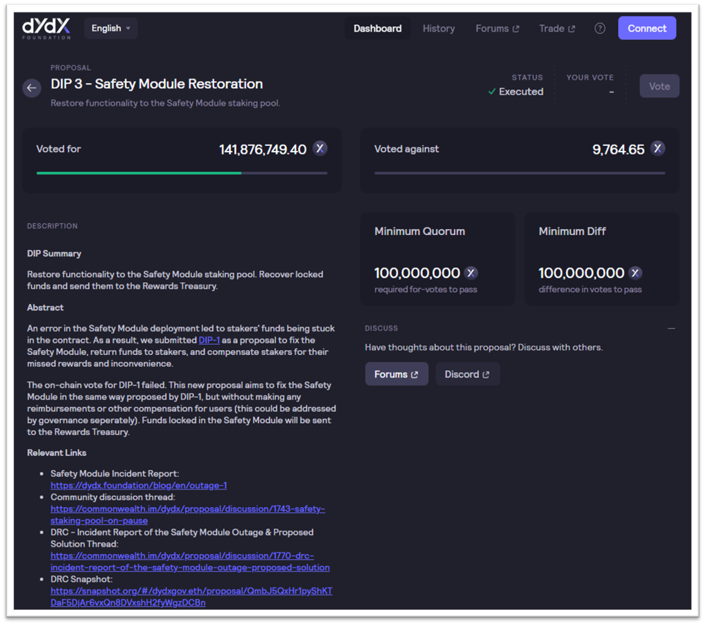

dYdX治理合约为0x7e9b1672616ff6d6629ef2879419aae79a9018d2：[https://etherscan.io/txs?a=0x7e9b1672616ff6d6629ef2879419aae79a9018d2\&p=10](https://etherscan.io/txs?a=0x7e9b1672616ff6d6629ef2879419aae79a9018d2\&p=10)。

DIP部署可以在Etherscan上确认：[https://etherscan.io/tx/0x5f2472e7dfcbf50628d29c94f97a072f3c19177f66cde4cca9f376c7934af5ad](https://etherscan.io/tx/0x5f2472e7dfcbf50628d29c94f97a072f3c19177f66cde4cca9f376c7934af5ad)。

DIP 于 2021 年 11 月 1 日在区块 13532376 创建。对于之后的 6570 个区块，DIP 状态为“待定”。

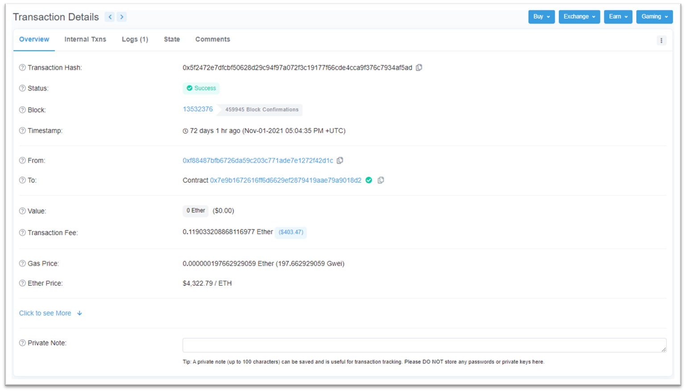

当DIP在区块13538946转换为“活动”状态时，DYDX持有者能够对DIP进行投票。

第一次投票于世界标准时间 2021 年 11 月 2 日下午 5:51:22 进行（区块 13538959），距离 DIP 在链上创建时有 6583 个区块。

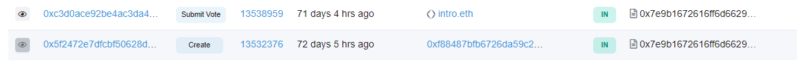

在与长时间锁相关的10天投票期结束后，任何社区成员都可以启动队列，并将提议移至7天的时间锁延迟。对于DIP 3，社区成员需要将近3天的时间才能启动队列。

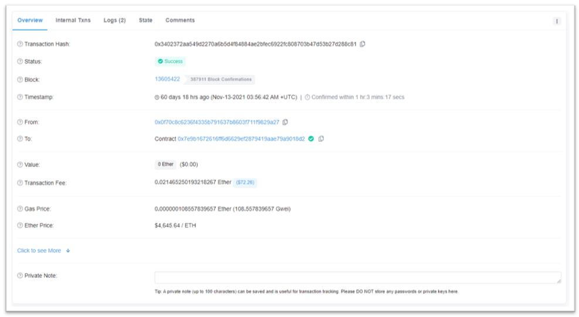

在7天的时间锁延迟之后，DIP在链上执行。

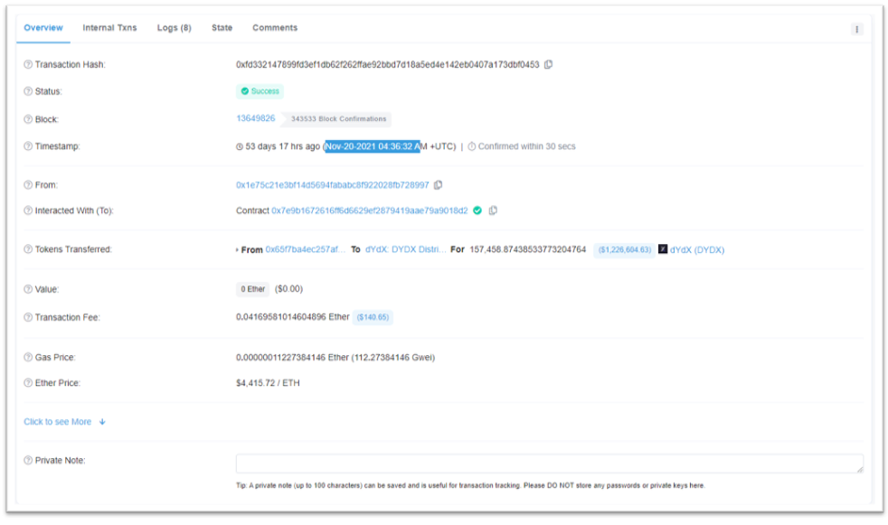

当 DIP 在链上执行时，[https://dydx.community/dashboard/proposal/3](https://dydx.community/dashboard/proposal/3) 上的 DIP 状态被更新为“已执行”。

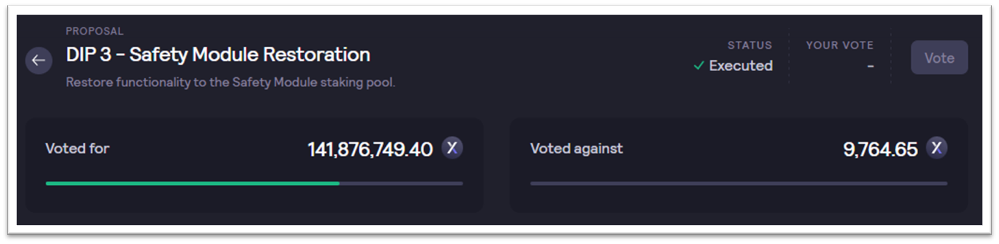

请注意，(1) 提议必须在时间锁延迟后立即开始的7天执行宽限期内执行；(2) 提议地址必须保持相应时间锁合约要求的最低提议权数量，直到 DIP 被执行（5 百万或2 千万的提议权）。

#### _如何提交链上DIP：_

* 确保您有足够的提议权来创建DIP。可以在[DIP创建](https://docs.dydx.community/dydx-governance/voting-and-governance/dip-proposal-lifecycle)中查阅更多信息。
  * 短时间锁执行器：总供应量的 0.5%（500 万的提议权）。
  * Starkware 执行器：总供应量的 0.5%（500 万的提议权）。
  * 长时间锁执行器：总供应量的 2.0%（2 千万的提议权）。
  * Merkle Pauser 执行器：总供应量的 0.5%（500 万的提议权）。
* 确保钱包中有ETH来支付gas费。
* 在Alchemy上为以太坊主网网络创建一个应用程序。

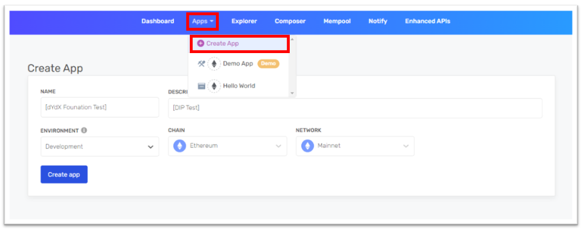

* 创建应用程序后，点击“查看密钥”获取您的Alchemy密钥(7LOaQtguSm2kSEcFXQH88B)：[https://eth-mainnet.alchemyapi.io/v2/7LOaQtguSm2kSEcFXQH88B-EN\_K7t\_ul](https://eth-mainnet.alchemyapi.io/v2/7LOaQtguSm2kSEcFXQH88B-EN\_K7t\_ul)。

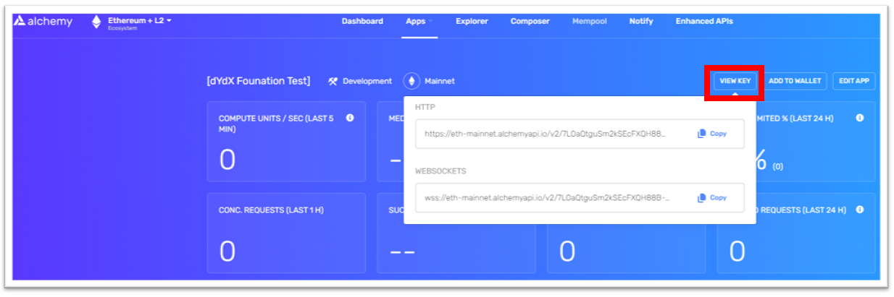

* 下载并安装Node.js和npm：[https://docs.npmjs.com/downloading-and-installing-node-js-and-npm](https://docs.npmjs.com/downloading-and-installing-node-js-and-npm)。
* 安装Hardhat：[https://hardhat.org/tutorial/setting-up-the-environment.html](https://hardhat.org/tutorial/setting-up-the-environment.html)。
* 运行您起草的脚本。
* 检查治理合约以验证提议是否在链上创建：[https://etherscan.io/txs?a=0x7e9b1672616ff6d6629ef2879419aae79a9018d2\&p=10](https://etherscan.io/txs?a=0x7e9b1672616ff6d6629ef2879419aae79a9018d2\&p=10)。
* 使用提交提议的地址，您必须保持相应时间锁合约所需的最低提案权，直到提议被执行。

#### _如何对DIP进行投票：_

* 确保钱包中有ETH来支付gas费。
* 您可以通过从[https://dydx.community/dashboard](https://dydx.community/dashboard)中选择DIP来对活动的DIP进行投票。

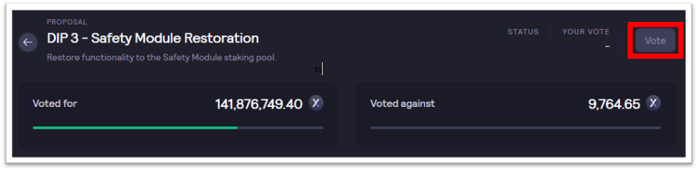

* 将来，您还可以对Commonwealth中活动的DIP进行投票。

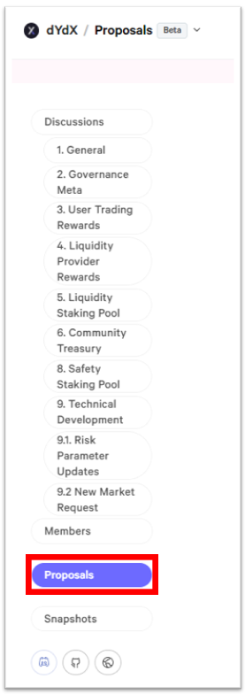

投票时限取决于提议的类型。可以在[DIP创建](https://docs.dydx.community/dydx-governance/voting-and-governance/dip-proposal-lifecycle)中查阅更多信息。

* 短时间锁执行器：4天。
* Starkware执行器：4天。
* 长时间锁执行器：10天。
* Merkle Pauser执行器：2天。

#### _如何对提议进行排队：_

成功的提议可以排队以启动时间锁延迟。

* 确保您使用的是包含ETH的兼容钱包。
* 转至 Etherscan 上的“合约”选项卡，然后点击“编写合约”。请点击[此处](https://etherscan.io/address/0x7e9b1672616ff6d6629ef2879419aae79a9018d2#writeContract)，访问治理合约链接。

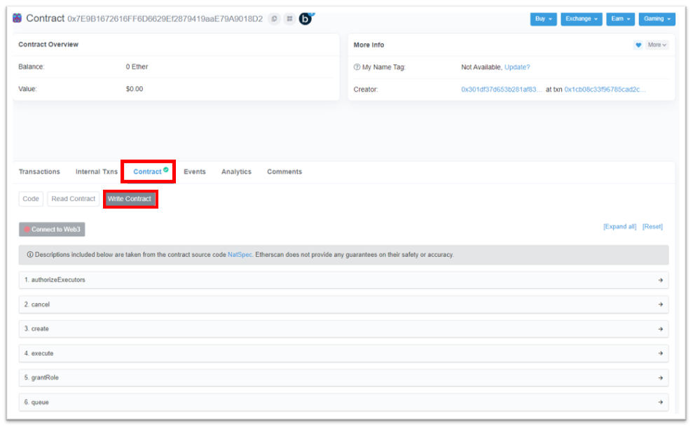

* 选择队列并提交 “proposalId”。

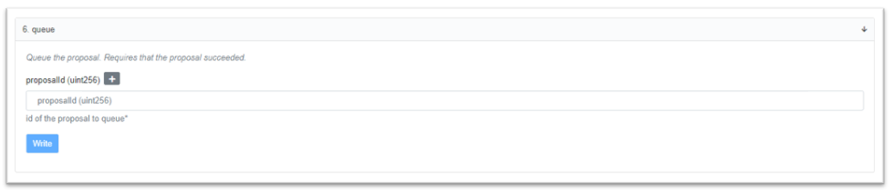

创建DIP时，可以在Etherscan上找到“proposalId”：[https://etherscan.io/tx/0x5f2472e7dfcbf50628d29c94f97a072f3c19177f66cde4cca9f376c7934af5ad](https://etherscan.io/tx/0x5f2472e7dfcbf50628d29c94f97a072f3c19177f66cde4cca9f376c7934af5ad)。

* 选择“点击以查看更多”。

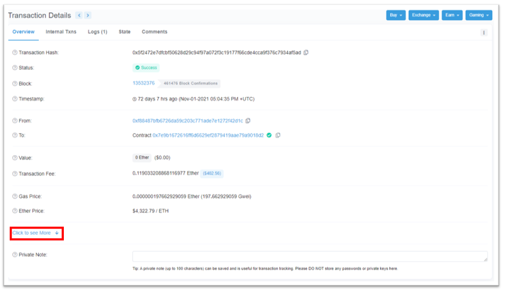

* 选择“解码输入数据”。

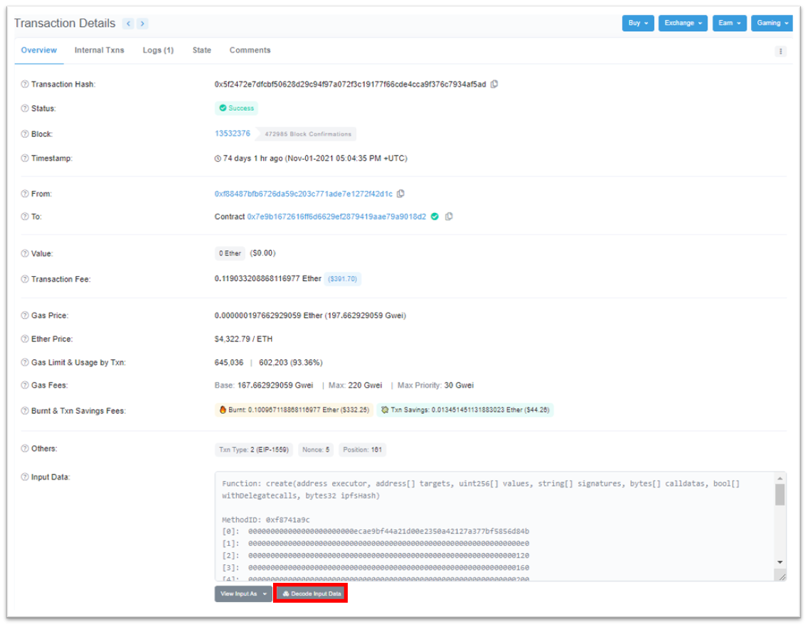

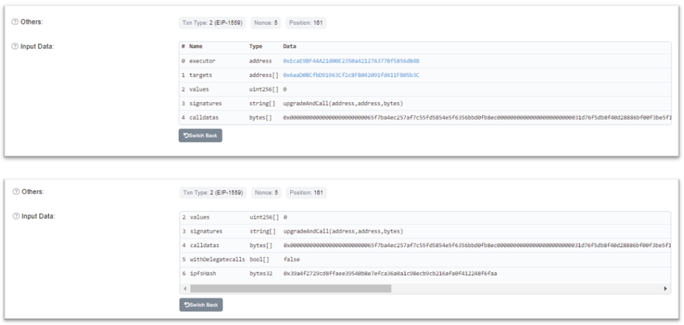

#### _如何执行提议：_

在时间锁延迟之后，可以执行成功的提议。

* 转至 Etherscan 上的“合约”选项卡，然后点击“编写合约”。请点击[此处](https://etherscan.io/address/0x7e9b1672616ff6d6629ef2879419aae79a9018d2#writeContract)，访问治理合约链接。

* 选择“执行”并提交 “proposalId”。

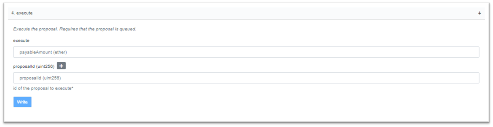

* 按照上述步骤（在_如何对提议进行排队_中）找到 “proposalId”。
* 在 “payableAmount (ether)” 下输入 “0”。
