# 거버넌스 가이드

dYdX Foundation은 dYdX 커뮤니티의 dYdX 거버넌스 프로세스의 이해를 돕기 위해 이 가이드를 만들었습니다. 본 가이드는 다음의 단계별 개요를 제공합니다.

* [포럼 토론(오프체인)](governance-guide.md#step-1-forum-discussions-drc-creation-off-chain-and-drc-feedback)
* [DRC 생성(오프체인)](governance-guide.md#step-1-forum-discussions-drc-creation-off-chain-and-drc-feedback)
* [스냅샷 여론조사 생성(오프체인)](governance-guide.md#step-2-drc-snapshot-polling-off-chain)
* [스냅샷 여론조사 투표](governance-guide.md#how-to-vote-on-a-snapshot-poll)
* [DIP 생성(오프체인)](governance-guide.md#step-3-dip-creation-off-chain-proposal)
* [DIP 생성(온체인)](governance-guide.md#step-1-on-chain-dip-drafting)
* [DIP 투표(온체인)](governance-guide.md#how-to-vote-on-a-dip)
* [DIP 대기열 생성(온체인](governance-guide.md#how-to-queue-a-proposal)
* [DIP 실행(온체인)](governance-guide.md#how-to-execute-a-proposal)

본 가이드에 소개된 두 가지 예시는 _DIP 2(오프체인 제안) - 유동성 제공자 보상 기준 감소_ 및 _DIP 3(온체인 제안) - 안전 모듈 복원_.

## DIP 2(오프체인 제안) - 유동성 제공자 보상 기준 감소

_**요약:**_

에폭 6에 dYdX 커뮤니티는 마켓 메이커에 대한 LP 보상 거래량 기준을 1%에서 0.25%로 낮추기로 [Snapshot](https://commonwealth.im/dydx/snapshot/dydxgov.eth/0x785066561be1e5d170eb28960da5ef2643ee0d0c3d590fd797c028512cc6be43)에서 투표했습니다. 에폭 2에서의 LP 보상 기준 감소(5%에서 1%로 감소)는 에폭 6(1%에서 0.25%로 감소) 감소와 동일한 프로세스를 따랐습니다. LP 보상 거래량 기준을 5%에서 1%로 낮추기 위한 단계별 개요는 아래에 포함되어 있습니다.

커뮤니티의 대다수(399명의 투표자 및 DYDX의 86%)는 유동성 제공자 보상 기준을 획득하기 위한 거래량 기준을 5%에서 1%로 감소시키기 위해 [스냅샷](https://forums.dydx.community/snapshot/dydxgov.eth/QmXtS7CGVX7C5v2JdcJpsqWAeZrStQcogSQpP6zzhzwLmN)에서 투표했습니다. 시장 조성자를 위한 유동성 제공자 보상 거래량 기준을 5%에서 1%로 감소시키기 위한 [오프체인 DIP는](https://github.com/dydxfoundation/dip/blob/master/content/dips/DIP-2.md) DeFiance Capital에서 Jacob Goh(jteam0x)가 제출하였습니다. 에폭 2에서 1%의 기준을 충족한 시장 조성자는 에폭 3에서 유동성 제공자 보상을 받을 자격이 주어졌습니다. 해당 제안은 다른 온체인 스마트 계약 변경을 요구하지 않았습니다.

_**배경:**_

유동성 제공자 [보상 프로그램의](https://docs.dydx.community/dydx-governance/rewards/liquidity-provider-rewards) 일환으로, 1,150,685DYDX가 에폭별(28일)로 해당 프로토콜에 대한 시장을 조성하는 유동성 제공자에게 분배됩니다. 보상은 업타임, 양방향 호가, 매수-매도 호가 스프레드 및 지원 시장의 수를 조합하여 보상하는 공식에 따라 분배됩니다. 이 보상 프로그램에 참여하려면 유동성 제공자는 이전 에폭 동안 총 시장 조성자 거래량의 최소 비율을 제공해야 합니다.

dYdX 커뮤니티에는 유동성 제공자 보상 기준에 대한 '즉각적이고 변경 불가한 통제'가 있습니다. 커뮤니티가 통제하는 매개 변수의 전체 목록은 [여기](https://docs.dydx.community/dydx-governance/voting-and-governance/governance-parameters) 링크에서 확인할 수 있습니다.

커뮤니티는 신규 및 중소 규모의 시장 조성자를 장려하여 dYdX 플랫폼의 유동성을 높일 수 있기 때문에 유동성 제공자 보상 기준을 낮추었습니다. 또한, 플랫폼 내의 시장 조성자 수를 늘리는 것은 탈중앙화로 dYdX 프로토콜에 도움이 됩니다.

다음으로 저희는 dYdX 거버넌스 기능이 어떻게 시행되는지에 대한 단계별 개요를 제공합니다. dYdX 거버넌스 프로세스에 대한 자세한 내용은 [여기](https://docs.dydx.community/dydx-governance/voting-and-governance/dip-proposal-lifecycle) 링크에서 확인할 수 있습니다.

### **1단계 - 포럼 토론, DRC 생성(오프체인) 및 DRC 피드백**

_**설명:**_

dYdX 거버넌스 프로세스는 [거버넌스 포럼](https://forums.dydx.community/)을 기반으로 합니다. 커뮤니티 회원은 대략적인 합의 오프체인에 도달하기 위해 토론방에 글을 올리고 댓글을 남깁니다. 포럼 토론 및 DRC 생성에 대한 자세한 내용은 [여기](https://docs.dydx.community/dydx-governance/voting-and-governance/dip-proposal-lifecycle) 링크에서 확인하실 수 있습니다.

_**DIP 2에 대한 적용:**_

Three Arrows Capital의 Su Zhu(zhusu)는 유동성 제공자 보상 기준을 낮추기 위한 [오프체인 포럼 토론을](https://forums.dydx.community/proposal/discussion/1805-reduce-market-maker-incentives/) 생성하였습니다. Wintermute의 Evgeny, Kronos의 Ben, Sixtant 소속의 Josh 외에도 많은 다양한 커뮤니티 회원들이 토론에 참여하고 소중한 피드백을 제공했습니다.

.png>)

.png>)

#### _Commonwealth에 게시 및 댓글 남기는 방법:_

* 이더리움 지갑 또는 Github 계정으로 Commonwealth에 등록하고 [여기에서](https://forums.dydx.community/) dYdX 커뮤니티에 가입하세요.

 (1)>)

* 방을 선택하고 스크롤하여 댓글을 확인하고 각 댓글 아래의 아이콘을 클릭하여 좋아요를 누르거나 답변을 남기세요.

.png>)

* '새로운 방 만들기'를 클릭하고 주제 카테고리를 선택하여 새로운 토론방을 개설하거나 DRC를 게시하세요.

>)

* DRC를 생성할 경우, [여기](https://github.com/dydxfoundation/dip/blob/master/DIP-X.md) 링크의 템플릿을 사용하시기 바랍니다. [제안 수명 주기](https://docs.dydx.community/dydx-governance/voting-and-governance/dip-proposal-lifecycle)의 _DRC 생성_에 따라 설명된 바와 같이, 최소 DRC에는 다음이 포함되어야 합니다.
   * DRC의 짧고 간결한 제목.
   * 제안에 대한 짧고 간결한 설명.

   * DRC의 근거(예시: 왜?).
   * 포럼 게시물의 제목에는 DRC: \[간결한 DRC 제목 입력]이 포함되어야 합니다(예: DRC: 신규 시장 요청).
   * 커뮤니티 회원이 개선점 오프체인 투표에 사용할 수 있는 커뮤니티 여론조사.

### **2단계 - DRC 스냅샷 여론조사(오프체인)**

_**설명:**_

커뮤니티가 대략적인 합의에 도달하면 제안력 10,000을 보유한 커뮤니티 회원은 [스냅샷](https://snapshot.org/#/)에 대한 DRC 오프체인 투표를 생성할 수 있습니다. [제안권](https://docs.dydx.community/dydx-governance/voting-and-governance/voting)은 제안을 만들고 유지할 수 있는 액세스 권한을 부여합니다. 스냅샷은 사용자가 오프체인으로 견해를 표명할 수 있는 간단한 투표 인터페이스입니다.
 스냅샷 투표는 투표에 사용된 주소가 보유하거나 해당 주소에 위임된 DYDX 보유 수에 따라 가중됩니다. 스냅샷 여론조사를 생성한 커뮤니티 회원은 DRC, 투표 체계, 투표 시작일, 투표 종료일 및 스냅샷 블록 번호에 대한 세부 내용을 제공해야 합니다. 투표 기간은 5일이어야 하며 투표는 투표 지연 후 1일 뒤에 시작되어야 합니다. 투표 지연은 dYdX 커뮤니티 회원들이 DRC, DYDX 매수 또는 DYDX 투표권 위임에 대한 자세한 내용을 배우기 위한 시간을 제공합니다. DYDX를 보유하거나 스냅샷 블록 번호 이전에 투표권을 위임받은 커뮤니티 회원에게는 투표 자격이 주어집니다. 스냅샷 여론조사에 대한 자세한 내용은 [여기](https://docs.dydx.community/dydx-governance/voting-and-governance/dip-proposal-lifecycle) 링크에서 확인하실 수 있습니다.

_**DIP 2에 대한 적용:**_

커뮤니티 회원들이 Su Zhu의 게시물에 대한 피드백을 제공했습니다. 커뮤니티에서 제안한 다음 보상 기준은 다음과 같습니다.

* [0.5%](https://forums.dydx.community/proposal/discussion/1805-reduce-market-maker-incentives?comment=body) - Three Arrows Capital 소속의 Su Zhu,
* [1%](https://forums.dydx.community/proposal/discussion/1805-reduce-market-maker-incentives?comment=4972) - BitTrading 소속의 Sam,
* [2.5%](https://forums.dydx.community/proposal/discussion/1805-reduce-market-maker-incentives?comment=4855) - Kronos / WOO Network 소속 Ben,
* [5%](https://forums.dydx.community/proposal/discussion/1805-reduce-market-maker-incentives?comment=4872) - Wintermute의 Evgeny.

다음으로 Su Zhu는 다음 선택지로 스냅샷 여론조사를 생성하였습니다.

* MM 기준 1%로 하향
* MM 기준 2.5%로 하향
* MM 기준 5%로 유지

>)

#### _스냅샷 여론조사에서 투표하는 방법:_

* 이더리움 지갑으로 스냅샷에 등록하고 [여기](https://snapshot.org/#/dydxgov.eth)에서 dYdX 제안을 팔로우하세요. 아니면 [Commonwealth](https://forums.dydx.community/snapshot/dydxgov.eth)에서 스냅샷 여론조사를 직접 투표하고 생성할 수도 있습니다.

* 활성 스냅샷 제안을 보려면 [스냅샷](https://snapshot.org/#/dydxgov.eth) 또는 [Commonwealth](https://forums.dydx.community/snapshot/dydxgov.eth)로 이동하세요.

 (2)>)

* 활성 스냅샷 여론조사에 투표하려면 DYDX를 보유하거나 스냅샷 블록 번호 이전에 귀하의 주소로 위임된 투표권을 스냅샷 여론조사가 활성화되는 시점에 보유하고 있어야 합니다.

 (1)>)

* 투표하려면 제안을 클릭하고 '네' 또는 '아니오'를 선택하고 '투표하기'를 선택하세요.

 (2)>)

 (2)>)

#### _스냅샷에서 투표 생성하는 방법:_

* 스냅샷 여론조사를 생성하려면 최소 10,000DYDX를 보유하거나 제안 생성에 사용 중인 주소에 위임된 제안권을 보유해야 합니다.
* 스냅샷 제안은 단일 또는 다중 작업으로, 제안당 최대 10개의 작업까지 구성될 수 있습니다. 작업은 제안에 명시된 변경 사항입니다.
*  10,000의 최소 제안권 요건을 충족하는 경우, '새로운 제안'을 선택하고 아래 콘텐츠 요건에 따라 빈 칸을 채우세요.

 (2)>)

>)

DRC 스냅샷 여론조사 콘텐츠 요건:

* 포럼 토론 링크를 포함한 DRC 세부 사항,
* 투표 시스템,
* 총 4일 간의 투표 시작일 및 투표 종료일,
* 투표 시작 1일(\~6570블록) 전에 게시된 스냅샷 여론조사.

구속력 있는 스냅샷 여론조사 요건:

대부분의 결정에 스냅샷 여론조사는 신호로 작용하는 반면, 온체인 투표는 스마트 계약을 변경하는 구속력 있는 결과에 필요합니다. 온체인 스마트 컨트랙트 호출이 필요하지 않은 결정의 경우, 눈에 띄는 거래 및 유동성 제공자 보상 공식, 스냅샷 투표에 대한 내용 변경은 구속력 있는 투표 및 최종 투표로 간주됩니다. 위 콘텐츠 요건 외에도 오프체인 제어 변수에 대한 구속력 있는 투표인 스냅샷 여론조사는 다음을 포함해야 합니다.

* 찬반 투표 옵션. 명확성을 위해 주소는 찬성 또는 반대 하나에만 투표해야 합니다.

 (1)>)

* 투표 이후, 관련 정보는 IPFS에 저장되며, 보고서가 자동으로 생성되고 다운로드 가능합니다.

 (1)>)

### **3단계 - DIP 생성(오프체인 제안)**

_**설명**:_

DIP는 다음 상황에 생성되어야 합니다. (1) 오프체인 매개 변수(거래 보상 또는 LP 보상 공식의 변형 등)의 스냅샷 여론조사 결과가 업데이트될 때, (2) 커뮤니티 회원이 온체인 스마트 계약을 수정하려는 제안을 제출하고자 할 때. 다른 온체인 스마트 계약 업데이트가 필요하지 않은 투표의 경우, 스냅샷 여론조사 결과는 오프체인 DIP에서 공식화되어야 하며 dYdX Foundation의 Github의 보류 DIP 브랜치에 PR(Pull Request)를 통해 제출해야 합니다. DIP는 스냅샷의 우승 결과를 반영해야 합니다. DIP는 [여기](https://github.com/dydxfoundation/dip/blob/master/DIP-X.md)의 템플릿에 포함된 정보를 명시해야 합니다.

_**DIP 2에 대한 적용:**_

이 경우, [DIP](https://github.com/jteamdc/dip/blob/master/content/dips/DIP-2.md)는 @Jteamdc에 의해 승인되었습니다.

 (1)>)

DIP 2에 대한 제안 초안이 완료되었을 때 @Jteamdc가 dYdX Foundation의 보류 DIP 브랜치에 대한 업무 브랜치에서 \*\*\*\* PR([Pull Request](https://github.com/dydxfoundation/dip/pull/8))을 생성했습니다. dYdX Foundation이 제안을 검토 및 서명한 후, 보류 DIP의 변경 사항은 마스터 브랜치로 합병되었습니다.

 (3).png>)

유동성 제공자의 보상 기준 하향이 다른 온체인 스마트 계약 변경 사항을 필요로 하지 않기 때문에 이 프로세스는 이제 완전하며 변경 사항은 다음 에폭에 유효하게 됩니다.

#### _DIP 생성 방법:_

* DIP는 스냅샷 상 오프체인 DIP 투표의 개표 결과에 기반해야 하며, 하나 또는 여러 개의 활동(제안당 최대 10개)으로 구성될 수 있습니다.
    작업은 제안에 명시된 변경 사항입니다. 자세한 정보는 [DIP 생성](https://docs.dydx.community/dydx-governance/voting-and-governance/dip-proposal-lifecycle#6.-proposal-queuing-and-execution)에서 확인할 수 있습니다.
* Github 계정에 등록하기: [https://github.com/signup](https://github.com/signup).
* [여기](https://github.com/dydxfoundation/dip) 링크의 dYdX 저장소 페이지로 이동하여 Github 계정의 저장소를 포킹하세요.

.png>)

* 포킹된 DIP 저장소에서 DIP의 콘텐츠가 포함된 디렉토리로 이동하세요: [https://github.com/\[user\_name\]/dip/tree/master/content/dips](https://github.com/yt8073/dip/tree/master/content/dips).

>)

* DIP 폴더를 선택하세요: [https://github.com/\[user\_name\]/dip/tree/master/content](https://github.com/Jwatts15/dip/tree/master/content).

 (1)>)

DIP 폴더는 [여기](https://github.com/dydxfoundation/DIP/blob/master/DIP-X.md) 링크의 DIP 템플릿을 따르는 이전 제안 디렉토리를 포함합니다.

.png>)

* 제안 초본을 시작하기 전에 포킹한 브랜치가 마스터 브랜치의 최신 버전인지를 확인하시기 바랍니다. DIP 저장소의 이전 버전을 사용하는 경우, 귀하의 포킹한 버전이 최신 변경 사항이 적용된 최신 상태인지 확인하시기 바랍니다. 포킹한 버전을 리베이스하는 데 도움이 필요한 경우, 다음 링크의 단계를 수행할 수 있습니다: [https://stackoverflow.com/questions/7929369/how-to-rebase-local-branch-onto-remote-master](https://stackoverflow.com/questions/7929369/how-to-rebase-local-branch-onto-remote-master)
* 제안에 대한 정보로 [DIP 템플릿을](https://github.com/dydxfoundation/DIP/blob/master/DIP-X.md) 편집하세요. DIP 저장소를 포킹하지 않았을 경우, 편집 아이콘을 선택하면 사용자는 관리자가 아니기 때문에 마스터에서 저장소를 자동으로 포킹합니다.

 (2)>)

* [템플릿](https://github.com/dydxfoundation/DIP/blob/master/DIP-X.md)을 따르고 `content/dips/` 디렉토리의 포킹한 저장소에 DIP를 추가하세요. 아래 명시된 DIP 상태 명명 규칙을 따르시기 바랍니다.

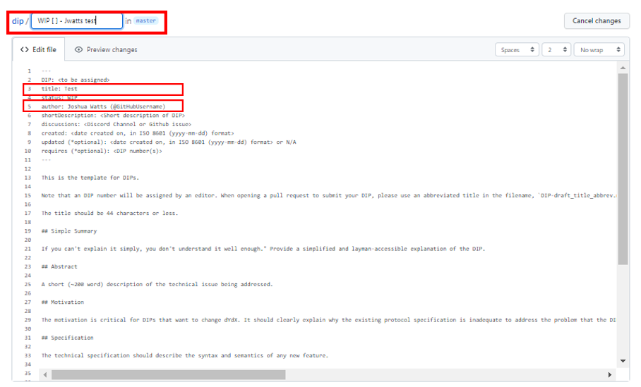

DIP 상태:

* WIP - 현재 개발 중인 DIP.
* 제안됨 - 온체인에 제안 준비가 된 DIP.
* 승인됨 - dYdX 커뮤니티에 의해 구현 승인된 DIP.
* 구현됨 - 메인넷에 배포된 DIP.
* 거절됨 - 승인 거부된 DIP.
* 모든 콘텐츠가 올바른지 확인한 후, dYdX Foundation의 보류 DIP 브랜치에 대한 업무 브랜치에서 PR을 생성하세요. 외부 당사자가 마스터 브랜치로 병합을 원할 경우 IPFS 작업이 실패하게 되므로 dYdX Foundation의 마스터 브랜치에 대해 이 PR을 **제출하지 마세요**. [여기](https://github.com/dydxfoundation/dip/pull/8) 링크의 PR을 예시로 사용하시기 바랍니다.

.png>)

* 검토 후, dYdX Foundation이 보류 DIP 브랜치의 변경 사항을 마스터 브랜치에 병합하게 됩니다.

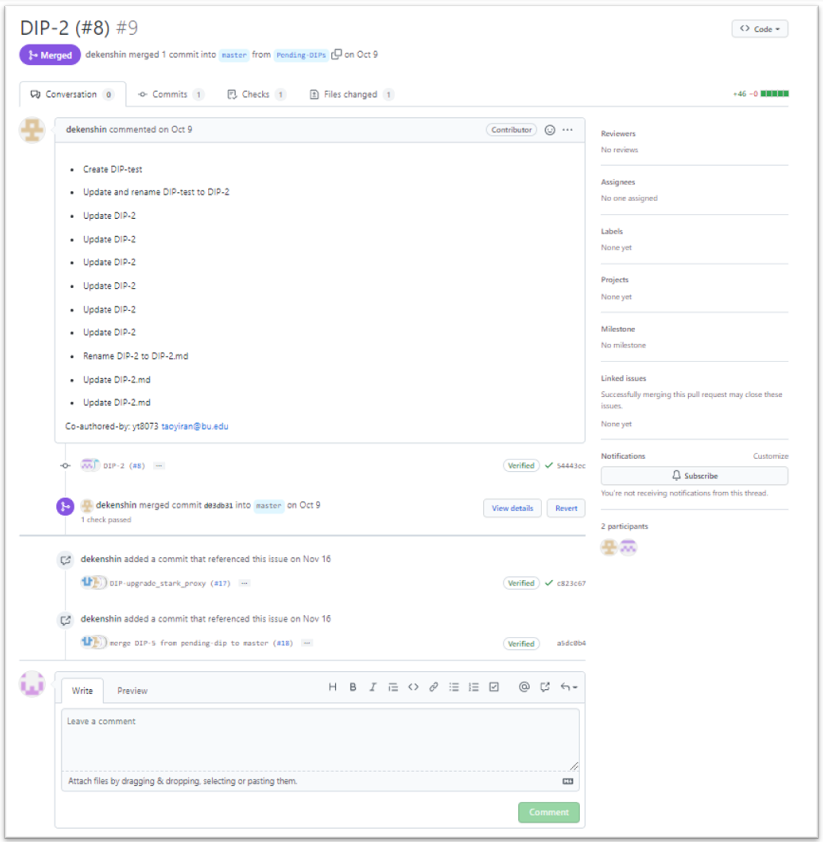

* **병합** 이전에 DIP를 IPFS에 업로드하게 위해 작업이 자동으로 실행됩니다. 여기에서 DIP의 IPFS 업로드를 확인하실 수 있습니다: [https://github.com/dydxfoundation/dip/pull/9/checks](https://github.com/dydxfoundation/dip/pull/9/checks).
* DIP는 [**`dip`**](https://github.com/dydxfoundation/dip)`/`[`content`](https://github.com/dydxfoundation/dip/tree/master/content)`/`**`dips`**`/`에 추가됩니다.

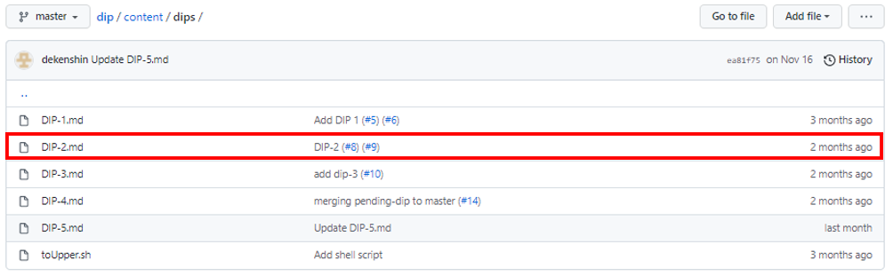

해당 제안은 다른 온체인 스마트 계약 변경을 요구하지 않기 때문에 프로세스는 이제 완전하며 변경 사항은 다음 에폭에 유효하게 됩니다

## DIP 3(온체인 제안) - 안전 모듈 복원

_**요약:**_

11월 1일, 안전 모듈 스테이킹 풀의 기능을 복원하기 위해 Paradigm 소속의 Dan Robinson이 온체인 [DIP](https://dydx.community/dashboard/proposal/3)를 제작하였습니다. 커뮤니티의 대다수(251명의 유권자 및 거의 1억 4천2백만 DYDX)가 안전 모듈의 기능을 복원하는 데 찬성하였습니다. 10일의 투표 기간 후, 커뮤니티 회원이 대기열을 호출하고 제안을 7일의 장기 타임락 지연으로 이동시키는 데 거의 3일이 소요됐습니다. 11월 20일, 안전 모듈이 복원되었고 깨끗한 상태로 초기화되었습니다.

_**배경:**_

dYdX 안전 모듈은 dYdX 프로토콜의 안전 장치로 사용할 수 있는 자금의 탈중앙화 풀을 촉진하도록 설계된 스테이킹 계약입니다. 사용자는 안전 풀에 DYDX를 스테이킹하고 stkDYDX를 일대일 비율로 받습니다. stkDYDX는 DYDX와 동일한 투표권과 제안권을 보유한 ERC-20으로 전송된 토큰화된 포지션입니다. 자금 부족 상황이 발생할 경우, 거버넌스 투표는 손실을 경감하기 위해 스테이킹된 DYDX를 삭감해야 합니다. DYDX 토큰 공급량의 2.5%(25,000,000DYDX)는 안전 스테이킹 풀에 DYDX를 스테이킹한 사용자에게 배포됩니다. 안전 스테이킹 풀에 대한 자세한 정보는 [여기에서](https://dydx.foundation/blog/en/safety-staking) 확인할 수 있습니다.

[안전 스테이킹 풀 보상](https://docs.dydx.community/dydx-governance/staking-pools/safety-staking-pool)의 일환으로 383,562DYDX가 각 에폭(28일)에 스테이커에게 분배됩니다. 보상은 1초마다 스테이커에게 비례적으로 분배됩니다.

dYdX 커뮤니티는 안전 모듈 스마트 계약의 매개 변수에 '즉각적이고 변경 불가한 통제 권한'을 갖게 됩니다. 커뮤니티가 통제하는 매개 변수의 전체 목록은 [여기](https://docs.dydx.community/dydx-governance/voting-and-governance/governance-parameters) 링크에서 확인할 수 있습니다.

9월 8일 오후 3시(UTC), DYDX 토큰에 대한 전송 제한은 해제되었으며 효과적으로 dYdX 안전 모듈에 대한 스테이킹이 오픈되었습니다. 거의 1시간 동안 약 157,000DYDX가 50개 이상의 다른 주소에 스테이킹되었습니다. 배포 과정에서 버그가 오류를 발생시켰으며 안전 모듈에 스테이킹한 주소로 stkDYDX가 발행되지 않았습니다. 결과적으로 각 스테이커의 자금은 계약에 묶였으며 dYdX 팀은 dYdX 거버넌스 UI에 대한 스테이킹을 비활성화하였습니다.

[DIP 1](https://dydx.community/dashboard/proposal/0)은 안전 모듈에 대한 기능을 복원하고 영향을 받은 주소의 자금 복구 허용을 제안했으며 스테이킹된 토큰의 10%를 보상으로 추가 획득하게 됩니다. 커뮤니티 분위기가 [DIP 1 - 안전 모듈 복원 및 스테이커 복구에](https://dydx.community/dashboard/proposal/0) 상당히 찬성하였으나 이 제안은 통과를 위한 장기 타임락 투표에 필요한 1억 DYDX라는 최소 정족수를 충족하지 못했기 때문에 실패했습니다. 결과적으로 DeFiance 소속의 Jacob Goh(jteam0x)가 영향을 받은 주소의 사라진 보상과 불편함을 보상하기 위해 [DIP 4 - 안전 모듈 스테이커 변재 및 보상을](https://dydx.community/dashboard/proposal/2) 생성하였습니다. [DIP 4](https://dydx.community/dashboard/proposal/2)는 토큰을 스테이킹한 사용자에 대한 복구 계약의 배포와 영향을 받은 주소에게 보상 트레저리의 10% 추가 보상이 포함되어 있습니다. DIP는 단기 타임락의 덜 엄격한 거버넌스 매개 변수로 관리되었습니다.

DIP의 제안 생애주기는 일반적으로 DIP 생성될 때까지 일관됩니다. DIP 3(온체인) 및 DIP 2(오프체인) 간의 주요 차이점은 DIP 3은 온체인 투표와 스마트 계약 배포가 필요하다는 점이었습니다. 포럼 토론, DRC 생성 및 DIP 생성 초안 작성에 대한 프로세스가 동일하기 때문에 온체인 DIP 초안을 작성하기 위한 콘텐츠의 요건에 대해 단계별 토론을 시작했습니다. 자세한 정보는 아래 링크를 통해 확인하시기 바랍니다.

* dYdX의 거버넌스 프로세스 - [https://docs.dydx.community/dydx-governance/voting-and-governance/dip-proposal-lifecycle](https://docs.dydx.community/dydx-governance/voting-and-governance/dip-proposal-lifecycle).
* 안전 모듈 사고 보고서 - [https://dydx.foundation/blog/en/outage-1](https://dydx.foundation/blog/en/outage-1).
* 오프체인 포럼 토론 **-** [https://commonwealth.im/dydx/proposal/discussion/1743-safety-staking-pool-on-pause](https://commonwealth.im/dydx/proposal/discussion/1743-safety-staking-pool-on-pause).
* 오프체인 DRC **-** [https://commonwealth.im/dydx/proposal/discussion/1770-drc-incident-report-of-the-safety-module-outage-proposed-solution](https://commonwealth.im/dydx/proposal/discussion/1770-drc-incident-report-of-the-safety-module-outage-proposed-solution)
* 오프체인 DRC 스냅샷 여론조사 **-** [https://snapshot.org/#/dydxgov.eth/proposal/QmbJ5QxHr1pyShKTDaF5DjAr6vxQn8DVxshH2fyWgzDCBn](https://snapshot.org/#/dydxgov.eth/proposal/QmbJ5QxHr1pyShKTDaF5DjAr6vxQn8DVxshH2fyWgzDCBn)
* Github에 제안된 DIP **-** [https://github.com/dydxfoundation/dip/blob/master/content/dips/DIP-3.md](https://github.com/dydxfoundation/dip/blob/master/content/dips/DIP-3.md)

### **1단계 - 온체인 DIP 초안 작성**

_**설명:**_

dYdX 프로토콜에 대한 거버넌스 합의에 영향을 미치는 온체인 DIP 초안은 스마트 계약 변경 사항 실현에 대한 특정 단계를 명시해야 합니다. 커뮤니티가 스냅샷 또는 이전에 실패한 DIP에서 대략적인 합의에 도달한 후, 충분한 제안권을 가진 커뮤니티 회원은 신규 DIP 온체인을 제출할 수 있습니다. 제안권 기준, 타임락 실행자 및 기타 거버넌스 매개변수에 대한 자세한 정보는 [여기](https://docs.dydx.community/dydx-governance/voting-and-governance/governance-parameters) 링크에서 확인할 수 있습니다.

_**DIP 3에 대한 적용:**_

이 경우, 해당 [DIP](https://github.com/dydxfoundation/dip/blob/master/content/dips/DIP-3.md)는 Paradigm 소속 Dan Robinson이 승인하였습니다. 온체인 스마트 계약 변경 사항을 포함한 제한임을 고려하면, 해당 제안은 특정 스마트 계약 이행에 대한 링크를 포함하고 있습니다.

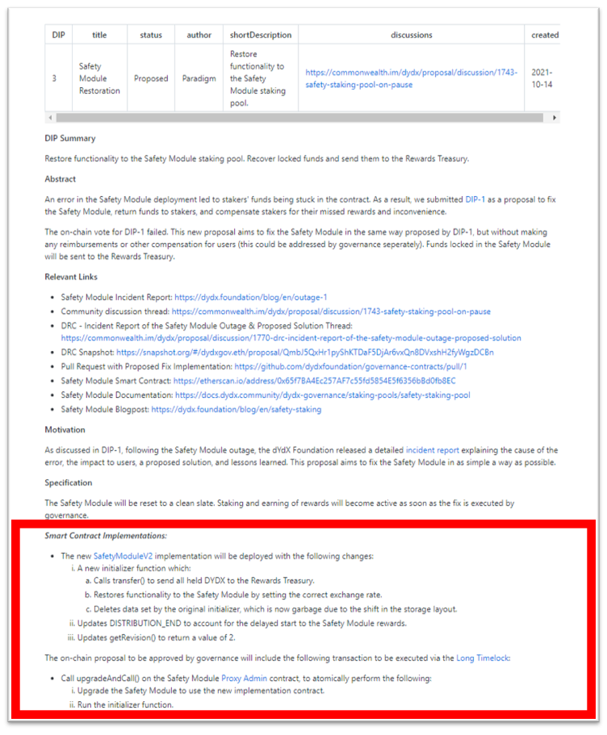

안전 폴더에 대한 SafetyModuleV2.sol 배포 계약의 탐색으로 해당 제안이 어떤 방식으로 실행될지에 대한 구체적인 세부 내용이 들어 있는 README 파일을 볼 수 있습니다.

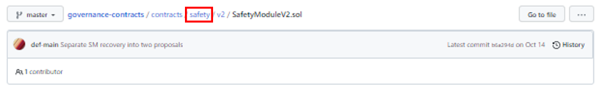

README 파일에 포함된 제안 실행 단계는 다음 링크에서 확인하실 수 있습니다. [https://github.com/dydxfoundation/governance-contracts/tree/master/contracts/safety](https://github.com/dydxfoundation/governance-contracts/tree/master/contracts/safety)1

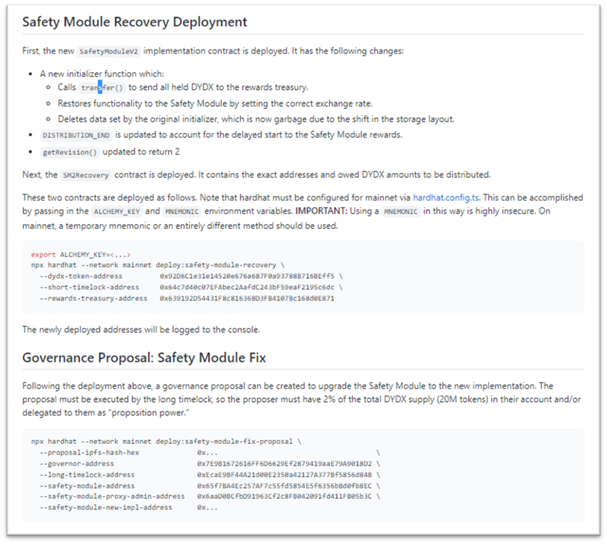

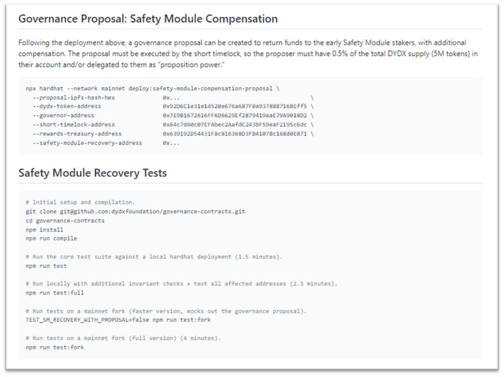

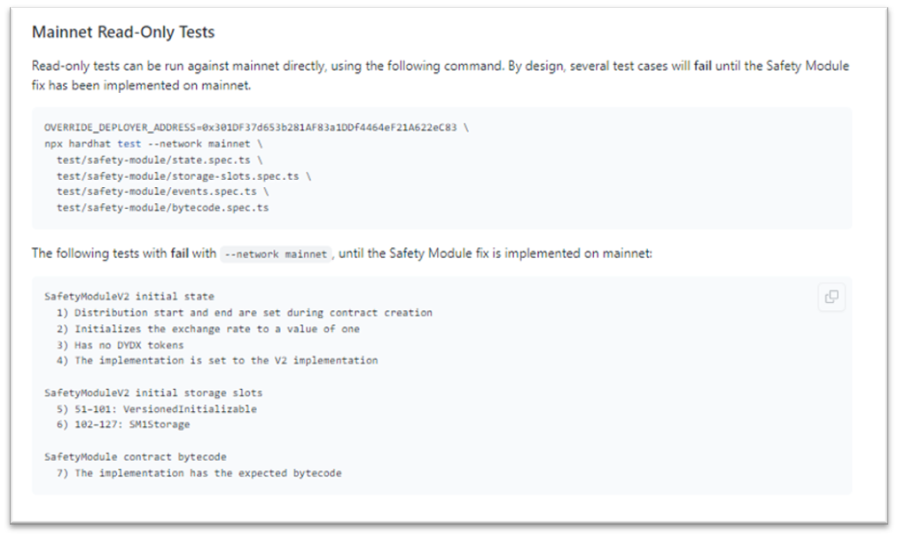

#### _온체인 DIP 초안 작성 방법(WIP):_

* DIP 생성을 위해 새로운 지갑을 만드세요. 배포 프로세스는 환경 변수로 보안 문구 입력이 필요하기 때문에 온체인 DIP 생성에 하나의 지갑을 사용하실 것을 권장합니다.
* DIP 생성을 위해 하나의 지갑에 충분한 제안권을 위임하세요. 제안권 위임은 [여기](https://dydx.community/dashboard)에서 하실 수 있습니다. 다른 제안권 기준은 아래 및 [여기](https://docs.dydx.community/dydx-governance/voting-and-governance/governance-parameters) 링크에서 확인하실 수 있습니다.
   * 단기 타임락: 총 공급량의 0.5%(제안권 5백만).
   * Starkware 실행자: 총 공급량의 0.5%(제안권 5백만).
   * 장기 타임락 실행자: 총 공급량의 2.0%(제안권 2천만)
   * 머클 일시정지자 타임락: 총 공급량의 0.5%(제안권 5백만).
* Alchemy 키를 만드세요. Alchemy 키를 이용하면 이더리움과의 상호작용 및 스마트 계약 배포를 위해 이더리움 노드를 운영할 필요가 없습니다. Alchemy 키 생성 가이드는 [여기](https://docs.alchemy.com/alchemy/introduction/getting-started) 링크에서 확인하실 수 있습니다.

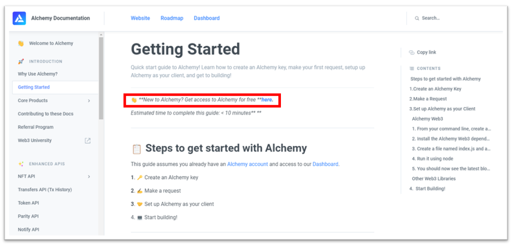

이더리움을 선택하고 '시작'을 누르세요.

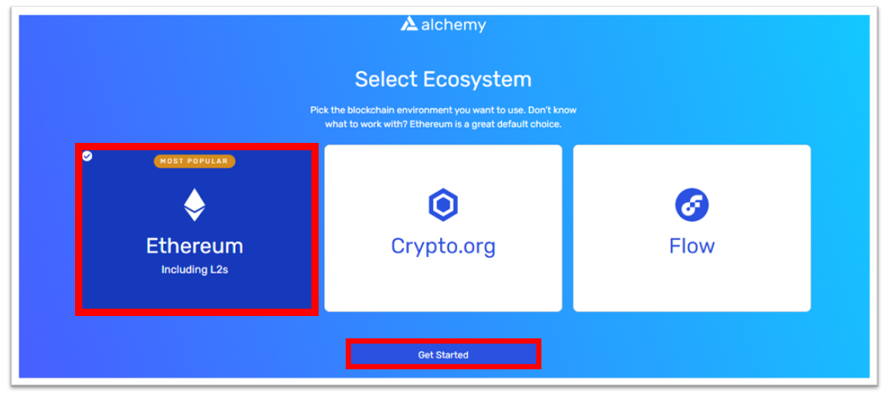

필요한 정보를 입력하고 Ropsten 네트워크를 선택하고 '앱 생성'을 선택하세요.

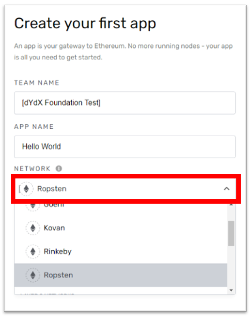

계정을 생성한 후, [여기](https://docs.alchemy.com/alchemy/introduction/getting-started) 링크의 설치 지침을 따르세요.

'4. 구축 시작하기' 아래에서 '첫 스마트 계약 배포 시도'를 선택하고 가이드를 따르세요.

.png>)

* 윈도우 명령어 창, 기본 터미널 앱을 열거나 다음에서 iTerm을 다운로드하세요. [https://iterm2.com/](https://iterm2.com/)
* 아직 없는 경우, 다음 경로에서 'Node.js and npm'을 다운로드하고 설치하세요. [https://docs.npmjs.com/downloading-and-installing-node-js-and-npm](https://docs.npmjs.com/downloading-and-installing-node-js-and-npm)
* Hardhat은 이더리움 소프트웨어를 컴파일하고 테스트하기 위한 개발 툴입니다. 아직 없는 경우, 다음 경로에서 Hardhat을 설치하세요. [https://hardhat.org/tutorial/setting-up-the-environment.html](https://hardhat.org/tutorial/setting-up-the-environment.html)
* 제안된 스마트 계약 이행 초안을 작성하세요.
* IPFS 해시는 자동으로 생성되며 [여기](https://github.com/dydxfoundation/dip/tree/master/content/ipfs-dips)에서 확인할 수 있습니다. IPFS 해시는 `DIP-[NEW DIP #]-ipfs-hashes.json이라는` 파일 이름으로 dYdX Foundation의 디렉토리에서 찾을 수 있습니다.

.png>)

* 새로운 파일(`DIP-[New DIP #]-ipfs-hashes.jso`)을 선택한 후, 인코딩된 해시를 사용하시기 바랍니다.

.png>)

### **2단계 - DIP 온체인 제출**

_**설명:**_

제안된 스마트 계약 이행이 올바르며 해당 DIP가 확정되었음을 커뮤니티 회원이 확인한 후, 해당 DIP는 온체인으로 제출할 수 있습니다. 온체인 DIP가 생성되면 해당 제안은 약 1일(약 6570블록) 동안 지속되는 투표 지연에 대해 '보류 중' 상태로 진입합니다. 사용자 스냅샷은 DYDX 보유량 및 위임된 투표권을 처리하기 위해 투표 지연 이후에 기록됩니다. 다음으로 제안은 '활성' 상태로 진입하며 투표 기간은 제안의 유형에 따라 2~10일로 바뀝니다. 제안이 실행되려면 투표는 최소 정족수를 충족해야 하며 제안의 유형에 따라 변하는 최소 투표 격차를 충족해야 합니다. DIP가 최소 정족수와 최소 투표 격차를 충족하고 투표 커뮤니티 회원의 대다수가 DIP 찬성에 투표할 경우, 모든 주소는 제안을 타임락 대기열로 이동하기 위해 대기열을 호출할 수 있습니다. 타임락 계약은 dYdX 커뮤니티가 채결한 거래를 대기, 취소 또는 실행할 수 있습니다. 타임락 대기열의 기간은 제안의 유형에 따라 다릅니다.

_**DIP 3에 대한 적용:**_

Paradigm 팀이 `SafetyModuleV2.sol`에 대한 솔리디티 코드를 완성했습니다.

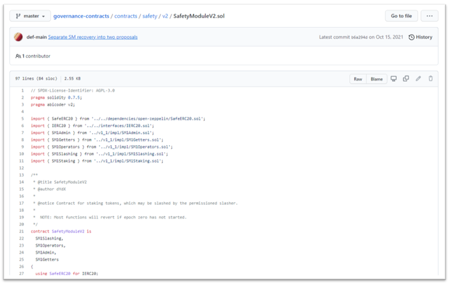

Paradigm 팀은 로컬 및 포킹된 메인넷 환경 모두에서 업데이트를 시뮬레이션했습니다. 메인넷에 대한 거버넌스 제안서의 실행 이후 전체 기능이 복원되도록 테스트 도구가 실행되었습니다.

Paradigm 팀은 아래 스크립트를 실행하여 스마트 계약 업데이트를 배포했습니다.

**안전 모듈 복원 배포**

`ALCHEMY_KEY=<... 추출 >`

`MNEMONIC=<... 추출 >`

`npx hardhat --네트워크 메인넷 배포:안전-모듈-복구`\ `--dydx-토큰-주소 0x92D6C1e31e14520e676a687F0a93788B716BEff5`\ `--단기-타임락-주소 0x64c7d40c07EFAbec2AafdC243bF59eaF2195c6dc`\
 `--보상-트레저리-주소 0x639192D54431F8c816368D3FB4107Bc168d0E871`

**거버넌스 제안: 안전 모듈 수정**

`ALCHEMY_KEY=<... 추출 >`

`MNEMONIC=<... 추출 >`

`npx hardhat --네트워크 메인넷 배포:안전-모듈-수정-제안서`\ `--제안서-ipfs-해시-hex 0x...`\ `--거버너-주소 0x7E9B1672616FF6D6629Ef2879419aaE79A9018D2`\
 `--장기-타임락-주소 0xEcaE9BF44A21d00E2350a42127A377Bf5856d84B`\
 `--안전-모듈-주소 0x65f7BA4Ec257AF7c55fd5854E5f6356bBd0fb8EC`\
 `--안전-모듈-프록시-관리자-주소 0x6aaD0BCfbD91963Cf2c8FB042091fd411FB05b3C`\
 `--안전-모듈-신규-실행-주소 0x...`

**거버넌스 제안: 안전 모듈 보상**

`ALCHEMY_KEY=<... 추출 >`

`MNEMONIC=<... 추출 >`

`npx hardhat --네트워크 메인넷 배포:안전-모듈-보상-제안서`\ `--제안서-ipfs-해시-hex 0x...`\ `--dydx-토큰-주소 0x92D6C1e31e14520e676a687F0a93788B716BEff5`\ `--거버너-주소 0x7E9B1672616FF6D6629Ef2879419aaE79A9018D2`\
 `--단기-타임락-주소 0x64c7d40c07EFAbec2AafdC243bF59eaF2195c6dc`\
 `--보상-트레저리-주소 0x639192D54431F8c816368D3FB4107Bc168d0E871`\ `--안전-모듈-복구-주소 0x...`

DIP는 [https://dydx.community/dashboard](https://dydx.community/dashboard)에도 동시에 게시되었습니다.

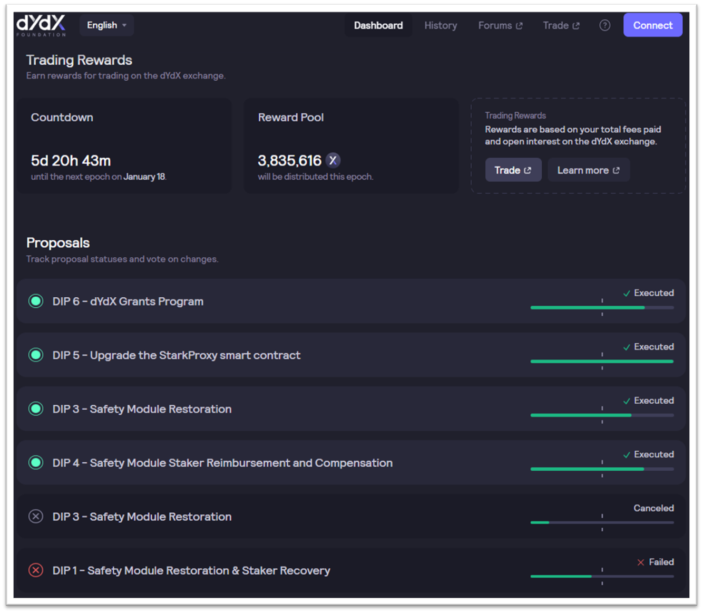

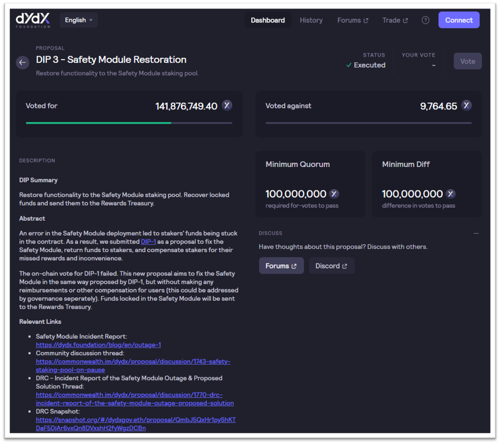

dYdX 거버넌스 계약은 0x7e9b1672616ff6d6629ef2879419aae79a9018d2입니다. [https://etherscan.io/txs?a=0x7e9b1672616ff6d6629ef2879419aae79a9018d2\&p=10](https://etherscan.io/txs?a=0x7e9b1672616ff6d6629ef2879419aae79a9018d2\&p=10)1

DIP 배포는 이더스캔에서 확인할 수 있습니다. [https://etherscan.io/tx/0x5f2472e7dfcbf50628d29c94f97a072f3c19177f66cde4cca9f376c7934af5ad](https://etherscan.io/tx/0x5f2472e7dfcbf50628d29c94f97a072f3c19177f66cde4cca9f376c7934af5ad)1

DIP는 2021년 11월 1일에 13532376블록에서 생성되었습니다. 향후 6570블록 동안 DIP 상태는 '보류 중'입니다.

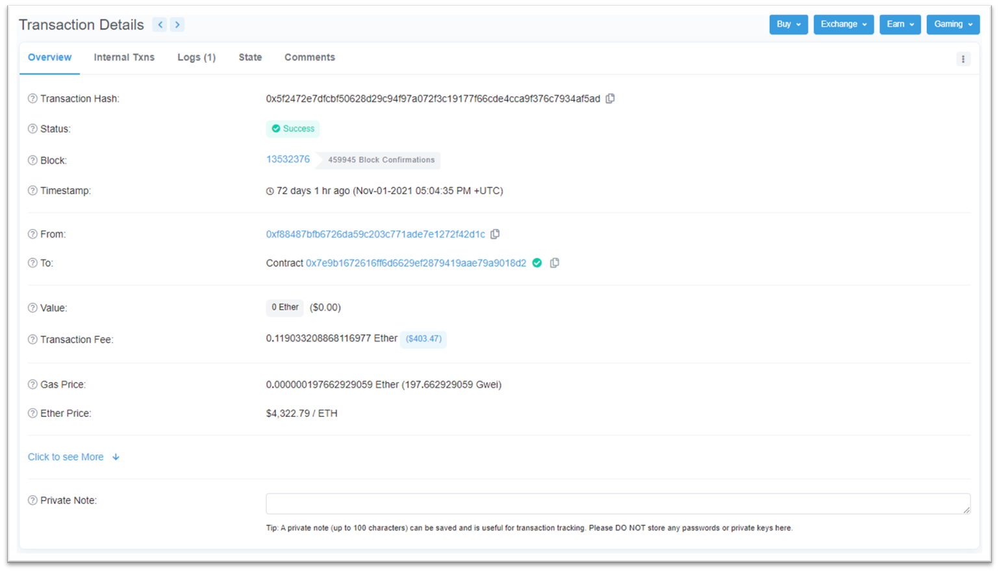

DYDX 보유자는 13538946블록에서 '활성' 상태로 전환되었을 때, DIP에 투표할 수 있었습니다.

첫 번째 투표는 2021년 11월 2일, DIP가 온체인에 생성된 지 6583블록 이후인 세계협정시 기준 오후 5:51:22(13538959블록)에 실시되었습니다.

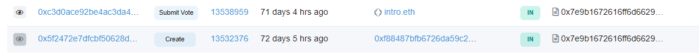

장기 타임락에 관련된 10일의 투표 기간 후, 모든 커뮤니티 회원은 대기열을 호출하고 제안을 7일 타임락 지연으로 옮길 수 있습니다. DIP의 경우, 커뮤니티 회원이 대기열을 호출하는 데 거의 3일이 소요되었습니다.

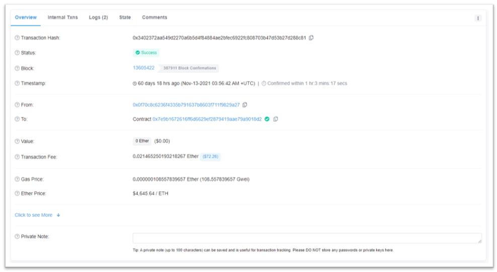

7일 타임락 지연 이후, DIP가 온체인으로 실행되었습니다.

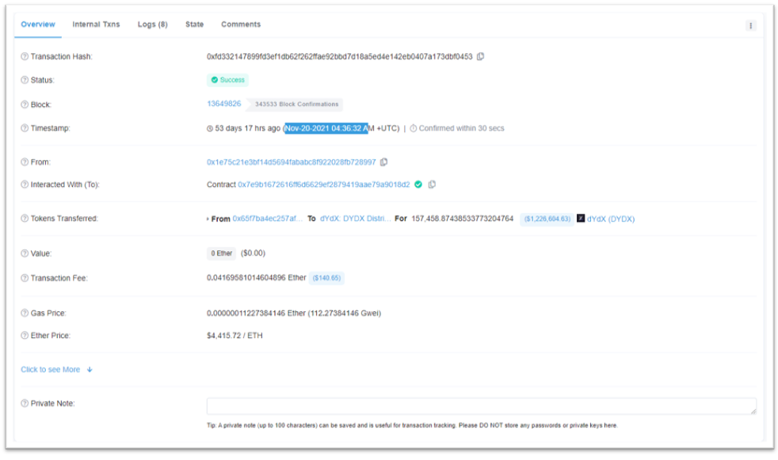

DIP가 온체인으로 실행되었을 당시의 [https://dydx.community/dashboard/proposal/3](https://dydx.community/dashboard/proposal/3)에서 DIP 상태는 '실행됨'으로 업데이트되었습니다.

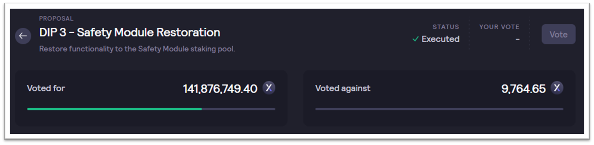

참고, (1) 제안서는 타임락 지연 직후 시작되는 7일의 실행 그레이스 기간 내에 실행되어야 하며 (2) 제안 주소는 DIP가 실행될 때까지 각 타임락 계약에 필요한 최소 제안권의 양을 유지해야 합니다(5백만 또는 2천만 제안권 중 하나).

#### _DIP를 온체인에 제출하는 방법:_

* DIP 생성을 위해 충분한 제안권을 확보하시기 바랍니다. 자세한 정보는 [DIP 생성](https://docs.dydx.community/dydx-governance/voting-and-governance/dip-proposal-lifecycle)에서 확인하실 수 있습니다.
   * 단기 타임락 실행자: 총 공급량의 0.5%(제안권 5백만).
   * Starkware 실행자: 총 공급량의 0.5%(제안권 5백만).
   * 장기 타임락 실행자: 총 공급량의 2.0%(제안권 2천만)
   * 머클 일시정지자 타임락: 총 공급량의 0.5%(제안권 5백만).
* 가스 수수료를 지불하기 위해 지갑에 ETH가 있는지 확인하세요.
* Alchemy에 이더리움 메인넷 네트워크에 대한 앱을 만드세요.

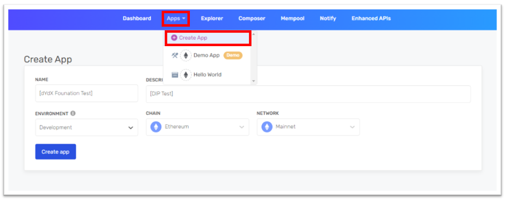

* 앱이 생성되면 Alchemy 키(7LOaQtguSm2kSEcFXQH88B)를 획득하기 위해 '키 보기'를 클릭하세요. [https://eth-mainnet.alchemyapi.io/v2/7LOaQtguSm2kSEcFXQH88B-EN\_K7t\_ul](https://eth-mainnet.alchemyapi.io/v2/7LOaQtguSm2kSEcFXQH88B-EN\_K7t\_ul)

.png>)

* Node.js and npm 다운로드 및 설치: [https://docs.npmjs.com/downloading-and-installing-node-js-and-npm](https://docs.npmjs.com/downloading-and-installing-node-js-and-npm).
* Hardhat 설치: [https://hardhat.org/tutorial/setting-up-the-environment.html](https://hardhat.org/tutorial/setting-up-the-environment.html).
* 초안 작성한 스크립트를 실행하세요.
* 제안이 온체인으로 생성되었는지 확인하기 위해 거버넌스 계약을 확인하세요. [https://etherscan.io/txs?a=0x7e9b1672616ff6d6629ef2879419aae79a9018d2\&p=10](https://etherscan.io/txs?a=0x7e9b1672616ff6d6629ef2879419aae79a9018d2\&p=10)
* 제안을 제출한 주소로 제안이 실행될 때까지 각 타임락 계약에 필요한 최소 제안권 양을 유지해야 합니다.

#### _DIP에서 투표하는 방법:_

* 가스 수수료를 지불하기 위해 지갑에 ETH가 있는지 확인하세요.
* 다음에서 DIP를 선택하여 활성 DIP에서 투표하실 수 있습니다. [https://dydx.community/dashboard](https://dydx.community/dashboard)

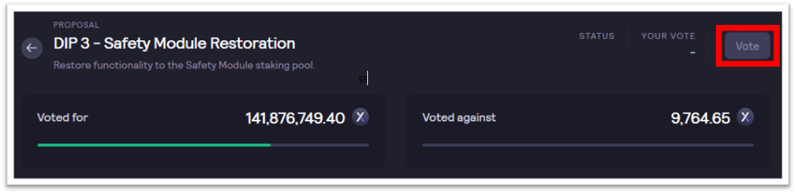

* 향후에는 Commonwealth에서도 활성 DIP에 투표하실 수 있습니다.

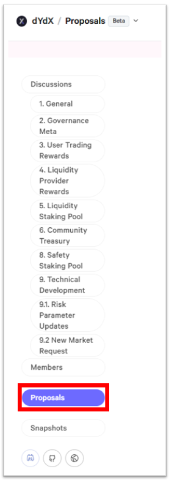

투표 기간은 제안의 유형에 따라 다릅니다. 자세한 정보는 [DIP 생성](https://docs.dydx.community/dydx-governance/voting-and-governance/dip-proposal-lifecycle)에서 확인할 수 있습니다.

* 단기 타임락 실행자: 4일.
* Starkware 실행자: 4일.
* 장기 타임락 실행자: 10일.
* 머클 일시정지자 실행자: 2일.

#### _제안 대기 상태 변경 방법:_

성공적인 제안은 타임락 지연을 시작하기 위해 대기 상태로 변경할 수 있습니다.

* Eth가 포함된 호환되는 지갑을 사용하시기 바랍니다.
* 이더스캔의 '계약' 탭으로 이동하고 '계약서 작성'을 클릭하세요. 거버넌스 계약은 [여기](https://etherscan.io/address/0x7e9b1672616ff6d6629ef2879419aae79a9018d2#writeContract) 링크에서 확인하실 수 있습니다.

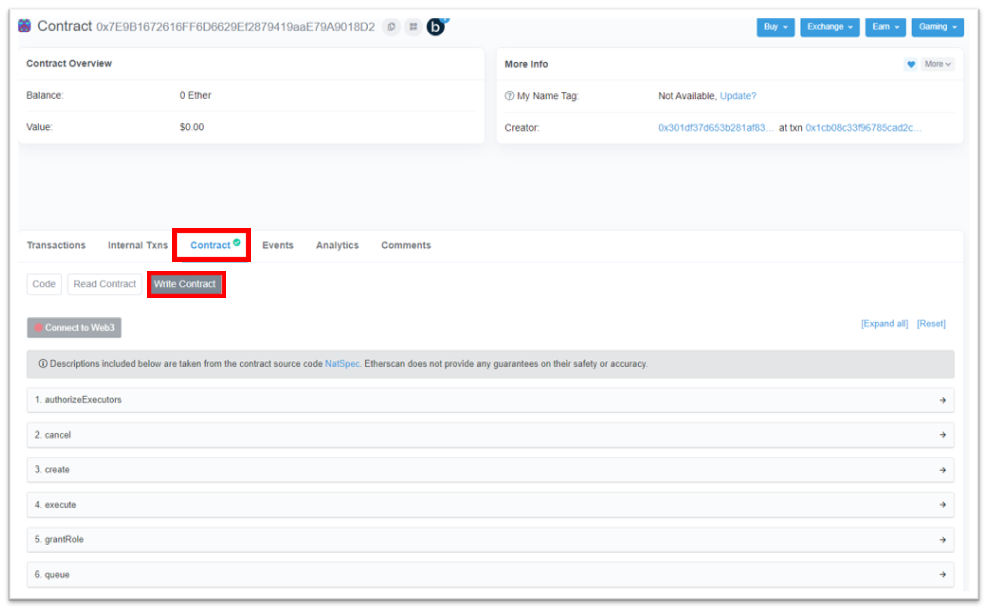

* 대기열을 선택하고 '제안ID'를 제출하세요.

.png>)

'제안ID'는 DIP가 생성되었을 때 이더스캔에서 확인하실 수 있습니다. [https://etherscan.io/tx/0x5f2472e7dfcbf50628d29c94f97a072f3c19177f66cde4cca9f376c7934af5ad](https://etherscan.io/tx/0x5f2472e7dfcbf50628d29c94f97a072f3c19177f66cde4cca9f376c7934af5ad)

* '클릭하여 더 보기'를 선택하세요.

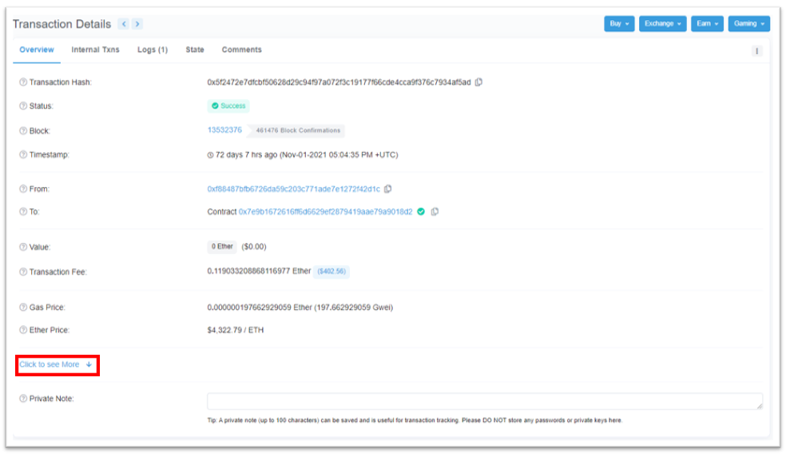

* '입력 데이터 디코딩'을 선택하세요.

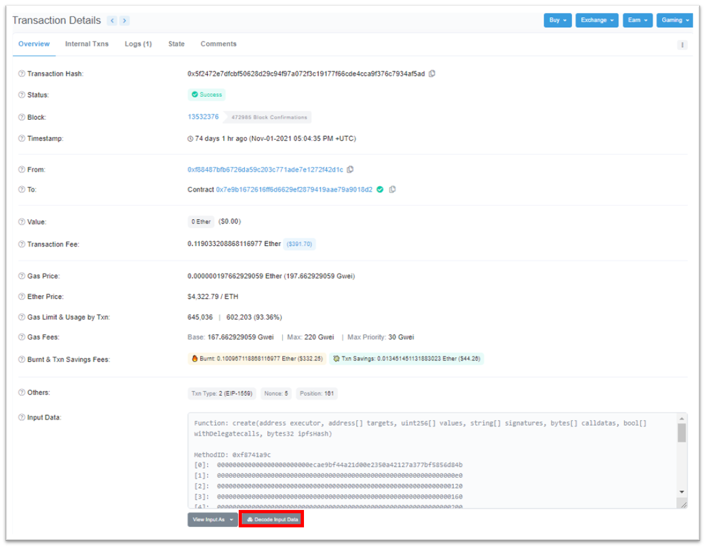

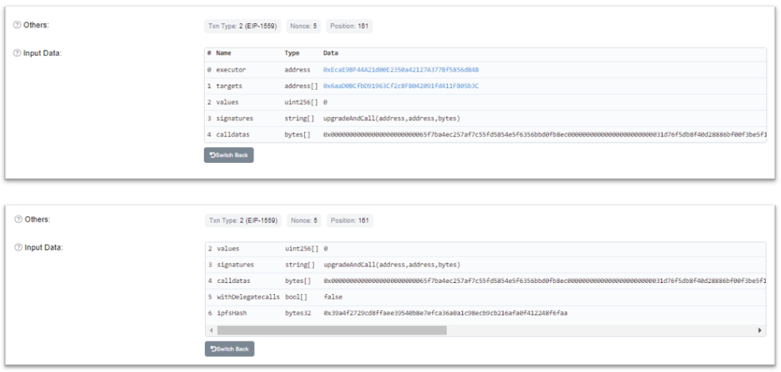

#### _제안 실행 방법:_

타임락 지연 이후, 성공적인 제안은 실행할 수 있습니다.

* 이더스캔의 '계약' 탭으로 이동하고 '계약서 작성'을 클릭하세요. 거버넌스 계약은 [여기](https://etherscan.io/address/0x7e9b1672616ff6d6629ef2879419aae79a9018d2#writeContract) 링크에서 확인하실 수 있습니다.

* '실행'을 선택하고 '제안ID'를 제출하세요.

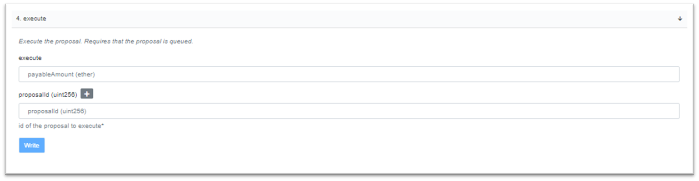

* '제안ID'를 확인하려면 상기 단계(_제안 대기 상태 변경 방법_ 아래)를 따르세요.
* '지불 급액(이더)' 하단에 '0'을 입력하세요.
