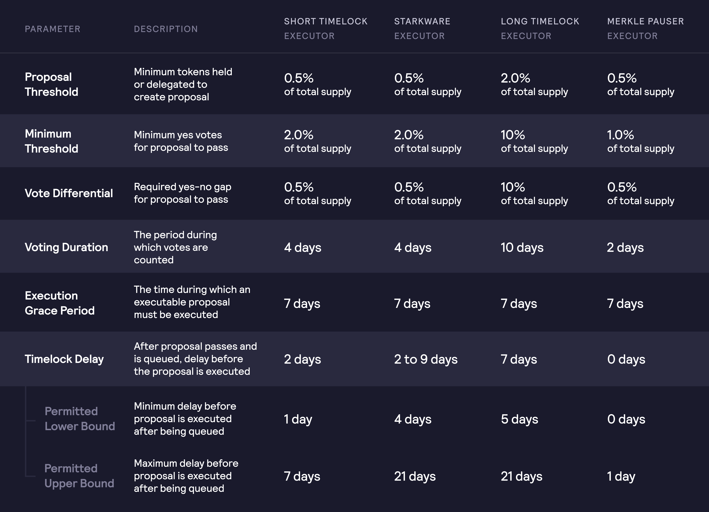

# Parameters

At the time of launching governance, DYDX holders have immediate and irrevocable control over:

* Allocation of the community treasury
* New token listings on the Protocol
* Risk parameters for the Protocol
* Capital allocations to market makers in the liquidity staking pool
* Addition of new market makers to the liquidity staking pool
* Determining safety staking pool payouts in the event of a loss
* Changing any of the rewards and pools existing at launch
* The governance contracts themselves

dYdX Governance has control over the parameters of the following contracts:

* [Timelock](https://github.com/dydxfoundation/governance-docs/tree/28153eacbdaafb32078630fafa7ad64f111ac9ab/voting-and-governance-process/parameters.md#timelock-parameters)
* Priority Timelock
* Governor
* DYDX Token
* Treasury
* Merkle Distributor
* Liquidity Staking
* Safety Module
* Stark Proxy
* Stark Perpetual

## Timelock Parameters

## Governor Parameters

| Parameter         | Description                                                                   | Value          |
| ----------------- | ----------------------------------------------------------------------------- | -------------- |
| Voting Delay      | Delay (in blocks) between proposal creation and voting on the proposal        | 6,570 blocks   |
| Add Executor role | Address that can add new executors                                            | Short Timelock |
| Owner role        | Can change strategy / voting delay / unauthorize executors + owns other roles | Long Timelock  |

## DYDX Token

| Parameter | Description                                 | Value          |
| --------- | ------------------------------------------- | -------------- |
| Owner     | Can mint DYDX tokens after mint restriction | Short Timelock |

## Rewards Treasury Parameters

| Parameter   | Description                                            | Value          |
| ----------- | ------------------------------------------------------ | -------------- |
| Owner       | Can approve or transfer any token held by the treasury | Short Timelock |
| Proxy Admin | Can upgrade the contract                               | Short Timelock |

##

## Community Treasury Parameters

| Parameter   | Description                                            | Value          |
| ----------- | ------------------------------------------------------ | -------------- |
| Owner       | Can approve or transfer any token held by the treasury | Short Timelock |
| Proxy Admin | Can upgrade the contract                               | Short Timelock |

##

## Merkle Distributor

| Parameter           | Description                                                                                                                    | Value                        |
| ------------------- | ------------------------------------------------------------------------------------------------------------------------------ | ---------------------------- |
| Owner role          | Can update the rewards oracle address, update the IPNS name, and is admin of all roles                                         | Short Timelock               |
| Config updater role | May set rewards parameters, change the epoch schedule, or change the IPFS update period                                        | Short Timelock               |
| Pauser role         | Can pause updates to the merkle root                                                                                           | Merkle-pauser Timelock       |
| Unpauser role       | Can unpause updates to the merkle root                                                                                         | Short Timelock               |
| Claim operator role | May claim rewards on behalf of a user                                                                                          | Claims Proxy                 |
| Interval            | Length of an epoch                                                                                                             | 28 days                      |
| Offset              | Start of epoch zero                                                                                                            | August 3rd 15:00 UTC 2021    |
| IPNS name           | IPNS name where rewards data is published                                                                                      | rewards-data.dydx.foundation |
| IPFS update period  | Period of time after the epoch end after which the new epoch exchange statistics should be available on IPFS via the IPNS name | 3 minutes                    |
| Proxy Admin         | Can upgrade the contract                                                                                                       | Short Timelock               |

##

## Liquidity Staking

| Parameter             | Description                                                                       | Value                     |
| --------------------- | --------------------------------------------------------------------------------- | ------------------------- |
| Owner role            | Admin of all roles                                                                | Short Timelock            |
| Epoch parameters role | May set epoch parameters such as the interval, offset, and blackout window        | Short Timelock            |
| Rewards rate role     | May set the emission rate of rewards                                              | Short Timelock            |
| Borrower admin role   | May set borrower allocations and allow/restrict borrowers from borrowing          | Short Timelock            |
| Claim operator role   | May claim rewards on behalf of a user                                             | Claims proxy              |
| Stake operator role   | May manipulate user's staked funds (e.g. perform withdrawals) on behalf of a user | Short Timelock            |
| Debt operator role    | May decrease borrow debt and decrease staker debt                                 | Short Timelock            |
| Interval              | Length of an epoch                                                                | 28 days                   |
| Offset                | Start of epoch zero                                                               | August 3rd 15:00 UTC 2021 |
| Blackout window       | Length of the blackout window                                                     | 3 days                    |
| Rewards emission rate | Tokens allocated to stakers as rewards per second                                 | 0                         |
| Proxy Admin           | Can upgrade the contract                                                          | Short Timelock            |

## Safety Module

| Parameter             | Description                                                                       | Value                     |
| --------------------- | --------------------------------------------------------------------------------- | ------------------------- |
| Owner role            | Admin of all roles                                                                | Short Timelock            |
| Slasher role          | Can slash staked token balances and withdraw those funds                          | Short Timelock            |
| Epoch parameters role | May set epoch parameters such as the interval, offset, and blackout window        | Short Timelock            |
| Rewards rate role     | May set the emission rate of rewards                                              | Short Timelock            |
| Claim operator role   | May claim rewards on behalf of a user                                             | Claims proxy              |
| Stake operator role   | May manipulate user's staked funds (e.g. perform withdrawals) on behalf of a user | Short Timelock            |
| Interval              | Length of an epoch                                                                | 28 days                   |
| Offset                | Start of epoch zero                                                               | August 3rd 15:00 UTC 2021 |
| Blackout window       | Length of the blackout window                                                     | 3 days                    |
| Rewards emission rate | Tokens allocated to stakers as rewards per second                                 | 0                         |
| Proxy Admin           | Can upgrade the contract                                                          | Long Timelock             |

## Stark Proxy

| Parameter                | Description                                                                                                                                                                                                      | Value                  |
| ------------------------ | ---------------------------------------------------------------------------------------------------------------------------------------------------------------------------------------------------------------- | ---------------------- |
| Owner role               | Can add/remove recipients who receive funds + STARK keys, set ERC20 allowances on liquidity staking and stark perpetual contracts, call forced actions, and is admin of owner + delegation admin roles           | Market Maker           |
| Delegation admin role    | Is admin of borrower, exchange operator, and withdrawal operator roles                                                                                                                                           | Market Maker           |
| Borrower role            | May call borrow functions on the liquidity staking contract                                                                                                                                                      | Market Maker           |
| Exchange operator role   | May call exchange functions on the stark perpetual contract                                                                                                                                                      | Market Maker           |
| Withdrawal operator role | May withdraw funds in excess of the borrowed balance to an allowed recipient                                                                                                                                     | Market Maker           |
| Guardian role            | May perform close actions, perform force actions if borrower has overdue debt, restrict open actions with borrowed funds, and approve a token amount to be withdrawn externally by the withdrawal operator role. | Short Timelock         |
| Veto guardian role       | May veto forced trade requests initiated by the owner, during the waiting period                                                                                                                                 | Merkle-pauser timelock |

## Stark Perpetual

| Parameter                              | Description | Short Timelock Executor | Merkle-Pauser Executor | Long Timelock Executor | Starkware Executor |
| -------------------------------------- | ----------- | ----------------------- | ---------------------- | ---------------------- | ------------------ |
| Add new asset                          |             | N                       | N                      | N                      | Y                  |
| Change configuration of existing asset |             | N                       | N                      | N                      | Y                  |
| Proxy admin                            |             | N                       | N                      | N                      | Y                  |
| Add operator                           |             | N                       | N                      | N                      | Y                  |
| Remove operator                        |             | N                       | N                      | N                      | Y                  |
| Add verifier                           |             | N                       | N                      | N                      | Y                  |
| Remove verifier                        |             | N                       | N                      | N                      | Y                  |
