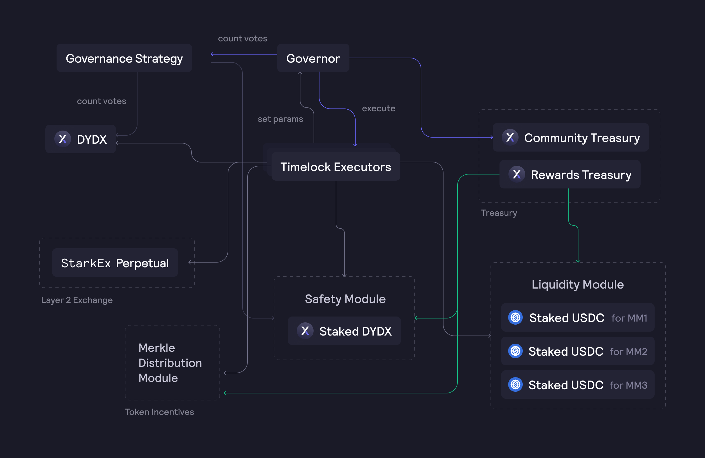

# 아키텍처

## 개요

DYDX 보유자는 프로토콜 변경을 제안하고 이에 대해 투표할 권리가 있습니다. DYDX 거버넌스는 AAVE 거버넌스 계약에 기반하며, DYDX 토큰 보유량을 기반으로 투표를 지원합니다.

제안은 제안 유형에 따라 주어지는 임계점 및 찬성 투표 백분율을 반드시 통과해야 합니다.

이러한 DYDX 토큰은 거버넌스 제안을 생성하거나 이에 대해 투표할 때 사용할 수 있으며, 다른 이더리움 주소로 위임할 수 있습니다.

dYdX 거버넌스의 핵심에는 다음 6가지 스마트 계약이 있습니다.

* **`DYDX Token` 계약**: 각기 다른 시간 블록에 기록된 각 주소의 투표권에 대한 스냅샷을 보유합니다.
* **`거버넌스 전략` 계약**: 제안 및 투표에 대한 사용자의 상대적인 권한을 측정하는 로직을 포함합니다.
* **`안전 모듈` 계약**: DYDX 토큰 스테이킹, 포지션 토큰화 및 보상 획득을 위한 로직을 포함합니다. 안전 모듈에 스테이킹된 토큰은 완전한 거버넌스 권한을 보유합니다.
* **`거버너` 계약**: 제안을 추적하고 타임락 스마트 컨트랙트를 통해 제안을 실행할 수 있습니다.
* **`타임락` 계약**: 거버넌스에서 투표한 거래를 대기열에 넣거나 취소하거나 실행할 수 있습니다. 제안 내 기능은 타임락 계약에 의해 시작됩니다. 대기 중인 거래는 딜레이 후 그리고 유예 기간 만료 전에 실행할 수 있습니다.
* **`우선 타임락` 계약**: 타임락 계약과 동일하지만, 우선순위 통제자가 타임락 지연이 종료되기 전에 **우선순위 기간**(7일) 내에 거래를 실행할 수 있습니다.

dYdX 온체인 거버넌스는 다음을 허용합니다.

* 승인된 실행자 계약을 통해 제안에 대한 투표 실행
* 제안 시작 시 토큰 보유량 스냅샷 기록
* 투표권 및 제안권 별도 위임
* 제안, 정족수, 투표 격차를 비롯한 거버넌스 임계값 설정
* 투표 계산 방식 변경(거버너 계약의 '거버넌스 전략' 스마트 계약 주소 변경)

## 제안 유형

제안 기간 및 실행에 영향을 미치는 파라미터가 서로 다른 4개의 제안 유형이 있습니다. 거버넌스 합의에 영향을 미치는 중요한 제안의 경우 투표를 비교적 오래 진행해야 하며 찬반표 격차가 커야 하지만, 프로토콜 파라미터에만 영향을 미치는 제안의 경우 투표를 빠르게 진행하고 빠르게 실행할 수 있습니다. 실행자는 각 제안 유형을 검증해야 합니다.

#### **단기 타임락 실행자**

단기 타임락 실행자는 다음을 제어합니다.

* 유동성 모듈, 안전 모듈 및 머클 분배자 모듈을 포함한 인센티브 계약
* 보상 및 커뮤니티 트레저리의 자금
* 새로운 토큰 발행
* 안전 모듈을 제외한 모든 프록시 계약
* Stark 프록시 계약에 대한 보호자 역할

**Starkware 우선 타임락 실행자**

Starkware 우선 타임락 실행자는 StarkEx 무기한 거래소 계약을 소유합니다. dYdX 레이어 2 거래소의 구성을 통제하는 제안을 실행할 수 있습니다.

실행할 조치에 따라 거래소 변경사항을 올바르게 이행하기 위해 Starkware 팀이 참여해야 할 수도 있습니다. 이러한 이유로 해당 실행자에게는 '우선순위 통제자' 역할이 주어지며, 이를 통해 Starkware는 제안 실행을 발동할 수 있을 경우에만 7일의 기간(**우선순위 기간**)을 부여받게 됩니다.

Starkware는 _어떤_ 프로토콜 변경을 수행 여부를 제어하지 않습니다. DYDX의 보유자만이 dYdX 거버넌스를 통해 거래소 프로토콜의 변경을 승인 또는 거부할 수 있습니다.

#### **장기 타임락 실행자**

장기 타임락 실행자는 거버넌스 합의에 영향을 미치는 프로토콜 중 일부를 일반적으로 변경하는 제안을 실행할 수 있습니다.

#### **머클-파서 실행자**

머클-파서 실행자는 머클 루트를 동결하는 제안을 실행할 수 있습니다. 이는 각 사용자의 누적 보상 잔액을 주기적으로 업데이트하고, 제안된 루트가 부정확하거나 악의적인 경우 시간이 경과함에 따라 사용자에게 새로운 보상을 배포할 수 있습니다. 또한 모든 Stark 프록시 계약에 의한 강제 거래 요청을 거부할 수 있습니다.

초기 타임락 파라미터는 다음과 같습니다.

