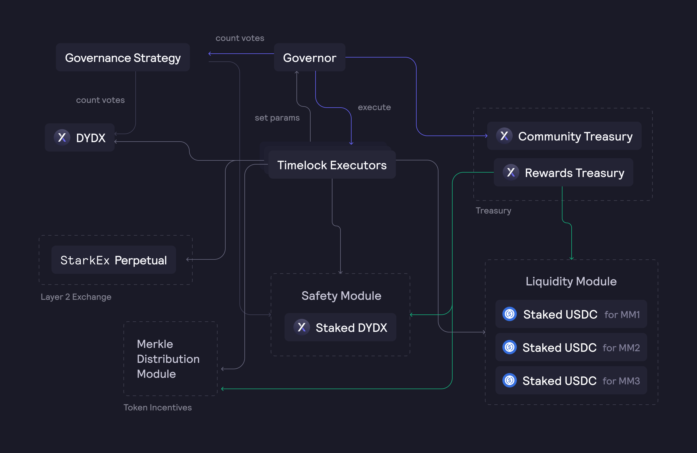
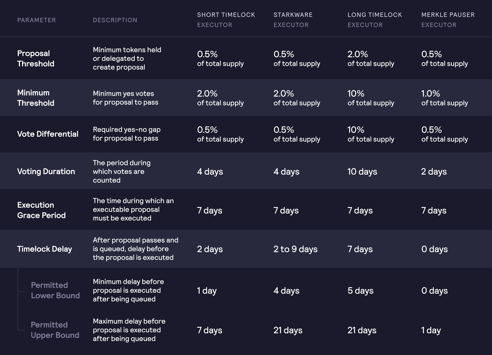

# 🏗️ 아키텍처

## 개요

$ethDYDX, $stkDYDX 및 $wethDYDX('거버넌스 토큰')는 그 소유자들에게 dYdX v3를 변경할 수 있는 제안권 및 투표권을 부여합니다. dYdX 거버넌스는 AAVE 거버넌스 계약을 기반으로 하며, 거버넌스 토큰 보유량에 기초하여 투표를 지원합니다.

제안은 제안 유형에 따라 주어지는 임계점 및 찬성 투표 백분율을 반드시 통과해야 합니다.

거버넌스 토큰의 투표 및 제안 권한은 거버넌스 토큰 보유자가 거버넌스 제안을 제안하고 투표할 수 있도록 합니다. 참고로, 거버넌스 토큰 보유자는 이러한 권한을 다른 이더리움 주소에 위임할 수 있습니다.

dYdX 거버넌스의 핵심에는 다음 8가지의 스마트 계약이 있습니다.

* **`$ethDYDX, $stkDYDX, $wethDYDX 토큰` 계약**: 시간 내 다른 블록에서 각 주소의 투표권에 대한 스냅샷을 보유합니다.
* **`거버넌스 전략 V2` 계약**: 제안 및 투표에 대한 사용자의 상대적인 권한을 측정하는 로직이 포함되어 있습니다. dYdX 커뮤니티는 `거버넌스 전략` 계약을 `거버넌스 전략 V2`로 업그레이드하도록 [투표하여](https://dydx.community/dashboard/proposal/15) dYdX v3에서 투표 및 제안을 하는 데 있어서 $wethDYDX가 ethDYDX와 동일한 거버넌스 기능을 지닐 수 있도록 했습니다.
* **`안전 모듈` 계약**: $ethDYDX 토큰을 스테이킹하고 포지션을 토큰화하며 보상을 받기 위한 논리를 포함합니다. 안전 모듈에 스테이킹된 토큰은 전체 거버넌스 권한을 유지합니다.
* **`거버너` 계약**: 제안을 추적하고 타임락 스마트 컨트랙트를 통해 제안을 실행할 수 있습니다.

* **`타임락` 계약**: 거버넌스에서 투표한 거래를 대기열에 넣거나 취소하거나 실행할 수 있습니다. 제안 내 기능은 타임락 계약에 의해 시작됩니다. 대기 중인 거래는 딜레이 후 그리고 유예 기간 만료 전에 실행할 수 있습니다.
* **`우선순위 타임락` 계약**: 타임락 계약과 동일하지만, 우선순위 통제자가 타임락 지연이 종료되기 전에 **우선순위 기간**(7일) 내에 거래를 실행할 수 있습니다.

dYdX 온체인 거버넌스는 다음을 허용합니다.

* 승인된 실행자 계약을 통해 제안에 대한 투표 실행
* 제안 시작 시 토큰 보유량 스냅샷 기록
* 투표권 및 제안권 별도 위임
* 제안, 정족수, 투표 격차를 비롯한 거버넌스 임계값 설정
* 투표 계산 방식 변경(거버너 계약의 '거버넌스 전략' 스마트 계약 주소 변경)

## 제안 유형

제안 길이와 실행에 영향을 미치는 매개 변수가 서로 다른 네 가지 유형의 제안이 있습니다. 즉, 거버넌스 합의에 영향을 미치는 중요한 제안은 투표 시간과 더 높은 투표 차이를 필요로 하는 반면, 프로토콜 매개 변수만 영향을 미치는 제안은 투표 시간을 적게 요구하며 신속하게 구현할 수 있습니다. 실행자는 각 제안 유형을 검증해야 합니다.

#### **단기 타임락 실행자**

숏 타임락 실행자는 다음을 제어합니다.

* 유동성 모듈, 안전 모듈 및 머클 분배자 모듈을 포함한 인센티브 계약
* 보상 및 커뮤니티 트레저리의 자금
* 새로운 토큰 발행
* 안전 모듈을 제외한 모든 프록시 계약
* Stark 프록시 계약에 대한 보호자 역할

**Starkware 우선순위 타임락 실행자**

Starkware 우선순위 타임락 실행자는 dYdX v3 구성 제안을 실행하는 StarkEx 무기한 거래소 계약을 관리합니다. Starkware는 "우선 순위 통제자" 역할을 보유하여 7일의 우선 순위 기간을 통해 제안 실행을 트리거할 수 있습니다. 그러나 프로토콜 변경은 거버넌스 토큰 보유자가 dYdX v3 거버넌스를 통해 단독으로 결정합니다.

#### **장기 타임락 실행자**

장기 타임락 실행자는 거버넌스 합의에 영향을 미치는 dYdX v3 일부를 전반적으로 변경하는 제안을 실행할 수 있습니다.

#### **머클-파서 실행자**

머클-파서 실행자는 머클 루트를 동결하는 제안을 실행할 수 있습니다. 이는 각 사용자의 누적 보상 잔액을 주기적으로 업데이트하고, 제안된 루트가 부정확하거나 악의적인 경우 시간이 경과함에 따라 사용자에게 새로운 보상을 배포할 수 있습니다. 또한 모든 Stark 프록시 계약에 의한 강제 거래 요청을 거부할 수 있습니다.

초기 타임락 매개 변수는 다음과 같습니다.

