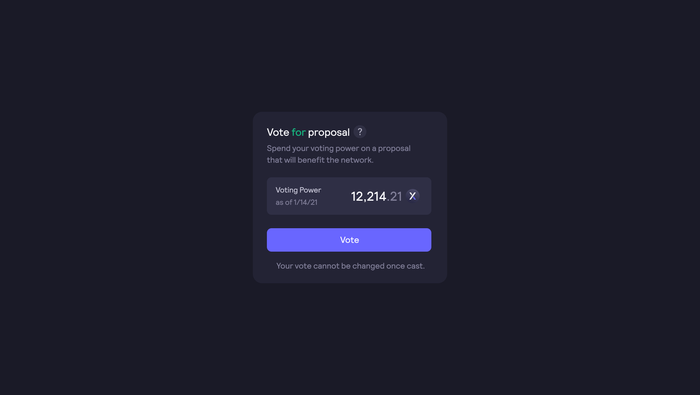
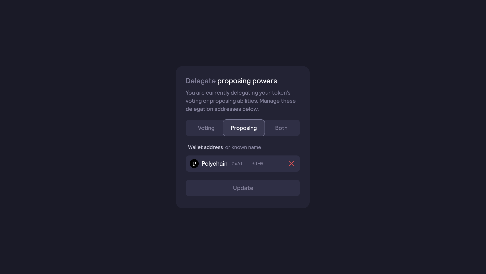

# Oylama Süreci

dYdX v3, Yönetişim Token'ları sahipleri ve delegeleri tarafından yönetilir ve yükseltilir.

## **Öneri Verme ve Oy Verme Yetkileri**

Yönetişim Tokenlarının her biri ile ilişkili iki yetki vardır:

* **Teklif verme yetkisi** bir teklif oluşturma ve sürdürme erişimi sağlar.
* **Oy verme yetkisi** mevcut teklifler lehine veya aleyhine oy vermek için kullanılır.

Yönetişim Token'larının sahipleri, belirli bir blokta sahip oldukları ve delege edilmiş token'ların toplamıyla orantılı olarak yönetişim yetkileri kazanırlar.

**`Teklif Verme Yetkisi =`**`$ethDYDX token'ından gelen Teklif Verme Yetkisi +`

`$wethDYDX token'ından gelen Teklif Verme Yetkisi +`

`$stkDYDX token'ından gelen Teklif Verme Yetkisi +`

`Delege olarak alınan $ethDYDX token'larından gelen Teklif Verme Yetkisi +`

`Delege olarak alınan $wethDYDX token'larından gelen Teklif Verme Yetkisi +`

`Delege olarak alınan $stkDYDX token'larından gelen Teklif Verme Yetkisi -`

`Delege edilmiş $ethDYDX'ten gelen Teklif Verme Yetkisi -`

`Delege edilmiş $wethDYDX'ten gelen Teklif Verme Yetkisi -`

`Delege edilmiş $stkDYDX'ten gelen Teklif Verme Yetkisi`

\`\`

**`Oy Verme Yetkisi =`**`$ethDYDX token'larından gelen Oy Verme Yetkisi +`

`$wethDYDX token'larından gelen Oy Verme Yetkisi +`

`$stkDYDX token'larından gelen Oy Verme Yetkisi +`

`Delege olarak alınan $ethDYDX token'larından gelen Oy Verme Yetkisi +`

`Delege olarak alınan $wethDYDX token'larından gelen Oy Verme Yetkisi +`

`Delege olarak alınan $stkDYDX token'larından gelen Oy Verme Yetkisi -`

`Delege edilmiş $ethDYDX'ten gelen Oy Verme Yetkisi -`

`Delege edilmiş $wethDYDX'ten gelen Oy Verme Yetkisi -`

`Delege edilmiş $stkDYDX'ten gelen Oy Verme Yetkisi`

## SSS

### Nasıl oy veririm?

dYdX yönetişimine katılabilmek için Yönetişim Token'larına sahip olmanız veya size bu token'ların delege edilmiş olması gerekir. Ayrıca işlem maliyetlerini karşılamak için ETH'ye de ihtiyacınız olacaktır.

Token sahibi iseniz veya size delege edilmiş tokenleriniz varsa ve aktif bir teklif varsa, dYdX Yönetişiminde oy vermeye hazırsınız demektir.

Oyunuzu vermek için teklifler sayfasına gidin ve aktif bir teklifin üzerine tıklayın.

### **Nasıl delege edebilirim?**

dYdX yönetişimi, token sahiplerinin oy verme haklarını kendi seçtikleri bir adrese delege etmelerine olanak tanır. Kendilerine token delege edilen herkes, Yönetişim Token'larına sahip olma şartı olmadan dYdX yönetişimine katılabilir. Kullanıcılar bir seferde tek bir adrese delege edebilir ve delegenin oy sayısına eklenen oyların sayısı kullanıcının hesabındaki Yönetişim Token'ı bakiyesine eşittir. Oylar, gönderen kullanıcı Yönetişim Token'larını tekrar delege edene veya transfer edene kadar mevcut bloktan ve sonraki bloklardan delege edilir.

Token sahipleri, yönetişim portalından veya programlama yoluyla bir token ile ilişkili yönetişim yetkilerinden birini veya her ikisini birden delege etmeyi seçebilirler. Delege edilmiş bir yetki alan bir kullanıcı kendisine delege edilen bu yetkiyi başka bir delegeye iletemez.

Token sahipleri teklif verme yetkisini ve oy verme yetkisini farklı adreslere delege edebilir. Ancak kısmi delegasyon yoktur (yetkinin yalnızca %100'ü veya %0'ı).

Tokenlerinizi bir cüzdan adresine delege etmek için:

* [dydx.community/dashboard](https://dydx.community/dashboard) adresine gidin
* "Delege Et" seçeneğine tıklayın
* Delege etmek istediğiniz yetki türünü seçin
* Oy verme ve/veya teklif verme yetkinizi delege etmek istediğiniz üçüncü taraf için bir Cüzdan Adresi girin. Yetkilerin delege edilmesi ile tokenleriniz transfer edilmez

Yönetişim Token'larını delege etmek ve delegasyonu sonlandırmak için kullanıcıların Ethereum gas ücreti ödemeleri gerekir.

### Oy verdikten sonra oyumu değiştirebilir miyim?

Zincir içi bir oy verdikten sonra oyunuzu değiştirmeniz mümkün değildir.

### Oy verme işlemi devam ederken Yönetişim Token'larımı transfer edebilir miyim?

Evet.

### Oyuma daha fazla token ekleyebilir miyim?

Zincir içi bir DIP gönderildiğinde, mevcut token sahiplerinin bir anlık görüntüsü alınır. Kullanıcıların başlangıç bloğundan önce Yönetişim Token'larına sahip olmaları gerekmektedir.
