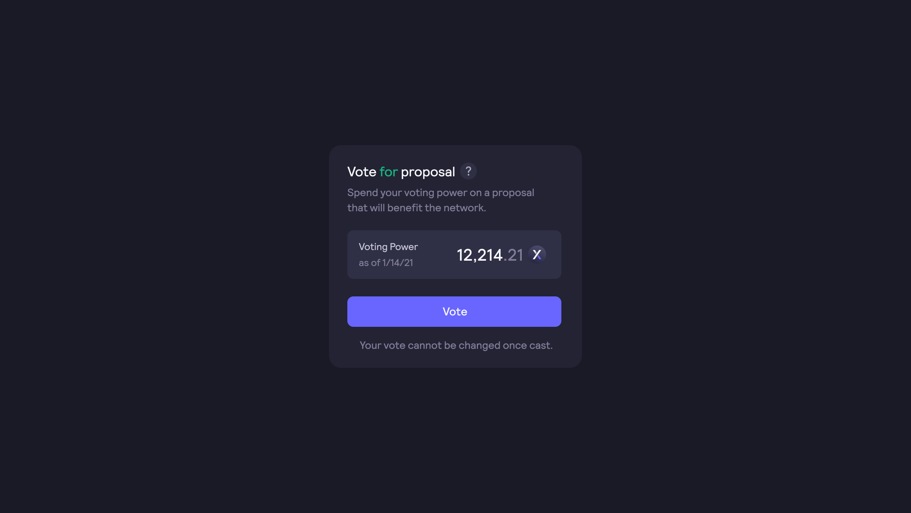
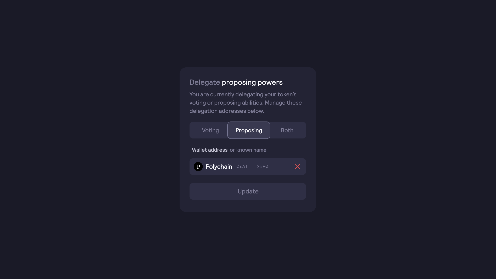

# 🗳️投票プロセス

dYdX v3は、ガバナンストークンの保有者と委任者によって管理およびアップグレードされます。

## **提案権および投票権**

各ガバナンストークンと関連付けられた2つの権限があります。

* **提案権**により、提案の作成および維持ができるようになります。
* **投票権**は、既存の提案に賛成または反対の投票を行うために使用されます。

ガバナンストークンの保有者は、所定のブロックにおける所有および委任されたトークンの合計に比例してガバナンス権限を受け取ります。

**`提案権 =`** `$ethDYDXトークンからの提案権 +`

`$wethDYDXトークンからの提案権 +`

`$stkDYDXトークンからの提案権 +`

`委任者として受け取った$ethDYDXトークンからの提案権 +`

`委任者として受け取った$wethDYDXトークンからの提案権 +`

`委任者として受け取った$stkDYDXトークンからの提案権 -`

`委任された$ethDYDXからの提案権 -`

`委任された$wethDYDXからの提案権 -`

`委任された$stkDYDXからの提案権`

\`\`

**`投票権 =`** `$ethDYDXトークンからの投票権 +`

`$wethDYDXトークンからの投票権 +`

`$stkDYDXトークンからの投票権 +`

`委任者として受け取った$ethDYDXトークンからの投票権 +`

`委任者として受け取った$wethDYDXトークンからの投票権 +`

`委任者として受け取った$stkDYDXトークンからの投票権 -`

`委任された$ethDYDXからの投票権 -`

`委任された$wethDYDXからの投票権 -`

`委任された$stkDYDXからの投票権`

## FAQ

### 投票するにはどうすればよいですか？

dYdXガバナンスに参加するには、ガバナンストークンを所有しているか、委任される必要があります。 トランザクション費用をカバーするには、ETHが必要です。

トークンを保有している、またはトークンを委任されており、アクティブな提案がある場合は、dYdXガバナンスで投票する準備が整っています。

投票するには、提案ページに移動し、アクティブな提案をクリックします。

### **どのように委任しますか？**

dYdXガバナンスでは、保有者は選択したアドレスに投票権を委任できます。誰でもガバナンストークンを所有することなく、委任を受け取ることで、dYdXガバナンスに参加できます。ユーザーは一度に1つのアドレスに委任することができ、委任者の投票カウントに追加された投票数は、ユーザーの口座におけるガバナンストークンの残高に相当します。送信者が再度委任をするか、またはガバナンストークンを譲渡するまで、投票権は現在のブロック以降に委任されます。

トークン保有者は、ガバナンスポータルを通じて、またはプログラムにより、トークンに関連するガバナンス権限の1つまたは両方について、委任することを選択できます。委任された権限を受け取ったユーザーは、委任された権限を別の委任者に譲渡することはできません。

トークン保有者は、提案権および投票権を異なるアドレスに委任することができます。ただし、部分的に委任することはできず、権限は100％または0％のいずれかとなります。

トークンをウォレットアドレスに委任する方法：

* [dydx.community/dashboard](https://dydx.community/dashboard)にアクセス
* 「委任」をクリック
* 委任したい権限の種類を選択
* 投票権および/または提案権を委任したい第三者のウォレットアドレスを入力します。権限を委任しても、トークンは譲渡されません

ガバナンストークンの委任および委任を解除する場合、ユーザーはイーサリアムのガス代（手数料）を負担する必要があります。

### 投票した後に、自分の投票内容を変更することはできますか？

投票がオンチェーンで実行されると、投票内容の変更はできません。

### 投票の進行中にガバナンストークンを譲渡することはできますか？

はい。

### 自分の投票にトークンを追加することはできますか？

DIPがオンチェーンで提出されると、現在のトークン保有者のスナップショットが取得されます。ユーザーは、スタートブロックの前にガバナンストークンを所有する必要があります。
